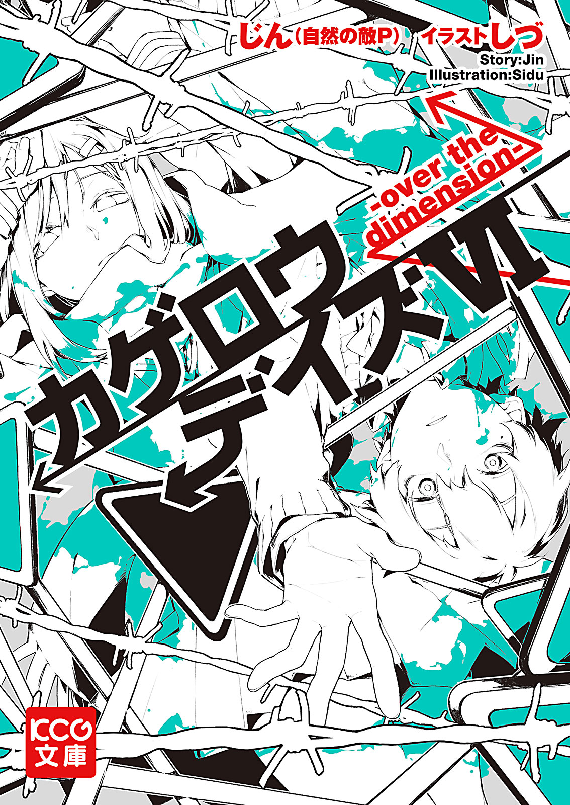
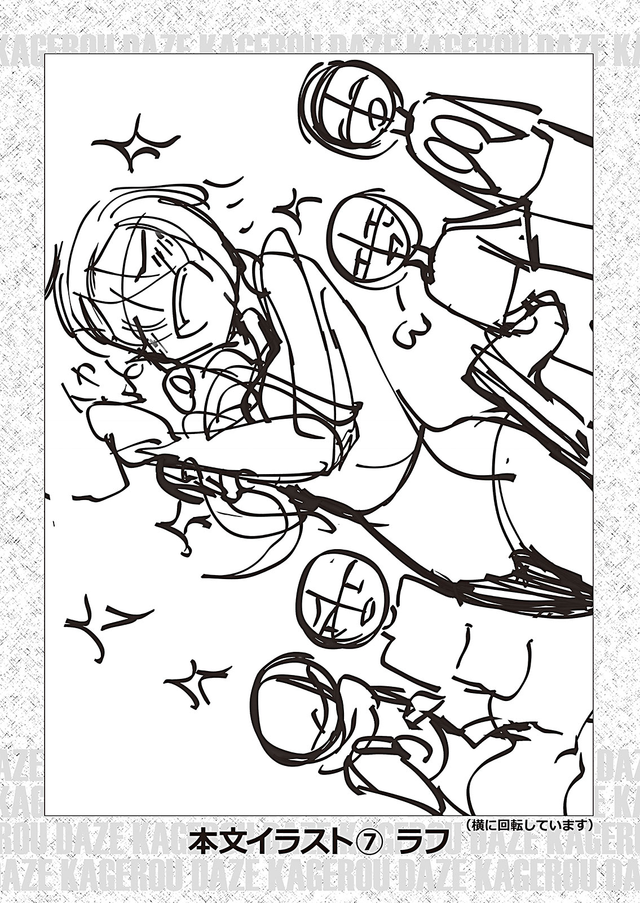

<h1>カゲロウデイズⅥ　-over the dimension-</h1>
<h3>じん（自然の敵Ｐ）</h3>

## 目次

- [ｄａｚｅ１](#ｄａｚｅ１)
- [ｌｏｓｔ ｄａｙｓ‐１](#ｌｏｓｔ-ｄａｙｓ１)
- [ｌｏｓｔ ｄａｙｓ‐２](#ｌｏｓｔ-ｄａｙｓ２)
- [ｌｏｓｔ ｄａｙｓ‐３](#ｌｏｓｔ-ｄａｙｓ３)
- [ｌｏｓｔ ｄａｙｓ‐４](#ｌｏｓｔ-ｄａｙｓ４)
- [ｌｏｓｔ ｄａｙｓ‐５](#ｌｏｓｔ-ｄａｙｓ５)
- [ｌｏｓｔ ｄａｙｓ‐６](#ｌｏｓｔ-ｄａｙｓ６)
- [ｌｏｓｔ ｄａｙｓ‐７](#ｌｏｓｔ-ｄａｙｓ７)
- [ｌｏｓｔ ｄａｙｓ‐８](#ｌｏｓｔ-ｄａｙｓ８)
- [ｄａｚｅ２](#ｄａｚｅ２)
- [目のやり場に困る話](#目のやり場に困る話)

## ｄａｚｅ１

「なんで、テレビなんか見てるんだ、オレ」

 

　ポツン、と置かれたアナログテレビを前に、オレは誰に<ruby>訊<rt>たず</rt></ruby>ねるでもなくそう<ruby>呟<rt>つぶ</rt></ruby>いた。

　特に、頭が<ruby>混<rt>こん</rt>濁<rt>だく</rt></ruby>しているって感じじゃない。眠っていた覚えもなければ、気を失っていた覚えもない。

　……いや、違うな。そもそも、何も覚えていないんだ。

 

　自分がどういう理由でここにいて、どうしてテレビなんか眺めていたのか。どういう訳だか、ちっとも思い出すことができない。

　先ほどまで観ていたはずのテレビの内容どころか、口を開き、言葉を発する直前までのありとあらゆる出来事を、オレはまったくと言っていいくらいに覚えていなかった。

　まるで今さっき口を開くまでの記憶を、誰かにすっぽりと抜き取られてしまったかのようだ。

 

　オレは散っていた意識を、目の前のテレビ画面へと戻した。

　画面には映画のエンドロールと<ruby>思<rt>おぼ</rt></ruby>しき文字列が、<ruby>歪<rt>ゆが</rt></ruby>んだバイオリンの<ruby>淑<rt>しと</rt></ruby>やかなメロディに合わせてゆっくりと流れていく様が、映し出されている。

　だとするとはオレは、今までなにかの映画でも観ていたのだろうか。

　……それは、あまり考えられないな。そもそも、オレに映画鑑賞の趣味はない。観るといっても、日曜の朝帯に放送しているバトルヒロインアニメの劇場版ぐらいだ。

　だからといって、目の前に流れるエンドロールをただ延々と眺め続けていたなんてことも、まぁ、ないだろう。

　いくら<ruby>暇<rt>ひま</rt></ruby>を持て<ruby>余<rt>あま</rt></ruby>すような暮らしをしているといっても、それじゃあさすがに暇の<ruby>無<rt>む</rt>駄<rt>だ</rt>遣<rt>づか</rt></ruby>いってもんだ。

　エンドロールがあるということは「本編」があるってことだ。オレは必ず『なにか』の本編を観ていたはずなのだが、一体なにを観ていたのだろうか。

 

 

 

 

 

 

 

 

 

 

「ダメだ、なにも思い出せねぇ。っつ～か、どこなんだよここは……」

 

　そうだ。まずは現在地を確認しよう。

　なにか<ruby>周<rt>まわ</rt></ruby>りに、状況を把握できそうな物はないか。建物でも、窓でも、人でもいい。

　まぁ、オレが部屋から出るなんてこと、まずあり得ないだろうけど。

　そんなことを考えながら<ruby>辺<rt>あた</rt></ruby>りを見回したオレは────

 

　────飛び込んで来た光景に、我が目を疑った。

 

「……<ruby>噓<rt>うそ</rt></ruby>だろ、おい」

 

　辺りには、四方何百キロ先まで続いているのか<ruby>目<rt>もく</rt>測<rt>そく</rt></ruby>も立たないほどに延々と、純白の世界が広がっていた。

　人や建物どころか、見渡す限りに枯れ木一本生えていない。空と地面の<ruby>境<rt>さかい</rt>目<rt>め</rt></ruby>もなければ、太陽や月なんてものはもちろん、自分自身の影すら見つけることができない。

　オレと古ぼけたアナログテレビを残して、前後、左右、上下、視界に広がる「<ruby>全<rt>すべ</rt></ruby>て」が、白一色に塗りつぶされていた。

 

　あまりに<ruby>慈<rt>じ</rt>悲<rt>ひ</rt></ruby>のない、非現実的な光景を前に、オレはただただ打ち<ruby>震<rt>ふる</rt></ruby>える他なかった。

 

　子供の頃よく真夜中の<ruby>暗<rt>くら</rt>闇<rt>やみ</rt></ruby>に<ruby>怯<rt>おび</rt></ruby>えたもんだが、眼前に広がる白色はその暗黒と反対色にして、<ruby>同<rt>どう</rt>義<rt>ぎ</rt></ruby>だ。

　いや、暗黒であれば「見えないだけでどこかに希望が隠れているのでは」と、多少の期待ができたかもしれない。

　しかし、ここには何もない。ここまで白々と<ruby>虚<rt>きよ</rt>無<rt>む</rt></ruby>を見せつけられては、希望を見いだすことなんて到底不可能に思えた。

 

　頭の中が、<ruby>解<rt>かい</rt>釈<rt>しやく</rt></ruby>の<ruby>余<rt>よ</rt>地<rt>ち</rt></ruby>も許さぬ<ruby>絶<rt>ぜつ</rt>望<rt>ぼう</rt></ruby>で埋め尽くされていく。

　この場所に来るまでの記憶もなければ、辺りには人っ子一人いない。<ruby>何<rt>ど</rt>処<rt>こ</rt></ruby>かを目指して歩こうにも、目指す先の見当すらつかない。

　辺り一面に広がるのは、一片の希望すら映さない、白、白、白……。

　何なんだ、この場所は。こんな<ruby>突<rt>とつ</rt>拍<rt>ぴよう</rt>子<rt>し</rt></ruby>もない巨大な空間が、人間に作れるっていうのか？　いいやありえない。かといって見た限り、<ruby>到<rt>とう</rt>底<rt>てい</rt></ruby>自然物にも思えない。

　ただただ何もない、人工物でも、自然物でもない広大な空間。一つ考えられるとするなら、もしかしてオレは……

 

「んな訳あるか、クソッ……！」

 

　オレは乱暴な言葉で、<ruby>逸<rt>はや</rt></ruby>る思考を<ruby>遮<rt>さえぎ</rt></ruby>った。

　そうだ。こんな非現実的な状況、まともに考えたって答えなんて出るか。

　今はとにかく探すしかない。何処かにきっと、ここから抜け出すヒントがあるはずだ。

　何か、何か手がかりはないか。どうやったらこの異様な空間を、抜け出すことができるのか。その方法を知る手がかりが何処かに……。

 

　そうしてオレが真っ先に飛びついたのは、やはり目の前に置かれたアナログテレビだった。

　<ruby>最<rt>も</rt>早<rt>はや</rt></ruby>この空間における唯一の希望は、眼前のテレビの他にない。何でもいい。どんなに下らないことでもいいから、情報が欲しかった。

　そんな期待を込めて画面を覗き込んだオレだったが、願い<ruby>虚<rt>むな</rt></ruby>しく、映し出されていたのは絶望と何ら変わらぬ情報だった。

 

「<ruby>何<rt>ど</rt>処<rt>こ</rt></ruby>の国の言葉だよ、こりゃ……」

　画面に流れるエンドロールは、<ruby>多<rt>た</rt>種<rt>しゆ</rt>多<rt>た</rt>様<rt>よう</rt></ruby>な国の言語をごちゃ混ぜにして貼り付けたような、<ruby>奇<rt>き</rt>怪<rt>かい</rt></ruby>な文字列によって構成されていた。

　なんとか読み取ろうと<ruby>注<rt>ちゆう</rt>視<rt>し</rt></ruby>してはみるものの、規則性もなければ<ruby>一<rt>いつ</rt>貫<rt>かん</rt>性<rt>せい</rt></ruby>もない。言語学に少々の覚えはあったが、これではさすがに、手も足も出なかった。

 

　オレは大きく<ruby>溜<rt>た</rt></ruby>め息をつき、その場にどっかりと腰を落とした。

　改めて辺りを見回してみるも、どこをどう見たってこのテレビ以外に物もなければ、人もいない。

　思い出せる最後の記憶は、自分の部屋でパソコンをいじっていた記憶……だろうか。これも<ruby>曖<rt>あい</rt>昧<rt>まい</rt></ruby>なものだが、少なくとも外出した覚えはなかった。

 

　エンドロールの流れるテレビ……一体これは何を意味しているのだろうか。

　画面を眺めていると「やはりオレは、今までここで『なにか』を観ていたのではないか」という気になってくる。

　笑える内容だった気もするし、物悲しい、<ruby>粛<rt>しゆく</rt>々<rt>しゆく</rt></ruby>とした内容だった気もする。そんな断片にもならないような記憶が、頭の隅に浮かんでは消えた。

　そうだ。やはりオレは間違いなく、このエンドロールの「本編」を観ている。

 

　しかしどういう訳だか、その「本編」に関する核心的な記憶が、<ruby>霞<rt>かすみ</rt></ruby>がかったように思い出せない。

　オレは一体どうして、<ruby>肝<rt>かん</rt>心<rt>じん</rt></ruby>なところを忘れてしまったのだろう。

 

「思い出したくもねぇような、内容だったのか？」

 

　そんな言葉を口にしたその瞬間、オレは奇怪な文字列の中に、読み取ることのできる一文を見つけた。

　読み逃すまいと、<ruby>慌<rt>あわ</rt></ruby>ててテレビ画面にかじりつく。

　ようやく見つけた<ruby>一<rt>いち</rt>縷<rt>る</rt></ruby>の希望だ。オレは思わず、その一文を口に出した。

 

「なになに……『主演……<ruby>如月<rt>きさらぎ</rt></ruby>……<ruby>伸<rt>しん</rt>太<rt>た</rt>郎<rt>ろう</rt></ruby>？』」

 

　生まれてこの方、<ruby>同<rt>どう</rt>姓<rt>せい</rt>同<rt>どう</rt>名<rt>めい</rt></ruby>の奴になんて出会ったこともない。いたとしても、このタイミングでこんな<ruby>偶<rt>ぐう</rt>然<rt>ぜん</rt></ruby>が起きるなんてことは、まずないだろう。

　そう、主演の<ruby>項<rt>こう</rt>目<rt>もく</rt></ruby>に書かれているのは、間違いなくオレの名前だ。

 

　主演……つまり主役ってことか？　おいおい、主役どころか、映画なんて一度も出た覚えないぞ。

　映画じゃない別のなにかってことか？　しかし、それ以外にエンドロールが流れるようなもんっていっても、演劇の録画、ドラマ、アニメ……どれにしたって出た覚えのないものばかりだ。

　大体、そんな中でオレが主役になれそうなもんなんて、一つも思い当たらない。

 

　そうだよ。そもそも、オレが主役でいられるのなんて、せいぜい自分の人生くらいのもんで……。

　オレの……人生……？

 

「……違う」

 

　違う。違う、違う、違う！

　そんなはずあるか。夢だ。きっとオレは、悪い夢を見ているんだ。この身体の冷たさも、息苦しさも、全て悪い夢に違いない。

　そうだ「終わった」なんてそんなこと、あるわけが……！

 

「一体なんだってんだよ……！　クソぉッ！」

 

　オレは立ち上がり、目先にあったアナログテレビを思い切り<ruby>蹴<rt>け</rt></ruby>り飛ばした。

　骨がへし折れたっておかしくないくらいの強さで、蹴り飛ばした。

　……だってのに、なんだよこれ。どうして痛みもなければ、血も流れない？

　怖い。解らない。不安でしょうがない。それだっていうのに、あぁ……オレ、なんで涙も流れないんだ。

　オレは、どうなっちまったんだ？　どうしてなにも思い出せないんだ？　オレは本当に「キサラギシンタロー」なのか？

　誰でもいい、誰か教えてくれ。

 

　オレは、これからどうなるんだ。

 

　このまま消えるのか？

　終わるってことなのか？

　それとも永久に、続くってことなのか？　まさか、このまま永遠に、こんな何もない場所に一人きりで……

 

　……あぁ、そんなのは嫌だ、なんて<ruby>酷<rt>ひど</rt></ruby>い夢なんだ。

　頭がどうにかなりそうだ、夢なら早く覚めてくれ……早く……。

 

「……落ちついて、シンタローくん」

 

 

 

　……声。

 

 

 

　<ruby>不<rt>ふ</rt>意<rt>い</rt></ruby>に聞こえたその声は、今にも焼け切れそうだったオレの思考を、ピタリと止めた。

　突然の声に驚いた、というのもあるかも知れない。しかし、オレの頭が思考を急停止させたのは、恐らく声の持ち主があまりに意外な人物だったからだろう。

 

　声に続いて、短く、鋭い電子音が「ピッ、ピッ」と<ruby>等<rt>とう</rt>間<rt>かん</rt>隔<rt>かく</rt></ruby>で鳴り始めた。

　<ruby>無<rt>む</rt>機<rt>き</rt>質<rt>しつ</rt></ruby>に、何かを示すように、響き続ける電子音。この音、この鳴り方……、知っている。これは、命の<ruby>鼓<rt>こ</rt>動<rt>どう</rt></ruby>を現す時に使う音だ。

　<ruby>心<rt>しん</rt>電<rt>でん</rt>計<rt>けい</rt></ruby>……だったか。今までに、何度か聞いたことがある。死んだじいさんが入院していた時。妹が海で<ruby>溺<rt>おぼ</rt></ruby>れた時。それ以外にも、一度。

 

　<ruby>俯<rt>うつむ</rt></ruby>いていたオレが顔を上げると、少し離れた空間に、何処からともなく鉄製の扉が現れていた。

　扉の周りには壁なんてものもなく、本当にただ、ドアが立っているという感じだ。

　頭の芯が冷静になったのか、いよいよおかしくなってしまったのか、自分でもよく解らなかったが<ruby>突<rt>とつ</rt>如<rt>じよ</rt></ruby>現れたそれを見ても何というか、不思議と「驚く」とかそういった感情は湧いて来なかった。

 

　改めて扉を眺めてみる。

　あれは、手術室の扉……だろうか。そう思えたのは、扉の上部に手術中を<ruby>連<rt>れん</rt>想<rt>そう</rt></ruby>させる赤色の電光板が光っていたからだ。

　ピッ、ピッ、と等間隔で鳴っている電子音も、どうやらあの扉の向こうから聞こえているようだった。

　いきなり現れた扉。そして先ほど聞こえた声……。

 

「……来いってことか？」

 

　突如現れた扉の意味を、オレはそう<ruby>解<rt>かい</rt>釈<rt>しやく</rt></ruby>した。

　さっきの声は、聞き覚えがある。多分、思い当たっている人で、間違いないはずだ。

　そうだとするなら、<ruby>皮<rt>ひ</rt>肉<rt>にく</rt></ruby>な話だが目の前にあるのが「手術室」の扉だというのにも、<ruby>納<rt>なつ</rt>得<rt>とく</rt></ruby>がいく。

　しかし……そんなことがありえるのだろうか？

 

　そりゃあ、会えるもんなら、会って話がしたいさ。ちゃんと話を聞けなかったことも、ちゃんと話をできなかったことも、この二年間ずっと<ruby>後<rt>こう</rt>悔<rt>かい</rt></ruby>してきたんだ。

　二年前の「あの日」本当は何があったのか、どうしてオレだけ置いていかれたのか、知りたくて仕方がなかったんだ。

 

　もう一度、会って話ができるのなら……

 

「……開けよ」

 

　ドアの前に<ruby>辿<rt>たど</rt></ruby>り着いたオレがそう呟くと、パチンという音とともに、電光板に灯っていた赤い光が消えた。

　それと同時に、鉄製の扉が音もなく開く。

 

　真っ先に気が付いたのは、<ruby>匂<rt>にお</rt></ruby>いだった。

　病院特有の<ruby>消<rt>しよう</rt>毒<rt>どく</rt>液<rt>えき</rt></ruby>の<ruby>匂<rt>にお</rt></ruby>いが、開きかけの扉の<ruby>隙<rt>すき</rt>間<rt>ま</rt></ruby>から一気に<ruby>溢<rt>あふ</rt></ruby>れ出す。

　次いで目に飛び込んで来たのは、純白の空間に<ruby>縦<rt>じゆう</rt>横<rt>おう</rt>無<rt>む</rt>尽<rt>じん</rt></ruby>に乱立している、<ruby>夥<rt>おびただ</rt></ruby>しい数の<ruby>点<rt>てん</rt>滴<rt>てき</rt>台<rt>だい</rt></ruby>。

　点滴台には無色の液体が入ったパックがぶら下がっており、そこから延びた細い管は、それぞれ何処か一点を目指すように奥へと延びている。

　それが何十、何百とあるのだから、延びた無数の管の<ruby>様<rt>よう</rt>相<rt>そう</rt></ruby>はさしずめ、<ruby>蜘<rt>く</rt>蛛<rt>も</rt></ruby>の<ruby>巣<rt>す</rt></ruby>のようだった。

　管の終着点は……入り口からでは見えないか。しかし、どうやら鳴り続けている電子音も、音の方向からすると管の終着点の方に発信源があるようだ。

 

　たじろいでいても仕方ない。

　一呼吸分の間を置いて、オレはその空間に足を踏み入れた。

 

　立ち並ぶ点滴台を<ruby>摑<rt>つか</rt></ruby>み、それをかき分けるようにどかし、一歩ずつ進んでいく。

　進めば進むほど<ruby>濃<rt>のう</rt>厚<rt>こう</rt></ruby>になっていく消毒液の匂い。

　その中を何十本もの細い管に足を絡めぬよう進む行程は、さながら<ruby>鋼<rt>はがね</rt>色<rt>いろ</rt></ruby>のジャングルを<ruby>探<rt>たん</rt>索<rt>さく</rt></ruby>しているようにさえ思えた。

 

　ガシャガシャと派手な音を鳴らしながらしばらく行くと、無数の管が集まる終着点が、いよいよ見えて来た。

　手術室の扉をくぐって来たというのに、そこには点滴台以外の<ruby>医<rt>い</rt>療<rt>りよう</rt>機<rt>き</rt>器<rt>き</rt></ruby>もなければ、医者の姿もない。

 

　あったのは、純白の空間に溶け込むような白いシーツにくるまれた、一台のベッドだけだった。

 

　ベッドの上、<ruby>不<rt>ふ</rt>意<rt>い</rt></ruby>に目が合ったその人のかつてと変わらぬ姿に、オレは息を飲んだ。

 

　どうして、あなたはこんなところにいるのか。

　あれからどうしていたのか。

　ここは一体、何処なのか。

　オレは、あなたに呼ばれてここに来たのか。

 

　……こんな程度じゃ足らないくらいに色々な質問が頭に浮かんだが反射的にオレの口をついて出たのは、<ruby>平<rt>へい</rt>凡<rt>ぼん</rt>極<rt>きわ</rt></ruby>まりないこんな言葉だった。

 

「お久しぶりです、<ruby>遥<rt>はるか</rt>先<rt>せん</rt>輩<rt>ぱい</rt></ruby>」

「……うん、本当、久しぶりだね」

 

　身体を起こした<ruby>九<rt>ここ</rt>ノ<rt>の</rt>瀬<rt>せ</rt></ruby>遥先輩は、あの頃と変わらない柔らかな<ruby>喋<rt>しやべ</rt></ruby>り方でもって、そう返した。

　……ありえないことが、目の前で起きている。

「あの、オレ……その……」

　<ruby>動<rt>どう</rt>揺<rt>よう</rt></ruby>で言葉が詰まってしまう。そりゃあそうだ。ヘラヘラ喋れるような内容なんて、何一つないんだから。

　そんなオレの内心を<ruby>察<rt>さつ</rt></ruby>してか、遥先輩が<ruby>徐<rt>おもむろ</rt></ruby>に口を開いた。

 

「久しぶりだと、少し緊張するよね。こうしてまた会えるなんて、夢にも思ってなかったから」

「せ、先輩もですか。オレもです」

　遥先輩は小さく「だよね」と<ruby>零<rt>こぼ</rt></ruby>すと、少し浮かない顔をして視線を落とした。

　……早すぎる沈黙。そういえば人との会話なんて、いつぶりだっただろうか。

　妹と会話する機会がちょっと前にあったような気がするが、それ以外に人間と話した記憶なんて、頭の片隅にすら見当たらない。

　そんなオレだ。上手な会話のキャッチボールなんて、できるはずもなかった。

 

「……あ、あの！　オレ！　は、話したいことがたくさんあって！　この場所のこととか、き、聞きたくて……！」

　<ruby>案<rt>あん</rt></ruby>の<ruby>定<rt>じよう</rt></ruby>、声のボリュームをかなり間違えてしまった。まぁ、<ruby>反<rt>はん</rt>響<rt>きよう</rt></ruby>しない分まだマシか。壁のない場所で助かった。

　しかし、遥先輩はオレの大声に驚いたりすることもせず、<ruby>代<rt>か</rt></ruby>わりに少し申し訳なさそうな顔をして、俯いてしまった。

 

「その感じだと、やっぱり覚えてないんだね。もしかして『みんな』のことも忘れちゃったのかな」

 

　やっぱり？　みんな？　覚えがない。どこの皆さんのことだろうか。

「えっと……。ちょっと思い出せないです、すみません」

「そっか。そうだなぁ……どこから話そうかな」

　やはり遥先輩はなにか知っている風だった。その情報をすぐにでも聞かせて欲しい……ところではあるのだが、どうもこの人をせっつく気になれない。

　昔からそうだ。遥先輩には、遥先輩のペースがある。

　そしてオレは、そんな遥先輩のマイペースが、あの頃から嫌いじゃなかった。

 

「……オレ、ずっと聞きたかったんすよ。先輩の話」

　あぁ、ダメだ、言葉が<ruby>崩<rt>くず</rt></ruby>れてしまう。

　かつてあいつらに「口が悪い」とあれだけ<ruby>叱<rt>しか</rt></ruby>られたというのに、会話もさることながら、<ruby>敬<rt>けい</rt>語<rt>ご</rt></ruby>も<ruby>未<rt>いま</rt></ruby>だ大の苦手だった。

「ありがとう。実は謝らなくちゃいけないこともあってね。少し長くなるんだけど……」

　遥先輩は申し訳なさそうにそう言うと、少し長い、昔話を切り出した。

 

 

 

　二年前の夏、<ruby>亡<rt>な</rt></ruby>くなったその頃と同じ、<ruby>透<rt>す</rt></ruby>き通った<ruby>声<rt>こわ</rt>色<rt>いろ</rt></ruby>で。

## ｌｏｓｔ ｄａｙｓ‐１

　<ruby>小<rt>こ</rt>春<rt>はる</rt>日和<rt>びより</rt></ruby>。

 

　窓際の席に座った僕は、右手にペンをぶらつかせながら、ぼんやりと午後の校庭を<ruby>眺<rt>なが</rt></ruby>めていた。

　<ruby>淡<rt>あわ</rt></ruby>かった秋の色は<ruby>一<rt>いつ</rt>層<rt>そう</rt></ruby>深みを増して、グラウンドを囲む<ruby>広<rt>こう</rt>葉<rt>よう</rt>樹<rt>じゆ</rt></ruby>の葉を、<ruby>鮮<rt>あざ</rt></ruby>やかな紅色に染め上げている。

 

　一年で一番色鮮やかな季節、秋。僕の一番好きな季節だ。

　澄み渡る青空には、<ruby>綿<rt>わた</rt>雪<rt>ゆき</rt></ruby>を散らした様なうろこ雲。その<ruby>隙<rt>すき</rt>間<rt>ま</rt></ruby>から<ruby>注<rt>そそ</rt></ruby>ぐ<ruby>柔<rt>やわ</rt></ruby>らかな日差しに、もう夏の名残は見当たらない。

　……そういえば、今年もいつの間にか終わっちゃったなぁ、夏。

　毎年疑問に思うんだけど、夏の終わりって一体いつのことをいうんだろう。

 

「お<ruby>盆<rt>ぼん</rt></ruby>が過ぎたら夏は終わり」なんて気の早い人もいれば「八月が終わったら」なんて言う人もいる。

「夏休みが終わると秋になる」なんて言って、学校の日取りに<ruby>倣<rt>なら</rt></ruby>う人もいれば「涼しくなったら」なんて<ruby>曖<rt>あい</rt>昧<rt>まい</rt></ruby>なことを言う人もいる。

「<ruby>蟬<rt>せみ</rt></ruby>の声が止んだら」……なんて<ruby>風<rt>ふう</rt>流<rt>りゆう</rt></ruby>な人も。

 

　こんな風に人それぞれに終わり方があるってことは、もしかすると「夏」っていう概念自体に、人それぞれの<ruby>定<rt>てい</rt>義<rt>ぎ</rt></ruby>があるってことなんじゃないだろうか。

　うん、考えてみたらそうだよね。今さら国の偉い人が「何月何日の何時を夏の終わりとして定めます」なんて言い出したところで、地域によって気候の違いもあれば文化の違いだってあるんだ。

　多分誰も納得しないし、<ruby>浸<rt>しん</rt>透<rt>とう</rt></ruby>もしないよ。うん、僕もきっと、納得できないと思うし。

 

　でも、それじゃあ僕にとっての「夏」って一体何なんだろう。思えば今年の夏休みもあんまり外に出られなかったし……なんか全然ピンと来ないや。

　う～ん、来年の夏はもうちょっと、遊んだり出かけたりしたいな。それこそ「友達」と、海なんかに行ったりして。

　キャンプもいいなぁ。虫はちょっと苦手だけど、カレーなんか皆で作ったらすっごく美味しいんだろうなぁ。

　思いっきり遊んで、思いっきり<ruby>満<rt>まん</rt>喫<rt>きつ</rt></ruby>できたら……、そしたら見つかるのかなぁ、僕の「夏」。

 

　来年……かぁ。ちょっと遠いな。

 

　……だめだ、考えるのやめよう。

　そうだよ。そんなことより、今考えなくちゃいけないこと他にあるよね、僕。

　時間も、もう三時になるし……。

　あれ、もう三時か。

　……え!?　もう三時!?　ど、どうしよう！　六時限目終わっちゃうよ！　あぁ、何にも進んでない……！　と、とにかく、とりあえず落ち着いてから……

 

「んで、ぶっ飛ばしがいのある『敵さん』の絵は描けたわけ!?」

「う……」

 

　静かだった理科準備室に、突如としてぶっきらぼうな声が響いた。それはもう「響いた」と言って差し支えないくらいの、結構な大声だった。

　休み時間でもないっていうのに、この大声はちょっとどうなのかな。

　なんてことを考えながら<ruby>教<rt>きよう</rt>卓<rt>たく</rt></ruby>の方を見ると、担任の<ruby>楯<rt>たて</rt>山<rt>やま</rt></ruby>先生は机に<ruby>突<rt>つ</rt></ruby>っ<ruby>伏<rt>ぷ</rt></ruby>して「ぐぅぐぅ」と寝息を立てている真っ最中だった。まぁ、そんなことだろうと思ったけど。

　しかしそうなると、二人しか生徒のいない教室だ。どう考えても、<ruby>野<rt>や</rt>次<rt>じ</rt></ruby>の宛先は僕しかいないってことになる。

 

　<ruby>観<rt>かん</rt>念<rt>ねん</rt></ruby>して声の方に目を向けると、隣の席に座った黒髪ツインテールの少女が、意地悪い笑みを浮かべて僕の方を見つめていた。

　つり目がちな目に、少し濃い色の<ruby>隈<rt>くま</rt></ruby>。首に下げたヘッドフォンからは、<ruby>微<rt>かす</rt></ruby>かにロックミュージックが漏れている。

 

　この子は<ruby>榎<rt>えの</rt>本<rt>もと</rt>貴<rt>たか</rt>音<rt>ね</rt></ruby>。僕の、<ruby>唯<rt>ゆい</rt>一<rt>いつ</rt></ruby>のクラスメイトだ。

　クラスメイトといっても、その<ruby>内<rt>ない</rt>実<rt>じつ</rt></ruby>はちょっと複雑なんだけど。

　というのも、本来の僕の所属クラスはＥ組で、貴音はＢ組なのだ。普通だったら、僕ら二人が一緒に授業を受けるなんてことは、まずありえないことだと思う。

　それだというのに僕らが今こうして机を並べているのは、僕らの<ruby>身体<rt>からだ</rt></ruby>にそれぞれ「病気」があり、ここが「<ruby>特<rt>とく</rt>別<rt>べつ</rt>養<rt>よう</rt>護<rt>ご</rt>学<rt>がつ</rt>級<rt>きゆう</rt></ruby>」だからだ。

　貴音は「ふとした瞬間に突然眠ってしまう」という<ruby>珍<rt>めずら</rt></ruby>しい症状の病気を持っているらしく、それが原因でこのクラスに<ruby>籍<rt>せき</rt></ruby>を置いているのだった。

　とはいえ貴音は<ruby>滅<rt>めつ</rt>多<rt>た</rt></ruby>にその話をしないし、僕からわざわざ聞くこともないので、貴音の病気について僕は、それくらいのことしか知らないのだった。

 

　しかしだ。貴音のこういう意地悪な顔なら、よく知っている。この顔は僕の弱点とか、<ruby>脆<rt>もろ</rt></ruby>い部分を見つけた時の顔だ。

　なにを隠そう、僕もそんな自分の弱点に思い当たる<ruby>節<rt>ふし</rt></ruby>がある。<ruby>内<rt>ない</rt>心<rt>しん</rt>慌<rt>あわ</rt></ruby>てている僕の様子に気が付いたのか、貴音は僕の返答を<ruby>急<rt>せ</rt></ruby>かした。

「あんた、敵の絵くらいは今日中に描くって言ってたよねぇ。進み具合はどうなのさ？　まさか、何も描いてないなんて言わないよね？」

 

　僕は、貴音の意地悪な視線から目を<ruby>逸<rt>そ</rt></ruby>らして、手元の画用紙を<ruby>眺<rt>なが</rt></ruby>めた。

　しかし、画用紙には貴音の言う『敵さん』の姿どころか、ペンを<ruby>奔<rt>はし</rt></ruby>らせた<ruby>痕<rt>こん</rt>跡<rt>せき</rt></ruby>すらない。

　当然だ。何かを描いた記憶なんて、まったくないもの。絵なんて浮かび上がってたら、逆にこっちが驚くよ。

 

「えぇと……ま、まだあんまりかな。はは……」

 

　僕はのらりくらりとそう言いながら画用紙を裏返そうとしたが、一歩どころか百歩は遅かった。

　貴音はぐい、と首を伸ばして、画用紙を<ruby>一<rt>ひと</rt>頻<rt>しき</rt></ruby>り<ruby>睨<rt>にら</rt></ruby>んだかと思うと「ふん」と鼻を鳴らした。

「へぇ。あんたの言う『あんまり』ってのは、奇麗さっぱり真っ白のことを言うんだね。覚えとくわ」

　貴音は<ruby>芝<rt>しば</rt>居<rt>い</rt></ruby>っぽくそう言うと、浮かした腰を椅子へと戻し、悪びれもせず小さな<ruby>欠伸<rt>あくび</rt></ruby>をして「あ～、アホくさ」と吐き捨てた。

　貴音のいびりは、相変わらず<ruby>強<rt>きよう</rt>烈<rt>れつ</rt></ruby>の一言に<ruby>尽<rt>つ</rt></ruby>きる。もともと自分に自信なんてないけれど、そんなものがあったとしたら粉々に<ruby>砕<rt>くだ</rt></ruby>かれていると思う。

 

　しかし、貴音の<ruby>悪<rt>あく</rt>態<rt>たい</rt></ruby>の<ruby>神<rt>しん</rt>髄<rt>ずい</rt></ruby>はこんなもんじゃない。こんな程度で終わってくれればいいのだけど、どうもこの子はそういう訳にいかない子なのだ。

　多分、まだ何かしら言われる。いや、絶対に言われる。こういう時の貴音が、一言で終わったことなんてあっただろうか？　いや、ない。

　覚悟して<ruby>身<rt>み</rt>構<rt>がま</rt></ruby>えていると案の定、貴音からこれまた意地悪な質問が飛んできた。

 

「ねぇ。『学園祭の出し物は<ruby>射<rt>しや</rt>的<rt>てき</rt>屋<rt>や</rt></ruby>さんがやりたい～』なんて言ったの、どこの誰だっけ？」

「そ、それは……僕だね」

「そうだよね。で、文化祭まであと一週間しかない。ここまでは解ってる？」

「解ってる……けど……」

「じゃあ、なんで手も動かさないで窓の外なんか見てるわけ？　あんた<ruby>馬<rt>ば</rt>鹿<rt>か</rt></ruby>なの？」

　再び繰り出された貴音の<ruby>口<rt>こう</rt>撃<rt>げき</rt></ruby>は、これまた<ruby>鋭<rt>えい</rt>利<rt>り</rt>極<rt>きわ</rt></ruby>まりなかった。

　まったく「アホ」とか「馬鹿」とか、人に使う言葉としてはあんまりよくないやつだよ。女の子なんだから、もうちょっと気を付けた方がいいと思うな。

　そういう言葉<ruby>遣<rt>づか</rt></ruby>い、<ruby>癖<rt>くせ</rt></ruby>になっちゃうとお嫁に行く時大変だよ？

　……なんて<ruby>台詞<rt>せりふ</rt></ruby>はもちろん口に出せるはずもなく、僕の口からは返す言葉の代わりに小さな<ruby>呻<rt>うめ</rt></ruby>き声が<ruby>漏<rt>も</rt></ruby>れた。

　もちろん、呻き声なんかで許してくれる貴音ではない。

「で、<ruby>遥<rt>はるか</rt></ruby>。なんか言うことないの？」

 

「……ボーッとしてました。ごめんなさい」

 

　初めての学園祭まであと一週間。僕らはちょっと、困ったことになっていた。

　僕らの高校の学園祭はそこそこに歴史も長く、ここいらの地域ではそれなりに知名度のあるイベントなんだそうだ。

　学校側も例年かなりの気合いが入っているようで、学園祭準備期間に入った初日に「全校生徒決起」と<ruby>銘<rt>めい</rt>打<rt>う</rt></ruby>った集会が<ruby>執<rt>と</rt></ruby>り行われたのには、ちょっと驚いた。

　なんでも、去年は有名なロックバンドのライブなんかもあったらしく、それはもう大変な<ruby>賑<rt>にぎ</rt></ruby>わいだったとか。

　かくいう貴音もそのロックバンドのファンだったようで、去年は一般客として来場していたらしい。それが入学の動機になったのかどうかは、ちょっと解らないけれど。

 

　そんな学園祭準備期間も、後半に差し掛かった今日この頃。

　期間中は各クラス四、五、六時限目を自由に使っていいということになっているため、午後になるとそこかしこが<ruby>模<rt>も</rt>擬<rt>ぎ</rt></ruby>店や各種企画の準備で賑わうのだった。特に学園祭開催の一週間前ともなれば通常授業はほぼなくなるので、休み時間返上で作業するクラスも珍しくないのだった。

 

　しかし、それは「普通のクラスだったら」の話だ。

　僕らのクラスは通常のクラスとはちょっと事情が異なるため、体育祭や学園祭などの各行事への参加が、各自の<ruby>任<rt>にん</rt>意<rt>い</rt></ruby>になる。

　もちろん、それは僕らの身体的な都合を<ruby>考<rt>こう</rt>慮<rt>りよ</rt></ruby>しての決まりごとなのだけど、元々マイペースな僕らのクラスだ。

「積極的に参加」なんて考えは出てくるはずもなく、そもそも乗り気でなかった貴音の「私は店なんてやりたくないけど」の一言で、模擬店としての当日不参加が決まったのだった。

 

　なので<ruby>順<rt>じゆん</rt>当<rt>とう</rt></ruby>にというか、当初の予定通りだったとするなら、学園祭準備の件で僕らが頭を悩ませることなんて、何一つないはずだった。

　あったとしても「当日はどんな順番で屋台を回ろう」とか「屋台一カ所につき何人前まで食べていいことにしよう」とか、そういう悩みだ。

　少なくとも昨日の朝まで、<ruby>急<rt>きゆう</rt>遽<rt>きよ</rt></ruby>出店することになった模擬店の制作に追われるなんて予定は、一切なかった。

 

「まぁ、あんたばっかり責めてもしょうがないんだけどね。<ruby>大<rt>たい</rt>概<rt>がい</rt></ruby>、あの先生のテキトーさが原因なわけだし」

　貴音は<ruby>呆<rt>あき</rt></ruby>れ気味にそう言うと、<ruby>依<rt>い</rt>然<rt>ぜん</rt></ruby>として教卓に突っ伏している楯山先生をビシッと指差した。

　僕は、頭の中に浮かんだ「人差し指とは言うけど、そこまでビシッとやるのはちょっと失礼じゃない？」というセリフを、苦笑いで押さえ込んだ。

　貴音の言ったことは、<ruby>概<rt>おおむ</rt></ruby>ね合っていると思う。

　僕らが急遽模擬店を出店しなくてはいけなくなった理由は、楯山先生のちょっとした「おべっか」に原因があるのだから。

「ったく、なんで私らまで先生のポイント<ruby>稼<rt>かせ</rt></ruby>ぎに付き合わなきゃなんない訳？　大体、<ruby>理<rt>り</rt>事<rt>じ</rt>長<rt>ちよう</rt></ruby>にいい顔したいからって『スペシャルな企画準備してるんで～』とか、ハードル上げ過ぎでしょ！　っていうか、そもそもなんの準備もしてないんだから変な<ruby>見<rt>み</rt>栄<rt>え</rt></ruby>張るなっての!!」

 

　貴音は一頻り叫ぶとガタガタと机を揺らし、抗議の意を示した。

　それを<ruby>宥<rt>なだ</rt></ruby>める意味も含めて、僕は口を開く。

「僕は楽しみだよ、学園祭。こうやって作業したりするのも、やっぱり楽しいし」

 

　僕がそう言うと、貴音はブスッとした表情を少し<ruby>緩<rt>ゆる</rt></ruby>めて「まぁ……別にいいけど。頑張るのあんたらだし」と言って机に突っ伏した。

 

　とは言っても他クラスの模擬店準備は既に<ruby>佳<rt>か</rt>境<rt>きよう</rt></ruby>に差し掛かっている頃だ。正直こんな時期から準備を始めるなんて、時間不足どころの話じゃない。

　それだけでも大変な事態だというのに、僕らのクラスには先生を含めても三人の<ruby>人<rt>じん</rt>員<rt>いん</rt></ruby>しかいないのだ。

　普通に考えたら、スペシャルな企画どころか模擬店を形にできるかどうかも微妙なところだと思う。

　しかし「出店する以上、<ruby>中<rt>ちゆう</rt>途<rt>と</rt>半<rt>はん</rt>端<rt>ぱ</rt></ruby>にはしたくない。やるなら最高に面白い内容でないと」というのが、貴音の信条らしく、それには僕も賛成していた。「もちろんだよ」なんてことも言った。

　各クラスが全力で作り上げた模擬店の輪の中に、適当に<ruby>拵<rt>こしら</rt></ruby>えた模擬店で参加するというのはちょっと気が引ける。やるなら全力でやりたい。

　とはいえ……。

 

「とはいえ、だよ。貴音……」

「なにさ」

「いや、ね。さすがに『一週間でシューティングゲーム作ろう』っていうのは、ちょっと無理があるんじゃないかなって」

　先生のハードル上げに<ruby>苦<rt>く</rt>言<rt>げん</rt></ruby>を<ruby>呈<rt>てい</rt></ruby>していた貴音の「最高に面白い」のハードルは、べらぼうに高いのだった。

 

　先生の<ruby>居<rt>い</rt>眠<rt>ねむ</rt></ruby>りは、恐らく昨日の徹夜作業が原因だろう。それはそうだ、そうでもしないと間に合わない。

　なにせ先生は、あと一週間で<ruby>一<rt>いつ</rt>丁<rt>ちよう</rt>前<rt>まえ</rt></ruby>のシューティングゲームのプログラミングを、すべて終わらせなければいけないのだから。

　それは、<ruby>素人<rt>しろうと</rt></ruby>考えで<ruby>見<rt>み</rt>積<rt>つも</rt></ruby>っても<ruby>並<rt>なみ</rt>大<rt>たい</rt>抵<rt>てい</rt></ruby>の作業量じゃない。いくら先生のおべっかがことの<ruby>発<rt>ほつ</rt>端<rt>たん</rt></ruby>とはいえ、少し<ruby>可<rt>か</rt>哀<rt>わい</rt>想<rt>そう</rt></ruby>に思えてしまう。

　しかし、貴音はというと、先生のことなんて<ruby>何<rt>ど</rt>処<rt>こ</rt></ruby>吹く風。

「何言ってんの？　引くに引けなくしちゃったのは先生だし、射的やりたいって言ったのあんたでしょ？　あんたら日曜大工もできないんだから、もうゲーム作るしかないじゃん」

　そう言うと「おかしなやつ」といわんばかりに首を<ruby>傾<rt>かし</rt></ruby>げるのだった。

　まぁ……確かに、射的屋さんがやりたいと言ったのは僕だ。それに僕らには大道具製作のノウハウもなければ、人員の数も、費用的な余裕もない。

　となると、絵とプログラムさえ突き詰めれば制作できる「ゲーム」というのは、確かに都合がいいのだった。もちろん「時間」という大問題を除いたらの話だけど。

 

「ほら、グダグダ言ってる暇あったら手を動かす！　時間ないぞ～」

　貴音はそう言うと手をパンパンと打って、僕を急き立てた。僕も<ruby>慌<rt>あわ</rt></ruby>ててペンを握り直す。そうだ、もう本当に時間がない。

　なにせ僕は、今日のノルマである「ゲームに登場する敵のキャラクター二十体」のうち、まだ一体も描けていないのだから。

　午後一から初めてもう二時間も画用紙に向かっているというのに、一体も描けていないんじゃ、今日中に二十体なんて夢のまた夢だ。

 

　しかし……だめだ、どうも描けない。

　絵が苦手という訳ではないし、むしろ風景画なんかはよく描いてきた方だと思う。

　ただ、こういうキャラクター創作というか「敵」という言葉から想像して描くという風な作業になると、どうも手が進まないのだった。

　僕がウンウン<ruby>唸<rt>うな</rt></ruby>っていると、見兼ねた貴音が呆れ気味に助け舟を出してくれた。

 

「なにあんた、敵キャラの一匹も思いつかないわけ？」

「そうなんだよねぇ。僕、こういうゲームあんまりやらないから、敵っていうのがどういう姿してるのか、いまいち<ruby>摑<rt>つか</rt></ruby>めなくて」

　僕が正直に告げると、貴音は「はぁ」と小さく溜め息をついて、ピッと指を立てた。

 

 

 

 

 

 

 

 

 

 

「いい？　敵ってのはね。ぶっ飛ばして気持ちよさそうな姿してたら、どんな奴でもいいの。そもそもゲームなんてストレス解消なんだから、結局そういうキャラデザインが一番になってくる訳。わかる？」

　ぶっ飛ばすなんて<ruby>随<rt>ずい</rt>分<rt>ぶん</rt>物<rt>ぶつ</rt>騒<rt>そう</rt></ruby>な話だけれど、ゲームをあまりやらない僕が聞いても、貴音の言うことには筋が通っているように思えた。

　先生から貴音はシューティングゲームが大の得意だって聞いていたけど、なるほど、これは頼もしい。

　とはいえ、シューティングゲームはおろか、何かをぶっ飛ばした経験なんてもちろんない僕は「気持ちよさそうな」と言われても、その姿形に思い当たる<ruby>節<rt>ふし</rt></ruby>はなかった。

「う～ん。そういうゲームって、例えばどんなキャラが出てきたりするのかな」

「例えばねぇ……。シューティングゲームの敵キャラで有名どころっていうと、やっぱりゾンビとか？」

 

　ゾンビ。

　その言葉を聞いた僕は、<ruby>堪<rt>たま</rt></ruby>らず<ruby>身<rt>み</rt>震<rt>ぶる</rt></ruby>いした。

　昔、テレビでやっていたパニックホラー物の映画。あれは本当に<ruby>怖<rt>こわ</rt></ruby>かった。

　墓から<ruby>這<rt>は</rt></ruby>い出して来るゾンビの群れに、なす<ruby>術<rt>すべ</rt></ruby>なく次々と<ruby>襲<rt>おそ</rt></ruby>われていく村人たち……そして……。

 

「ご、ご、ごめん貴音、できれば、それ以外だと嬉しいかな」

「はぁ？　もういいじゃんゾンビで。何、何か不都合でもあんの？」

「不都合っていうかなんていうか……。ほら、ぞ、ゾンビって、実際には存在しないからさ。ちょっと外見が想像しにくいっていうか」

　苦しい僕の言動に貴音は訝しげな表情を浮かべたが、変に詰め寄ったりはせず、不意に「あっ」という顔をしたかと思うと、再び指を立てた。

「なら、動物とかモチーフにしたら？　ゲームに出てくるいわゆる『モンスター』って、動物のパーツとか参考にして作ったりもするらしいよ」

「動物をモチーフにしたモンスターかぁ。……うん、それなら描けるかも」

　モンスターと聞いて僕は、主人公の少年がカプセルから飛び出すモンスター達と冒険をする、国民的アニメを思い出していた。

　小さなモンスターが大きな姿に<ruby>変<rt>へん</rt>貌<rt>ぼう</rt></ruby>したり、合体して複雑な姿になったりというのが好きで、小さい頃は夢中になっていたことを覚えている。

　そういえばその頃は、そのアニメのモンスターの絵ばっかり描いていたっけ。そうだよ。自分で新しいモンスター考えたりしてたじゃん、僕。

　……いける。敵キャラクターがそういうモンスターでいいのなら、イメージが<ruby>湧<rt>わ</rt></ruby>く。もしかすると、今日中に二十体も夢じゃないかもしれない。

 

「モンスター……ね。ありがとう貴音、なんとかなりそうだよ！」

　僕がガッツポーズすると、貴音は満足そうに鼻を鳴らした。

「しっかり頼むよ～。本番中にバグなんか起こしたら、<ruby>承<rt>しよう</rt>知<rt>ち</rt></ruby>しないからね」

 

　僕らの予定している模擬店の企画内容は「対戦形式のシューティングゲーム」だ。

　挑戦者は一定ポイントの<ruby>取<rt>しゆ</rt>得<rt>とく</rt></ruby>を目指すのではなく、対戦相手である貴音よりも多くのポイントを取得することがクリアの条件となる。

　そもそもこんなルールになったのは、先生が学園祭用の予算を使い込んでしまったせいで、準備できる<ruby>景<rt>けい</rt>品<rt>ひん</rt></ruby>が、「魚の<ruby>標<rt>ひよう</rt>本<rt>ほん</rt></ruby>一つ」しかないからだった。

　景品が一つしかない以上、一人でもクリア者が出てしまった段階で、僕らの模擬店は終了となる。

　もし一人目のお客さんにいきなりクリアなんてされた日には、僕らの学園祭は非常に<ruby>陰<rt>いん</rt>鬱<rt>うつ</rt></ruby>なものになるだろう。

 

　学園祭の<ruby>終<rt>しゆう</rt>盤<rt>ばん</rt></ruby>まで、景品を持っていかれるわけにはいかない。かといってクリア得点を高く設定し過ぎるとお客さんの文句が怖い。

　そこで、貴音から提案があったのが「対戦形式」だ。

　貴音<ruby>曰<rt>いわ</rt></ruby>く「<ruby>可<rt>か</rt>愛<rt>わい</rt></ruby>い女の子が相手なら、負けても文句は出ないでしょ」ということらしい。確かに、女の子と戦って負けたのでは、文句なんてなかなか言えない。

　とはいえ負けてしまうとそれまでなのだが、貴音はゲームの腕に相当自信があるらしく、<ruby>手<rt>て</rt>加<rt>か</rt>減<rt>げん</rt></ruby>でもしない限り絶対に負けないとのことだった。

 

　なので現状「不安を数えればキリがないがやるしかない」というのが正直なところなのだった。

　一週間後の学園祭までに、シューティングゲームを作る。準備期間もなければ、人員も少ない。

　何だか無茶苦茶だなぁとも思うんだけど、何だろうこの気持ち。

　……すごく、ワクワクしている。

 

「とにかく最高の模擬店にしようね、貴音」

「当然でしょ。それしかありえない」

　そういうと貴音はニッと笑った。僕も、自然と顔が<ruby>綻<rt>ほころ</rt></ruby>んだのが解った。

「……あぁ、そうそう」

　貴音はそう言うと、なにか思い出したと言わんばかりに手を叩いた。僕は首を傾げる。

「タイトルどうすんの結局。あんた昨日、考えとくって言ってたよね」

　あぁ、そうだ。伝え忘れていた。

　僕は<ruby>鞄<rt>かばん</rt></ruby>からファイルを取り出し、その中に納めてあった一枚の画用紙を貴音に手渡した。

「ん？　何この紙……ってあぁ、タイトルロゴ！　ちゃんとできてんじゃん！　え～っとなになに～……」

 

　昨日の夜、必死に考えたタイトルだったが、思えば口に出すのは貴音が初めてだ。

　実際に口に出したら、どんな響きになるんだろう。ちょっと楽しみだった。

　今<ruby>以<rt>もつ</rt></ruby>て鳴り止まないロックミュージックの音<ruby>漏<rt>も</rt></ruby>れの中、貴音は確かめるようにその名前を口にした。

 

 

 

『……ヘッドフォンアクター』

 

　　　　　＊

 

　<ruby>静<rt>せい</rt>寂<rt>じやく</rt></ruby>に<ruby>融<rt>と</rt></ruby>けていた秒針の音に、ふと気が付いた。

　時計を見ると、時刻は午前一時になるところだった。すこし、ウトウトしていたみたいだ。

　背もたれに寄りかかり、腕を上に伸ばすと、入学の時に新しくした<ruby>椅<rt>い</rt>子<rt>す</rt></ruby>がギギッと<ruby>軋<rt>きし</rt></ruby>んだ。そういえば、こないだ身長計ったらまた伸びてたんだよなぁ。もう、あんまりいらないんだけど、なんで勝手に伸びちゃうんだろう。目立つし、ぶつかるし、いいことないよホント。

 

　背もたれから座面に重心を戻し、ぼやぼやと視界が<ruby>滲<rt>にじ</rt></ruby>む目を<ruby>擦<rt>こす</rt></ruby>る。

　スタンドライトに照らされた卓上には、本棚にあった動物図鑑と、消しゴムかすの散らばった画用紙。

　画用紙の中心には、先ほど描き終えた十九体目の敵キャラクター「ニャンタロス」の姿があった。

 

「……いいな。うん、いいよこれ」

 

　本当に、<ruby>流石<rt>さすが</rt></ruby>は貴音、と言うべきか。

　あれだけ頭を悩ませていたキャラクターデザインが、動物をモチーフにしてからというもの、驚くほど順調に進んでいた。

　どのキャラクターも、モチーフとなった動物の特徴をいい具合に反映することができたと思う。どの子もすごく活き活きしているよう見えるのは、親心のせいだろうか。

　途中からは楽しくて楽しくて手を止められないくらいの充実した作業ができた。こういう風に<ruby>無<rt>む</rt>我<rt>が</rt>夢<rt>む</rt>中<rt>ちゆう</rt></ruby>で絵を描くのって、いつぶりだろう。実に、いい気分だ。

 

「あと一体で目標の二十体かぁ。この進みっぷりを知ったら貴音、きっと驚くぞ～」

　あの子はああ見えてよく驚く子だから、きっといい反応をしてくれるに違いない。貴音の驚いている様子を想像しただけで、僕はなんだか頰が緩んだ。

　今まで、<ruby>褒<rt>ほ</rt></ruby>められたりなんてこと一回もなかったけど、もしかしてこの絵を見たら、少し見直してくれるかも。

　そう思うと、こんな時間だと言うのに<ruby>俄<rt>が</rt>然<rt>ぜん</rt></ruby>やる気が<ruby>漲<rt>みなぎ</rt></ruby>って来た。よし、気合いを入れて最後の一体にとりかかるとしよう。

　僕は鼻息も荒く動物図鑑に手をかけ、ページをめくった。

 

「……あれ、おかしいな」

　めくった先のページに載っていた動物は、牛だった。牛はさっき「モーギューン」を描いた時に参考にしたから、モチーフとして使う訳にはいかない。

　何処かでめくる順番を間違えたのだろうか。

　とりあえずでもう一ページめくってみるも、そこにあった熊の姿は「クマゴリラ」を描いた時に参考にしたので、これまたモチーフにはできないのだった。

 

　……ちょっと待ってよ。

　嫌な予感がした僕は、<ruby>慌<rt>あわ</rt></ruby>てて置いていた図鑑を手にとり目次のページを開いた。

　そこに<ruby>羅<rt>ら</rt>列<rt>れつ</rt></ruby>されている動物の名前を、上から順に確認していく。犬、<ruby>鷹<rt>たか</rt></ruby>、<ruby>豚<rt>ぶた</rt></ruby>、<ruby>亀<rt>かめ</rt></ruby>……。あぁ！　やっぱりそうだ！

「僕、もう全部の動物参考にしちゃったんだ……」

 

　<ruby>迂<rt>う</rt>闊<rt>かつ</rt></ruby>だった。まだ最後の一体を描き終えてないというのに、<ruby>既<rt>すで</rt></ruby>にすべての動物をモチーフにしてしまっていたなんて……。

　どうしよう。「今日のノルマは敵キャラ二十体！」なんて<ruby>豪<rt>ごう</rt>語<rt>ご</rt></ruby>してしまった以上、描けませんでしたじゃあ格好がつかない。

　しかも最後の一体は「ラスボス」というやつだ。今までのキャラクターよりも強いキャラクターになるのだから、当然デザインも今までと同じ意識でデザインする訳にはいかないのだ。

　あぁ、こんなことになるのなら、調子に乗って何種類もの動物を混ぜて描いたりしなきゃよかった。なんなの「クマゴリラ」って。クマなのかゴリラなのかはっきりしてよ。

 

　なんて<ruby>支<rt>し</rt>離<rt>り</rt>滅<rt>めつ</rt>裂<rt>れつ</rt></ruby>なことを考えていると、<ruby>突<rt>とつ</rt>如<rt>じよ</rt></ruby>、部屋に着信音が響いた。

　慌てて音の方を見やると、ベッドの真ん中辺りで携帯電話がチカチカ光っているのを見つけた。

　急いでベッドの方に向かいながら、横目に時計を見る。午前一時。こんな時間に、一体誰だろうか。

　僕は携帯を手に取ると、番号も確認しないまま耳に押し当てた。

 

「はい、もしもし」

「おぉ、やっぱり起きてたか。いやぁ、遅くにすまねぇな」

　電話の声は、楯山先生だった。声の調子に慌てている様子はなかったが、ほんの少しぎこちなさがある気がした。

　僕はベッドに腰掛け、少し足を伸ばして楽な体勢をとる。

「僕は全然大丈夫ですけど……なにかありましたか？」

「ん？　あぁ、いや、学園祭のことでちょっとな」

　やっぱり楯山先生の言い方には、少し渋っているような感じがあった。学園祭の話……か。なんだろ。

　僕が<ruby>促<rt>うなが</rt></ruby>すより先に、楯山先生は本題を切り出した。

「貴音から聞いたが、お前、昨日も夜遅くまで作業してたらしいじゃねえか。その……なんだ。今日も無理してんじゃねぇかと思ってよ」

 

　あぁ、なるほど、そういうことか。

　<ruby>合<rt>が</rt>点<rt>てん</rt></ruby>のいった僕は、口調も楽しげに言葉を返した。

「無理なんてしてないですよ？　むしろ、楽しくって身体が勝手に動いちゃうくらいです」

　実際、<ruby>噓<rt>うそ</rt></ruby>じゃない。今日の作業は、それこそ「勝手に手が動いた」と言って差し支えないくらいに、順調なものだった。

　ただ、先生が言っているのは「そういうこと」じゃないってことも、僕は何となく解っていたのだけど。

 

　<ruby>案<rt>あん</rt></ruby>の<ruby>定<rt>じよう</rt></ruby>先生は、<ruby>酷<rt>ひど</rt></ruby>く言いにくそうにしながら話を続けた。

「そうは言ってもお前、体調崩しちまったら何にもならねぇぞ？　当日楽しむ為にも、休むときはしっかり休まねぇと……」

「……やめてくださいよ、先生」

　先生が話し終わる前に、僕は乱暴に口を挟んだ。話を<ruby>遮<rt>さえぎ</rt></ruby>られた先生は二の<ruby>句<rt>く</rt></ruby>を<ruby>継<rt>つ</rt></ruby>がず、言葉の代わりに小さく息を吐いた。

　少し沈黙していると、部屋に響く秒針の音がやけに大きく聞こえ始めた。

　カチッカチッと規則正しく時を刻むこの秒針のリズムを「怖い」と感じるようになったのは、いつの頃からだっただろうか。

　そうだ、秒と言えば前に一度計算したことがある。

　確かもう残り三千万秒もなかったはずだ。そういう表し方をすると意外と多い数だなぁと思うんだけど、時間と言うのはホント、過ごしてみないとその長さが解らないから不思議だ。

 

　あぁ、もうこんな時間だし、あんまり間を空けても申し訳ない。僕は先生に伝えたいことを、<ruby>端<rt>たん</rt>的<rt>てき</rt></ruby>に口にすることにした。

 

「……休んだって、何したって、あと一年で死ぬんですよ、僕」

 

　僕の病気は、<ruby>随<rt>ずい</rt>分<rt>ぶん</rt></ruby>と<ruby>律<rt>りち</rt>儀<rt>ぎ</rt></ruby>なやつだった。

　僕のお母さんを殺したときも、きっちりきっかり、お医者さんの診断したタイムリミット通りに殺していったらしい。

　そのお医者さんが「あと一年」と言っているのだから、僕もまぁ、そうなるんだと思う。

　それに対して<ruby>嘆<rt>なげ</rt></ruby>いたり悲しんだりは今のところなかった。多分、それはお父さんのおかげだ。

 

　お父さんは、ちょっと変わった人だった。

　どこだかの研究施設に務めているらしく、昔から噓をつくとか冗談を言うとかそういう<ruby>無<rt>む</rt>駄<rt>だ</rt></ruby>なことは何一つやらない人だったけど、僕が十歳になった時、顔色一つ変えずに「お前は恐らく六年後に死ぬ」と言い放ったのには、さすがに驚いた。

 

　今も一応は二人暮らしという形になっているけれど、仕事の忙しいお父さんとは、ほとんど顔も合わせていない。

　なので僕の通院や食事は、住み込みのお手伝いさんがお世話をしてくれているのだった。

　僕は今のそういうお父さんしか知らないのだけれど、聞く話によると、なんでもお母さんが死んだ辺りからお父さんは「まとも」じゃなくなってしまったんだそうだ。

 

　そんな「色々」を考えると、確かに、寂しいことの多い人生だった気がする。一人の時間も多かったし、未だにできないことも多い。

　目の前で、見ず知らずのおばさんに「かわいそうに」と泣かれたこともあるから、多分人からもそう見えているんだろう。

 

　でも僕は、自分の人生がそんなに悪いものには思えなかった。

 

　特に最近は、学校に行く楽しみも増えたし、やりたいこともできた。

　<ruby>余<rt>よ</rt>命<rt>めい</rt></ruby>が～なんて言ったところで、世の中には交通事故で死んじゃう人だっているんだ。寿命ってものは、あってないようなものだと思う。

　ただ……「あと一年」というのだけは、どうしようもないみたいだった。つまり、この学園祭が、<ruby>必<rt>ひつ</rt>然<rt>ぜん</rt></ruby>的に僕にとっての最後の学園祭になるのだ。

　模擬店も、出店できないのならわざわざ手を挙げることもないとは思っていたけど、折角出店できるチャンスが廻って来たんだ。

 

「だから先生、僕、この学園祭はちゃんと頑張ってみたいんです」

　僕の言葉を聞いて、先生は困った様子で唸った。「しょうがないなぁ。よし、頑張れよ」なんて簡単に言えないんだろう。

　そうだよね。僕が先生の立場だったら、同じように悩むと思う。こんな言い方して、迷惑かけてごめんね、先生。

　けれど先生は、闇雲に「我慢しなさい」と叱ることもしない。僕は先生がそうしない理由にも、なんとなく当たりがついていた。

 

「……先生、理事長に見栄を張っちゃったって話。あれ、噓ですよね？」

　僕の言葉に先生は何も言わない。返事がないので、僕はそのまま続けた。

「そうでも言わないと貴音がやる気にならないし、貴音がやる気にならないと僕が皆に遠慮しちゃうから……だから、わざとこういう状況を作ってくれたんですよね」

　実は前に一度、理事長と楯山先生が廊下で話しているのを見たことがあった。その時の雰囲気は何ていうか……少し<ruby>険<rt>けん</rt>悪<rt>あく</rt></ruby>だったのだ。

　うちの高校の理事長先生は結果主義みたいな思想が強い人らしく、その時も「進学率」とか「アピール」とか、そういう言葉がよく出てくる話をしていた。

　その時、理事長の話を一方的に聞かされていた楯山先生は、気に食わなかったのか二言三言<ruby>嚙<rt>か</rt></ruby>みつくと、スタスタと歩き去ってしまったのだった。

 

　そんな楯山先生が、理事長にペコペコ頭を下げている姿を、僕はあまり想像できなかった。

　貴音はたまに悪く言ったりするけど、楯山先生は僕らのことをちゃんと考えてくれている、とてもいい先生だ。

　僕が今の高校に進学できたのも、お父さんの古い知り合いだった楯山先生が面倒をみてくれたおかげだし、悩みを相談できる大人の人も、なんだかんだで楯山先生だけだった。

 

　事実はどうあれ、僕は先生が「貴音と僕が一緒に頑張れる学園祭」をわざと作ってくれたように思えて、仕方ないのだった。

「ゲーム作るのにだって、お金かかりますよね。それも、もともとの予算じゃとても<ruby>賄<rt>まかな</rt></ruby>えないくらいの額が。先生こそ、無理してお金出したりしてるんじゃないですか？」

　僕がそう言うと、先生は大きく笑った。

「お前が言うほど、俺はできた人間じゃあねぇよ。あと、理事長に見栄張っちまったのも本当だ。あんまりにもうちのクラスのことなめてかかるもんだから、つい口が出ちまってよ」

「あはは。それ、なんか想像できます。でも先生、そういうふうに言ってくれたってことは……」

 

　僕が期待を込めてそう言うと、<ruby>観<rt>かん</rt>念<rt>ねん</rt></ruby>したと言わんばかりに先生はその言葉を口にした。

「当たり前だろ。自分の生徒に期待しねぇ教師なんて、いねぇよ。……まぁ、泣いても笑ってもあと一週間だもんな。よし、遥、いっちょ頑張るか！」

「……はいっ、頑張ります！」

「頑張る」っていうのはいい言葉だ。「生きている」っていうことの、すごく近くにある言葉のように思う。

　あと一年でできることなんて、正直、たかが知れているかもしれない。世界旅行なんてきっといけないし、年齢的に結婚だってできない。

　でも、今の僕は「頑張れる何かがある」ことのほうが、他のどんなことよりも、ずっとありがたいことに思えるのだった。

 

「……っと。とはいえもう一時か。お前、もう今日は寝るのか？」

「えっと、そうですね。昨日も<ruby>夜<rt>よ</rt>更<rt>ふ</rt></ruby>かししちゃったから、結構眠いし……」

　そんな言葉を口に出したところで、僕は思い出した。

　そうだよ、二十体目のキャラクターのモチーフ。それをどうするかが、結局思いついていないままじゃないか。

　携帯を耳に当てたまま、立ち上がって机の方を見る。とはいっても、動物図鑑はもう参考にできないし、そんな簡単にモチーフなんて……。

「……あっ！」

　一つ閃いた僕は、思わず声を出してしまった。先生は、驚いた様子で僕に尋ねる。

「うおっ、黙り込んだと思ったら今度はなんだ。何かあったのか？」

　そうだ。先生なら持っているかもしれない。いや、絶対持っているはずだ。お仕事的に。

　しかし、どうだろう。やっぱり怒られるだろうか。

　……とりあえず、訊いてみるだけ。

 

「えっと、先生。ちょっといいですか？」

「おう、なんだ」

「……貴音の写真って持ってます？」

## ｌｏｓｔ ｄａｙｓ‐２

　<ruby>紅葉<rt>もみじ</rt></ruby>色に<ruby>彩<rt>いろど</rt></ruby>られた<ruby>遊<rt>ゆう</rt>歩<rt>ほ</rt>道<rt>どう</rt></ruby>を歩き始めてから、もうかれこれ十分は<ruby>経<rt>た</rt></ruby>っただろうか。一歩踏み出すごとに、靴底に感じる木の葉の感触が、心地いい。

　少し大きめのキャリーバッグを引いてはいたけど、天候の具合がいいこともあって、気分も体調も上々だった。

 

　天気のいい休日とはいえ、この辺りは近くに目立ったレジャー施設もなく、道<ruby>往<rt>ゆ</rt></ruby>く人の数もそう多くない。すれ違う人と言えば、<ruby>閑<rt>かん</rt>静<rt>せい</rt></ruby>な住宅街ということもあって「マダム」とかそういう呼称が似合いそうな人ばかりだ。

　そんな<ruby>淑<rt>しと</rt></ruby>やかな方々と<ruby>会<rt>え</rt>釈<rt>しやく</rt></ruby>を交わしつつ、<ruby>迫<rt>せま</rt></ruby>るベビーカーをゆるりと<ruby>躱<rt>かわ</rt></ruby>しながら、僕は<ruby>一<rt>いち</rt>路<rt>ろ</rt></ruby>、<ruby>楯<rt>たて</rt>山<rt>やま</rt></ruby>先生の家を目指していた。

　というのも、今日から文化祭までの残り六日間、僕は楯山先生の家で作業合宿をすることになったのだ。

 

　理由というのも簡単なもので、ゲームに必要な絵のスキャン、着色、その他編集に必要なパソコン機材が先生の家にあるからだ。

　昔「同人ゲーム」というのを作っていた<ruby>名残<rt>なごり</rt></ruby>だと先生は言っていたけど、自分で<ruby>揃<rt>そろ</rt></ruby>えると結構な値段になるので、お借りすることにしたのだった。

　しかし借りると言っても、取りにいける程お手軽なサイズでもなければ、持って来てもらうのも<ruby>流石<rt>さすが</rt></ruby>に申し訳ない。

　一昨日の夜、貴音の写真を借りに行きたいという話から二転三転そんな話へと<ruby>繫<rt>つな</rt></ruby>がり、「毎日通うくらいなら」ということで、しばらく泊めてもらう流れになったのだった。

 

「えっと、郵便局を右に……と」

　先生から聞いた通りに小さな郵便局を曲がると、先ほどまで街路樹の葉で<ruby>遮<rt>さえぎ</rt></ruby>られていた日差しが、一斉に降り注いだ。

　秋とはいえ、ちょっと気を抜いたらあっという間に日焼けしてしまいそうだ。まぁ、願ったり<ruby>叶<rt>かな</rt></ruby>ったりなんだけどね。日焼けって憧れるんだけど、なかなか機会もないし。

 

　ガラガラと、ローラーの音を<ruby>響<rt>ひび</rt></ruby>かせながら少し進むと、これも事前に目印と言われていた公園が見えてきた。

　背の低い塀の上から園内を<ruby>覗<rt>のぞ</rt></ruby>くと、砂場、<ruby>滑<rt>すべ</rt></ruby>り台、ブランコなどお<ruby>馴<rt>な</rt>染<rt>じ</rt></ruby>みの<ruby>遊<rt>ゆう</rt>具<rt>ぐ</rt></ruby>の中に、支柱にゴリラを模した鉄棒を見つけた。

　図らずも、頭の中に「クマゴリラ」の愛らしい姿が浮かぶ。そういえば学園祭が終わったら、ゲームに登場した敵キャラクター達はどうなってしまうんだろう。

　あんなに愛情を込めて描いたんだ。その後誰にも見られず忘れ去られてしまうというのは、ちょっと<ruby>不<rt>ふ</rt>憫<rt>びん</rt></ruby>に思えた。あ、そうだ。手製の缶バッチでも作ろうかな。うん、そうしよう。

 

　ゴリラの鉄棒に別れを告げ、歩道に向き直る。事前に聞いた案内によれば、先生の家はこの公園の並びにあるはずだった。

　通行人も多ければ立ち止まるが、そうでもないので足を進めながら<ruby>辺<rt>あた</rt></ruby>りを見回す。

　建物の外観は言葉で聞いただけだったが、見ればなるほど、一目で分かった。

 

「赤<ruby>煉<rt>れん</rt>瓦<rt>が</rt></ruby>の家っていうと……うん。ここしかないよね」

　門に<ruby>掲<rt>かか</rt></ruby>げられた<ruby>表<rt>ひよう</rt>札<rt>さつ</rt></ruby>を確認すると、「楯山」の文字があった。僕は迷うことなく玄関チャイムのボタンを押した。

　ピンポーンと、電子音が鳴る。あんまり人の家を訪ねるなんてことはしないから、この瞬間はちょっとだけ苦手だ。大人しくしていればいいのに、ソワソワもじもじと、変に動いてしまう。

　しかし、十秒、二十秒、三十秒と待ってみたけど、家の中から誰かが出てくる気配はなかった。

　おかしいなぁ。一昨日の夜の電話で、先生は「俺は会議で少し遅くなるから、家にいる娘に出迎えるように伝えておくからよ」とか言っていたと思うんだけど。

 

　失礼とは思いながらも、門の外から家の窓を気にしてみる。カーテンが閉まっていれば別だけど、開いていれば中の様子が<ruby>窺<rt>うかが</rt></ruby>えるかもしれない。

　まぁ、こんな天気のいい日に外から家の中を見たんじゃあ、暗くて何も見えないと思うけど。

 

　僕の位置から見える窓は、二階に三つ、一階に……

 

　……誰かいる。

 

　一階、向かって一番右側の窓から、髪の長い少女のような影がこちらをジッと覗いていた。

　いつから見ていたのだろうか。僕のことを間違いなく認識しているというのに、ピクリとも動こうとしない。

 

「う、うわああぁっ！」

　それに気付いた僕は、まるでホラー映画のワンシーンでも観たかのように悲鳴をあげ、その勢いで<ruby>尻<rt>しり</rt>餅<rt>もち</rt></ruby>をついてしまった。

　お尻に痛みが走ると同時に、パニックを起こした頭が色々なことを考え始めた。

　誰だあの子。先生の娘さん？　だったらなんでチャイム鳴らしても出てくれなかったの？　おかしくない!?

　いや、でも娘さんだよね。ちゃんと<ruby>挨<rt>あい</rt>拶<rt>さつ</rt></ruby>しなくちゃ。それに家の前で座り込んでたら迷惑になるし、とりあえず立ち上がって……

「ってあれ!?　いなくなってる！」

　僕が窓から目を離したのは、尻餅をついたその一瞬だけ。それこそ、一秒にも満たないような短い時間だ。

　それだというのに、窓際に<ruby>佇<rt>たたず</rt></ruby>んでいた少女のシルエットは、<ruby>忽<rt>こつ</rt>然<rt>ぜん</rt></ruby>とその姿を消したのだった。

　先ほどのパンチのある驚きとは違った「ゾッ」というような感覚が<ruby>胸<rt>きよう</rt>中<rt>ちゆう</rt></ruby>に広がっていく。

 

　<ruby>途<rt>と</rt>端<rt>たん</rt></ruby>、ブブッとポケットが震えた。

 

「うわああああぁっ!!」

　ちょうど周囲に<ruby>敏<rt>びん</rt>感<rt>かん</rt></ruby>になっていたときだったので、僕はまたしても悲鳴を上げてしまった。声のボリューム的には、さっきのより大きかったかもしれない。すぐに振動の正体が携帯電話だと気がつき、堪らなく恥ずかしくなった。あぁもう、ご近所の皆さん、騒いでしまってホントごめんなさい。

 

　携帯を確認すると、一通のメールが届いていた。差出人は、楯山先生だ。

　僕がちゃんと到着したか、心配してくれたのだろうか。何にせよちょうどよかった。家に着いたけれど誰も出迎えてくれないと、伝えないと。

 

　そんなことを思いながらメールを開いた僕だったが、その内容を読んで、<ruby>啞<rt>あ</rt>然<rt>ぜん</rt></ruby>としてしまった。

　メールには本文がなく、件名のところに「娘からメールが来た。着いたみたいだな。部屋は二階だ。ドアを開けてあるから勝手に入っていいぞ」とあった。

　なんだろう、突っ込みどころが<ruby>沢<rt>たく</rt>山<rt>さん</rt></ruby>ある気がするんだけど、とりあえず一つだけ。

　……娘さん、なんで僕に気付いてるのに開けてくれないんだろう？

 

「……もしかして嫌われてる？」

 

　会ったこともないというのに、そんなまさか、ね。

　そんなぼやきを誰に告げるでもなく、僕はキャリーバッグに手をかけた。

　もう一度窓の方を気にしてみるも、窓際に人の気配はない。まぁ、状況から考えて、さっきの影は娘さんだったと考えるのが自然だろう。

　正直、人の家に出迎えもなしで入るのはあまり気が進まないのだけど、そうしろと言われているのだからお言葉に甘えることにしよう。

 

　僕はガラガラと音を立てながら玄関口まで進み、一度深呼吸したのちドアを開けた。

「すみません、楯山先生の生徒の<ruby>九<rt>ここ</rt>ノ<rt>の</rt>瀬<rt>せ</rt></ruby>です。え～と……お、おじゃましま～す」

　一人<ruby>芝<rt>しば</rt>居<rt>い</rt></ruby>のような<ruby>挨<rt>あい</rt>拶<rt>さつ</rt></ruby>をして、玄関に入る。外にいたせいか、家の中は<ruby>随<rt>ずい</rt>分<rt>ぶん</rt></ruby>暗く感じた。

　キレイに<ruby>清<rt>せい</rt>掃<rt>そう</rt></ruby>された廊下が、真正面に向かって延びている。途中の壁には「ｗ．ｃ．」と書かれたドアが一つと、二階へと続く階段。階段の手前にはプレートのかかった子供部屋と思しきドアが一つ。突き当たりのドアの向こうは、居間だろうか。ドアにはめ込まれたモザイクガラスに透けて、明るい室内が見える。

 

　玄関で少し待ってみたが、誰かが出て来る様子はなかった。確か先生からのメールに、部屋は二階と書いてあったはず。とりあえずは、そこを目指した方がよさそうだ。

　靴を脱ぎ、キャリーバッグをよいしょと持ち上げて、家の中へと足を踏み入れる。

 

　お<ruby>邪<rt>じや</rt>魔<rt>ま</rt></ruby>して<ruby>解<rt>わか</rt></ruby>ったけど、この家、すごくキレイだ。

　先生が「<ruby>整<rt>せい</rt>頓<rt>とん</rt></ruby>」とか「清潔」にマメじゃないのは、理科準備室の散らかりっぷりを見ていれば<ruby>一<rt>いち</rt>目<rt>もく</rt>瞭<rt>りよう</rt>然<rt>ぜん</rt></ruby>だ。このキレイさは、奥さんか娘さんの<ruby>尽<rt>じん</rt>力<rt>りよく</rt></ruby>に違いない。

　そうじゃないんだとしたら、正直、もうちょっと準備室の整頓にも気を使ってほしいところだ。

 

　階段の手前、プレートのかかったドアの前まで歩いて、僕は少し足を止めた。

　やはりプレートには「子供部屋」と書かれてある。予想がピッタリ当たっていたものだから、ちょっとビックリした。

　先ほど驚かされた「例の窓」は、間取り的にこの部屋の窓で間違いないはずだ。ということはやはり、僕を見ていたのは先生の娘さんだったのだろう。

 

　一応声でもかけようかと少し考えてはみたものの、なにか事情がありそうなので、やめておくことにした。

　階段をのぼり二階へと上がる。二階の廊下の壁には<ruby>小<rt>こ</rt>洒落<rt>じやれ</rt></ruby>た装飾の大窓があり、一階よりも随分開けて見えた。

 

　少し見回すと、いくつかあるドアのうち、一番奥の一つが開いていることに気が付いた。キャリーバッグの重みで手が<ruby>痺<rt>しび</rt></ruby>れてきたので、とりあえずの思いでそこまで進む。

　そうして<ruby>辿<rt>たど</rt></ruby>り着いたその部屋の<ruby>様<rt>よう</rt>相<rt>そう</rt></ruby>に、僕は思わず見惚れてしまった。

 

「す、すごい……」

　そこは本の部屋だった。

　十三<ruby>畳<rt>じよう</rt></ruby>くらいの部屋の、ドアを除いたすべての壁が本棚のようになっており、そこに<ruby>隙<rt>すき</rt>間<rt>ま</rt></ruby>なく本が並べられている。

　市販の国語辞典のようなものから魔物が飛び出してきそうな分厚い洋書、はたまた紐で<ruby>纏<rt>まと</rt></ruby>められただけの紙束まで、種類も様々だ。床から天井までの一面に壁紙の<ruby>如<rt>ごと</rt></ruby>く連なる本の背表紙は、まさに圧巻だった。

　ローラーで床を汚さないようキャリーバッグを横向きにして置き、僕は誘われるがままに本の部屋へと足を踏み入れた。

　一歩目で気付くインクの匂い。何処か、魔法の国にでも迷い込んでしまったような感覚に、胸が高鳴る。

　これほどの量の本が、これほどの密度で並んでいる様を見るのは、生まれて初めてだった。

 

　しかし、どうもこの部屋は先生の雰囲気じゃないように思う。先生はもっと、とっ散らかっていた方が好きなタイプのはずだ。

　となると、奥さんの部屋だろうか。この本の量だ。もしかするとなにか学問を<ruby>修<rt>おさ</rt></ruby>める仕事でもしているのかもしれない。

　とはいえ先生はあまり家族の話をしないから、奥さんがどんなお仕事をしているのかなんて話も、ちょっと思い出せなかった。

　先生の奥さんか。どんな人なんだろう。

 

　そんなことを考えながら立ち尽くしていると、<ruby>不<rt>ふ</rt>意<rt>い</rt></ruby>に色とりどりに<ruby>溢<rt>あふ</rt></ruby>れていた本の部屋が暗色に包まれた。

　驚いた僕が「え？」と声をあげるのと同時に、カチャリという<ruby>堅<rt>かた</rt></ruby>い音が部屋に響く。

　一瞬何が起きたのか解らないでいたが、状況を理解するのにそう時間はかからなかった。

　ドアが閉まって、鍵がかかったのだ。

 

「……と、閉じ込められた!?」

 

　窓一つない本の部屋は、ドアを閉めただけで簡単に暗黒の世界へと<ruby>様<rt>さま</rt>変<rt>が</rt></ruby>わりした。

　それはもう結構なもので、僕はたまらずバタバタと手探りをしながら床に<ruby>這<rt>は</rt></ruby>いつくばった。

　窓がないのだから、少なくとも風でドアが閉まるなんてことはない。

　しかも、鍵までかかったんだ。姿を見ることはできなかったが、どう考えたって人の<ruby>仕<rt>し</rt>業<rt>わざ</rt></ruby>に違いなかった。

 

　這いつくばった僕は、とにもかくにも辺りを見回した。せめてドアの場所くらい確認しなくては、どうしようもない。

　少しキョロキョロしていると、これもまた極わずかなものだったが、ドアの<ruby>隙<rt>すき</rt>間<rt>ま</rt></ruby>から<ruby>漏<rt>も</rt></ruby>れ入る光を発見した。

　しかし、光源が小さすぎて距離感が<ruby>全<rt>まつた</rt></ruby>く<ruby>摑<rt>つか</rt></ruby>めない。勢いよく進んでドアに<ruby>衝<rt>しよう</rt>突<rt>とつ</rt></ruby>しては困るので、僕はジリジリと光源との距離を詰めた。

 

「だ、だれかぁ～……！」

　人を呼ぼうと声を上げたが、どうも張りのある声が出てこない。

　これはもう昔からそうなのだけど、僕は大声とか、かけ声とか、そういうのが本当に苦手なのだった。

　なんとかドアに<ruby>辿<rt>たど</rt></ruby>り着き何度かドンドンと音を鳴らしてみたが、反応が返ってくることはなかった。

 

　ドアを背にして、<ruby>溜<rt>た</rt></ruby>め息とともにへたり込む。

　一体誰が、どういう理由でこんなことを……。なんて考えるふりはしてみたものの、今のところ思い当たるのは一人しかいなかった。

 

　例の、先生の娘さんだ。

　どういう訳か、僕は先生の娘さんに<ruby>毛<rt>け</rt>嫌<rt>ぎら</rt></ruby>いされているらしい。しかし、出迎えてくれないなんてのはまぁいいけれど、閉じ込められるというのは、ちょっと困る。

　そもそも、毛嫌いされる「理由」が解らない。会ったこともないのに嫌われるだなんて、逆にそうしようと思ってもなかなか難しそうなものだけど……。

 

　しばらく<ruby>悶<rt>もん</rt>々<rt>もん</rt></ruby>としていると、ドアの外から、足音が聞こえた。

　人の<ruby>気<rt>け</rt>配<rt>はい</rt></ruby>に、僕は飛び<ruby>跳<rt>は</rt></ruby>ねる。

　誰だろう。できれば奥さんだとありがたい。とりあえずここを開けてもらわないと！

 

「あ、あの！　すみません！　ここを開けてくれませんか!?　怪しいものじゃないんです、お願いします！」

　僕が声を上げると、歩いている様子だった足音がピタッと止まった。そして、方向転換をしたように、この「本の部屋」の方へと近づいて来る。どうやら開けてもらえそうだ。

 

　しかし、娘さんだとしたら、閉じ込めておいてわざわざ開けるというのも変な話だ。

　ということは、奥さんだろうか？　先生が帰ってきたって感じでもないし……。

　途端、先ほど聞いたカチャリという音が鳴って、僕は扉から飛び<ruby>退<rt>の</rt></ruby>いた。<ruby>間<rt>かん</rt>髪<rt>ぱつ</rt></ruby>入れず扉が開くと、そこには、パジャマ姿の一人の少女の姿があった。

　寝起きなのか、目は<ruby>据<rt>す</rt></ruby>わり、セミロングの黒髪は所々<ruby>撥<rt>は</rt></ruby>ねている。歳は、僕らとそう遠くない感じだが、この<ruby>娘<rt>こ</rt></ruby>が先生の娘さんなのだろうか？

 

「うるさいってば！　何<ruby>騒<rt>さわ</rt></ruby>いでるの!?　っていうかお母さんの部屋に入っちゃダメだってお父さんが……」

　少女は最初、口調も荒く<ruby>怒<rt>ど</rt>鳴<rt>な</rt></ruby>りつけるような感じだったが、僕の姿に気づくと言葉を止め、首を傾げた。

 

「あれ、しゅう……や……？」

「し、しゅうや……と申しますと？」

 

 

 

 

 

 

 

 

 

 

　あまりの<ruby>剣<rt>けん</rt>幕<rt>まく</rt></ruby>に<ruby>怯<rt>おび</rt></ruby>えながら僕が訪ねると、少女は「ええと」と<ruby>呟<rt>つぶや</rt></ruby>いて、固まってしまった。

　この人が先生の娘さん……？　いや、状況的に間違いなくそうなんだろうけど、どうもさっき見た「窓際の少女」とは、少し印象が違う気がした。

　あの時少し影にはなっていたけれど、髪の長さも顔つきも、もうちょっと違う感じの子だったはずだ。

　それにこの子……。

 

「あの、寝起き……ですか？」

　僕がそう言うと、少女は顔を真っ赤にして「あ、あの……あはは……」と言ったかと思うと、<ruby>一<rt>いち</rt>目<rt>もく</rt>散<rt>さん</rt></ruby>で駆け出してしまった。

「えぇ!?　ちょ、ちょっと、どうしました!?」

　僕の静止の声も聞かず、少女はもの凄い勢いで階段を駆け下りていく。

 

　追いかけようと僕も部屋から飛び出したが、階下から上がった少年の悲鳴に、思わず足を止めた。

　少年の悲鳴？　先生には息子さんもいるのだろうか？　状況が、全然理解できない。娘さんと、窓際の少女と、悲鳴の少年……この家、どうなってるの？

 

　<ruby>狼<rt>ろう</rt>狽<rt>ばい</rt></ruby>していると、先ほどの少女がハァハァと肩で息をしながら階段を上がってきた。

　先ほどの少年の悲鳴と照らし合わせて考えてみると、かなり怖い。

　少女は息もあがったまま、貼付けたような笑顔で切り出した。

「お待たせしました、九ノ瀬さんですよね？　父から聞いています。すみません、ちょっと目覚まし時計に細工をされていたみたいで……。弟達が大変失礼しました。キツく<ruby>叱<rt>しか</rt></ruby>りつけておきましたので……」

　目覚まし時計に細工？　弟達？　……ますます状況が飲み込めない。

　聞きたいことは山のようにあるけれど、とにかくちょっと落ち着いてからの方がよさそうだ。

　今は、とりあえず一つ聞いておくことにしよう。こういう時こそ、順番ってものを大事にしなくては。

 

　僕は仕切り直す意味も込めて、小さく<ruby>咳<rt>せき</rt>払<rt>ばら</rt></ruby>いをした。

 

「ええと、九ノ瀬<ruby>遥<rt>はるか</rt></ruby>です。……お名前は？」

　少女は少しキョトンとしたあと、今度は本物らしい笑顔で、こう答えた。

 

「私はアヤノ……『楯山アヤノ』です」

## ｌｏｓｔ ｄａｙｓ‐３

　二階の一室は、午後の<ruby>陽<rt>よう</rt>気<rt>き</rt></ruby>に暖められていた。

　アヤノちゃん曰く「当初案内する予定だった」という客間に通してもらった僕は、温かい紅茶をごちそうになっていた。

　木製テーブルの中央に置かれた菓子<ruby>盆<rt>ぼん</rt></ruby>には、一つ一つが袋詰めにされたクッキーが<ruby>丁<rt>てい</rt>寧<rt>ねい</rt></ruby>に並べられてある。

　<ruby>個<rt>こ</rt>別<rt>べつ</rt>包<rt>ほう</rt>装<rt>そう</rt></ruby>のお菓子は、ちょっとした<ruby>贅<rt>ぜい</rt>沢<rt>たく</rt></ruby>品だ。間違っても大袋のスナック菓子を食べる感覚でパクパク食べてはいけない……というのが僕の中での決まりごとなのだけど、このクッキーがこれまた<ruby>格<rt>かく</rt>別<rt>べつ</rt></ruby>に<ruby>美<rt>お</rt>味<rt>い</rt></ruby>しいのだった。手を止めようにも、やめられない止まらない。なにか話でもしていないとあっという間に食べ切ってしまいそうだったので、僕は自然と<ruby>饒<rt>じよう</rt>舌<rt>ぜつ</rt></ruby>になった。

 

「いやぁ、ビックリしたよ。まさか先生にお子さんが四人もいるなんて……。で、さっき鍵をかけていった子っていうのが、えぇと『しゅうや』君でいいのかな？」

「そう……ですね。あぁ、本当になんてお<ruby>詫<rt>わ</rt></ruby>びしたらいいか……」

　僕の対面に座ったアヤノちゃんはそう言うと、申し訳なさそうに頭を下げた。

　確かに閉じ込められた時は驚いたけど、別にどこか<ruby>怪<rt>け</rt>我<rt>が</rt></ruby>をした訳でもないし、今ひとつ怒る気にはなれない。っていうか僕、今までの人生で「怒ったこと」なんてあっただろうか。いや、ないと思う。

「あはは、大丈夫大丈夫。むしろちょっとサバイバルな感じっていうのかな？　閉じ込められるなんて初めてだったし、ワクワクしちゃったくらいだよ～」

「え？　サバ……？　あ、あはは……！」

　ぎこちない感じで会話が続く。本の部屋から脱出してから、かれこれ三十分が<ruby>経<rt>た</rt></ruby>とうとしていた。

　パジャマから着替えたアヤノちゃんは、白いワンピースにベージュのカーディガンを<ruby>羽<rt>は</rt>織<rt>お</rt></ruby>った格好になっていた。

　こうして見ると改めて気付くが、アヤノちゃんの容姿はあまり先生に似ていない。髪の感じも、黒目がちな瞳も、通った鼻筋も、お母さん譲りなんだろうな～と、僕は勝手に想像して、勝手に納得した。

「それにしても、ごめんね。学園祭の準備なんて言って、急にお邪魔しちゃって」

「あぁ、そんなお気になさらず！　父が生徒さんを呼ぶことなんて<ruby>滅<rt>めつ</rt>多<rt>た</rt></ruby>にないので、何だか嬉しいです。でもまぁ、ちょっと騒がしい家なので、その……」

 

　アヤノちゃんはそこまで言って視線を泳がせたかと思うと、気まずそうに「多少危険もありますが」と付け加えた。

　人の家にお世話になるという経験自体が少ない僕だけど、まさかいきなり「危険もあります」なんて言葉を聞くことになるとは。

　危険というと、やはり弟君達の「イタズラ」のことだろうか。まぁ、「本の部屋」でのこともあるし、そう考えて間違いないと思う。

　さっきの様子を見るに、アヤノちゃんも<ruby>随<rt>ずい</rt>分<rt>ぶん</rt></ruby>と苦労をしているみたいだけど、弟君達は<ruby>所謂<rt>いわゆる</rt></ruby>「やんちゃ<ruby>盛<rt>ざか</rt></ruby>り」だったりするのだろうか。兄弟のいない僕は、少し興味が湧いた。

 

「ね、弟君達にもご<ruby>挨<rt>あい</rt>拶<rt>さつ</rt></ruby>しちゃダメかな？　今日から数日お世話になる訳だし、自己紹介くらいはしたいんだけど……」

「え!?　あ、挨拶ですか!?　いや！　えぇっと……」

 

　僕の申し出に、アヤノちゃんはちょっと<ruby>異<rt>い</rt>様<rt>よう</rt></ruby>なくらいに<ruby>動<rt>どう</rt>揺<rt>よう</rt></ruby>し始めた。どう見てもこれは、喜ばれている感じじゃない。

　挨拶くらいならと思ったんだけど、もしかして弟君達と僕を会わせたくない事情でもあるのだろうか。

　う～ん、気になる。……とはいえ人の家庭の事情だ。あんまり突っ込む訳にもいかない。

　初日から気まずい雰囲気にしてしまっては誘ってくれた先生にも申し訳ないし、ここは話題を変えよう。

「ま、まぁ、無理だったら大丈夫だからさ！　あぁそうだ、お<ruby>土産<rt>みやげ</rt></ruby>を持って来たんだった！　すっごく美味しいやつだから、よかったら弟君達と食べてよ～」

 

　僕は横にしておいたキャリーバッグを開いて、来る途中に買った箱入りのバウムクーヘンを取り出した。

　道中で僕も一本食べてしまったのだけど、これがなかなかどうして、かなりの<ruby>絶<rt>ぜつ</rt>品<rt>ぴん</rt></ruby>だった。きっとアヤノちゃんも気に入ってくれるはず。

「えぇっ!?　これ、有名なお店のやつじゃ……そんな、申し訳ないです！」

「いやいやいや。むしろ、<ruby>宿<rt>やど</rt>代<rt>だい</rt></ruby>って言うにはちょっと足りないくらいだよ。さ、どうぞどうぞ」

　僕は、<ruby>半<rt>なか</rt></ruby>ば押し付けるようにバウムクーヘンを渡した。

　アヤノちゃんは申し訳なさそうにそれを受け取ると、直後、何かを思いついたかのように「あっ」と声を上げた。

 

「そうだ。お返しにって訳じゃないですけど……。あの、お昼って何か食べてきました？　私、今からお昼の準備するので、よかったら何か作りましょうか？」

　そういえば、ちょうどお昼時だ。アヤノちゃんの手料理……か。ちょっと気になる。

　しかし、本当なら「<ruby>是<rt>ぜ</rt>非<rt>ひ</rt></ruby>に！」と手を<ruby>挙<rt>あ</rt></ruby>げてしまうところを、僕はぐっと<ruby>堪<rt>こら</rt></ruby>えた。というのも、実は来る<ruby>途<rt>と</rt>中<rt>ちゆう</rt></ruby>でカレーライスを食べてしまったのだ。

　あれからまだ一時間半も経っていない。次の食事というには、<ruby>流石<rt>さすが</rt></ruby>にちょっと早過ぎだ。

　返事を<ruby>渋<rt>しぶ</rt></ruby>っていてもしょうがないので、僕は泣く泣く見切りをつけ、<ruby>遠<rt>えん</rt>慮<rt>りよ</rt></ruby>の言葉を伝えるべく口を開いた。

「……実は、来る途中でご飯食べて来ちゃってさ。だから、気にしなくても大丈」

 

　途端、僕の言葉を搔き消すように「ぐぅ～」と情けない音が鳴った。当然、僕のお腹からだ。

　<ruby>慌<rt>あわ</rt></ruby>ててごまかそうと「ん、んん～？」となんなのかよく解らない声を出したりしたが、時すでに遅し。

　<ruby>案<rt>あん</rt></ruby>の<ruby>定<rt>じよう</rt></ruby>バッチリ聞こえていたようで、アヤノちゃんは僕のお腹辺りをジッと見つめて、言った。

「あの、ご<ruby>遠<rt>えん</rt>慮<rt>りよ</rt></ruby>なさらなくても大丈夫ですよ？　私、そんなに量食べないので」

 

　あぁ！　これは恥ずかしい。何でよりにもよって「ご飯食べて来ちゃった」なんてことを言った直後に鳴るんだ、僕のお腹は。

　これじゃあまるで僕が食べても食べてもお腹が減る人みたいじゃないか！　いや、実際ちょっとは減っているんだけども。

　……っていうか、実は結構空いているんだけども。あぁ、どうしよう。この際だし、ごちそうになっちゃおうか。

　いや！　いやいやいや、ダメだ。いくらなんでも、こんな短時間に何食も何食も食べるだなんて、許されるわけ……。

 

「じゃ、じゃあお言葉に甘えちゃおうかな。えへ」

　今日だけ。今日だけってことにしよう。

　午後からの作業も、中途半端にお腹が空いてたら効率下がっちゃうかもしれないし。

 

　僕が頭の中で必死に<ruby>自<rt>じ</rt>己<rt>こ</rt>肯<rt>こう</rt>定<rt>てい</rt></ruby>をしていると、そんな様子が面白かったのかアヤノちゃんはくすっと小さく笑って「ちょっと多めに作りますね」と言った。

　アヤノちゃんは本当にいい子だ。それに比べて僕ときたら、なんて<ruby>節<rt>せつ</rt>操<rt>そう</rt></ruby>のない……。

　<ruby>気<rt>き</rt>恥<rt>は</rt></ruby>ずかしくなった僕は、<ruby>火<rt>ほ</rt>照<rt>て</rt></ruby>る顔も<ruby>俯<rt>うつむ</rt></ruby>き気味に「どうも」とだけ返した。

「じゃあ私準備してくるので、その前にご説明だけ……」

　そう言いながらアヤノちゃんは部屋の一角を指差した。

　そこには、折り畳み式の簡易テーブルを初め、少し型の古いパソコン、スキャナ、タブレットなんかが置かれてあった。

「あそこにあるので、全部みたいです。すみません、父が準備していったんですけど私こういう機材に<ruby>疎<rt>うと</rt></ruby>くって……。使い方って解りますか？」

　パッと見た感じ、接続に困るような複雑な機材はなさそうだ。まぁ、解らないことがあっても携帯があるし、インターネットで調べればすぐだろう。

「うん、大丈夫。とりあえず、なんとなくでやってみるよ」

　僕がそう言うと、アヤノちゃんは安心したように頷き、バウムクーヘンを手に立ち上がった。

「では、ご飯できたら持ってくるので、よろしくお願いしますね。あぁそうだ、それから……」

　部屋から出ようというちょうどその時、アヤノちゃんは少し抑えた声の調子で、こんなことを言った。

「弟達なんですが、その……ちょっと事情のある子達なんです。なので、直接ご挨拶したりお話ししたりは、できないと思います」

　急な話題に僕は動揺した。

「え？　あぁ、うん。それは全然問題ないだけど、ええと、事情って言うのは……ご病気とか？」

「あぁ、いえ。病気とかではないんです。ただ、ちょっと普通の人とは違うところがあって……」

　僕の位置からは表情が読み取れなかったが、声の感じだと、アヤノちゃんは少し緊張しているようだった。

　言葉を選ぶようにしながら、アヤノちゃんは続ける。

「なので、家の中で弟達に出会ったとして……もし『少し不思議なこと』が起こったとしても、気にしないでいただきたいんです」

 

　遠回しな言い方に、僕は首を傾げた。

『少し不思議なこと』ってなんだろう。そして、それを「気にするな」と言われても……正直、あまりピンと来ない。

　でも、こんな回りくどい言い方をするってことは、あまり突っ込まれたくない部分なんだよね、きっと。

　話したくないことの一つや二つ、誰にだって……それこそ、僕にだってある。とりあえず、興味半分で<ruby>根<rt>ね</rt>掘<rt>ほ</rt></ruby>り<ruby>葉<rt>は</rt>掘<rt>ほ</rt></ruby>り聞くのは、止めておこう。

「……うん、わかった。気にしないようにするから、大丈夫だよ」

　アヤノちゃんが浮かべた<ruby>安<rt>あん</rt>堵<rt>ど</rt></ruby>の表情を、今度は僕の位置からでも確認できた。

「ほ、ホントですか。よかった……。あぁ、いきなり変なこと言ってすみませんでした。ご飯、できたら持ってきますので」

　アヤノちゃんはそう言ってこちらに向き直り、一度ぺこりと頭を下げると、再び<ruby>踵<rt>きびす</rt></ruby>を返して部屋を出て行った。

 

　トントン、と軽快に階段を降りて行く足音は小さくなり、やがて聞こえなくなった。

 

『少し不思議なこと』……か。あの言い方、やっぱりちょっと気になるなぁ。

　弟君達にどんな事情があるにしたって、困ったことならまだしも不思議なことなんて起こるだろうか。

　不思議なことねぇ……。どうしよう。それこそ本当に、会った瞬間いきなり消えたり、浮いたり、変身なんてしたりしたら……。

 

「……まさかね」

　僕はあまりに安直な自分の想像に、少しにやけてしまった。

　そうして一人になったのを実感した僕は、<ruby>肩<rt>かた</rt>肘<rt>ひじ</rt></ruby>に張っていた力を抜き、少し息をついた。

　<ruby>喋<rt>しやべ</rt></ruby>ってる間はあまり実感しないのだけど、こういう感じで誰かと二人きりになるっていうのは、やっぱり少し緊張するのだった。

　そうだ。考えてみれば、一対一で気楽に話せる同年代の子なんて、思いつく限りに一人しかいない。

 

　ゴロンと横になり、天井を<ruby>仰<rt>あお</rt></ruby>ぐ。何となく目を<ruby>瞑<rt>つむ</rt></ruby>って、僕は「あの子」のことを思い浮かべ始めた。

　黒い髪、怒ったような目つき、小さな唇、細すぎるくらい細い身体、少しだけ低い<ruby>背<rt>せ</rt>丈<rt>たけ</rt></ruby>、<ruby>憮<rt>ぶ</rt>然<rt>ぜん</rt></ruby>とした態度、お決まりの悪口、たまに見せる笑顔……。

 

　……不思議だ。

　あの子のことだったら、ちょっと目を瞑っただけで、こんなにも<ruby>鮮<rt>せん</rt>明<rt>めい</rt></ruby>に思い出すことができる。

　あぁ、馬鹿だなぁ、僕。わざわざ先生に写真を借りる必要なんて、なかったじゃないか。ただ目を瞑るだけで、どんな写真より<ruby>活<rt>い</rt></ruby>き活きとしたあの子を思い出すことができるんだから。

　そんなことを考えていると、なんだか僕は、<ruby>無<rt>む</rt>性<rt>しよう</rt></ruby>にあの子の名前を呼びたくなった。

　……誰もいないし、小さい声でなら、いいよね。僕は息を吸い、姿を思い浮かべながらその名前を口にし……

 

　ドンドンドン。

 

「……た、うわあぁあぁッ!!　はいっ!?　はい!!　なんでしょうか!!」

 

　<ruby>突<rt>とつ</rt>如<rt>じよ</rt>響<rt>ひび</rt></ruby>いたノックの音に<ruby>不<rt>ふ</rt>意<rt>い</rt></ruby>を突かれた僕は、慌てて飛び起きた。仰向けの状態から変に飛び起きたものだから、背中に鈍い痛みが走る。

　いやぁ、ビックリした。危うくちょっと恥ずかしい思いをするところだった。正座の体勢になった僕は、ドギマギしながらノックの主が現れるのを待つ。

　アヤノちゃんかな？　いや、でもご飯の準備ができたにしては、ちょっと早すぎるんじゃ……。

 

「失礼します」

　そう言ってふらりと入って来たのは、予想通りアヤノちゃんだった。しかし、食器類なんかの準備もなく、やはりご飯を持って来たという感じには見えない。

 

 

 

 

 

 

 

 

 

 

　アヤノちゃんは部屋に入るやいなやスタスタと勢いよく歩き、机を挟んだ僕の対面に座った。気のせいだろうか、先ほどに比べると、表情が随分と柔らかくなったような気がする。

「ど、どうしたのかな。なにかあった？」

　僕が訊ねると、アヤノちゃんは首を横に振った。

「いえ、大したことじゃないんです。その、ちょっとお話がしたくって」

「えっと、それは大丈夫だけど……」

　お昼の準備は？　と訊こうとした僕だったが、<ruby>催<rt>さい</rt>促<rt>そく</rt></ruby>に聞こえるのも嫌だったので、このまま話を聞くことにした。

「お話っていうと、相談ごとかなにか？」

「はい。相談と言うか、<ruby>単<rt>たん</rt>刀<rt>とう</rt>直<rt>ちよく</rt>入<rt>にゆう</rt></ruby>に聞きたいことがあるんですけど……」

 

　そこまで言って、アヤノちゃんは僕の目をジッと見つめた。なんだか、まるで「次の質問、噓は通じませんよ」と言われているような気分になる。

　刺すようなアヤノちゃんの視線にそんな<ruby>意<rt>い</rt>思<rt>し</rt></ruby>を感じとった僕は、この先どんな質問が来てもしっかり答えられるように、グッと身構えた。

　お昼の準備を中断してまで聞きたいことか。どんな質問なんだろう。

　僕が<ruby>身<rt>み</rt>構<rt>がま</rt></ruby>えていると、アヤノちゃんは不意に<ruby>訝<rt>いぶか</rt></ruby>しげな表情を浮かべ、とんでもない質問を口にした。

 

「……あの、さっきいやらしいこと考えてませんでした？」

 

　ガードしていた<ruby>箇<rt>か</rt>所<rt>しよ</rt></ruby>と全然違うところに「ドゴォッ！」とボディーブローが入ったような感覚だった。心臓がここぞ！　とばかりに激しく脈打つ。

「い、い、い、いやらしいことってアヤノちゃん、いきなりなんてこと言うの!?」

　た、確かに……ちょっと「あの子」のことは考えてたけど、でも、いやらしいことなんてとんでもない！　言いがかりだよ!!

　……と、ここまで考えて、僕は少し冷静になった。

　超能力者じゃあるまいし、アヤノちゃんが僕の心を読むなんてこと、あるはずがない。「さっき」っていうのは、ノックした時よりももっと前。つまり、僕ら二人が雑談をしてた時のことを言ってるんじゃないだろうか……。

「なにドギマギしてるんですか？　……怪しいです！　やっぱりさっき話してる時、私のこといやらしい目で見てたんでしょう!?」

　そう言ってアヤノちゃんは、僕をキッと<ruby>睨<rt>にら</rt></ruby>みつけた。やっぱりその時のことか。なぁんだ、変な風に心を読まれたんじゃないかとドキドキしちゃったよ。いやぁ、よかったよかっ……。

 

　……ってよくないよ！　いやらしい目で見てた？　僕がアヤノちゃんのことを!?　そんなつもり一切ないのに!!

　流石に言われっぱなしでいる訳にも行かないので、僕も反論へ打って出ることにした。

「そ、そんなの誤解だよ！　っていうかアヤノちゃん、いきなりどうしちゃったの!?　僕、そんな風に思われるようなこと、なんかした!?」

「なんかしたとかじゃないんです！　男はみんな<ruby>狼<rt>おおかみ</rt></ruby>なんですよ結局!!　そうなんでしょう!?」

　いや、何言ってるんだこの子!?

　<ruby>半<rt>なか</rt></ruby>ば<ruby>支<rt>し</rt>離<rt>り</rt>滅<rt>めつ</rt>裂<rt>れつ</rt></ruby>なことを言いながら、アヤノちゃんは<ruby>俄<rt>が</rt>然<rt>ぜん</rt>強<rt>つよ</rt>気<rt>き</rt></ruby>な態度で、僕に<ruby>攻<rt>せ</rt></ruby>め<ruby>寄<rt>よ</rt></ruby>った。

　あぁ、本当にこの子は一体どうしちゃったんだろう。さっきまで、あんなに大人しくていい子だったというのに、これじゃあ<ruby>多<rt>た</rt>重<rt>じゆう</rt>人<rt>じん</rt>格<rt>かく</rt></ruby>だよ。

　っていうか、僕はどうしたらいいんだろう。否定しても信用してもらえそうな感じでもないし……。

　もういいや、そのまま聞こう。

「えぇと……。じゃ、じゃあさ、僕はどうしたら許してもらえるのかな？」

「どうしたら……？」

　アヤノちゃんは僕の言葉を聞くとピタッと<ruby>押<rt>お</rt></ruby>し<ruby>黙<rt>だま</rt></ruby>り、少し考えたのちに口を開いた。

「じゃあ、私のことを二度といやらしい目で見ないと約束してください。そしたら許します」

「いや、だからそんな目で見てないって……」

「ちゃんと約束してください!!」

　アヤノちゃんがドンッ！　と机を叩く。

　あぁ！　もうこうなったらやけくそだ！　僕は目を瞑り、声を振り絞った。

「～～ッ！　も、もう二度といやらしい目で見たりしません！　約束します！」

 

　……あぁ、何を言ってるんだろう、僕。

 

「うんうん。約束ですよ？」

　アヤノちゃんはそう言うと、ニコッと笑った。さっきの<ruby>恫<rt>どう</rt>喝<rt>かつ</rt></ruby>のあとだと、その笑顔に<ruby>可<rt>か</rt>憐<rt>れん</rt></ruby>さを見いだすのは、流石にちょっと難しい。

　<ruby>一<rt>ひと</rt>頻<rt>しき</rt></ruby>り暴れて満足したのか、アヤノちゃんは立ち上がると「それじゃあこれにて。失礼しました」と言って鼻歌まじりに部屋を出て行った。

　何というか「失礼しました」という言葉に対して「ほんとに失礼されたなぁ」と感じたのは、生まれて初めてだと思う。

　バタンとドアが閉まると、部屋はシンと静まり返り、再び僕一人だけが残された。

 

　なんだったんだ、今の。あまりのショックで、僕はそのまましばらく放心状態になってしまった。

　アヤノちゃん……お<ruby>淑<rt>しと</rt></ruby>やかそうないい子だと思ってたのに、まさかあんな一面があるなんて。

　あの様子、ホントただ事じゃないよ。アヤノちゃん、何かとんでもないストレスでも抱えてるのかな。そういえば弟君達のことも随分と気にかけているみたいだったし、もしかしたらそういうのが原因で……。

　先ほどのアヤノちゃんの<ruby>奇<rt>き</rt>行<rt>こう</rt></ruby>について、あれこれ考えながら呆然と部屋の壁を眺めていると、再びドアがノックされた。

「ひゃう……ッ！」

　再び不意をつかれた僕は、<ruby>堪<rt>たま</rt></ruby>らず飛び跳ねた。一日に二回もノックに驚いて飛び跳ねるなんて、ホント、今日はなんて日だろう。

　あぁ、またアヤノちゃんだろうか。そうだ、アヤノちゃんに決まってる……！

「失礼します」

　アヤノちゃんだった。

「えぇと、どうかしましたか？」

　僕が引きつった顔のまま固まっているのに気がつくと、アヤノちゃんはキョトンとした顔で小さく首を傾げた。

「いや、別になんでもないよ。はは」

　僕はなんとか取り<ruby>繕<rt>つくろ</rt></ruby>おうとしたが、<ruby>上<rt>う</rt>手<rt>ま</rt></ruby>く笑えなかった。

　っていうか、どうしたもこうしたもないよ。さっきのアレのあとで、笑顔でお出迎えなんてできるわけないじゃないか。

「そう……ですか。あの、お昼ご飯、お待たせしてすみませんでした。冷蔵庫にあまり材料がなかったので、ちょっと買い足しに行ってて……」

　アヤノちゃんは、そう言うと、足下に置いてあったお盆を持ち、<ruby>危<rt>あぶ</rt></ruby>なげなくテーブルまで運んだ。

　盆が置かれた瞬間、立ち上がる湯気に混じって「<ruby>餡<rt>あん</rt></ruby>」の香りがふわっと<ruby>鼻<rt>び</rt>腔<rt>くう</rt></ruby>を<ruby>撫<rt>な</rt></ruby>でた。

「中華丼です。えっと、お口に合うといいんですが」

「うん、大丈夫。間違いなく合うよ！」

　さっきまで<ruby>凝<rt>こ</rt></ruby>り固まっていた表情も自然とほぐれ、僕の表情筋は満面の笑みを作った。

　冷めてしまってはもったいない。一も二もなく<ruby>箸<rt>はし</rt></ruby>を取った僕は、手を合わせて言う。

「いただきま……」

 

　……ちょっとまって。何か、おかしい。

　ふと気付いた違和感に、僕は言葉を止めた。アヤノちゃんが心配そうに、僕の顔を<ruby>覗<rt>のぞ</rt></ruby>く。

「遥さん、どうしました？　あの、もしかして中華丼苦手でした？」

「あぁ、そうじゃないよ。えっと……」

　<ruby>違<rt>い</rt>和<rt>わ</rt>感<rt>かん</rt></ruby>の正体は、はっきりしてる。黙っているのも気持ち悪いので、僕は訊ねることにした。

「アヤノちゃん、さっき『材料を買い足しに行った』って言ったよね」

　アヤノちゃんは質問の意図がわからないのだろうか、不思議そうな顔で「言いました」と答えた。

　やっぱりそうだ。しかし、それだとちょっとおかしなことになる。

　仮にそうだったとしたなら、アヤノちゃんに「いやらしい目で見てたでしょ！」なんてことを言ってる時間はなかったはずだ。

　買い物に行って、料理を作って、僕の部屋で暴れる……。あんな短時間でそれを全部こなすなんてこと、そう簡単にできるだろうか。

「あ、そうだ……。ほら、レシートもありますよ」

　アヤノちゃんはカーディガンのポケットからレシートを取り出すと、僕に手渡した。

　レシートには<ruby>海<rt>かい</rt>鮮<rt>せん</rt></ruby>系の<ruby>具<rt>ぐ</rt>材<rt>ざい</rt></ruby>から野菜、そして晩ご飯の分だろうか、ひき肉やらカレー粉やらの食材の名前がびっちりと記載されていた。

　そして印字されている会計時間は、確かにアヤノちゃんが最初にこの部屋を出ていった時間から照らし合わせても、<ruby>丁<rt>ちよう</rt>度<rt>ど</rt></ruby>いいくらいの時間なのだった。

 

　改めて、テーブルに視線を落とす。

　この中華丼……どう見てもレトルトじゃない。材料の大きさもまちまちだし、なんならカボチャとか入ってる。

　要は、ちゃんと作ったってことだ。しかもこれだけ<ruby>具<rt>ぐ</rt>沢<rt>だく</rt>山<rt>さん</rt></ruby>だと、それなりに時間もかかるはず。作り置きってことも考えられるけど、さっきのレシートを見るに、それはないと思う。しかし、アヤノちゃんがさっきこの部屋で大暴れしていたのも、間違いのない事実なのだ。

　考えれば考えるほどに、なんとも不思議な状況だった。

　だけど、不思議……かぁ。そう考えると一つだけ、聞いてみたいことがある。

　まぁ、ありえない話だと思うけど。

「ねぇ、アヤノちゃん。もう一ついいかな？」

　アヤノちゃんは少し困って来ている様子だったが、笑顔を崩さず、頷いた。

「あのさ、アヤノちゃんって……<ruby>双<rt>ふた</rt>子<rt>ご</rt></ruby>だったりする？」

　僕は苦笑いでそう訊ねた。流石に馬鹿なことを聞いたという自覚があったからだ。そして質問の意味を考えようとしてか、アヤノちゃんは少し<ruby>硬<rt>こう</rt>直<rt>ちよく</rt></ruby>してしまった。

　それはそうだよね。いきなり「双子ですか？」なんて聞かれたら、僕もそうなる。

　しかし、アヤノちゃんは直後、重大な何かに気が付いたのか「えっ!?」と声を上げ、目を見開いた。

「そ、それってその、もしかして私が料理しているあいだに誰か来たってことですか!?　なんて言ってました!?」

　アヤノちゃんは先ほどの「いやらしい目で～」の時とはまた違うニュアンスの圧迫感で、僕に詰め寄った。本当に焦っているという感じだ。

　思わぬ食いつきに僕はたじろいだが、聞かれたのだからと、さっき起こったことをありのまま伝えることにした。

「いやらしい目で見ていた」とあらぬ誤解を受けたこと。二度とそんなことはしないと約束させられたこと。そして最後、当の本人はご機嫌で部屋を出て行ったということ。

　説明の途中、アヤノちゃんの顔がみるみる赤くなるものだから、なんだか悪いことをしている気分になってしまった。

　僕が話し終えると、アヤノちゃんは無言で立ち上がり、ドアの方へと向かって行った。<ruby>恐<rt>おそ</rt></ruby>らく、なにかしらの「始末」をしに行くのだろう。

　僕はとりあえず一言、声をかけることにした。

「あ、あんまり怒らないであげてね」

　僕の言葉にアヤノちゃんは「<ruby>抑<rt>おさ</rt></ruby>えられたら」と静かに言って、部屋を出て行った。

 

　いやぁ、それにしても驚いた。

　アヤノちゃんの言っていた「少し不思議なこと」の正体が、まさか双子の妹さんのことだったとは。

　うん、なんだかモヤモヤが晴れた気がする。やっぱりアヤノちゃんはいい子だった訳だし。

　……さて。

　冷めてしまった中華丼を前に、僕は再び手を合わせた。

「いただきますっ」

　そう言うと同時に、階下から悲鳴が上がった。どうやら、アヤノちゃんは抑えられなかったようだ。

　僕はちょっと芯の残ったお米を食べながら、上がった悲鳴がなぜ少年のものだったのかと、首を傾げたのだった。

## ｌｏｓｔ ｄａｙｓ‐４

「いやぁ、ほんとツイてるなぁ」

　草木も、もうちょっとで眠る、午前一時。

　近くのコンビニエンスストアから帰ってきた僕は、玄関に入って早々、レジ袋を広げて<ruby>破<rt>は</rt>顔<rt>がん</rt></ruby>していた。

　袋の中には飲み物や軽食類に混じって、小さめのプリンが二つ入っている。「小さめ」というとどこか<ruby>劣<rt>おと</rt></ruby>っているように聞こえるけど、コンビニプリンの「小さめ」は<ruby>贅<rt>ぜい</rt>沢<rt>たく</rt></ruby>品の<ruby>証<rt>あかし</rt></ruby>だ。そんなプリンが一つならまだしも、二つもあるのはどうしてか。

　……そう。驚くなかれ、なんと二つ目のプリンはクジを引いて当てたのだった。

　いやぁ、実に運がいい。くじ運には自信がなかったけど、これはもしかすると何かすごいパワーを持っていたのかもしれない。グッジョブ、僕。

　それにしても千円ちょっとの買い物しかしていないのに、こんなにいいものが当たるなんて<ruby>随<rt>ずい</rt>分<rt>ぶん</rt></ruby>と気前のいい話だ。

　最近のコンビニは経営とか大丈夫なんだろうか。と、僕は少し心配になったが、<ruby>貰<rt>もら</rt></ruby>ったものをわざわざ返す<ruby>道<rt>どう</rt>理<rt>り</rt></ruby>もないので、とりあえず「ごちそうさまです」とだけ<ruby>呟<rt>つぶや</rt></ruby>いておいた。

 

　学園祭まで残り二日。ゲーム制作合宿もいよいよ<ruby>佳<rt>か</rt>境<rt>きよう</rt></ruby>へと突入していた。

　とは言っても「クマゴリラ」を初めとする各種キャラクターの着色作業はほぼ終わったので、残っている僕の仕事といえば少量の背景作業ぐらいだ。

　佳境というのは、どちらかというと徹夜続きの先生の方が当てはまる。<ruby>夜<rt>よ</rt></ruby>な夜な聞こえてくるうめき声にはホント、頭が上がらない。

　とはいえ専門知識が必要な作業ということもあって、手伝おうにも手伝えないので、ここ数日、僕はこうして買い出しの担当をしているのだった。

　もちろんこの買い出しは、僕の夜食調達も兼ねている。そう、ウィンウィンってやつだ。あれ、ちょっと違ったかな。まあ、いいや。

 

　ダラダラしていてもしょうがない。先生の「とりあえずコーヒー」というリクエストを<ruby>早<rt>さつ</rt>急<rt>きゆう</rt></ruby>に<ruby>叶<rt>かな</rt></ruby>えるべく、僕は靴を脱ぎ、<ruby>廊<rt>ろう</rt>下<rt>か</rt></ruby>へと上がった。

　階段までそう距離もないので、電気を<ruby>点<rt>つ</rt></ruby>けず、壁に手をつきながら進んで行く。

　この時間だときっと、ご家族の皆さんは眠っているはずだ。起こしたら申し訳ないし、音を立てないように気をつけて進まないと。<ruby>慎<rt>しん</rt>重<rt>ちよう</rt></ruby>に、慎重に……。

　そんなことを気にしながら、僕は「子供部屋」とプレートの下げられたドアの前を通り過ぎた。

　一瞬、合宿初日のことが頭を<ruby>過<rt>よぎ</rt></ruby>る。本の部屋に閉じ込められ、いやらしい目で見るなと<ruby>脅<rt>おど</rt></ruby>されたあの日から、かれこれもう四日が経つのだ。

 

　不思議なことに、僕はあの日以来アヤノちゃんの弟君達に一度も出くわしていなかった。

　確かに、部屋で作業をしていた時間も多かったとは思う。けど、同じ家にいるっていうのに、こんなにも出会わないものだろうか。

　それこそこの四日間、毎朝学校にも行っているし、お風呂なんかもお借りしているのに……。

 

　階段を<ruby>軋<rt>きし</rt></ruby>ませないように、一段一段気をつけて昇りながら、僕は弟君達についてあれこれと思いを<ruby>巡<rt>めぐ</rt></ruby>らせた。

　あの日、アヤノちゃんに「兄弟のことは気にしないでください」と言われ、僕は<ruby>了<rt>りよう</rt>承<rt>しよう</rt></ruby>した。

　その約束があったので、アヤノちゃんに会っても弟君達の話は聞かないようにしているのだけど、やっぱり気になるというのが正直なところだった。

　初日、弟君達は一体何を思ってあんな<ruby>悪戯<rt>いたずら</rt></ruby>のようなことをしたんだろう。なんでアヤノちゃんは、頑に弟君達を僕に会わせないようにしているんだろう。

　だめだ、気になる。かといって、聞くのもなぁ。

 

「あれ？」

　<ruby>悶<rt>もん</rt>々<rt>もん</rt></ruby>としながら二階の廊下へ出たところで、僕はそのまま先生の部屋に向かう予定だった足を止めた。

　僕がお借りしている部屋のドアが<ruby>半<rt>はん</rt>開<rt>びら</rt></ruby>きになっており、どういう訳だかそこから明かりが<ruby>漏<rt>も</rt></ruby>れ出ていたのだ。

　さっき部屋を出る時、電気を消し忘れてしまったのだろうか？　いや、間違いなく消したことを確認したはずだ。じゃあどうして……？

 

　……ん？

　なんだろう、あれ。<ruby>逆<rt>ぎやく</rt>光<rt>こう</rt></ruby>になっていて見えにくいけど、ドアの下のところで、なにかがウニョウニョ動いている……。

　えっ、なんかあれ、こっちに近づいて来てない!?

　ちょっ！　な、なに!?　なになになにっ!?

 

「いっ……ッ!!」

　ドアの<ruby>隙<rt>すき</rt>間<rt>ま</rt></ruby>から飛び出した小さな影は、<ruby>猛<rt>もう</rt></ruby>スピードで突っ込んで来たかと思ったら、僕の右足に<ruby>嚙<rt>か</rt></ruby>み付いた。

　突然の痛みに、叫んでしまいそうになったが、なんとか<ruby>堪<rt>こら</rt></ruby>える。なに!?　僕、何に嚙まれたの!?

　黒い影をなんとか追っ払い、僕が<ruby>踞<rt>うずくま</rt></ruby>ったと同時に、半開きだった部屋のドアが大きく開いた。

　<ruby>漏<rt>も</rt></ruby>れ出ていた光が強い光源へと変わり、少年のシルエットを形作る。

 

「は、はなおっ！　ダメっ！」

 

　部屋から出て来た少年は<ruby>慌<rt>あわ</rt></ruby>てた様子こそあったが、黒い影に狙いを定めると、スムーズな動きでそれを<ruby>捕<rt>とら</rt></ruby>らえた。

　明かりに照らされて、影の正体が<ruby>浮<rt>う</rt></ruby>き<ruby>彫<rt>ぼ</rt></ruby>りになる。僕は痛みよりも、少年についてよりも真っ先に、その生き物の名前を口にした。

「は、ハムスター……？」

「はなお」と呼んだハムスターを抱えた少年は、踞った僕の真正面にしゃがみ込むと、心配そうに僕の顔を<ruby>覗<rt>のぞ</rt></ruby>き込んだ。

「あ、あの、大丈夫でしたか!?　すみません、すみません、本当にすみません……！」

　歳の頃は、僕より一つ二つ下だろうか。少し硬そうな黒髪を、前だけピンで<ruby>留<rt>と</rt></ruby>めている。

　<ruby>格<rt>かつ</rt>好<rt>こう</rt></ruby>は白いシャツにカーゴパンツとアウトドアな感じだが、それを打ち消して余りあるくらいに、本人の<ruby>態<rt>たい</rt>度<rt>ど</rt></ruby>は<ruby>臆<rt>おく</rt>病<rt>びよう</rt>極<rt>きわ</rt></ruby>まりなかった。

　取り<ruby>憑<rt>つ</rt></ruby>かれたようにペコペコと頭を下げるものだから、僕は<ruby>慌<rt>あわ</rt></ruby>てて<ruby>胡座<rt>あぐら</rt></ruby>に座り直し、フォローをいれた。

「お、落ち着いて！　血も出てないみたいだし、大丈夫だから！　ね？」

　一応確認してみると、<ruby>手<rt>て</rt>加<rt>か</rt>減<rt>げん</rt></ruby>してくれたのか<ruby>怪<rt>け</rt>我<rt>が</rt></ruby>にはなっていないようだった。

　少年は僕の言葉を聞いて、少しだけ<ruby>安<rt>あん</rt>堵<rt>ど</rt></ruby>の表情を浮かべた。

「ほんとに……大丈夫ですか？」

　正直まだちょっと痛かったが、<ruby>潤<rt>うる</rt></ruby>む<ruby>瞳<rt>ひとみ</rt></ruby>でそう聞かれては、そんなことを言うわけにもいかない。

　僕はなるべく上等な笑顔を作って「全然問題ないよ」と強がってみせた。

「君……アヤノちゃんの弟さんだよね？」

　少年は僕が問いかけると<ruby>怯<rt>おび</rt></ruby>えたような表情を浮かべて、コクコクと<ruby>頷<rt>うなず</rt></ruby>いた。

「は、はい。そうですが……やっぱりこのこと、お姉ちゃんに報告しますか？」

　言い終えると同時に少年はブルブルと<ruby>震<rt>ふる</rt></ruby>え出す。報告なんてそんな、軍隊じゃあるまいし。しかしこの様子だと、どうやらアヤノちゃんは怒ると相当怖いらしい。あぁ、そういえば初日も弟君を<ruby>絶<rt>ぜつ</rt>叫<rt>きよう</rt></ruby>させていたっけ。いやはや……<ruby>肝<rt>きも</rt></ruby>に<ruby>銘<rt>めい</rt></ruby>じておこう。

「しないしない！　えっと、初めましてだから、ちゃんと<ruby>挨<rt>あい</rt>拶<rt>さつ</rt></ruby>しておこうと思ってさ」

　僕はそう言って手を差し出した。万国共通の、友好の<ruby>証<rt>あかし</rt></ruby>だ。

「僕は、<ruby>九<rt>ここ</rt>ノ<rt>の</rt>瀬<rt>せ</rt>遥<rt>はるか</rt></ruby>。君は？」

　少年は両手で抱えていたハムスターを片手に持ち直し、僕の手を握り返した。

「こ、<ruby>幸<rt>こう</rt>助<rt>すけ</rt></ruby>です。どうも」

「こうすけ」くん、と聞いてハっと思い出した。初日にアヤノちゃんに聞いた弟君の名前は、確か「しゅうや」くんだったはずだ。二人のどっちがお兄さんなんだろう。こうすけくんだろうか。しゅうやくんだろうか。あぁ、なんだか気になってきた。

「じゃ、じゃあ、僕はもう下に降りますね。あの、ホント、遅くに申し訳ありませんでした」

　幸助くんは立ち上がり、また何度か頭を下げた。

　もう寝るのだろうか。まぁ、時間も時間だし、そりゃそうだよね。ホントはもうちょっとお話ししたかったんだけど……もう寝るよね。うん。

「あぁ、おやす……」

　……いや、もしかしたら寝ないかもしれないよね？　意外と。

　そんなよく解らない期待が、僕の言葉をピタリと止めた。

　でも、引き止めてどうする？　いや、しかし、聞くだけでも聞いてみようか。

　いやいや、別に<ruby>根<rt>ね</rt>掘<rt>ほ</rt></ruby>り<ruby>葉<rt>は</rt>掘<rt>ほ</rt></ruby>りお家の事情を<ruby>訊<rt>き</rt></ruby>こうって訳じゃないし、大丈夫だよ。ちょっとお話ししたいっていう、それだけだから……。

「こ、幸助くん」

「……はい、なんでしょう？」

　幸助くんが首を傾げる。

　僕は横においてあったレジ袋を持ち上げ、一つを取り出して、こう言った。

「プリンとか……好き？」

 

　　　　　＊

 

「こ、こんなにおいしいの、初めて食べました！　普段は三つで一セットのやつばかり食べてるので……！」

　机を挟んで座った幸助くんは、<ruby>至<rt>し</rt>福<rt>ふく</rt></ruby>の表情でそう言った。

　ふふふ、甘いよ幸助くん。三つで一セットのプリンには、<ruby>普<rt>ふ</rt>遍<rt>へん</rt></ruby>的な<ruby>魅<rt>み</rt>力<rt>りよく</rt></ruby>があるんだ。君も一周回ってそこに<ruby>辿<rt>たど</rt></ruby>り着く日が来るはずさ……。

　そんな<ruby>啓<rt>けい</rt>蒙<rt>もう</rt></ruby>のフレーズを脳内再生しながら、僕もパクパクとお<ruby>揃<rt>そろ</rt></ruby>いのプリンを口に運んだ。うん、<ruby>美<rt>お</rt>味<rt>い</rt></ruby>しい。

 

　差し入れを持って行くと、先生は僕と幸助くんが並んでいるのを見て、とてもビックリしていた。

　先生<ruby>曰<rt>いわ</rt></ruby>く、アヤノちゃんより下の三人の子は「<ruby>人<rt>ひと</rt>見<rt>み</rt>知<rt>し</rt></ruby>りっこちゃん」らしく、あんまり人に懐いたりはしないのだそうだ。

　幸助くんはそれを言われて恥ずかしそうにしていたけど、なるほど、三人になかなか出会えなかったのは、そんな理由があったからかもしれない。

 

「にしてもその子、すごく<ruby>懐<rt>なつ</rt></ruby>いてるねぇ」

　幸助くんの肩には、先ほどのハムスター「はなおくん」がちょこんと乗っていた。嫌がっている様子も、暴れ出しそうな気配もない。

 

 

 

 

 

 

 

 

 

 

「えへへ……。仲良しなので」

　幸助くんはそういうと、<ruby>愛<rt>いと</rt></ruby>おしそうに「はなおくん」の背中をちょいちょいと<ruby>撫<rt>な</rt></ruby>でた。撫でられた「はなおくん」も、気持ちよさそうに身をよじる。

「九ノ瀬さん、学園祭の準備で来てるんですよね？　お姉ちゃん、確か明後日が本番って言っていたような」

「そうそう、高校の学園祭なんだ。あ、よかったら幸助くんも来る？　出店とかも<ruby>沢<rt>たく</rt>山<rt>さん</rt></ruby>出るし、毎年<ruby>大<rt>だい</rt>盛<rt>せい</rt>況<rt>きよう</rt></ruby>らしいよ～」

　僕の誘いに、幸助くんは申し訳なさそうに首を振った。

「ありがたいんですけど……<ruby>遠<rt>えん</rt>慮<rt>りよ</rt></ruby>しておきます。僕、あんまり人が多いところが得意じゃないので。それにその日は、ちょっと用事もあるんです」

　そう言うと、幸助くんは落ち込んだような顔をした。そうだ、先生もさっき人見知りって言ってたじゃないか。それだというのにまた僕は<ruby>迂<rt>う</rt>闊<rt>かつ</rt></ruby>なことを……。

　僕は慌ててなにか言おうと口を開いたが、幸助くんが<ruby>喋<rt>しやべ</rt></ruby>るのが早かった。

「あ、でも、お姉ちゃんと……それから兄弟二人は、遊びに行くって言ってました」

「え！　ご兄弟も来てくれるの!?」

　ちょっと……いや、かなり意外だった。

　正直、嫌われているんじゃないかと思っていたくらいだったのに、それがまさか遊びに来てくれるだなんて！

　気分のよくなった僕は、<ruby>堪<rt>たま</rt></ruby>らず<ruby>歓<rt>よろこ</rt></ruby>びの言葉を口にした。

「いやぁ～うれしいなぁ！　皆が来てくれるなら、やる気も倍増だよ～！」

　僕が笑顔で言うと、幸助くんも笑顔で返してくれた。

「僕も応援しています。ホント、用事がなかったら少しくらいは行けたかもしれないんですけど」

「あ、さっきも言ってたよね。それって……<ruby>結<rt>けつ</rt>構<rt>こう</rt></ruby>大変な用事なの？」

　幸助くんは「ちょっとだけ」と<ruby>前<rt>まえ</rt>置<rt>お</rt></ruby>きして、続ける。

「新聞配達のアルバイトの面接なんです。僕の歳でも<ruby>雇<rt>やと</rt></ruby>ってもらえるところがあって、どうしても外せなくって」

　なるほど。と僕は<ruby>一<rt>いつ</rt>瞬<rt>しゆん</rt>納<rt>なつ</rt>得<rt>とく</rt></ruby>しそうになったが、見たところ幸助くんはまだ十三、四歳だ。どう考えたって労働が<ruby>推<rt>すい</rt>奨<rt>しよう</rt></ruby>される<ruby>年<rt>ねん</rt>齢<rt>れい</rt></ruby>じゃない。どうしてわざわざ……。

　僕が言葉に詰まっていると、それを<ruby>察<rt>さつ</rt></ruby>したのか、幸助くんは再び口を開いた。

「変わらなくちゃって思ったんです。お母さんが死んで、みんな頑張ろうってしているのに、僕だけいつまでも<ruby>臆<rt>おく</rt>病<rt>びよう</rt></ruby>なままじゃいられないって……」

　そこまで言って幸助くんは僕の様子に気がついたのか、喋るのを止めた。

 

　……いや、え、ちょっと待って。今、幸助くんなんて言った？

「お母さんが死んだ」って……お母さんってそれ、先生の奥さんってことだよね。

　いやいや、そんなまさか。だって先生、そんなこと一言も言ってなかったよ。それに入学してから……ううん、ずっと昔から今日まで、先生が悲しんでるところなんて、見たことないもん。

　二学期に入ってからだって、いつもの調子で……

 

「……死んじゃったの？　先生の奥さん」

 

　僕の言葉に、幸助くんは少し驚いたような顔をして言った。

「お父さん、言ってなかったんですか？」

　僕は無言で頷く。

　思い当たる節があったのか幸助くんは、少し考えて、納得したように<ruby>溜<rt>た</rt></ruby>め息をついた。

「あんまり人に悲しんでるところとか、見せたくないみたいで……。僕たちの前でも、泣いたりしませんでした。きっとお父さんは、九ノ瀬さん達に心配かけたくなかったんだと思います」

　僕らに気を使って言わないようにしていたのだろうか。あんなに毎日楽しそうに笑っていたのは、強がりだったんだろうか。

　本当は、影で泣いたりしていたのだろうか。頭の中に今日までの先生の笑顔が浮かび、<ruby>途<rt>と</rt>端<rt>たん</rt></ruby>に胸が苦しくなった。

「……先生に無理させちゃってたのかな、僕ら」

　幸助くんは首を横に振る。

「そうじゃないと思います。お父さん、九ノ瀬さんのことすごく楽しそうに話してましたから。『<ruby>自<rt>じ</rt>慢<rt>まん</rt></ruby>の生徒だ～』って」

　それを聞いた僕は<ruby>図<rt>はか</rt></ruby>らずも泣きそうになってしまったが、幸助くんの前だったので、なんとか<ruby>堪<rt>こら</rt></ruby>えた。

「なんだよ先生、僕らには直接言ってくれないくせに」

　僕がそう言うと、幸助くんは「<ruby>酔<rt>よ</rt></ruby>っぱらってた時だったので」と言って<ruby>苦<rt>にが</rt>笑<rt>わら</rt></ruby>いした。

　先生が酔っぱらってるところか。なんか想像つくなぁ。

　すると言葉の流れで何か思い出したのか、幸助くんは柔らかく手を叩いた。

「あぁ！　そうだ、その時すごかったんですよ、お父さん。ドンドン酔っぱらっちゃってお姉ちゃんに『今度連れて来るから彼女にしてもらえ～』なんて言い始めて。普段は『<ruby>嫁<rt>よめ</rt></ruby>に行ったら死ぬ』とか言ってるくせにですよ？」

　幸助くんはそう言って笑ったが、僕はそれを聞いてギクッとした。思い出したのはもちろん、初日の「あの事件」のことだ。

「あはは、それはまぁ……どうだろうね、はは……」

「おかしいですよねぇ。しかも兄弟の皆もまともに受け止めちゃって『姉ちゃんを守るぞ！』とか言いだして……って九ノ瀬さん？」

　あぁ、幸助くんは、あの時子供部屋にいなかったんだろうか。その『姉ちゃんを守るぞ運動』、<ruby>多<rt>た</rt>分<rt>ぶん</rt>実<rt>じつ</rt>施<rt>し</rt></ruby>されたんだと思うよ。うん。すっごい物理的な感じで。

　安心してください、ご兄弟の皆さん。多分僕は向こう<ruby>生<rt>しよう</rt>涯<rt>がい</rt></ruby>、アヤノちゃんをいやらしい目で見ることはないと思います。

　僕は気まずさに堪え兼ねて、プリン会のお開きを<ruby>促<rt>うなが</rt></ruby>した。

「こ、幸助くん。もういい時間だし、そろそろ眠ろうか」

「え？　あ、ほんとだ、もう二時ですもんね。すみません、<ruby>長<rt>なが</rt>居<rt>い</rt></ruby>しちゃって」

　幸助くんは空になったプリンの容器を手に持つと、立ち上がった。

「はなおくん」は、そんな幸助くんの急な動きにも<ruby>柔<rt>じゆう</rt>軟<rt>なん</rt></ruby>に対応し、肩の定位置から外れない。う～ん、実に仲良しだ。

　見送るべく僕も立ち上がると、幸助くんは「おかまいなく」と言った。

「まぁまぁ」と言いながら幸助くんの後ろをくっ付いて行き、ドアのところで見送ることにする。

「アルバイトの面接、頑張ってね」

　僕がそう言うと、幸助くんは笑顔を作り「九ノ瀬さんも、学園祭」と言った。

　……いや、正確には続く言葉があったんだろう。しかし、幸助くんは、言い終わる前に<ruby>額<rt>ひたい</rt></ruby>の辺りに手をあて、目を隠すように<ruby>俯<rt>うつむ</rt></ruby>いたのだった。

　慌てて幸助くんの背中をさする。

「だ、大丈夫です。ちょっと立ちくらみがしたみたいで……」

　言葉ではそう言ったが、幸助くんは少し<ruby>動<rt>どう</rt>悸<rt>き</rt></ruby>もあるようだった。あまり大丈夫には見えない。

「本当に大丈夫？　なにかお薬とか……」

「すぐに落ち着きますから、大丈夫……です……」

　額を<ruby>抑<rt>おさ</rt></ruby>えたまま、幸助くんはみるみる青ざめていった。<ruby>微<rt>かす</rt></ruby>かに震えているような気もする。流石に<ruby>尋<rt>じん</rt>常<rt>じよう</rt></ruby>じゃない様子だったが、幸助くんはこの症状に心辺りがあるようだったので、僕は黙って背中を撫で続けた。

　少しの間そうしていると落ち着いて来たのか、幸助くんはしっかりと立ち、額からも手を話した。手をどけたその下にあった表情は、なんだか少し、<ruby>哀<rt>かな</rt></ruby>しそうにしている気がした。

 

「す、すみません、お手数をおかけしました」

「いやいや、そんなことよりも本当に……」

　大丈夫かと聞くより先に、幸助くんは「だ、大丈夫ですっ」と言葉を被せた。あまり心配しすぎてはかえって迷惑になってしまうかもしれないと思い、僕はそれ以上の言葉を控えた。

　改めて見送る形になり、幸助くんは階段の方へと歩いて行った。最後、僕の顔を見つめるその表情はやはり少し哀しそうに見えたが、幸助くんの本心は最後までわからなかった。

 

　その日はそれ以降の作業もそこそこに、少し早めに<ruby>布<rt>ふ</rt>団<rt>とん</rt></ruby>に入ったが、先生の奥さんのことが頭に浮かんでしまってなかなか寝付けなかった。

　あの本の部屋は、やっぱり奥さんの部屋だったんだろうか。一体どんな人だったんだろう。

　子供思いの優しいお母さんだったのだろうか。あぁ、もしかするとアヤノちゃんの「兄弟想い」は、お母さんが死んでしまったことから来ているのかもしれない。

　幸助くんだってそうだ。変わろうと、頑張ろうとしている。

　何かそう考えたら、すごいよなぁ。そこにいなくても、皆の生きる力になれるって、本当にすごいことだと思う。

 

　それに比べて僕は、誰かの生きる力に何てなれるんだろうか。……どうだろう、ちょっと難しそうだな。

 

　少し考えてみようかと思ったけど、それ以上は頭が回らなかった。

　思考の糸がシュルシュルとだらしなく解け、<ruby>自<rt>じ</rt>我<rt>が</rt></ruby>とか、そういう「僕」みたいなものが、<ruby>徐<rt>じよ</rt>々<rt>じよ</rt></ruby>に<ruby>弛<rt>し</rt>緩<rt>かん</rt></ruby>していく。

　気がつくと色取り取りの闇だ。なにも怖くないし、なにも感じない。

　多分「死ぬ」ってこういうことなんだろうなと思うと同時に、わずかに残った僕の<ruby>主<rt>しゆ</rt>観<rt>かん</rt></ruby>は、底なしの眠りの世界へ落ちて行った。

## ｌｏｓｔ ｄａｙｓ‐５

　沈む太陽が、<ruby>静<rt>せい</rt>寂<rt>じやく</rt></ruby>に包まれたゴーストタウンを<ruby>鮮<rt>あざ</rt></ruby>やかに染めあげていた。

　荒れた街路に、<ruby>在<rt>あ</rt></ruby>りし日の支配者だった人類の姿はない。そこらかしこで<ruby>蠢<rt>うごめ</rt></ruby>くのは、<ruby>多<rt>た</rt>種<rt>しゆ</rt>多<rt>た</rt>様<rt>よう</rt></ruby>な進化を<ruby>遂<rt>と</rt></ruby>げ、今やこの世界の新たな君主となった<ruby>異<rt>い</rt>形<rt>ぎよう</rt></ruby>の存在「モンスター」だけだった。

　かつて、この世界に<ruby>突<rt>とつ</rt>如<rt>じよ</rt></ruby>として出現した「モンスター」は、わずか一ヶ月のあいだに地球上の生態系を大きく狂わせた。その<ruby>堅<rt>けん</rt>牢<rt>ろう</rt></ruby>さと<ruby>凶<rt>きよう</rt>悪<rt>あく</rt></ruby>な攻撃性を前に、ありとあらゆる生命体はなす<ruby>術<rt>すべ</rt></ruby>もなく、<ruby>滅<rt>めつ</rt>亡<rt>ぼう</rt></ruby>の<ruby>一<rt>いつ</rt>途<rt>と</rt></ruby>を<ruby>辿<rt>たど</rt></ruby>った……はずだった。

 

　そう「たった一人の少女」を<ruby>除<rt>のぞ</rt></ruby>いては。

 

　ダンッ！　という重々しい銃声が<ruby>轟<rt>とどろ</rt></ruby>き、夕景と色合わせをしたような<ruby>橙<rt>だいだい</rt></ruby>色の<ruby>閃<rt>せん</rt>光<rt>こう</rt></ruby>が<ruby>瞬<rt>またた</rt></ruby>く。ほぼ同時に、<ruby>銃<rt>じゆう</rt>口<rt>こう</rt></ruby>の目前にまで迫っていたモンスター「クマゴリラ」は<ruby>爆<rt>ばく</rt>裂<rt>れつ</rt></ruby>し、<ruby>無<rt>む</rt>数<rt>すう</rt></ruby>の肉片となってアスファルトに転がった。

　その<ruby>血<rt>ち</rt>飛沫<rt>しぶき</rt></ruby>を切り裂くようにして、ミルク色の<ruby>無<rt>む</rt>機<rt>き</rt>質<rt>しつ</rt></ruby>な爪が、少女の鼻先に迫る。少女はギリギリのところでそれ<ruby>躱<rt>かわ</rt></ruby>し、落ち着いた様子で銃を握り直した。

　爪の持ち主である異形の猫型モンスター「ニャンタロス」は、攻撃を躱されたことで大きく体勢を崩し、無防備な腹を少女の眼前に<ruby>晒<rt>さら</rt></ruby>す。

　少女は<ruby>無<rt>む</rt>慈<rt>じ</rt>悲<rt>ひ</rt></ruby>とも思えるスピードでその腹に銃口を向け、ノータイムで引き金を引いた。腹に<ruby>鉛<rt>なまり</rt>玉<rt>だま</rt></ruby>を受け、<ruby>断<rt>だん</rt>末<rt>まつ</rt>魔<rt>ま</rt></ruby>の悲鳴を上げながら<ruby>爆<rt>ばく</rt>散<rt>さん</rt></ruby>するニャンタロス。その血飛沫を浴びながら、少女は旧アーケード街の方を<ruby>睨<rt>にら</rt></ruby>んだ。

　もはや、一<ruby>桁<rt>けた</rt></ruby>では<ruby>到<rt>とう</rt>底<rt>てい</rt></ruby>収まらない数のモンスター達が、おぞましい悲鳴を上げながら少女の立つ場所へと迫っている。

　少女は一呼吸置いて、手に持った銃を振るう。グリップから空になったマガジンが飛び出し、アスファルトに跳ねてカランと音を立てた。

　新しい<ruby>弾<rt>だん</rt>倉<rt>そう</rt></ruby>を<ruby>装<rt>そう</rt>塡<rt>てん</rt></ruby>すると同時に、少女は再び銃口をモンスターの群れへと向け、口を開く。

 

「一匹残らず、ぶっ飛ばしてやろうじゃないの……！」

　言うが早いか、構えた銃が<ruby>轟<rt>ごう</rt>音<rt>おん</rt></ruby>とともに火を吹いた。

　一発、二発と絶え間なく連射されるその<ruby>銃<rt>じゆう</rt>撃<rt>げき</rt></ruby>は、まるでレーザービームの<ruby>掃<rt>そう</rt>射<rt>しや</rt></ruby>のようにモンスターの群れを<ruby>薙<rt>な</rt></ruby>ぎ、その一切を赤い<ruby>飛<rt>ひ</rt>沫<rt>まつ</rt></ruby>へと変えてしまった。

　にやりと笑う少女。多勢に無勢の圧倒的不利な状況だというのに、その余裕の表情には一片の曇りもない。

　<ruby>無<rt>む</rt>限<rt>げん</rt></ruby>にも思えたモンスターの群が<ruby>退<rt>たい</rt>屈<rt>くつ</rt></ruby>に思えてきた<ruby>辺<rt>あた</rt></ruby>りで、少女の最後の一撃が<ruby>血<rt>ち</rt>塗<rt>ぬ</rt></ruby>られた大通りに終戦の花を咲かせ……

 

　……なんてモノローグを頭に浮かべていた僕は、その<ruby>惚<rt>ほ</rt></ruby>れ<ruby>惚<rt>ぼ</rt></ruby>れするようなプレイに、<ruby>堪<rt>たま</rt></ruby>らず<ruby>溜<rt>た</rt></ruby>め息をついたのだった。

 

『閃光の<ruby>舞<rt>まい</rt>姫<rt>ひめ</rt></ruby>・エネ』

 

　そこには、僕の知らないもう一つの<ruby>貴<rt>たか</rt>音<rt>ね</rt></ruby>の姿があった。

 

　　　　　＊

 

　学園祭当日。

　ほとんど先生のおかげだけど、ゲーム「ヘッドフォンアクター」は無事完成した。しかも、ちょっとあり<ruby>得<rt>え</rt></ruby>ないくらいにいい出来だ。これを一週間で作ったと見抜ける人は、まずいないと思う。

　そしてゲーム自体の出来もさることながら、貴音のゲームプレイの腕前も<ruby>尋<rt>じん</rt>常<rt>じよう</rt></ruby>じゃないのだった。

「本当に人間のプレイなのか」と疑ってしまうくらいに<ruby>正<rt>せい</rt>確<rt>かく</rt>無<rt>む</rt>比<rt>ひ</rt></ruby>なそのプレイは、見るものを<ruby>惹<rt>ひ</rt></ruby>き付け、<ruby>驚<rt>きよう</rt>嘆<rt>たん</rt></ruby>させる。

　そう。今日僕は始めて、ゲームをしている人を「かっこいい」と思ったのだった。

 

　そんなこんなで本日何十戦目になるか、という今回の戦いだったが、当然のようにワンサイドゲームとなった。

　画面に表示されたリザルトを確認するまでもなく、貴音の<ruby>圧<rt>あつ</rt>勝<rt>しよう</rt></ruby>だ。いやぁ、素晴らしい！　本当にかっこいいよ、貴音！

 

　白熱の一戦を終えた貴音の横顔を、僕は<ruby>尊<rt>そん</rt>敬<rt>けい</rt></ruby>の<ruby>眼<rt>まな</rt>差<rt>ざ</rt></ruby>しで見つめていた。部屋が薄暗いせいで表情こそあまり読み取れないけど、あんなに<ruby>華<rt>か</rt>麗<rt>れい</rt></ruby>なプレイが決まった直後だ、さぞかし満足していることだろう。うん、そうに違いない。そう思うと貴音の様子はどこか、戦いの<ruby>余<rt>よ</rt>韻<rt>いん</rt></ruby>に<ruby>浸<rt>ひた</rt></ruby>っているようにも見えた。

　僕の口からは、思わず<ruby>賞<rt>しよう</rt>賛<rt>さん</rt></ruby>の言葉が飛び出す。

「やったね貴音！　また勝った!!　いや、今は……」

　そうだ、今の貴音は、貴音であって貴音じゃない。皆が<ruby>讃<rt>たた</rt></ruby>えるあの名前を呼ばないと……！

「……今は『エネ』って読んだ方がいいのかな？」

　僕がそう言うと、貴音はディスプレイの逆光を浴びながら、<ruby>徐<rt>おもむろ</rt></ruby>に口を開いた。

「うるさい、<ruby>阿<rt>あ</rt>呆<rt>ほう</rt></ruby>……」

　激しいＢＧＭの中、放たれたその言葉に感動した僕は、ゾクッと身震いしてしまった。

　これも今日知ったことだけど、貴音は以前ネットゲームの大会で全国二位に入賞したことがあるらしく、ファンまでいる有名人なのだそうだ。

　いやはや、身近な存在だと思っていたけれど、まさか貴音にそんな一面があったなんて。

　それにしてもこの余裕、この<ruby>貫<rt>かん</rt>禄<rt>ろく</rt></ruby>……まさに「閃光の舞姫」って感じだよ。そうだね！　僕阿呆だね！　くぅ～、かっこいい！

　しかし貴音の様子に<ruby>見<rt>み</rt>惚<rt>と</rt></ruby>れてばかりもいられない。僕は立ち上がり、<ruby>挑<rt>ちよう</rt>戦<rt>せん</rt>者<rt>しや</rt></ruby>の方に向かって笑顔で言った。

「はい！　おつかれさまでした～！　連続の挑戦はできない決まりになっています。素晴らしいバトル、ありがとうございました!!」

　僕がそう言い終わると同時に、薄暗い理科準備室は大きな<ruby>拍<rt>はく</rt>手<rt>しゆ</rt></ruby>に包まれた。部屋一杯を埋め<ruby>尽<rt>つ</rt></ruby>くす、人、人、人……。うん。どう見たって<ruby>大<rt>だい</rt>盛<rt>せい</rt>況<rt>きよう</rt></ruby>と言っていい集客だ。

　挑戦者だったミリタリー風のお兄さんは勢いよく立ち上がると、貴音に向かって<ruby>敬<rt>けい</rt>礼<rt>れい</rt></ruby>をし「<ruby>恐<rt>おそ</rt></ruby>れ入りました。まさかこんなところで『閃光の舞姫・エネ』様に手合せ願えるとは……こっ光栄であります!!」と叫んで、<ruby>退<rt>たい</rt>室<rt>しつ</rt></ruby>して行った。うんうん。あんなにいい試合だったもんね。横で見ていた僕ですら感動したもの。

　それと同時に、試合を観戦していたオーディエンスからは「次は俺だ」「いや、次は私と手合わせを……」なんて声が次々と上がった。

　そう。何を隠そうこの部屋にいるお客さんのほとんどが、貴音のファンなのだ。

 

　というのも、本日最初のお客さんがたまたま貴音のことを知っている人だったらしく、この学園祭のことをインターネットで宣伝してくれたんだそうだ。

　その情報を知った貴音ファンの方々が、貴音と一度<ruby>手<rt>て</rt>合<rt>あ</rt></ruby>わせしようと全国から<ruby>駆<rt>か</rt></ruby>けつけた！　というのが、今回のことの流れなのだった。まぁ、全国からっていうのはちょっと大きく言い過ぎかもしれないけど。

 

　俺が私がのざわめきの中、僕は入室順のルールに則って一人に合図を送り、挑戦席へと案内した。

　貴音から簡単なルール説明が入り、いざゲームがスタートすると、騒がしかった室内が一気に静まり返る。

 

　この<ruby>緊<rt>きん</rt>迫<rt>ぱく</rt>感<rt>かん</rt></ruby>。本当、スポーツ<ruby>観<rt>かん</rt>戦<rt>せん</rt></ruby>みたいだ。

　今までゲームをやっているのを「観る」なんて経験がなかったから知らなかったけど、まさか対戦ゲームがこんなに熱いものだったなんて。

　こういう大会って結構やってるのかなぁ。一度でいいから行ってみたいかも。

「……あ、やばっ！　時間！」

　そうだ。プレイを観るのに夢中になっていて、本業のことをすっかり忘れていた。泣く泣くゲーム画面から目を離し、時計とお客さんの人数を確認する。

　<ruby>危<rt>き</rt>惧<rt>ぐ</rt></ruby>した通り、学園祭終了の時間まであと十五分もなかった。<ruby>流石<rt>さすが</rt></ruby>に今からこの人数のお客さんを相手するのは、難しいだろう。

　そうこうしている内にまた一人挑戦者を下した貴音に、オーディエンスから再び歓声が上がった。

　これだけの連戦だ。貴音も<ruby>相<rt>そう</rt>当<rt>とう</rt>疲<rt>ひ</rt>弊<rt>へい</rt></ruby>しているに違いない。挑戦者が立ち上がったその一瞬のブレイクタイムを狙い、僕はすかさず声をかけた。この場に置いては、と思い、再びあの呼び名を選ぶ。

「エネ、まだ行ける？　あと十分くらいで終了の時間だから、最後まで<ruby>頑<rt>がん</rt>張<rt>ば</rt></ruby>ろう！」

　僕のエールに貴音はなにか<ruby>呟<rt>つぶや</rt></ruby>いたが、ゲームのＢＧＭとオーディエンスのざわめきに混じってしまって、<ruby>上<rt>う</rt>手<rt>ま</rt></ruby>く聞き取れなかった。

　対戦できるのは、時間的に考えてあと二、三人が限度だろうか。

　当初の予定通り進めるのなら、そろそろ貴音には「勝者」を出して<ruby>貰<rt>もら</rt></ruby>わないといけない。「誰一人としてエネに勝てなかった」という伝説を作るのが、今回の目的ではないのだ。それにあの魚の<ruby>標<rt>ひよう</rt>本<rt>ほん</rt></ruby>、誰かに持って帰ってもらわないと。

 

　貴音は「後半のあたりで<ruby>適<rt>てき</rt>当<rt>とう</rt></ruby>に負けりゃ盛り上がるでしょ」なんて言っていたけど、そもそも負けなくちゃいけないということをちゃんと覚えているのだろうか。

　いや、どうだろう。今の貴音は泣く子も<ruby>黙<rt>だま</rt></ruby>る「閃光の舞姫」だ。もしかしたら、目の前のプレイヤーを<ruby>狩<rt>か</rt></ruby>り尽くすことしか考えていないかも知れない。

　だとすると非常に困る。かと言って、<ruby>折<rt>せつ</rt>角<rt>かく</rt></ruby>集中しているのにそう何度も声をかけるのはいかがなものか……。

　不安になってそわそわしていると、不意に誰かが僕の肩を叩いた。次いでヒソヒソ声が僕の名前を呼ぶ。

 

「……お<ruby>邪<rt>じや</rt>魔<rt>ま</rt></ruby>してますっ、<ruby>遥<rt>はるか</rt></ruby>さん」

　振り返ると、そこにはアヤノちゃんの姿があった。来てくれるっていう話は幸助くんに聞いていたけど、いざ来てもらえるとやっぱり嬉しいものだ。

　あれ、そういえば幸助くん、弟君達も来てくれるって言っていたような気がするけど……来てたのかな？

「あぁ、アヤノちゃん！　ごめんねぇ、バタバタしてて」

「いえいえ、こちらこそお忙しい時にすみません。それにしても、ホント<ruby>大<rt>だい</rt>盛<rt>せい</rt>況<rt>きよう</rt></ruby>ですね。ビックリしちゃいました」

　そう言ってアヤノちゃんは辺りをキョロキョロと見回した。

「こっちもビックリしてるんだ。予想以上にお客さんが来てくれてね。あ、でもアヤノちゃんごめん、今からじゃその……」

　残り時間はもうほんの少ししかないし、待ってくれているお客さんもいる。今来た様子のアヤノちゃんに順番を回すことは、ちょっとできなさそうだった。

　僕は申し訳ない思いで頭を下げたが、アヤノちゃんはそんなこと<ruby>承<rt>しよう</rt>知<rt>ち</rt></ruby>の上だと言わんばかりに笑顔を作った。

「はい、私は大丈夫です。一緒に来た子が並んでてくれたので、その子だけお相手してもらえたら……」

　アヤノちゃんは僕から目線を外すと、貴音の横辺りを見やった。そこには、ボーッとした様子でディスプレイを眺める、赤いジャージを着た少年の姿があった。

　先ほどまでの挑戦者達と違い、その様子からはゲームへの「熱」みたいなものを一切感じない。

　しかし少年の立っている位置から考えても、次の貴音への挑戦者はどうやらこの子で間違いないようだった。

「あの子、学校の同級生なんです。今日、一人で来るのもちょっとあれだったので、誘ったらその……ついてきて来てくれて。さ、誘ったって言っても、もちろん変な意味はないですよ？」

　アヤノちゃんは、なにやらモジモジとしながら、少年のことを簡単に紹介した。

　……えぇと、うん。わかりやすいなぁ、この子。

　<ruby>堪<rt>たま</rt></ruby>らず僕は「ははーん」と声を出しそうになったが、おじさんみたいだし、流石に<ruby>野<rt>や</rt>暮<rt>ぼ</rt></ruby>なので<ruby>自<rt>じ</rt>重<rt>ちよう</rt></ruby>した。

　そうこうしているうちに、ジャージの少年が挑戦者席に<ruby>腰<rt>こし</rt>掛<rt>か</rt></ruby>けた。年下の挑戦者は<ruby>久<rt>ひさ</rt>々<rt>びさ</rt></ruby>なので、貴音も少しキョトンとしているようだ。

　あ、でもこれ、タイミング的にちょうどいいかもしれない。

　多分普通に戦ったら、ジャージの少年は貴音にボコボコにされちゃうだろう。そうなると、少年はアヤノちゃんの前でちょっと<ruby>格<rt>かつ</rt>好<rt>こう</rt></ruby>がつかないことになる訳で、ええと、それはあんまりよくないんじゃないかと思う。

　なので、ここは貴音に掛け合ってこの子に勝ちを<ruby>譲<rt>ゆず</rt></ruby>ってもらうとしよう。時間的にも頃合いだし、うん、いい考えだと思う。

　思い立ったが吉日だ。僕は早々に貴音の肩を叩いた。もちろん呼び名は、あっちの方を選ぶ。

「エネ、熱くなってるところ申し訳ないんだけど、時間的にそろそろ勝ちを<ruby>譲<rt>ゆず</rt></ruby>った方がいいと思う。悔しいかもしれないけど……この子には負けてくれるかな」

　僕が言うと、貴音はジャージの少年を方マジマジと見つめた。今日一日頑張ってくれた貴音に対して、最後にこんなことを言うのは、正直いい気分じゃない。

　でも、今日僕らが目指さなくちゃいけないのは「最高に面白い<ruby>射<rt>しや</rt>的<rt>てき</rt></ruby>」。つまり、お客さんを楽しませるってことなんだ。

　貴音もそれは解っているようで、コクと一度<ruby>頷<rt>うなず</rt></ruby>くと、文句も言わずにゲームの説明を始めてくれた。

　最後の戦いをしっかりと目に焼き付けるべく、僕は数歩下がって見守ることにした。

 

　……あれ、なかなか始まらない。

　よくよく見ると、貴音とジャージの少年はなにやら話をしている様だった。なんだろう。仲良くお話しする風には、見えない二人だけど。

　何を話しているのか気になったが、僕の位置からだとゲームのＢＧＭが邪魔になって、会話の内容までは聞き取ることはできなかった。

　聞き耳を立てていても<ruby>無<rt>む</rt>駄<rt>だ</rt></ruby>そうだったのでふと横に目をやると、アヤノちゃんが具合の悪そうな顔をして二人の様子を見ていることに気がついた。ちょうど、<ruby>授<rt>じゆ</rt>業<rt>ぎよう</rt>参<rt>さん</rt>観<rt>かん</rt></ruby>の時のお母さんみたいな感じだ。

　気がついたので、という感じで僕は声をかけた。

「どうしたの？　アヤノちゃん。なにか心配？」

　アヤノちゃんは「ギクッ」と肩を揺らすと、言い難そうに口を開いた。

「心配と言えばそうなんですけど、あの子……ちょっと口が悪いというか、<ruby>歯<rt>は</rt></ruby>に<ruby>衣<rt>きぬ</rt></ruby>を着せないところがあるんです。なので、失礼なことを言ったりしていないか気になっちゃって……」

　何だか、ホントにお母さん目線な心配事だった。

　口が悪いと言えば、貴音もそんなに口がいい方じゃないと思う。それはそれで貴音の個性とも思うんだけど、要はあの少年もそんな感じってことなのだろうか。

　……あぁ、それはちょっとマズイかも。貴音、<ruby>覿<rt>てき</rt>面<rt>めん</rt></ruby>に<ruby>機<rt>き</rt>嫌<rt>げん</rt></ruby>が悪くなりそう。

　僕はちょっと嫌な予感がしたが、アヤノちゃんを心配させるようなことを言ってもしょうがないので、<ruby>差<rt>さ</rt></ruby>し<ruby>障<rt>さわ</rt></ruby>りのないセリフを口にした。

「ま、まぁ、ちょっとぐらい大丈夫だよ。貴音だってアレで<ruby>結<rt>けつ</rt>構<rt>こう</rt>我<rt>が</rt>慢<rt>まん</rt></ruby>づよ……」

　<ruby>途<rt>と</rt>端<rt>たん</rt></ruby>、

「……私、絶ッッッ対に負けないけど!?」

　と貴音の声。

 

　……あれ、おかしいな。あの子、予定と全然違うこと言ってるよ。

　僕は<ruby>慌<rt>あわ</rt></ruby>てて貴音の横に<ruby>滑<rt>すべ</rt></ruby>り込んだ。この子に勝つ!?　それはマズいよ!!

「ちょ、ちょっと貴音!?　負けなきゃダメだよ！」

　しかし、貴音は表情を読み取るまでもなく、あからさまにご<ruby>立<rt>りつ</rt>腹<rt>ぷく</rt></ruby>の様子だった。僕の言葉なんか全然届いてなさそうだ。

 

「……あんたの<ruby>下<rt>げ</rt>僕<rt>ぼく</rt></ruby>になって『ご主人』って呼んだっていいよ!?　絶……ッ対負けないから!!」

　二度目の勝利宣言。負けなくちゃいけないというのに、どういうわけだか貴音は今日一番に勝ち気だ。

　貴音の<ruby>怒<rt>ど</rt>鳴<rt>な</rt></ruby>り声は他のお客さんには聞こえなかっただろうか。あぁ、でもアヤノちゃんには聞こえたみたいだ。耳が真っ赤になっている。

　ダメだ、こうなってはどうしようもない。<ruby>諦<rt>あきら</rt></ruby>めて立ち上がった僕は、再びアヤノちゃんの横まで戻った。

　僕の「ごめん」とアヤノちゃんの「すみません」は、ほぼ同時だっただろうか。言い終わると同時に効果音が鳴り響き、本日のラストを飾る戦いが、勢い任せにスタートした。

 

　……開始早々、気がついたことが一つ。

　飛び出して来るモンスターの数が、尋常じゃない。一目見て僕は、貴音が最高<ruby>難<rt>なん</rt>易<rt>い</rt>度<rt>ど</rt></ruby>を選択したのだと解った。普通に負けようと思ったのであれば、絶対に選ばない難易度だ。相手を楽しませようと思ったにしても、まぁ、まず選ばないだろう。そんなところから、導き出される貴音の精神状態は、想像に難くなかった。

「メチャクチャ怒ってる……」

　僕が頭を抱えると、アヤノちゃんは「やっぱりですか!?」と言って青ざめた。

　しかし、この戦いはもう、誰が何を言っても止まらない。

　目の前で始まった『激戦』を前に、僕はそう直感した。

 

　二人の<ruby>怒<rt>ど</rt>濤<rt>とう</rt></ruby>のコントローラー<ruby>捌<rt>さば</rt></ruby>きによって、プレイ画面が<ruby>夥<rt>おびただ</rt></ruby>しい量の血飛沫で染まっていく。

　銃声、<ruby>断<rt>だん</rt>末<rt>まつ</rt>魔<rt>ま</rt></ruby>、<ruby>破<rt>は</rt>裂<rt>れつ</rt></ruby>音……。スピーカーから発せられる効果音の一つ一つが、爆音の<ruby>連<rt>れん</rt>鎖<rt>さ</rt></ruby>となって室内を満たした。

 

 

 

 

 

 

 

 

 

 

　およそシューティングゲームが放つとは思えないほどの轟音に、思わず僕は<ruby>気<rt>け</rt>圧<rt>お</rt></ruby>される。今まで<ruby>静<rt>せい</rt>観<rt>かん</rt></ruby>を決め込んでいたオーディエンスからも、ちらほらと<ruby>感<rt>かん</rt>嘆<rt>たん</rt></ruby>の声が<ruby>漏<rt>も</rt></ruby>れ聴こえた。

　コンマ数秒の「<ruby>絶<rt>ぜつ</rt>技<rt>ぎ</rt></ruby>」の<ruby>応<rt>おう</rt>酬<rt>しゆう</rt></ruby>。

　現れては<ruby>瞬<rt>またた</rt></ruby>く間に<ruby>迎<rt>げい</rt>撃<rt>げき</rt></ruby>されていくモンスターの姿は、もはや視認することすら困難だった。

　敵が現れ、それを認識し、照準を合わせ、攻撃する。

　この一連の動作を、この二人はどれほどの速さ、精度で繰り返しているというのだろう。

　……言葉が出ない。無理に言い表すとするなら「<ruby>凄<rt>すさ</rt></ruby>まじい」の一言に尽きる。

　目の前で繰り広げられている一戦は、間違いなく今日一番の名試合だった。あのジャージの少年、貴音に負けず<ruby>劣<rt>おと</rt></ruby>らず……いや、もしかすると貴音以上にいい腕をしているかもしれない。貴音も、どう見たって本気だ。どちらが勝つのか、もう本当に判らない。

 

　そんな二人に相手をしてもらえて、敵キャラクター達もどこか幸せそうだ。みんな、今日は本当におつかれさま。<ruby>辛<rt>つら</rt></ruby>い役回りだっただろうけど、君たちのおかげで<ruby>沢<rt>たく</rt>山<rt>さん</rt></ruby>の人が楽しんでくれたよ。今度、絶対缶バッジにしてあげるからね。

 

　永遠に続くとも思えた長い長い二分間だったが、いよいよ残り時間が十秒を切った。

　両者一歩も譲らずのデッドヒートが、もう間もなく終わろうとしている。勝者が決まるのだ。

　さぁ、どっちだ。一体どっちが勝つ。

　勝敗の行方を誰もが<ruby>固<rt>かた</rt>唾<rt>ず</rt></ruby>を吞んで見守る中、不意に僕の胸中に、予想もしていなかった感情が<ruby>芽<rt>め</rt>生<rt>ば</rt></ruby>えた。

 

　……<ruby>羨<rt>うらや</rt></ruby>ましい。

　二人ともかっこよくって、ホント、羨ましいよ。何で僕は、こんなところに突っ立って、<ruby>馬<rt>ば</rt>鹿<rt>か</rt></ruby>みたいに感動してるんだろう。

　貴音も、あんなに身体を揺らして熱中して……。あぁ、今どんな気分でいるだろう。やっぱり楽しくて楽しくてしょうがないのかな。

　……だめだ、すごく悔しい。僕だって貴音の横に座って、一緒にゲームがしたい。貴音を熱中させられるぐらいに、ゲームが上手くなりたい。

　あぁ、もしそうなったら、どれほど楽しいだろう。もしそんな未来が来たら……。

 

　ディスプレイの光でシルエットになった二人の姿は、何だかずっと遠くの存在のように思えた。

　そんな二人の後ろ姿に、僕はただただ、<ruby>羨<rt>せん</rt>望<rt>ぼう</rt></ruby>の眼差しを向け続けたのだった。

 

　　　　　＊

 

　ゲーム終了のブザーが鳴り響き、リザルト画面が表示される。

　僕は、再び貴音の脇にしゃがみ込んだ。何か、声をかけたかったのだ。

「すごかった！」とか「感動した！」とか、そういうことを言いたかったんだけど……なにも言えなかった。

　結果というのは実に単純なもので、勝ったか負けたか、それだけだ。

　画面に表示された貴音の取得ポイントは今日一番の数字だったけど、その下に「ＷＩＮ」の文字はなかった。

　貴音は、負けたのだ。

 

「貴音……」

　僕がかける言葉を迷っていると、ジャージの少年は静かに席を立ち、そのまま出口へと向かって行ってしまった。

　あぁ、いけない。景品を渡さないと。あれほどの熱戦に勝利した彼を、手ぶらで帰すなんてことはできない。

 

　僕は少し考えて、貴音に伝える言葉を決めた。素直にそのままの気持ちを、口にすることにしたのだ。

 

「……エネ、最後までかっこよかったよ。お疲れさま」

 

　　　　　＊

 

「ま、まってぇ～……！」

　僕は息も<ruby>絶<rt>た</rt></ruby>え<ruby>絶<rt>だ</rt></ruby>えで、少年の後ろ姿を追っていた。

　というのも、何を隠そうこの標本、結構な重量なのだ。見た目もちょっとあれだし、景品として難ありってレベルじゃないよ、これ。なんで気付かなかったんだろ。

　下手したら、嫌がらせに思われるんじゃないかな……。

　いや、でも「豪華景品をプレゼント」って<ruby>謳<rt>うた</rt></ruby>い文句でやったからには、何も渡しませんでしたじゃ話にならない。

　僕が渡しそびれて、貴音が<ruby>噓<rt>うそ</rt></ruby>つき扱いでもされたら、それこそ最悪だ。いらないと言われても、なんとか受け取ってもらわないと……！

「とまってぇ～……！」

　もう何度か声をかけたが、少年はまったく気付いていない様子で、早足に玄関の方へと進んでいた。

　っていうかあの子、アヤノちゃんと一緒に遊びに来てたんじゃないの？　思いっきりアヤノちゃん置いていってるけど、大丈夫!?

　ジャージの少年のことを、モジモジしながら紹介していたアヤノちゃんが<ruby>脳<rt>のう</rt>裏<rt>り</rt></ruby>に浮かぶ。あの感じだと多分、今日が楽しみで仕方なかったんだろう。

　だというのに置いて行かれたんじゃ、ちょっと<ruby>可<rt>か</rt>哀<rt>わい</rt>想<rt>そう</rt></ruby>だ。

　すると、僕のそんな気持ちが伝わったのか、<ruby>突<rt>とつ</rt>如<rt>じよ</rt></ruby>振り返ったジャージの少年と目が合った。

　この期を逃す手はない。僕はできる限りに声を張り上げた。

「こ、これ、景品です～！　受け取ってください～!!」

　少年は<ruby>怪<rt>け</rt>訝<rt>げん</rt></ruby>そうな顔をしていたが、貴音の横にいた僕を覚えていてくれたのか、知らんぷりをして歩き出そうとはしなかった。

　なんとか追いつくと、少年はつけていたイヤホンを外してポケットにしまった。あ、なるほど。だから声が届かなかったのか。

「な、なんすか、これ……」

　ドン引きっていう言葉がピッタリ当てはまりそうな少年のそんな質問に、僕も一瞬「ホント、何なんだろう、これ」と頭を<ruby>捻<rt>ひね</rt></ruby>ってしまう。

　って、いけないいけない。ちゃんと答えなくちゃ。

「これは、さっきの射的の景品なんだけど……お届けに来ました」

「は!?」

「だから、景品です。えぇっと、君のものです」

　だめだ。なんだか<ruby>悪<rt>あく</rt>徳<rt>とく</rt></ruby>な商売をしているような気分になってきた。いや、だってこうでも言わないと、多分この子受け取ってくれないよ。

　あぁ、ほら、すごく嫌な顔されてる。

「えぇっと……いらないっす」

　やっぱり。

「そこをなんとか……ね？　今日の思い出の品ってことで、どうでしょうか」

　うん、解ってるよ。無理あるよね。深海でも大冒険しないとこれを思い出になんてできないよ、きっと。

　あ～、もうホントどうしよう。こんな感じだと絶対受け取ってもらえないよ。大体こんなの欲しがりそうな人なんているわけ……。

 

　……あ。

 

「……君、今日アヤノちゃんと遊びに来たんだよね」

「そうっすけど……。それがなんなんすか？」

　少年は「<ruby>心<rt>しん</rt>底<rt>そこ</rt>胡<rt>う</rt>散<rt>さん</rt>臭<rt>くさ</rt></ruby>い」といった様子で、僕のことを見た。いきなり過ぎたか。いや、ここで引いてはいけない。もう一押し……。

「君はいらないかもしれないけど、この景品、アヤノちゃんにあげたらすっごく喜ぶと思うんだ。うん、間違いないよ」

　正直、僕は「これは<ruby>妙<rt>みよう</rt>案<rt>あん</rt></ruby>だ」と思っていた。

　元々これを買ったのは、アヤノちゃんのお父さんである先生なんだ。アヤノちゃんに渡せば、なんだかんだで不要品にはならないはず。

　というか、この少年からのプレゼントだったら、アヤノちゃんも喜んで受け取ってくれるんじゃないだろうか。だって多分、この子のこと好きだもん、アヤノちゃん。

　いや、我ながら名案だよ僕。自分の仕事もしっかりこなして、もしかしたら恋のキューピットにもなっちゃうんじゃないだろうか。いや、困ったなぁ、ふふふ……。

「あぁ、だったらアヤノに直接渡しといてください。それじゃ」

　少年は特に難しそうにでもなくそう言うと、<ruby>踵<rt>きびす</rt></ruby>を返し再び歩き出した。

　僕は大<ruby>慌<rt>あわ</rt></ruby>てで後を追う。

「えぇ!?　いや、ちょっと待ってよ！　そもそも君に受け取ってもらうことに意味があるというか、君が渡すってことに意味があるというか……！」

「いや、よく解らないっす。付いて来ないでください」

　少年はキッパリとそう言って、歩く速度を<ruby>緩<rt>ゆる</rt></ruby>めない。一般客の方々をスルスルと<ruby>躱<rt>かわ</rt></ruby>しながら進む少年に、荷物を持った僕はなかなか追いつけなかった。

　とうとう玄関に着き、来客用のスリッパを脱ぐ少年。なんとか僕が追いついた頃には、<ruby>丁<rt>ちよう</rt>度<rt>ど</rt></ruby>外靴を履き終えたところだった。

「あぁ、ちょっと待って！　なんか考えるから、えぇっと……！」

　マズい。校舎の外に出られたら、追いかける訳にもいかなくなる。あぁ、一体どうしたら……！

　瞬間、僕の肩に誰かがぶつかり、続けざまに「ごめんなさい！」と声が上がった。振り向くと、飲料の歩き売りをやっている女子生徒の子が、申し訳なさそうな顔をして立っていた。

　肩から下げたクーラーボックスには「炭酸飲料一本百円」の文字。

 

「じゃあ、これで。もう付いて来ないで……」

「じゅ、ジュース飲む!?」

　<ruby>啞<rt>あ</rt>然<rt>ぜん</rt></ruby>とする少年。

「い、いや、オレ甘いもの得意じゃないし、飲まな……」

「お願い、一本だけ！　<ruby>喉<rt>のど</rt></ruby>も<ruby>渇<rt>かわ</rt></ruby>いてるでしょ!?　あれだけ素晴らしい戦いのあとだもん、きっとジュースも美味しいよ!!　ほら、一緒に飲もう!?　ね!?」

　必死に<ruby>懇<rt>こん</rt>願<rt>がん</rt></ruby>する僕に、少年は恐怖にも似た表情を浮かべた。周囲を行き交う人も「なんだなんだ」と足を止める。

　売り子の女子生徒さんは僕らの顔を<ruby>交<rt>こう</rt>互<rt>ご</rt></ruby>に見て「あの、二本でいいですか？」と<ruby>能<rt>のう</rt>天<rt>てん</rt>気<rt>き</rt></ruby>な様子だ。すかさず僕は答える。

「はい、二本でいいです！　ね!?」

　少年はなにか言いたげにしばらく口をパクパクさせたが、最後なにか<ruby>諦<rt>あきら</rt></ruby>めたような顔をして、大きく息を<ruby>吐<rt>は</rt></ruby>いた。

「……っかりましたよ。飲めばいいんすね。飲めば」

　その言葉に、堪らず僕はガッツポースを取りたくなった。あぁ！　やった！　やったよ貴音！　引き止めた！　これで僕らの模擬店は、<ruby>名<rt>めい</rt>実<rt>じつ</rt></ruby>ともに大成功だ！

　売り子の女子生徒さんは「はい、まいどありです～！」と笑顔を<ruby>零<rt>こぼ</rt></ruby>し、周囲で足を止めていた人達からは「なんか知らんけどよかったよかった」と拍手が上がった。

　いやぁ、ホントによかった。うん、ホントに……

 

　……なんで僕こんな必死になってたんだっけ。

 

　　　　　＊

 

　校内各所に配置されたフリースペース。その内、玄関から<ruby>程<rt>ほど</rt></ruby>近い一階北側の<ruby>簡<rt>かん</rt>易<rt>い</rt></ruby>ベンチを選んで、僕らは一息ついていた。

「……めっちゃ<ruby>美<rt>う</rt>味<rt>ま</rt></ruby>いっすね、これ」

　<ruby>如月<rt>きさらぎ</rt></ruby>シンタローと名乗ったジャージの少年は、飲み干した炭酸飲料の空容器を見つめて、目を輝かせた。

　まるで、当たりの新商品にでも出会ったかの様なその態度に、僕は首を傾げる。

「でもこれ、そんなに<ruby>珍<rt>めずら</rt></ruby>しい飲み物じゃないよ？」

　珍しいどころか、シンタローくんが飲んだのは「世界一有名な黒い炭酸飲料」だ。知らないはずはないと思うのだけど。

　シンタロー君は心外とばかりに顔をしかめた。

「もちろん知ってますよ。甘いもんあんま好きじゃないんで、わざわざ選んで飲んだりしなかったってだけっす」

「へぇ、そうなんだ！　じゃあ、今日の新発見ってわけだ」

　僕は<ruby>微笑<rt>ほほえ</rt></ruby>んだが、シンタローくんは<ruby>興<rt>きよう</rt>味<rt>み</rt></ruby>もない様子で「あぁ、そっすね」と<ruby>適<rt>てき</rt>当<rt>とう</rt></ruby>な相づちを返した。

 

「……んで、これアヤノに渡したらいいんすか」

　シンタローくんは足下に置かれた例の標本に視線を落とす。

　確かに受け取ってもらうことは出来たけど、勝手にアヤノちゃんの名前まで出しちゃったことは、正直ちょっと反省していた。

「多分喜んでくれると思うんだけど……。ごめんね、もしいらないって言われたら、僕らで引き取るから」

「あぁ、そうなったらそうなったで別にいいっすよ。『変なもの』好きな妹がいるんで、そいつに渡しときます」

　シンタローくんはそう言うと立ち上がり、ベンチ横のゴミ箱に、空の容器を投げ捨てた。

　う～ん。やっぱりこの子、いい子だよなぁ。なんで貴音はあんなに怒ってたんだろうか。ゲームの腕前も<ruby>半<rt>はん</rt>端<rt>ぱ</rt></ruby>じゃないし、一体何者なんだろう。

　気になった僕は、少し<ruby>訊<rt>たず</rt></ruby>ねてみることにした。

「それにしても君、ゲーム<ruby>上<rt>う</rt>手<rt>ま</rt></ruby>いよねぇ。なんかの大会とか、出たりしてるの？」

「え？　あぁ、あんなもん適当っすよ、適当。順番に出て来る敵撃ってりゃいいだけなんて、楽なもんじゃないっすか」

　うわぁお、これは貴音と相性悪いわけだよ。なんていうか、水と油って感じ。

「そ、そっか。いやぁ、すごいなぁ。それであんな風にできるなんて……なんか……<ruby>羨<rt>うらや</rt></ruby>ましいよ、僕にはできないから……」

　……あれ、どうしよう。

　またちょっと<ruby>悔<rt>くや</rt></ruby>しくなって来ちゃった。うぅ、ホント馬鹿みたいだ。僕なんかが真似できる訳ないのに、羨ましいだなんて。

　でも、あぁ、やっぱりいいなぁ。僕もシンタローくんみたいにゲームができれば、貴音とも……。

「は？　やりたいなら、やりゃあいいじゃないっすか」

　シンタローくんは心底不思議そうな顔をして、そう言った。

「……え？」

「いや、だから、やりたいならネトゲでもなんでも、好きなのやったらいいじゃないすか。誰かに止められてるって訳じゃないんすよね？」

「と、止められてはいないけど……」

　シンタローくんは一度<ruby>溜<rt>た</rt></ruby>め息をつくと、頭をかきながら、繰り返すように続けた。

「じゃあやればいいんすよ、好きなの。なんなら、よさそうなゲームでも紹介しましょう……か……？」

 

　多分僕の顔には、そのまま思ってる言葉が表れてしまってたんだろう。

　シンタローくんの「しまった」といった様子の表情は、それに気付いてのものだったに違いない。

 

　十六時。

　学園祭の終了時刻を告げるアナウンスが流れると同時に、僕は身を乗り出し、声を張り上げた。

「よ、よろしくお願いします!!」

## ｌｏｓｔ ｄａｙｓ‐６

「へぇ～。二人はそういう感じで仲良くなったんだ。夜中の教室ってなんか……ロマンチックだねぇ」

「な、何かあったみたいに言うのやめてくださいよ、気持ち悪い」

「え～、いいじゃない別に～」

 

　お年玉も数年使っていないと<ruby>結<rt>けつ</rt>構<rt>こう</rt></ruby>な額になるもので、思っていたよりもいいパソコンが買えた。

　パソコンを使うようになって改めて実感したけど、インターネットというのは本当に便利だと思う。

　ゲームをやりながら、こうやって電話機も使わずに通話ができる。しかもこれが無料だっていうんだから、ホント驚きだ。

　シンタローくんに言われるがままソフトを入れて、こうやって通話してる訳なんだけど、本当にこれ大丈夫なのかな。っていうか、電話会社の人達はお仕事なくなったりしないんだろうか。ちょっと心配だ。

 

　学園祭から数ヶ月。

　あの日以降、僕はシンタローくんと一緒に、<ruby>夜<rt>よ</rt></ruby>な<ruby>夜<rt>よ</rt></ruby>なオンラインゲームをやるようになった。

　こういう「パソコンでやるゲーム」っていうのは初めてやったのだけど、これがまたとてつもなく奥が深くて、やればやるほどに面白いのだった。

　ゲームと言えば一人でピコピコやるイメージがあったけど、オンラインゲームは世界中の人がリアルタイムで対戦、交流している、いわば「<ruby>電<rt>でん</rt>脳<rt>のう</rt></ruby>世界の<ruby>社<rt>しや</rt>交<rt>こう</rt>場<rt>ば</rt></ruby>」みたいなものなのだ。

　その中には僕みたいに始めたての人もいれば、何年も何年も<ruby>修<rt>しゆ</rt>行<rt>ぎよう</rt></ruby>を重ねた言わば<ruby>仙<rt>せん</rt>人<rt>にん</rt></ruby>みたいな人もいる。顔も見えないそんな人たちと<ruby>切<rt>せつ</rt>磋<rt>さ</rt>琢<rt>たく</rt>磨<rt>ま</rt></ruby>し競い合うというのは、ゲームというよりもさながら異文化交流のようで、僕はすっかりハマってしまっているのだった。

 

　という訳で最近の僕はというと、<ruby>貴<rt>たか</rt>音<rt>ね</rt></ruby>のホームグラウンドである『DEAD BULLET ‐1989‐』はもちろん、その他にも様々な種類のゲームを、ほぼ毎晩のようにプレイしていた。

　ゲームの種類を一つに<ruby>絞<rt>しぼ</rt></ruby>らないのは、シンタローくんの「その方が<ruby>偏<rt>かたよ</rt></ruby>らないし、強くなる」という<ruby>助<rt>じよ</rt>言<rt>げん</rt></ruby>があったからだ。

　実際そうしているせいか『DEAD BULLET ‐1989‐』における僕『コノハ』の戦績はなかなかよく、最近ではちょっとちやほやしてもらえるくらいにまでなっていた。

　<ruby>因<rt>ちな</rt></ruby>みにシンタローくんは、ゲームを始めて克服できた僕なんかよりもずっと重症な「ゾンビ嫌い」らしく、そんな理由で『DEAD BULLET ‐1989‐』はやらないと決めているんだそうな。

 

「それにしても先輩、<ruby>随<rt>ずい</rt>分<rt>ぶん</rt>上<rt>う</rt>手<rt>ま</rt></ruby>くなったじゃないっすか。これ、もう並のゲームだったらなにやったっていいとこ狙えますよ」

「え？　そ、そうかなぁ。いやぁ、やっぱりシンタローくんの教え方が上手いからだよ～」

「特になんか教えた覚えはないっすけどね。あ、ほら、次の『イカ』来ましたよ」

　シンタローくんがそう言った次の瞬間、ゲーム画面中央にそびえ立っていた洋館の窓ガラスをぶち破り、大量の<ruby>触<rt>しよく</rt>手<rt>しゆ</rt></ruby>が生えた数体のエイリアンが飛び出して来た。

　シンタローくんが『イカ』と言ったのは、このエイリアンのことだ。僕はコントローラーを握り直し、<ruby>焦<rt>あせ</rt></ruby>ることなく一匹ずつ撃ち落とした。

 

　今日僕らがプレイしているのは「ハロウィン」をモチーフにした人気のシューティングゲーム『パンプキンシューター』だ。

　<ruby>魔<rt>ま</rt>女<rt>じよ</rt></ruby>、<ruby>狼<rt>おおかみ</rt>男<rt>おとこ</rt></ruby>、フランケンシュタインなどのモンスターの中から自キャラを選び、<ruby>迫<rt>せま</rt></ruby>り来る大量のエイリアンと戦う……という何だかよく解らない内容なのだけど、これがまた<ruby>爽<rt>そう</rt>快<rt>かい</rt>感<rt>かん</rt></ruby>があって、素晴らしく面白いのだった。

　一見すると「怖いものと怖いものを足したら、超怖いものができるのではないか」という開発者の<ruby>愚<rt>ぐ</rt>直<rt>ちよく</rt></ruby>な<ruby>魂<rt>こん</rt>胆<rt>たん</rt></ruby>が見え隠れする本作だけど、シンタローくん<ruby>曰<rt>いわ</rt></ruby>く「深い」らしい。

　余談だけど、マスコットキャラの『パンプキンくん』は<ruby>無<rt>む</rt>課<rt>か</rt>金<rt>きん</rt></ruby>だとなんの役にも立たないが、課金すると「敵陣に飛び込んで自爆する」という行き過ぎた<ruby>献<rt>けん</rt>身<rt>しん</rt></ruby>ぶりを見せるため、一部のユーザーからは「カボチャ爆弾さん」の愛称で親しまれている。

 

　まぁ、そんな話はいいとして、そういえばさっきシンタローくん、僕のこと「上手くなった」って褒めてくれたよね。

　シンタローくんに<ruby>褒<rt>ほ</rt></ruby>められるなんて、これはちょっとしたことだ。僕は<ruby>堪<rt>たま</rt></ruby>らず嬉しくなって、再び飛び出して来た『イカ』をウキウキ気分で<ruby>迎<rt>げい</rt>撃<rt>げき</rt></ruby>した。

「この調子だと、もうあいつにも勝てるんじゃないすか。えっと……<ruby>榎<rt>えの</rt>本<rt>もと</rt></ruby>って言いましたっけ」

「え？　い、いやぁ、流石に貴音にはまだ<ruby>敵<rt>かな</rt></ruby>わないよ。あ、あはは……」

「そっすかね。動きも相当よくなって来てるし、ワンチャンあると思いますよ。対戦申し込みしてくりゃいいのに」

　シンタローくんは簡単に言うけど、貴音……いや「エネ」は、やっぱり段違いに強い。今までの対戦動画なんかも見てみたけど、<ruby>未<rt>いま</rt></ruby>だ僕の及ぶところには思えなかった。

　しかしもちろん、貴音がいくら強くたって「対戦ができない」訳じゃない。負けようがどうしようが、戦うこと自体は可能なのだ。

　でも、僕はまだ貴音に対戦を申し込むつもりはなかった。なぜかっていうと……。

「あれっすよね。『弱いって思われたらもう対戦してもらえなくなる』とか思ってるんでしょ」

　<ruby>図<rt>ず</rt>星<rt>ぼし</rt></ruby>。眼前のイカの触手に心臓を<ruby>鷲<rt>わし</rt>摑<rt>づか</rt></ruby>みにされたような気分だ。

「ま、まぁそういう……意味も……あるけど……。い、いいの！　僕のタイミングでお願いするから！　放っておいてよ！」

「へいへい。まぁ、オレの知ったこっちゃないっすけどね……っと。また次のイカが……」

 

　シンタローくんが言いかけたところで、ガチャッとドアの開く音が聴こえた。僕の方じゃない。ヘッドフォン越しの、シンタローくんの部屋からだ。

　次いで、なにやら女の子の声が聴こえたので、僕は少々<ruby>緊<rt>きん</rt>張<rt>ちよう</rt></ruby>してしまった。

「……お兄ちゃん。ちょっといい？」

「ばっ、バカお前、入る時はノックしろっつってんだろ！　それに今はちょっと立て込んで……」

「あ！　イカのやつやってる！　いいなぁ～私もイカのやつやりたい～！」

　あぁ、この子が噂に聞くシンタローくんの妹さんか！　確か、えぇっと『変なもの』好きの……。

「やっぱイカかわいいな～」

　妹さんだ、間違いない。

　しかし、一体どうしたんだろう。シンタローくんになにか用事だろうか。

　僕はシンタローくんに「通話切ってもいいよ」と声をかけたが、どうやらシンタローくんはヘッドフォンを外してしまったらしく、返事は返ってなかった。

「今、人とやってんだよ。うるせぇからあっち行ってろっての」

「な、なにさ、そうやって他の人とばっかり。私とは全然やってくんないくせに……」

「だってお前、負けたらめんどくせぇんだもん。泣くわ殴るわ……そんなやつとゲームやったって楽しめたもんじゃねぇだろ」

　あらら。シンタローくん、それはちょっと言い過ぎじゃない？

　<ruby>案<rt>あん</rt></ruby>の<ruby>定<rt>じよう</rt></ruby>、妹さんの声は涙声に変わった。口調こそ<ruby>荒<rt>あら</rt>々<rt>あら</rt></ruby>しくないものの、やっぱりちょっと怒った感じだ。

「じゃ、じゃあ、もう私、お兄ちゃんとゲームやんないよ。一生やんないからね」

「おうおう、好きにしたらいいじゃねぇか。こっちこそ『一緒にやってくれ』って言われたって、二度とやってやんねぇからな」

　えぇ!?　し、シンタローくんそれはちょっと<ruby>酷<rt>ひど</rt></ruby>いよ！　妹さん泣いちゃうよ！

　どうなるかと思って聞いていると、妹さんは二回ほど鼻をすすったあと、消え入りそうな声でとんでもないことを言い出した。

 

「……じ、実は今日、学校帰りにゲームセンター寄ったの。ゲームの練習しようと思って。そしたらそこの店長さんが『来週末のイベントに出演してくれ』って『かわいい声だから人気者になれる』って言ってきて……私、ちょっと怖かったから、お兄ちゃんに聞かなくちゃって思って……」

「はぁ!?　な、なんだよそれ！　ステージに立つってことか!?　そんなもんお前、ダメに決まって……」

「で、でも私、もう出ることにしたから！　お兄ちゃんがなに言ったって、もう聞かないからね!!」

　言葉に続いて、バンッ！　と思い切り扉を閉める音が響いた。

　シンタローくんは最後「おい、モモッ！」と声を出したが、返事はなく、少しの<ruby>静<rt>せい</rt>寂<rt>じやく</rt></ruby>が訪れた。

　これは追っかけて行くかな？　と思ったけど、音の感じだとシンタローくんは、オロオロと困っているようだった。

　ちょっと待っていると「あっ」と声が聞こえた。ようやく、通話のことに気付いたらしい。

 

「……すんません、通話忘れてました」

「あ、いいよいいよ、大丈夫。それよりも、妹さん……」

　ちょっと考えているのか、返事が返って来ない。僕は思わず、言葉を継いだ。

「えっと、<ruby>親<rt>おや</rt>御<rt>ご</rt></ruby>さんとかに相談してみた方が、いいんじゃないかな……？」

　話の感じだと、そうするのが<ruby>妥<rt>だ</rt>当<rt>とう</rt></ruby>に思えた。

　しかし、シンタローくんは「いえ」と前置きして、言葉を返す。

「あいつがゲーセンに行ったこと親に話したら、多分あいつ、外出禁止になっちまいます。……そもそも、オレがあいつのこと<ruby>構<rt>かま</rt></ruby>ってやっていれば、こんなことには……」

　シンタローくんはすごく<ruby>真<rt>しん</rt>剣<rt>けん</rt></ruby>な様子だったけど、僕は何だか安心というか、感心してしまっていた。

　いやぁ、なんだかんだちゃんとお兄ちゃんやってるじゃない、シンタローくん。

「そっか。じゃあ……僕らで何とかするしかないよね」

「……え？」

　僕はゲームのプレイ画面を閉じ、カレンダーを立ち上げた。来週末の日付を確認し、続けてインターネットブラウザを立ち上げる。

　検索ワードに日付と地域名、そして「ゲームセンター」「イベント」の文字を入れ、検索をかける。

 

　……<ruby>該<rt>がい</rt>当<rt>とう</rt></ruby>する項目は、一つだけだった。う～ん……ホント、パソコンって便利。

 

「よし、シンタローくん。来週末、ゲームセンターいこっか」

 

　　　　　＊

 

「……あぁ！　先輩、いました！　あそこっす！」

「え!?　どこどこ!?」

「ほら、あそこっすよ！　あの……あ、辺り……うぐぅ……」

 

　シンタローくんは群衆から顔を出し、なんとか一方を指差そうと頑張っていたが、人の波に<ruby>揉<rt>も</rt></ruby>まれてしまい、どこを指しているのかまったく解らなかった。

　僕ですら立っているのがやっとなのだから、僕より背の低いシンタローくんには、さぞかし辛いシチュエーションだろうと思う。

 

　それにしても僕の思っていた「ゲームセンター」っていうのはもっとこう「こぢんまり」してるというか、ちっちゃい子たちが百円玉を握りしめて<ruby>駈<rt>か</rt></ruby>け回っているイメージだったんだけど、どうやらその認識は間違っていたらしい。

　人、人、人、人、ゲーム<ruby>筐<rt>きよう</rt>体<rt>たい</rt></ruby>、人、人、人……。

　いや、何なのここ!?　ホントにゲームセンター!?　むしろ「人センター」って感じなんだけど……。

「……あぁ、見失った！　クッソ、何だってこんな人多いんだ……あいでッ!!　あぁ、角が引っかかってますよ、いえ、こちらこそすみません……」

　<ruby>謝<rt>しや</rt>罪<rt>ざい</rt></ruby>をしながら、いよいよ人<ruby>混<rt>ご</rt></ruby>みに飲まれていくシンタローくん。こんなところではぐれてしまったら、もう今日中に出会うことなんてできないだろう。

　僕は<ruby>慌<rt>あわ</rt></ruby>てて声をかける。

「シンタローくん!?　どこ!!　シンタローくん!?」

　シンタローくんは、<ruby>辛<rt>から</rt></ruby>くも人の海から脱出し、ぷはぁと息を<ruby>吐<rt>は</rt></ruby>いた。

「だああ！　なんだってんだよ、もう！　ってか、あんまうろちょろしないでください！　先輩デカいんだから絶対はぐれないですって」

 

　確かに、普段はちっちゃい子に怖がられるわ天井に頭ぶつかるわで何の役に立たない僕の身長も、こういう時には役立つのだった。

　少し背伸びをして、辺りを見回す。シンタローくんが指差していたのは……メインステージの方か。確かに、モモちゃんがいるとしたら、あの辺りな気もするけど……。

 

「先輩、これマジでヤバいっすよ。こんな大勢の前でステージに立たされたら、モモのやつ……」

　シンタローくんは心配そうに頭を抱える。

「そ、そうだね。ちょっとマズいよね。えっと、イベントの開始時間まであと……二十分」

「あと二十分!?　あ、あわわ……も、モモー！　モモぉー！」

「わ！　し、シンタローくん落ち着いて！　……あぁ！　すみません、大丈夫です！　いえ、<ruby>不<rt>ふ</rt>審<rt>しん</rt>者<rt>しや</rt></ruby>とかそう言うのでは決して」

 

　シンタロー君の妹、モモちゃんがイベントの出演者として呼ばれたのは、この辺りでも有数の<ruby>規<rt>き</rt>模<rt>ぼ</rt></ruby>を<ruby>誇<rt>ほこ</rt></ruby>る大型ゲームセンターのビッグイベントだった。

　なんでも今日のイベントは、僕らもやっていた『パンプキンシューター』のアーケード版の大会らしく、センター内は一種のお祭りのような<ruby>雰<rt>ふん</rt>囲<rt>い</rt>気<rt>き</rt></ruby>になっていた。……いや、もう雰囲気というか、場内は完全に『お祭り』状態だった。

　というのも、なんと今日のイベントには、ゲームのモチーフに<ruby>倣<rt>なら</rt></ruby>ったのか「ハロウィンの<ruby>仮<rt>か</rt>装<rt>そう</rt></ruby>をした人しか入場できない」という大変な<ruby>縛<rt>しば</rt></ruby>りがあったのだ。

　実際のハロウィンから時期も外れているし、正直そこまでして参加したい人なんてそういるとは思えなかったけど、ところがどっこい、この人だかり。

　世の中にはまだ僕の知らないことが<ruby>沢<rt>たく</rt>山<rt>さん</rt></ruby>あるんだなぁ、とつくづく思った。

 

　そんな訳なので、この会場にいる人間は現在、全員なんらかの「怪物」の仮装をしているのだった。

　もちろん、今日のことを事前に調べていた僕とシンタローくんも、一応仮装をしている。シンタローくんが「<ruby>吸<rt>きゆう</rt>血<rt>けつ</rt>鬼<rt>き</rt></ruby>」で、僕が「フランケンシュタイン」だ。さっき二人で写真を撮って確認したけど、正直、ハマりすぎてて怖かった。

 

　しかし、このレベルのイベントの出演を、店頭でゲームをしていた女の子に頼むだなんて、ここの店長さんは一体何を考えていたんだろう。

　それとも、モモちゃんには一瞬にして人間を<ruby>魅<rt>み</rt>了<rt>りよう</rt></ruby>する<ruby>特<rt>とく</rt>殊<rt>しゆ</rt></ruby>な能力でも<ruby>備<rt>そな</rt></ruby>わっているのだろうか。う～ん、謎だ。

　まぁ、モモちゃんの勘違いだったっていう線ももちろん考えられる訳だけど、そうだったらそうだったで何の問題もない。シンタローくんに連れて帰って<ruby>貰<rt>もら</rt></ruby>えば、済む話だ。

　しかし万が一、例えば司会を担当するような事態にでもなっていたとしたら、ちょっと心配だ。もちろん内容にもよるだろうけど、最悪保護者や警察の方に連絡をすることになるかもしれない。

　なんにせよ、大事になってしまう前にモモちゃんを見つけなくては……。

「せ、先輩……<ruby>喉<rt>のど</rt>渇<rt>かわ</rt></ruby>きませんか……」

　僕がキョロキョロしていると、シンタローくんが<ruby>蚊<rt>か</rt></ruby>の鳴くような声を出した。

　人口<ruby>密<rt>みつ</rt>度<rt>ど</rt></ruby>が非常に高い場内は、<ruby>熱<rt>ねつ</rt>気<rt>き</rt></ruby>も<ruby>凄<rt>すご</rt></ruby>い。シンタローくんの気持ちも解るのだけど……。

「うん、渇いたけど……み、見て、あの列！　あれ、<ruby>多<rt>た</rt>分<rt>ぶん</rt></ruby>飲み物買うのに三十分くらい並ぶことになるよ……！」

「ひえぇ……<ruby>勘<rt>かん</rt>弁<rt>べん</rt></ruby>してくれぇ……」

　シンタローくんは力なくうなだれた。その目には<ruby>既<rt>すで</rt></ruby>に光がない。あぁ、このままではモモちゃん云々の前に、シンタローくんが大変なことになってしまう。

　しかし、ただでさえ人が多いっていうのに、そのうえ全員仮装までしていては人探しのしようもない。

　僕はふと、先ほどのシンタローくんの言葉を思い出した。

「シンタローくん、さっき妹さん見かけたって言ってたよね」

「はい、確かに妹だと思ったんすけど……」

「ってことは、妹さんが何の仮装してるか知ってるってことだよね？　僕も探すから、それ教えてよ！」

　しかし、シンタローくんは首を<ruby>傾<rt>かし</rt></ruby>げた。

「いや、モモが何の仮装してるかなんて知らないっすよ。そもそもオレ、あの日以来一度も会ってもらえなかったし……」

「え？　でもそれじゃあなんで、この人ごみの中で妹さんの姿が解ったわけ？」

「あぁ、簡単っすよ。一番変な格好してる奴探しゃいいんす」

　シンタローくんは「当然じゃないですか」と言わんばかりの表情でそう言った。

「一番変な格好」なんて、そんな個人の<ruby>裁<rt>さい</rt>量<rt>りよう</rt></ruby>に<ruby>依<rt>よ</rt></ruby>るところが、本当に妹さんを見つける手がかりになるのだろうか。

　返す言葉に迷ったので、僕はとりあえず見回してみたが、それこそ辺り一面変な格好をしている人だらけだった。

　この中から「一番変な格好」の人を見つけろだなんて、そんな無茶な……。

 

　……なんだ、あの変な格好。

 

「……い、いた！　し、し、シンタローくん。すっごく変な格好の人いたよ。あ、あれどうなってるの!?　頭から豚の足が生えて……」

「あぁ！　ありがたいっす、そいつです！　よし、とりあえず行きましょうか」

「行くの!?　あの人の近くに!?」

　まさしく「キングオブ変な格好」と言っても<ruby>過<rt>か</rt>言<rt>ごん</rt></ruby>じゃないくらいの仮装を前に、僕は<ruby>全<rt>ぜん</rt>身<rt>しん</rt>総<rt>そう</rt>毛<rt>け</rt></ruby>立っていた。

　なんかもう、<ruby>魔<rt>ま</rt>術<rt>じゆつ</rt></ruby>とか<ruby>呪<rt>じゆ</rt>術<rt>じゆつ</rt></ruby>とかの<ruby>領<rt>りよう</rt>域<rt>いき</rt></ruby>だよあれ。近づいただけでと<ruby>呪<rt>のろ</rt></ruby>い殺されそう。

　僕が<ruby>躊<rt>ちゆう</rt>躇<rt>ちよ</rt></ruby>している間にも、シンタローくんは人をかき分けズンズン進んで行く。立ち止まっていてもしょうがないので、とりあえず僕もついて行くことにした。

 

　なんとかかんとか十ｍくらい進んだところで、<ruby>不<rt>ふ</rt>意<rt>い</rt></ruby>にポケットに入れておいた携帯電話が鳴った。

　人ごみの中なので、ポケットに手を突っ込むのも大変だったが、なんとか携帯を手に取って画面を見ると、着信の項目に貴音の名前があった。

　何だろうと思いながら、電話を耳に当てる。

「はい、もしもし」

「あ～、もしもし<ruby>遥<rt>はるか</rt></ruby>？　って、なんかうっさいんだけど」

　なにせこの人の多さだ。場内ＢＧＭも手伝って、周囲はべらぼうにうるさかった。僕は通話口に手を当て、なるべく周りの音が入らないようにした。

「ごめんごめん。それで、どうしたの？　何の用事？」

「いや、今日さぁ、アヤノちゃんの誕生日なんだけど……あんた知ってた？」

　それは、<ruby>初<rt>はつ</rt>耳<rt>みみ</rt></ruby>だった。

「ううん、全然知らなかった。っていうか貴音こそよく知ってたね」

「でしょ。実は、私ら最近メル友なんだよね～。えへへ」

　貴音はやけに<ruby>上<rt>じよう</rt>機<rt>き</rt>嫌<rt>げん</rt></ruby>だった。……なんか「メル友」って、久々に聞いたな。

「んでさぁ。今日ちょっとお祝いしようかと思ってるんだけど、あんたさ、今日何やってんの？」

「え!?　今日はえぇっと……」

　そのまんま「シンタローくんと遊びに来てる」と言ってしまえば楽なんだろうけど、貴音とシンタローくんは<ruby>犬<rt>けん</rt>猿<rt>えん</rt></ruby>の仲だ。会話の流れで<ruby>軽<rt>かる</rt>々<rt>がる</rt></ruby>しく言ってしまうと、よからぬ事態になりかねない。

　貴音の言い方だと<ruby>多<rt>た</rt>分<rt>ぶん</rt></ruby>、誕生日会のお誘いだろう。参加できるとしたら、モモちゃんの件が落ち着いたあとだろうけど、今の段階じゃあ参加できる時間も見えてこない。

　あぁ、どうしよう、何て言ったら……！

 

「……ご、ごめん、ちょっと、か、買い物に、出かけてますので」

「な、なにその変な喋り方……。まぁ、いいわ。りょうかい」

　あぁ、下らない<ruby>噓<rt>うそ</rt></ruby>をついてしまった！　貴音、ごめんなさい！

　で、でもしょうがないよね。ホントのこと言ったら貴音、絶対機嫌悪くするだろうし。

「あぁ、そうだ。あと一個聞きたいことあるんだけど、いい？」

「ひゃい!?　なんでしょう!?」

「いやさ。……あいついるじゃん、あいつ」

　貴音は少し声のトーンを落として、<ruby>喋<rt>しやべ</rt></ruby>り出した。こういう呼び方をするってことは、多分シンタローくんのことだ。そうだと思って僕は<ruby>頷<rt>うなず</rt></ruby>く。

「うん、シンタローくんがどうしたの？」

「いや、なんかアヤノちゃん、前にあいつに頑張って誕生日伝えたんだって。今日もなんか、すごいソワソワしてるから<ruby>可<rt>か</rt>哀<rt>わい</rt>想<rt>そう</rt></ruby>になってきてさぁ。まぁ、<ruby>流石<rt>さすが</rt></ruby>に忘れてるってことはないと思うけど、ちゃんとプレゼント用意してんのかな～って。あんた、なんか聞いてない？」

　……シンタローくん、今日ここに来てるってことは、絶対用意してないよね。

「ぼ、僕は知らないよ!?　うん、僕は知らない！」

「……あっそ。まぁ知ってる訳ないか。……おぉ、着いた着いた」

　着いた？　何処かに外出でもしてるのだろうか。そういえば心なしか、貴音の方も少し<ruby>騒<rt>さわ</rt></ruby>がしい気がする。

「ほんじゃ、私はアヤノちゃんと遊んでくるわ。ふふ、買い物行ってて<ruby>損<rt>そん</rt></ruby>したね、遥。<ruby>暇<rt>ひま</rt></ruby>だったら、ぜ～ったいあんたも行きたくなるようなとこ連れてってやったのに～」

「え？　あ、あはは。また今度連れてってよ～」

　僕が<ruby>罪<rt>ざい</rt>悪<rt>あく</rt>感<rt>かん</rt></ruby>に<ruby>塗<rt>まみ</rt></ruby>れながらそう言うと、貴音は最後「やだよーだ」と言って、電話を切った。

 

　緊張の糸が切れた僕は、思わず<ruby>身体<rt>からだ</rt></ruby>を<ruby>弛<rt>し</rt>緩<rt>かん</rt></ruby>させた。

　あぁ、なんで噓なんかついてしまったんだろう。バレなきゃいいって問題じゃないよ。

　とにかく、モモちゃんの件を早く解決して、お祝いに行こう。ちょっと遅くなったって、アヤノちゃんのお家は知ってる訳だし……。

 

　そんなことを思いながら進んでいると、ちょうどイベントメインステージの脇、壁際のところで、シンタローくんが何やら頭を下げているのが見えた。

　慌てて近くまで行くと、どうやらシンタローくんは、イベントに使う照明機材の電源を<ruby>誤<rt>あやま</rt></ruby>って抜いてしまったらしい。

　幸い大事にはなっていないようだったが、通りがかった係の人に少々注意されているようだった。

 

　しかし、僕は<ruby>謝<rt>しや</rt>罪<rt>ざい</rt></ruby>しているシンタローくんによりも、その横に立ってシンタローくんに冷たい視線を送り続けている少女の方に目が行った。

　豚の足みたいなのが生えているし、服装はさっき見た姿と<ruby>一<rt>いつ</rt>致<rt>ち</rt></ruby>する。モモちゃんだ。

　係の人が去ったところで、モモちゃんはシンタローくんに歩み寄り、なにか話をしているようだった。

 

　シンタローくんはなにか言われたのか、<ruby>酷<rt>ひど</rt></ruby>く<ruby>哀<rt>かな</rt></ruby>しそうな顔をし、モモちゃんは立ち<ruby>尽<rt>つ</rt></ruby>くすシンタローくんをよそに、人混み中のへと姿を消してしまった。

　僕はシンタローくんの横へと駆け寄り、肩を叩いた。

 

「大丈夫？　シンタローくん」

「あぁ、先輩……。オレ、やらかしちまいました……」

　照明機材のことを言ってるんだろう。そのせいで、モモちゃんに<ruby>煙<rt>けむ</rt></ruby>たがられてしまったのは、聞くまでもなかった。

「まぁまぁ、それはしょうがないよ。それで、ちょっと話してたみたいだったけど、モモちゃんはなんて言ってたの？」

　シンタローくんは、<ruby>生<rt>せい</rt>気<rt>き</rt></ruby>を感じさせない表情のまま、わずかに唇を動かした。

「『なんでわざわざ来て<ruby>余<rt>よ</rt>計<rt>けい</rt></ruby>なことするの？　もうお兄ちゃんって呼ばない』って……はは。笑っちまいますよね……」

　そう言うと、シンタローくんは<ruby>燃<rt>も</rt></ruby>え尽きたと言わんばかりに、壁に背中をつけて座り込んだ。

「オレ……もう、お兄ちゃんじゃないんすよ。なんだか信じられねぇっす。あぁ……先輩。オレ、今どんな感じに見えてますか」

　えぇと……うん。ちょっと気持ち悪い感じに見えてますよ、シンタローくん。

「あぁ、もうダメだ。先輩もどうぞ、今後はオレのこと『お兄ちゃんじゃなくなったシンタロー』って呼んでやってください。はは……」

　いや、そんな呼び方は絶対いやだよ。絶対に呼びたくないよ。

 

　それにしてもシンタローくん、意外と妹さんにべったりなんだなぁ。僕は兄弟がいないから解らないけど、大事な妹さんにそんなこと言われたら、やっぱり辛いんだろうな。

　僕はシンタローくんの脇にしゃがみ込み、笑顔を作った。

「でもほら、こんなところで座り込んでてもしょうがないよ？　それに、モモちゃんを何とか説得しないと……」

「あぁ、それなんすけど、オレたち勘違いしてたみたいっす。ほら、あれ……」

　シンタローくんがそう言ってメインステージを指差すと、ステージ脇からバニーガールの格好をした少々キワドいお姉さんと、カボチャ爆弾さんことパンプキンくんが登場した。

 

　バニーガールのお姉さんはステージ中央に立つと、軽快な<ruby>口<rt>く</rt>調<rt>ちよう</rt></ruby>でイベント参加の最終呼び込みを始める。

　はたと気付いて時間を見ると、イベント開始時刻まで、もうあと十分少々というところだった。

　しかし、シンタローくんの言うように、ステージにモモちゃんの登場する<ruby>余<rt>よ</rt>地<rt>ち</rt></ruby>はなさそうだ。やはり、イベント出演を依頼されたというのは、モモちゃんの勘違いだったのだろうか……。

　僕が少し考えていると、突如カボチャ<ruby>爆<rt>ばく</rt>弾<rt>だん</rt></ruby>さんが「パンプキーン！」と言いながらファンシーなポーズを取った。観客からは「かわいい～！」と<ruby>声<rt>せい</rt>援<rt>えん</rt></ruby>が上がる。

　……あれ、今のカボチャ爆弾さんの声、聞いたことあるぞ。

「あの『パンプキーン』ってかけ声だけ<ruby>録<rt>と</rt></ruby>らされて、モモの役目はおしまいだったらしいっす。なんかちょうどいい声の人がいなかったらしくて」

　なるほど。出演って「声の出演」ってことだったのか。

　だとするなら、僕らが<ruby>危<rt>き</rt>惧<rt>ぐ</rt></ruby>していたモモちゃんのステージ出演の件は、おおよそ大丈夫だったということになる。

　なるのだけど……やっぱり少し変な話だ。それこそ、世の中には声優っていうお仕事もあるんだ。いきなり一般人であるモモちゃんにオファーが行くって言うのは、<ruby>道<rt>どう</rt>理<rt>り</rt></ruby>にかなっていないのではないだろうか。

　釈然としない僕の様子に気付いたのか、シンタローくんは<ruby>徐<rt>おもむろ</rt></ruby>にこんなことを言った。

「しゃあないんすよ、こういう変なこと起きるの。あいつ、普通じゃないし」

　それだけ聞くと悪い意味にも取れそうな言葉だったが、シンタローくんの言い方に<ruby>厭<rt>いや</rt>味<rt>み</rt></ruby>なところはなかった。

　そうだ。さっきモモちゃんを探していた時も、シンタローくんは当然のように、モモちゃんの「<ruby>特<rt>とく</rt>異<rt>い</rt>性<rt>せい</rt></ruby>」を特徴として挙げた。もしかするとシンタローくんの言うように、二人の間ではこういうことが<ruby>日<rt>にち</rt>常<rt>じよう</rt>茶<rt>さ</rt>飯<rt>はん</rt>事<rt>じ</rt></ruby>なのかも。

　なんにせよ、それは<ruby>窺<rt>うかが</rt></ruby>い知れないところだ。シンタローくんもこれ以上話そうという気はなさそうなので、僕は変に考えるのを止めて、立ち上がった。

「とにかく、大事にならなくてよかったよ。それで、このあとはどうしよっか？」

「あぁ、<ruby>散<rt>さん</rt>々<rt>ざん</rt></ruby>付き合わせちまったんで、もう先輩は自由にしてください。オレは……」

　シンタローくんはそう言うと、ゴンゴンと壁に頭を打ち付け始めた。

「もうお兄ちゃんも辞めたし、壁にでもなってますんで。はは、こいつ<ruby>硬<rt>かて</rt></ruby>えや。こんにゃろ」

　これはダメだ。このままだと、モモちゃんとか全然関係ないところで警察がやってきそうだ。

　っていうかシンタローくん、アヤノちゃんの誕生日のこと完全に忘れてるよね、これ。壁になることしか考えてないよ。

　あぁ、どうしよう、このまま<ruby>放<rt>ほう</rt>置<rt>ち</rt></ruby>して帰る訳にはいかないし。

 

　困っていると、途端、会場から一段大きな歓声が上がった。

　いよいよヤツが爆発でもしたのかと<ruby>壇<rt>だん</rt>上<rt>じよう</rt></ruby>の方に目を向けると、カボチャ爆弾さんの横あたりに、例の「イカ」の巨大フィギュアが出現していた。

　フィギュアには「優勝商品」と書かれた<ruby>襷<rt>たすき</rt></ruby>がかけられている。なんて趣味の悪い……と思った矢先、僕の頭にモモちゃんの言葉が<ruby>過<rt>よ</rt></ruby>ぎった。

 

「ね、ねぇ、シンタローくん！　あれプレゼントしたら、モモちゃん喜ぶんじゃない!?」

　僕の言葉にシンタローくんは壁になるのを止め、慌てて壇上を確認した。

「確かにそうかも……モモのやつ、あのキャラのことメチャクチャ好きだし……」

　アーケード版の『パンプキンシューター』はタッグ制のガンシューティングゲームだ。僕ら二人は経験もあるし、コンビで出れば優勝も狙えるかもしれない。

　そう思うと、途端に僕はワクワクしてきた。そうだよ、大会なんて<ruby>滅<rt>めつ</rt>多<rt>た</rt></ruby>に出れるもんじゃない。<ruby>折<rt>せつ</rt>角<rt>かく</rt></ruby>ここまで来たんだし、出たって<ruby>罰<rt>ばち</rt></ruby>はあたらないはずだ。

「シンタローくん、一緒に出よう！　このチャンスを逃す手はないよ！」

「そっすね。先輩さえ大丈夫なら<ruby>是<rt>ぜ</rt>非<rt>ひ</rt></ruby>……って、痛てて」

 

　立ち上がったシンタローくんは、そう言って手をぶらつかせた。どうやら、さっき照明器具に足を引っかけた時に、転んで<ruby>捻<rt>ひね</rt></ruby>ってしまったようだった。

「だ、大丈夫!?」

「あぁ、こんなん全然ヨユーっすよ。それより早く申し込みしないと……」

　シンタローくんの言う通り、イベント開始までもう五分もなかった。とにもかくにもという感じで、僕とシンタローくんは人ごみの中に飛び込んだ。

　受付は入り口の近くにあったはずだ。急げば間に合わないこともない。

 

　進む道中、すれ違った「二人組の魔女の女の子」に僕はなぜだか<ruby>既<rt>き</rt>視<rt>し</rt>感<rt>かん</rt></ruby>を抱いたが、大きな帽子のせいで顔が見えなかったということもあって、大して気にも留めなかった。

 

　　　　　＊

 

「痛い、痛い、もう帰りたい」

　手首を<ruby>擦<rt>さす</rt></ruby>っていたシンタローくんが、泣きそうな声でそう言った。僕は小声で返す。

「が、頑張ろうよ、シンタローくん。せっかく決勝まで来たんだし……」

　色取り取りのライトが<ruby>駆<rt>か</rt></ruby>け<ruby>巡<rt>めぐ</rt></ruby>るメインステージでは、もう間もなく決勝戦が<ruby>執<rt>と</rt></ruby>り行われようとしている。

　バニーガールのお姉さんとカボチャ爆弾さんがお客さんをドッカンドッカンと<ruby>煽<rt>あお</rt></ruby>る中、対戦相手二人を含む僕ら四人は、ステージ中央に横並びに立たされていた。

 

　シンタローくんと僕の二人がこのステージに立ってるっていうのは、なんていうか……もうホント、奇跡みたいなものだ。

　なにせ、手首を傷めたシンタローくんは途中からまともに戦うことができなくなり、対戦相手二人を僕一人が<ruby>捌<rt>さば</rt></ruby>くような図式なっていたのだから。

　しかし、そんな状況だったというのに、対戦相手の人が<ruby>偶<rt>ぐう</rt>然<rt>ぜん</rt></ruby>ミスを連発したり、急にお腹を下したりというのが重なって、あれよあれよという間に僕らは決勝戦に<ruby>駒<rt>こま</rt></ruby>を進めたのだった。

　いやいや、偶然というのは恐ろしい。うん、本っ当に恐ろしい。

　僕らの横に立つ、決勝戦の対戦相手。魔女の仮装をした貴音とアヤノちゃんの姿を横目に見ながら、僕は偶然の恐ろしさというのをほとほと<ruby>痛<rt>つう</rt>感<rt>かん</rt></ruby>していた。

 

　準決勝戦を観戦していた際、貴音たちが参加していることに気がついた僕らは、慌てふためいた。

　そりゃあそうだ。事情があるとはいえ、アヤノちゃんの誕生日当日に、噓をついてゲーム大会に参加していたなんてことがバレたら、ただじゃ済まないだろう。

　それこそ魔女の力かなにかで<ruby>蛙<rt>かえる</rt></ruby>に変身させられたとしても、なんら文句は言えない。僕はよっぽど帰ろうかとも思ったが、それとなくそんなことを言ったらシンタローくんがまた壁になろうとしだしたので、なんとか踏み留まったのだった。

 

　とにもかくにも、二人に姿を見られるのはマズい。しかし、モモちゃんとシンタローくんの仲をこのままにしておく訳にもいかない。

　結果、僕らに残された道は「二人にバレないように優勝する」という草木の一本も生えないような<ruby>悪<rt>あく</rt>路<rt>ろ</rt></ruby>だけだった。

「二人にバレないように」という点に関しては、幸い周囲が仮装大会のようになっていたので、会場でレンタルしていた仮面を着けることでなんとかなった。

　<ruby>無<rt>む</rt>論<rt>ろん</rt></ruby>バレれば<ruby>即<rt>そく</rt></ruby>アウトなんだけど、実際こうして横並びになっていても貴音からキックが飛んで来る気配はないので、まぁ大丈夫なんだと思う。

 

　しかし、このマスクというのが「仮面舞踏会か」と言わんばかりに派手なものなので、ちょくちょく貴音の方から聴こえる「横の人たちの格好、やばくない？」「貴音さん聞こえちゃいますよ……ふふっ」なんていう言葉に、僕らはメンタルをジワジワ<ruby>削<rt>けず</rt></ruby>られていた。

 

「な、何だって、こいつらまで参加してんだよ……」

　未だ泣きそうな顔をしながら、小さな声でぼやくシンタローくん。

　シンタローくんは元々、スーツを着た吸血鬼の仮装をしていたので、仮面をつけた今の姿はさながら、タキシード姿が有名な例のあの人のようだ。

　一方僕はフランケンシュタインの服装で仮面をつけているので、なんかもうヤバい二人組なのだった。

 

　カボチャ爆弾さんらによる長かった煽りも終わり、いよいよ対戦の時間がやって来た。両チーム、向かい合った筐体へと案内され、席に着く。

　ちょうど僕の対面に貴音が、シンタローくんの対面にアヤノちゃんが来るような席順だ。

　正面には筐体のモニターがあるのでもちろん貴音の姿は見えなかったが、アヤノちゃんと何やら雑談しているその声は、どこか楽しげだった。

　そんな声を聞きながら椅子に深く腰掛け、拳銃式のコントローラーを握ったあたりで、僕はふと気がついた。

 

「……し、シンタローくん」

「うぅ、痛い痛い……え？　なんか言いました？」

「ぼ、僕、貴音と戦うの初めてだ……！」

　目の前の対戦者席に、あの『エネ』がいる。そう思うと、<ruby>嬉<rt>うれ</rt></ruby>しさと<ruby>畏<rt>い</rt>怖<rt>ふ</rt></ruby>が入り交じったような気持ちになり、僕は<ruby>堪<rt>たま</rt></ruby>らず手を<ruby>震<rt>ふる</rt></ruby>わせた。

「優勝も狙える」だなんて軽々しく言ってしまったけど、とんでもない。この子が相手となれば話は別だ。倒すどころか、まともに戦えるのかすらわからない。

　いや、ダメだ。僕の個人的な事情だったら負けても構わないけど、少なくとも今回は負けるわけにはいかない。そうだ。なんとか、なんとかしないと……。

「……大丈夫っすよ、先輩」

　見ると、シンタローくんが痛みを我慢しながらの様子でこちらを見つめていた。

　振り向いた僕と目を合わせると、次いでシンタローくんは「いつもの調子でやれば絶対勝てるんで、頑張りましょう」と言って、笑った。

　それだけで僕は、スッと緊張が解けたような気がした。

「……ありがとう、頑張ろうね」

　あぁ、もしかしてこれは、俗にいう青春というものなんじゃないだろうか。

　これで僕らが仮面をつけた変態みたいな格好をしていなかったら、心の底からそう思えていたかもしれない。<ruby>悔<rt>く</rt></ruby>やまれる。

 

　バニーガールのお姉さんが合図を出すと、会場は一気に暗くなった。

　対戦者席の方からは「勝つぞ～」「お～」と二人分の柔らかい掛け声が聞えてくる。

　いいや。二人には悪いんだけど、<ruby>生<rt>あい</rt>憎<rt>にく</rt></ruby>、僕らも負けられない。

 

　僕らは最後、顔を見合わせてこう言った。

 

「絶対勝とう、シンタローくん」

「うっす」

 

　　　　　＊

 

　<ruby>満<rt>まん</rt>面<rt>めん</rt></ruby>の笑み、というのはこういう笑顔のことをいうのだろう。

　そう思わせても十分<ruby>余<rt>あま</rt></ruby>るくらいに、モモちゃんは嬉しそうに笑っていた。

 

 

 

 

 

 

 

 

 

 

「ね、ね、お兄ちゃん。これ、ホントに<ruby>貰<rt>もら</rt></ruby>ってもいいの？」

「何度も言わせんなっての。ほら、先輩にもちゃんと、お礼言えよ」

　その言葉にモモちゃんはこちらを振り向くと「ありがとうございますっ！」と言って大きく頭を下げた。

　僕は<ruby>遠<rt>えん</rt>慮<rt>りよ</rt>気<rt>ぎ</rt>味<rt>み</rt></ruby>に「いいよいいよ」と言って、笑顔を返した。ホント、お礼なんてもったいないよ。だって今日一番の<ruby>功<rt>こう</rt>労<rt>ろう</rt>者<rt>しや</rt></ruby>は、痛みの中、最後までコントローラーを握り続けたシンタローくんなのだから。

　そして、その結果がモモちゃんの抱えている「イカ」なんだ。僕へのお礼なんて、そんな。

 

　仮装から私服に着替えるのに少々時間がかかったが、まだ<ruby>陽<rt>ひ</rt></ruby>も明るいうちに、僕らは外に出ることができた。

　近くの駅へと続く道には、ちらほらと仮装の<ruby>名残<rt>なごり</rt></ruby>を感じる人たちの姿もあったが、やっぱりちょっと恥ずかしそうだった。

 

「にしても、遥。事情があったんなら、それをちゃんと言うべきなんじゃないの？　ホンット、今度噓ついたら絶対許さないかんね」

　貴音はそう言って、僕の方をギロリと<ruby>睨<rt>にら</rt></ruby>んだ。あぁ、<ruby>仰<rt>おつしや</rt></ruby>る通りです、言葉もありません。本当に、もう二度と噓なんかつきません。

「まぁまぁ、いいじゃないですか貴音さんっ。結果こうして会えたんですからっ」

　一方のアヤノちゃんはシンタローくんに会えたことは元より、モモちゃんに自己紹介できたことがよっぽど嬉しかったのか、すこぶる上機嫌だった。

　しかし、貴音はばつの悪そうな表情を浮かべて、首を縦に振ろうとしない。

「それはそうだけど……。ていうか私は、こいつと遊んでるのを隠してたってことが、そもそも気に食わないの！」

　貴音はシンタローくんを指差すと同時に、睨みの<ruby>矛<rt>ほこ</rt>先<rt>さき</rt></ruby>をもそちらへと移した。

　シンタローくんも「上等だ」と言わんばかりに睨み返す。

「あぁん？　あんたアレだろ。先輩に負けたのが<ruby>悔<rt>くや</rt></ruby>しいから、イチャモンつけたいんだろ」

「はあぁ!?　んなわけないでしょ!?　大体、あんなの負けたって言わないし！　遥のやつがいきなり私の名前呼ぶからビックリしたってだけで……大体、それ言ったらあんたこそアヤノちゃんにボッコボコにされてたでしょ!?」

「しゃあねぇだろ怪我してたんだから！　っつ～か、結果勝ったのはオレらなんだから文句つけてくんじゃねぇよ！　みっともねぇ」

　バチバチと火花を散らしながら<ruby>口<rt>こう</rt>論<rt>ろん</rt></ruby>する二人を、<ruby>啞<rt>あ</rt>然<rt>ぜん</rt></ruby>として見つめるモモちゃん。

　アヤノちゃんは「これはいけない」と思ったのか「モモちゃんは好きな食べ物なに？」なんて<ruby>脈<rt>みやく</rt>絡<rt>らく</rt></ruby>のない質問を繰り出した。

　しかしモモちゃんはちょっと考えて「<ruby>煮<rt>に</rt>干<rt>ぼ</rt></ruby>し」と、これまたアヤノちゃんを困らせるような返事をするのだった。

 

　騒がしい僕らは、<ruby>一<rt>いち</rt>路<rt>ろ</rt></ruby>、貴音の家を目指す。

　今日はこれから、アヤノちゃんのバースデイパーティーなのだ。とはいっても、あまり帰りが遅くなってしまうと<ruby>幸<rt>こう</rt>助<rt>すけ</rt></ruby>くんたちに申し訳ない。

　ちょっとおしゃべりをするくらいにして、解散するようにしなくては……。

 

　ふと気付く。

　アヤノちゃんの誕生日をお祝いできるの、もうこれが最後なんだ。そうだよ、来年はもう、お祝いできないんだ。

　あぁ、なんで忘れてたんだろう。変だな。僕、今「これ」がずっと続くと思ってた。今まで、こんなことなかったのに、どうして……。

 

　……だめだ、余計なこと考えるな。どうしようもないんだから。

 

　不意に貴音のパンチが<ruby>脇<rt>わき</rt>腹<rt>ばら</rt></ruby>に入り、僕は<ruby>悶<rt>もん</rt>絶<rt>ぜつ</rt></ruby>した。

　どうやら、なにかを聞き逃していたらしい。不満そうに<ruby>頰<rt>ほお</rt></ruby>を<ruby>膨<rt>ふく</rt></ruby>れさせる貴音に、僕は<ruby>苦<rt>にが</rt>笑<rt>わら</rt></ruby>いで答えた。

　それに合わせてアヤノちゃんもクスクスと笑う。シンタローくんも、なんだかんだで楽しそうだ。

 

　そうだ、考えるな。今、目の前に広がっているこの光景を、ただひたすらに<ruby>嚙<rt>か</rt></ruby>み<ruby>締<rt>し</rt></ruby>めるんだ。

　言い聞かせるように、僕は笑顔で足を進めた。

 

　そう。

　とっくに<ruby>眼<rt>がん</rt>前<rt>ぜん</rt></ruby>を埋め尽くしていた<ruby>絶<rt>ぜつ</rt>望<rt>ぼう</rt></ruby>から、必死に目を背けながら。

## ｌｏｓｔ ｄａｙｓ‐７

　<ruby>一<rt>ひと</rt>筋<rt>すじ</rt></ruby>の飛行機雲が、空の彼方へと伸びている。

　窓越しに見る外の風景は、突き抜けるような青色と<ruby>薫<rt>かお</rt></ruby>る緑のコントラストに色めいていた。

　<ruby>五月蝿<rt>うるさ</rt></ruby>いくらいの<ruby>蟬<rt>せみ</rt></ruby>の声が、耳に心地いい。いつの間にか、季節はすっかり夏だった。

 

　あの日から、どれくらい<ruby>経<rt>た</rt></ruby>っただろう。あの子と初めてゲームをした、あの日から。

　……ダメだなぁ、最近。日増しにボーッとする時間が増えてる気がする。

　動いていないと頭が回らなくなるって話、アレ本当なのかも。いや、でもそうだとしたら、スポーツ選手の人は皆頭がいいってことになるのかな。うーん、なんか違う気がする。

　ベッドの上に座ったままで、僕はそんなことに思いを巡らせていた。

 

　<ruby>不<rt>ふ</rt>意<rt>い</rt></ruby>にドアが開き、部屋にシンタローくんの<ruby>快<rt>かい</rt>活<rt>かつ</rt></ruby>な声が響いた。

「お<ruby>邪<rt>じや</rt>魔<rt>ま</rt></ruby>しま～っす。……おっ、先輩、今日は顔色いいじゃないっすか」

「あぁ、シンタローくん。今日もありがとうねぇ。外、暑かった？」

「いや、あっついなんてもんじゃないっすよ～。今年の最高気温なんじゃないっすかね、今日」

　シンタローくんはそう言いながら床に腰を落とすと、シャツの首もとをパタパタとやった。

　シンタローくんが言うように、外は<ruby>相<rt>そう</rt>当<rt>とう</rt></ruby>暑いのだろう。シンタローくんの<ruby>額<rt>ひたい</rt></ruby>から流れた汗が、首筋を伝って行くのを見ながら、僕は少し申し訳ない気持ちになった。

 

「こんな日もジャージだなんて、ホント<ruby>徹<rt>てつ</rt>底<rt>てい</rt></ruby>してるねぇ。<ruby>身体<rt>からだ</rt></ruby>壊しちゃダメだよ？」

「はは、大丈夫ですって。あ、そうだ。これ、お<ruby>土産<rt>みやげ</rt></ruby>っす」

　シンタローくんはそう言うと、紙袋の中から箱に入ったバウムクーヘンを取り出した。

　その懐かしい外観がなんだか面白くって、僕は<ruby>堪<rt>たま</rt></ruby>らず吹き出してしまった。

　シンタローくんが首を<ruby>傾<rt>かし</rt></ruby>げる。

「どうしました先輩。バウムクーヘン嫌いっすか？」

「いや、違うよ。<ruby>美<rt>お</rt>味<rt>い</rt></ruby>しそうだなぁ～、って思ってさ」

 

　夏休みに入ってからの日数は覚えている。今日でえ～っと……十日目。間違いないはず。

　シンタローくんはこの夏休み、ちょくちょくうちに遊びに来てくれていた。

　この暑い中、歩いて来てもらうのは正直申し訳なかったけど、シンタローくんの<ruby>来<rt>らい</rt>訪<rt>ほう</rt></ruby>が僕にとっての数少ない楽しみなのだった。

 

「それにしてもシンタローくん、よかったの？　甘いもの苦手なのに、バウムクーヘンなんか買って来ちゃって……」

「え？　あぁ、最近食えるようになったんすよ。なんか食わず嫌いだったみたいっす」

　そう言いながらシンタローくんはバウムクーヘンをモシャモシャと食べて「うめぇ～」と<ruby>零<rt>こぼ</rt></ruby>した。

　見た感じ<ruby>我<rt>が</rt>慢<rt>まん</rt></ruby>して食べているような様子もなかったので、僕はちょっと安心した。

「そういえば初めて会った時も『うめぇ～』って言ってジュース飲んでたよねぇ。面白かったなぁ、あれ。あんなに美味しそうに飲む人、初めて見たもん」

　シンタローくんは<ruby>恥<rt>は</rt></ruby>ずかしそうに頭をかいた。

「いや、あの時マジで感動したんすよ。アレ以来、<ruby>炭<rt>たん</rt>酸<rt>さん</rt>飲<rt>いん</rt>料<rt>りよう</rt></ruby>飲まない日ないっすもん、オレ。いや、先輩のおかげっすよホント」

「それじゃおかげっていうか、なんか『悪いもの教えちゃった』って感じだよ」

　そう言って僕が笑うと、シンタローくんも「違いねぇっす」と言って笑った。

 

　なんでもなく一緒にいて、なんでもなく話をして、なんでもなく笑い合う。

　こうしていると、ふと「僕らは、友達なのかもしれない」と思う。

「友達」っていうのがどういう<ruby>定<rt>てい</rt>義<rt>ぎ</rt></ruby>の上に成り立つのかは知らないけど、シンタローくんが友達じゃないのなら、僕は友達なんていらないくらいだ。

　もちろん、貴音も友達だ。いや、でも、貴音の場合は「友達」って言い切ってしまうと、何だか変なしこりが胸に残る。

　ん～何だろう。もしかしたら「そういうこと」なのかもなぁとも思うけど、僕はあんまりそういうことに積極的になれないのだった。そんなこと言えるわけないと、思ってしまっているのだ。

 

　……それはそうだよ。だって僕、もう死ぬんだから。

 

　蟬の声に耳を傾ける。

　これは割と本気で「僕はいい時期に死ねるなぁ」と思っていた。これがもし雪が降るような静かな時期だったとしたら、多分、気を取り乱していたと思う。

　なので最近は、少し考え込みそうになったら、<ruby>蟬<rt>せみ</rt></ruby>の声に耳を傾けることにしていた。

　蟬達が必死に「生きてるよ」と教えてくれている気がして、その度に僕は、少しだけ気が楽になるのだった。

 

　それでも夜は、やっぱり<ruby>辛<rt>つら</rt></ruby>かった。「死ぬって何だろう」なんて考え始めたら、それこそおしまいだ。

　自分があと少しで「死」なんていうよく解らない状態になってしまうんだと思うと、吐き気が止まらなくなった。

 

　最初に息が止まって、心臓が止まって、血液が流れなくなって、<ruby>脳<rt>のう</rt></ruby>が動かなくなる。

　そうしたら<ruby>喋<rt>しやべ</rt></ruby>ったり、笑ったりするどころか、見ることも、聞くことも、食べることさえもできなくなるんだ。

　それどころか……こうして、何かを考えることさえできなくなる。それってどういう状態なんだろう。想像もできない。

　僕は、そんな想像もできないような「死」という存在が、<ruby>怖<rt>こわ</rt></ruby>くて怖くて仕方がなかった。

 

　そういえば、前に「天国」ってものがあるんじゃないかって、本当に信じてみた時期もあった。

　空のずっと向こうには、本当に絵に描いたような「天国」があって、みんな楽しく暮らしてるんじゃないかって。

　僕はそこに、シンタローくんたちよりもちょっと先に行くだけで、いつかまた会えるんだって。

 

　……でもさ、そんなところ、あるわけないよ。

　誰が言ったんだよ、そんなところがあるって。行ったわけでもないのに。<ruby>噓<rt>うそ</rt></ruby>つきだ。噓つき、噓つき、噓つき……！

　そうだよ、きっと、死んだあとは真っ暗なんだ。何もない真っ暗な世界で、一人っきりで……。

 

「……せ、先輩？」

　シンタローくんの声に、僕は<ruby>我<rt>われ</rt></ruby>を取り戻した。ちょっと考えすぎていたみたいだ。心臓がうるさい、息が苦しい。

　僕が返事を返せずにしていると、シンタローくんは立ち上がり、部屋の外に出ようとした。誰かを呼んでくれようとしたのだろう。

　僕はシンタローくんの腕を<ruby>摑<rt>つか</rt></ruby>み、それを止める。

「大丈夫……わ、わかるんだ。これは、大丈夫なやつだから……」

「で、でも先輩、<ruby>辛<rt>つら</rt></ruby>そうじゃないっすか……」

　シンタローくんは、心配でしょうがないというような顔をしている。

　心配しておいてもらって<ruby>酷<rt>ひど</rt></ruby>い話かもしれないけど、僕はそれが、すごく<ruby>嬉<rt>うれ</rt></ruby>しかった。

　そうして、つくづく自分が嫌いになる。勝手に考え込んで、勝手に辛くなって、大事な友達に迷惑をかけるなんて……ホント、<ruby>惨<rt>みじ</rt></ruby>めだ。

 

　何度か<ruby>深<rt>しん</rt>呼<rt>こ</rt>吸<rt>きゆう</rt></ruby>をすると、<ruby>徐<rt>じよ</rt>々<rt>じよ</rt></ruby>に調子が戻って来た。戻って来たと言っても、たかが知れているのだけど。

　話すと少し苦しかったので、そこからしばらく僕は黙っていた。シンタローくんもその間は何も喋らず、一緒に窓の外を見ていたような気がする。

 

　空の色が変わり、夕暮れが近くなって来た。鳴り止まない蟬の声に混じってカラスが鳴き始める

「……早く、よくなるといいっすね」

　シンタローくんが、ボソっとそんなことを言った。久しぶりの言葉だったから、僕はちょっと返事に迷ってしまう。

　簡単な話だ。「そうだね、<ruby>頑<rt>がん</rt>張<rt>ば</rt></ruby>るよ」とだけ言えばいいんだから。

　でも、どういうわけだか、その<ruby>馬<rt>ば</rt>鹿<rt>か</rt></ruby>みたいに簡単な一言が、どうしても<ruby>喉<rt>のど</rt></ruby>から出て来なかった。

「……よくなんて、ならないよ」

　シンタローくんの顔は、見れなかった。見たくなかったし、僕の顔も見せたくなかった。

「……な、なに言ってんすか、先輩。ほら、最近ちょっと暑くなってきたから、きっとそのせいで……」

「違う。……違うんだよ、シンタローくん」

 

　絶対に言わないって、そう決めていたんだけど、言葉を止める手段がどうしてもみつからなかった。

 

「……死ぬんだ、僕。もう、あと一ヶ月も生きられないと思う。シンタローくんと仲良くなる、ずっと前から解ってたんだ」

 

　シンタローくんから、返事は返って来なかった。僕は、なんとか自分を<ruby>保<rt>たも</rt></ruby>って、再び口を開く。

「シンタローくん。僕ね、こんなに仲のいい友達ができたの、生まれて初めてだったんだ。だから、君には本当に幸せになって欲しい。この先どんな辛いことがあったって、僕の分まで長生きして欲しいんだ」

 

　夕暮れの色が濃くなり、部屋中が<ruby>橙<rt>だいだい</rt></ruby>色に<ruby>染<rt>そ</rt></ruby>め抜かれていく。

　自分勝手なことばかり言ったな、と思った。<ruby>案<rt>あん</rt></ruby>の<ruby>定<rt>じよう</rt></ruby>シンタローくんも返事に困っているようだ。

　もう時間も遅くなるし、声をかけてあげないと。

 

「ごめん、シンタローくん。今日はもう、帰って<ruby>貰<rt>もら</rt></ruby>ってもいいかな。もう時間も……」

「オレ……」

　<ruby>震<rt>ふる</rt></ruby>える声に、思わず振り向むくと、そこには大粒の涙を<ruby>零<rt>こぼ</rt></ruby>す友人の姿があった。

「オレ……せ、先輩が死ぬの……い、嫌です……ッ！」

　シンタローくんは、難しい言葉を使える人だ。<ruby>上<rt>う</rt>手<rt>ま</rt></ruby>い言葉も使えるし、気を遣って<ruby>差<rt>さ</rt></ruby>し<ruby>障<rt>さわ</rt></ruby>りのないことも言える。

　知ってる。知ってるよ、友達だもん。

「僕だって……」

　だから僕は、シンタローくんのその言葉に、何もかもが<ruby>抑<rt>おさ</rt></ruby>えられなくなったんだ。

 

「ぼ、僕だって死にたくないよ……ッ!!　なんで……なんで僕なの!?　おかしいよこんな……」

　<ruby>掛<rt>か</rt></ruby>け<ruby>布<rt>ぶ</rt>団<rt>とん</rt></ruby>の上に、零れた涙が<ruby>染<rt>し</rt></ruby>みを作った。そういえば人の前で泣いたことなんて、今までなかったと思う。

「どんどん<ruby>身体<rt>からだ</rt></ruby>もおかしくなって……ご、ご飯の味も、もう解らないんだ。あぁ、怖い、怖いよ。誰か、助けてよ……!!」

 

 

 

 

 

 

 

 

 

 

　僕はそう<ruby>吐<rt>は</rt></ruby>き散らしたあと、<ruby>布<rt>ふ</rt>団<rt>とん</rt></ruby>に顔を埋めて、泣いた。

　しばらく、シンタローくんが背中をさすってくれていたが、一体いつまでそうしていただろうか。

　いつの間にか僕は眠ってしまっていたようで、目を覚ますと夜になっていた。

　ベッド<ruby>脇<rt>わき</rt></ruby>の<ruby>絨<rt>じゆう</rt>毯<rt>たん</rt></ruby>の上でシンタローくんが眠っているのに気がつき、僕は<ruby>毛<rt>もう</rt>布<rt>ふ</rt></ruby>をかけてあげた後、少し外に出た。

 

　しばらく、当てもなしに歩いてたと思う。このあと、最後に何をすべきか考えていたのだ。

「この世になにか残す」とか、そんな<ruby>大<rt>たい</rt>層<rt>そう</rt></ruby>なことは考えていなかったけど、何となく「学校には行こう」と思った。

 

　そうだ。もうちょっとで『DEAD BULLET ‐1989‐』の大会もあるんだった。

　折角作ったんだもん。最後くらい「コノハ」で「エネ」に挑戦してみるのもいいかもしれない。

 

　そんなことを考えながら、僕はひたすら<ruby>夜<rt>よ</rt>道<rt>みち</rt></ruby>を歩いた。

　その時間はもしかすると、人生の中で一番<ruby>貴<rt>き</rt>重<rt>ちよう</rt></ruby>な時間だったのかもしれないが、僕はなぜだか少しも無駄にしたとは思わなかった。

## ｌｏｓｔ ｄａｙｓ‐８

　今日、八月十五日は実に<ruby>平<rt>へい</rt>凡<rt>ぼん</rt></ruby>で、いい一日だったと思う。

　今朝のニュースでは「例年並みの気温、過ごしやすい一日」なんてことを言っていたけど、まさにその通りだと思った。

 

　だから、特に不満とかはない。<ruby>強<rt>し</rt></ruby>いて言うなら、最後にもう一度だけ、<ruby>夕<rt>ゆう</rt>暮<rt>ぐ</rt></ruby>れを見たかったってことくらいだろうか。

　あぁ、あともう一つ言えるなら、大会には出たかったかも。でも、そんなこと言い出したら、キリがないよね。

 

　……まあ、人生っていうには、やっぱりちょっと短かったなって思う。

 

　救急車のサイレンの音と、<ruby>微<rt>かす</rt></ruby>かな振動。<ruby>途<rt>と</rt>切<rt>ぎ</rt></ruby>れ途切れになる意識の中で、<ruby>貴<rt>たか</rt>音<rt>ね</rt></ruby>の声を聞いていた。

「大丈夫だよ」とか「しっかりして」とか、<ruby>多<rt>た</rt>分<rt>ぶん</rt></ruby>、そういうことを言っていたと思う。

　さっきまでは<ruby>苦<rt>くる</rt></ruby>しくて苦しくてどうしようもなかったけど、今はもう、そういう風にも感じなかった。

　なんだろう、<ruby>治<rt>おさ</rt></ruby>まったって感じじゃない。変な感覚だけど「消えた」って感じだ。

　多分もう、僕の中の「苦しい」っていうのを感じる部分が、死んじゃったんだと思う。もちろん確認する<ruby>術<rt>すべ</rt></ruby>はないのだけど、そう思うと少し、<ruby>寂<rt>さび</rt></ruby>しい気もした。

 

　音が耳の周りでボワンボワンと<ruby>反<rt>はん</rt>響<rt>きよう</rt></ruby>する感じになって、いよいよ貴音の言葉も、ニュアンスでしか聞き取れなくなってきた。なんて言っているんだろう。でも、やっぱりすごく哀しそうだった。

　あぁ、貴音ごめんね。本当にごめん。君にもらったものが山ほどあるっていうのに、何一つ返すことができなかった。

　怒るよね。うん、怒ってもいいよ。殴ってもいい。それで気が済むなら何をしてくれてもいい。

　あぁ、でも僕以外の人はあんまり<ruby>叩<rt>たた</rt></ruby>いたらダメだよ。この先、<ruby>沢<rt>たく</rt>山<rt>さん</rt>素<rt>す</rt>敵<rt>てき</rt></ruby>な人に出会うかもしれないんだから、そういう人はちゃんと大事にするんだよ。

　うん、そうだよ。貴音は優しくていい子なんだから、この先はもっと沢山笑って、幸せにならなくっちゃ。

 

　だからね、貴音。もう、泣かないで……。

 

　最後、残っていた残響音も消えると、いよいよ僕は何も感じなくなった。

　あれだけ怖がっていた<ruby>静<rt>せい</rt>寂<rt>じやく</rt></ruby>だというのに、いざ目の前にしてみると、どうってことのないものだった。

　これが「死ぬ」ってことか。

　いや、まだこんなことを考えているってことは、それのちょっと手前なのかな。

　<ruby>走<rt>そう</rt>馬<rt>ま</rt>灯<rt>とう</rt></ruby>とか、そういう気の利いたものもなさそうだし、なんだかよくわからないな、これ。

　もうそろそろ、僕のこの<ruby>思<rt>し</rt>考<rt>こう</rt></ruby>も消えるんだろうか。このまま、何も考えられなくなって、そして……。

 

 

 

　……いやだ。

　やっぱりいやだよ。死にたくないよ。

　これからどうなるの、僕。ねぇ、貴音、まだ近くにいるの？　いるんだったら教えてよ。ねぇ。ねぇったら……。

 

　貴音、シンタローくん、アヤノちゃん、先生……。

　もっと、もっとみんなと一緒にいたかった。もっと沢山遊びたかったよ。

　こんな弱い身体に生まれたくなかった。もっと強い……それこそ、ゲームの主人公みたいに強い身体だったら、いつまでも、ずっと皆と一緒にいられたのに……。

 

　いつまでも……みんなと……。

 

 

 

 

 

『……願うか。<ruby>愚<rt>おろ</rt></ruby>かな人間よ』

 

　突如<ruby>暗<rt>くら</rt>闇<rt>やみ</rt></ruby>を満たしたそんな言葉は、どこから届いたのだろうか。

　そんなことを考えようとした矢先、まるで電源コードが<ruby>千<rt>ち</rt>切<rt>ぎ</rt></ruby>れたみたいに、僕の意識は<ruby>途<rt>と</rt>絶<rt>だ</rt></ruby>えた。

 

　　　　　＊

 

　──人生も終わって、感覚も消えて、それでも残っている『僕』は何なんだ。

 

　広がる純白の空間。立ち並ぶ<ruby>夥<rt>おびただ</rt></ruby>しい量の<ruby>点<rt>てん</rt>滴<rt>てき</rt>台<rt>だい</rt></ruby>。その中心に置かれたベッドの上に、僕はいた。

　白いベッドに<ruby>縫<rt>ぬ</rt></ruby>い付けられたように、<ruby>身体<rt>からだ</rt></ruby>は全く動かない。ただただ、僕の自我だけがそこにあるような感覚だった。

　ここは「現実」じゃない。僕は死んだんだ。

　僕がそれを理解するまでに、そう時間はかからなかった。

　ただ、どう見たって「天国」なんて場所じゃない。ここは一体……。

 

『……願いは聞き入れたぞ、人間』

　どこからともなく言葉が聞こえた。人の言葉のように思えるけど、そうじゃない。シュルシュルと気持ちの悪い音だ。

　そのはずなのに、なぜだか僕にはその音が人間の言葉のように理解できた。

「願い？　君は一体……」

　<ruby>訊<rt>たず</rt></ruby>ねようとした<ruby>途<rt>と</rt>端<rt>たん</rt></ruby>、僕はベッドの脇に立っていた「<ruby>見<rt>み</rt>慣<rt>な</rt></ruby>れた姿」に気付き、言葉を失くした。

『自分の身体だぞ。何を驚いているんだ？　これこそ、お前の望んだ「理想の身体」じゃないか』

 

　白い髪に黒い首輪。僕の作ったゲームキャラクター『コノハ』の姿が、そこにはあった。

「な、なんでコノハが……それに、これが僕の身体ってどういう……」

　コノハの<ruby>無<rt>む</rt>機<rt>き</rt>質<rt>しつ</rt></ruby>な瞳が、僕を<ruby>覗<rt>のぞ</rt></ruby>き込む。すると、僕の頭の中には「コノハの目が見ている僕の姿」が流れ込んで来た。

　頭が<ruby>強<rt>きよう</rt>制<rt>せい</rt>的<rt>てき</rt></ruby>にコノハを理解する。こいつは、僕だ。僕の身体の中に「なにか」が入り込んで、僕は<ruby>弾<rt>はじ</rt></ruby>き出されたんだ。

『望んだだろう？　「強い身体が欲しい」と。<ruby>叶<rt>かな</rt></ruby>ったんだよ、お前の願いは。もっとも、<ruby>貧<rt>ひん</rt>弱<rt>じやく</rt></ruby>なお前の「精神」は弾き出されてしまったみたいだがな』

　僕の身体が「コノハ」になって、僕は、弾き出された？

　そんなのおかしい。そんなの「僕の願ったこと」じゃない。

「ち、違うよ！　そうじゃない!!　僕が望んだのは、皆と……『友達と一緒にいたい』ってことだよ！」

『……あぁ、確かにそうだったな。じゃあこうするとしよう』

　その声はシュルシュルと、まるで「<ruby>上<rt>う</rt>手<rt>ま</rt></ruby>くいった」と言わんばかりに嬉しそうに、そう言った。

　次の瞬間、コノハの立っていた地面が黒く変色し、コノハを飲み込み始める。<ruby>無<rt>む</rt>抵<rt>てい</rt>抗<rt>こう</rt></ruby>のまま飲まれていくコノハ。

「な、なにしてるの!?　<ruby>止<rt>や</rt></ruby>めて……止めてよ!!」

『「友達」のところに行くのさ。いやぁ、お前がそう願ってくれて本当によかった。お前みたいな「残りカス」でも「主」であることには変わりない。お前が願ってくれないと、なにも「叶え」られないからな』

　コノハの瞳が、僕を見つめ続けている。

　頭の中に流れ込んで来る僕の顔は、<ruby>絶<rt>ぜつ</rt>望<rt>ぼう</rt></ruby>に打ち<ruby>拉<rt>ひし</rt></ruby>がれたような表情をしていた。

 

　そうか、そういうことか。

　この声の主は「僕の願いを叶える」という<ruby>名<rt>めい</rt>目<rt>もく</rt></ruby>で、僕の身体を奪い取って、現実の世界に行こうとしてるんだ。

 

「……向こうの世界に行って、何をするって言うんだよ」

『いやいや、これはただの「習性」さ。「女王」に呼び寄せられるたちでね。それに、動かしてるのは他でもない「お前の願い」なんだ。何をするかはお前次第だろう』

「……<ruby>酷<rt>ひど</rt></ruby>いね、君」

『何を言うんだ。「もっと酷いやつ」だっている。そもそも、お前がこちらに来た一番の原因は、そいつじゃあないか』

 

　声がそこまで言ったところで、コノハの身体は完全に飲み込まれた。

 

　一番の原因？

　僕が死んだ一番の原因なんて、そんなの病気以外にないはずだ。声の主は一体、何のことを言ったのだろうか。

 

　しばらく沈黙していると、不意に頭の中で音が鳴り出した。僕はそれを、<ruby>直<rt>ちよつ</rt>感<rt>かん</rt>的<rt>てき</rt></ruby>に「コノハ」が聞いている音だと察する。

　水の中にいるような少し<ruby>籠<rt>こも</rt></ruby>った感じで、何かの機械が作動している音が聞こえる。次いで、<ruby>嘲<rt>あざわら</rt></ruby>うような人間の笑い声が響いた。<ruby>声<rt>こわ</rt>色<rt>いろ</rt></ruby>が全然違ったので一瞬解らなかったが、直後、僕はその声の持ち主が思い当たった。

「先生……？」

　今の声は、確かに先生の声だった。でも、一体なんで？

 

「……やはり望んだな、強い身体を。だからお前を選んだんだ。『<ruby>覚<rt>さ</rt></ruby>める』の方もノコノコ出てきやがったし、これでフェイズ１はとりあえず成功だなぁ」

　先生の声は普段聞くような気の抜けた感じではなく、先ほどのシュルシュルとした音によく似た、<ruby>狡<rt>こう</rt>猾<rt>かつ</rt></ruby>な印象があった。

　僕が聞いていると知ってか知らずか、少し笑ったあと、先生の声は話を続けた。

「しかし、まさか一発で上手くいくとはなぁ。一年間かけて準備した<ruby>甲<rt>か</rt>斐<rt>い</rt></ruby>があるってもんだ。……いやいや、大変だったんだぜ？　『<ruby>睡<rt>すい</rt>眠<rt>みん</rt>欲<rt>よつ</rt>求<rt>きゆう</rt></ruby>』と『<ruby>虚<rt>きよ</rt>弱<rt>じやく</rt>体<rt>たい</rt>質<rt>しつ</rt></ruby>』。お前ら二人を同時にそっちにぶち込むってのはよぉ」

 

　途端、コノハが目を開いたのか、頭に映像が流れ込んで来た。

　暗い視界の中に、なにやら大小様々なモニターが点在する、実験室のような部屋が見えた。そこには聞こえていた通り、やはり先生の姿もある。

　そして、その後方にも誰かが……。いや、ちょっとまって、あの子はまさか……！

「おぉ、お目覚めか？　コノハ。お友達に会いに来たところ悪りぃんだが……」

 

　先生の背後、横たわる貴音の姿に、僕は<ruby>絶<rt>ぜつ</rt>句<rt>く</rt></ruby>した。

 

「お前の遊びたがってた友達はなぁ。もう死んじまったよ」

## ｄａｚｅ２

　長い、長い昔話だったと思うが、不思議と時の流れは感じなかった。

　それは、この空間にいるせいかもしれないし、<ruby>遥<rt>はるか</rt></ruby>先輩の話がどれもこれも新鮮で、つい<ruby>惹<rt>ひ</rt></ruby>き込まれてしまったせいかもしれない。

 

　遥先輩は一通り話終えると「ふぅ」と小さく息を<ruby>吐<rt>は</rt></ruby>き、改めてオレの方へと向き直った。

「……少し、長かったかな。ごめんね」

　オレは首を横に振った。

　言葉も返そうと思ったが、なかなかいい言葉が出て来ない。そういえば昔、遥先輩の家で病気を告白された時も、オレは言葉に詰まって固まってしまったのだった。

　アレからもう二年も経つというのに、ホント成長しないな、オレは。

　しかし、何も言わないわけにはいかない。なんとか言葉を選んで、オレは口を動かした。

「えっと、驚きました。その……コノハの正体が、まさか先輩だったなんて……」

 

　遥先輩は少しはにかんで「向こうでは言えなくって、ごめんね」と返した。

　遥先輩は謝ったが、さっきの話によると、それはしょうがないことなのではないかと思う。

　コノハにはコノハの人格があり、遥先輩の身体を動かしてるのは他でもない、コノハ自身なのだから。

 

　遥先輩の話を聞いたせいか、オレはここに至るまでの<ruby>粗<rt>あら</rt>方<rt>かた</rt></ruby>の記憶を思い出していた。

　遥先輩が死んでから、この二年間のことだ。

 

　学校を<ruby>辞<rt>や</rt></ruby>めて、家に引きこもったこと。<ruby>榎<rt>えの</rt>本<rt>もと</rt></ruby>がアホみたいなテンションに<ruby>変<rt>へん</rt>貌<rt>ぼう</rt></ruby>して家のパソコンに住み着いたこと。それを<ruby>未<rt>いま</rt></ruby>だに許していないこと。メカクシ団の連中に出会ったこと……。思い出してみると、なんで忘れていたのか不思議なくらい、変な話ばかりだった。

 

　そうだ、オレは「メカクシ団」に入ったんだ。早いとこ戻って「カゲロウデイズ<ruby>攻<rt>こう</rt>略<rt>りやく</rt>作<rt>さく</rt>戦<rt>せん</rt></ruby>」だかを手伝ってやんなきゃなんねぇんだ。

　一刻も早く、ここを出なくてはいけない。しかし、そうするためには、一つ<ruby>肝<rt>かん</rt>心<rt>じん</rt></ruby>なことを思い出せていないのだ。

　マリーの家に行った日。あの日の翌日から、ここに来るまでの記憶だ。それが何故だか、さっぱり思い出せない。困ったもんだ。

 

「……シンタローくん。僕、最初に『謝らなくちゃいけないことがある』って言ったよね。覚えてるかな」

「あぁ、そういえばそんなこと言ってましたね。でもさっきの話にそんな部分、ありましたか？」

「いや、ないよ。だって、これから話すことだから……」

　遥先輩は言いにくそうにしながら、続けざまにこんなことを言った。

 

「ここに来た理由、覚えてないって言ったよね。それって……本当？」

　本当？　と聞かれて、オレは首を傾げた。

「いやだな、本当ですよ。なんでそんなこと聞くんすか？」

　遥先輩は、途端に<ruby>哀<rt>かな</rt></ruby>しそうな顔をする。

「だって、僕の顔を見て思い出さないはずないよ。きっと、僕のことを<ruby>庇<rt>かば</rt></ruby>って……」

「えぇ？　いやいや、訳解んないですって。オレ、気になってしょうがないっすもん」

「そもそも、その<ruby>態<rt>たい</rt>度<rt>ど</rt></ruby>がおかしいんだよ。こんなおかしな空間なんだよ？　そんな<ruby>平<rt>へい</rt>然<rt>ぜん</rt></ruby>としてられるなんて変だよ」

 

　……いいっすよ、遥先輩。言わなくても。

 

「ねぇ、シンタローくん思い出してよ、だって……」

　……いやだ、お願いだから、言わないでくれ。頼むから……！

 

 

 

 

 

 

 

 

 

 

　止まった心臓がズキンと痛む。

　まるで「忘れるな」と忠告されたかのようだった。

 

「ねぇ、お願いシンタローくん。コノハを……僕を殺してよ。この話が、ゲームオーバーになっちゃうまえに……」

 

　遥先輩はそう言うと、あの夏の日のように泣き出した。

 

『カゲロウデイズ』の真ん中で、オレは立ち<ruby>尽<rt>つ</rt></ruby>くす。

　オレなんかに何ができるっていうんだ。誰一人助けられなかったオレに、一体何が。

## 目のやり場に困る話

　じんです。『カゲロウデイズⅥ-over the dimension-』、手に取っていただき<ruby>光<rt>こう</rt>栄<rt>えい</rt></ruby>です。

　前巻『カゲロウデイズⅤ-the diceiving-』のあとがきで「次回六巻もそれほど遠くない将来に発表できるかと思いまっす☆てへぺろってぃ☆」なんてことをのたまってから早一年が<ruby>経<rt>た</rt></ruby>ちました。

 

　……え？　一体なにが起きたのでしょうか？（<ruby>困<rt>こん</rt>惑<rt>わく</rt></ruby>）。

　一年ですよ、一年。ハムスターの一生に<ruby>換<rt>かん</rt>算<rt>さん</rt></ruby>したら約半分の期間ですよ。ホント、信じられません。発刊ペース遅すぎです。

　もうホントいい<ruby>加<rt>か</rt>減<rt>げん</rt></ruby>にしてくださいって感じですよね。ね。はい、本当にすみませんでした（<ruby>土<rt>ど</rt>下<rt>げ</rt>座<rt>ざ</rt></ruby>）。

　いや、この一年もアニメやライブ、音楽の制作と本当に色々大変だったのです。今後はペースよく刊行できるように<ruby>努<rt>つと</rt></ruby>めますので、見捨てないでいただけると<ruby>嬉<rt>うれ</rt></ruby>しいです（涙）。

 

　というわけで、待っていてくださってた方々ホントすみません。やっとこさの六巻です。

 

　今回の主人公は「<ruby>遥<rt>はるか</rt></ruby>」というシャイボーイだったんですが、これまた非常に書くのが大変なキャラクターでした。

　初めて書くキャラだったからというのもあるんですが、何よりも彼の「ピュアさ」をどう表現しようかという部分で<ruby>悩<rt>なや</rt></ruby>みました。

　まぁ、悩むのも<ruby>当<rt>とう</rt>然<rt>ぜん</rt></ruby>ですよね。書いている僕がピュアとは正反対の場所にいるんですから。おっぱい（<ruby>邪<rt>じや</rt>悪<rt>あく</rt></ruby>）。

 

　なので、<ruby>執<rt>しつ</rt>筆<rt>ぴつ</rt></ruby>中「このシーンの遥は何て言うんじゃ!!　んあ!!　んあああッ!!」と叫んだのも、一度や二度じゃありません。

　アヤノと初対面した時の遥のセリフも、最初は「君、<ruby>激<rt>げき</rt></ruby>マブじゃん。ＬＩＮＥ教えてよ」だったんですが、<ruby>鉄<rt>てつ</rt>仮<rt>か</rt>面<rt>めん</rt></ruby>をつけた編集さんに「<ruby>馬<rt>ば</rt>鹿<rt>か</rt>者<rt>もの</rt></ruby>が♡」と言われながら<ruby>爪<rt>つめ</rt></ruby>を<ruby>剝<rt>は</rt></ruby>がされそうになったので、ボツになりました。ホント、ふざけるとろくなことないですね。

 

　しかし、苦労して書いたキャラこそ<ruby>可<rt>か</rt>愛<rt>わい</rt></ruby>くなってくるもので、今ではもう遥にゾッコンです。

　後半にシンタローが遥のお<ruby>見<rt>み</rt>舞<rt>ま</rt></ruby>いに行くシーンがあるんですが、あれ、むしろ俺が行きたかったです。

「遥、今日は調子よさそうじゃないか……」

「じんさん、暑い中来てくれてありがとう」

「ええんやで（にっこり）」

　とかやりたかったですよ。いやもうむしろ俺をover the dimensionさせてくださいよ。そろそろ大丈夫でしょう（？）。

 

　そんなこんなで本編を書き終え、今こうしてあとがきを書いてる訳なんですが、実はちょっと大変なことになっています。

 

　えぇと、家がなくなりました（<ruby>絶<rt>ぜつ</rt>望<rt>ぼう</rt></ruby>）。

　あまりの忙しさで、お借りしている部屋との<ruby>契<rt>けい</rt>約<rt>やく</rt></ruby>が切れる前に、<ruby>新<rt>しん</rt>居<rt>きよ</rt></ruby>を見つけられなかったのです。

　契約が切れてしまったので、今はお世話になっている事務所の一室に<ruby>居<rt>い</rt>座<rt>すわ</rt></ruby>っています。小説もそこに<ruby>籠<rt>こも</rt></ruby>って書きました。うぅ、<ruby>惨<rt>みじ</rt></ruby>めです。社員の皆さんもすみません。

 

　そう。いつも小説書く時は、部屋に籠って<ruby>延<rt>えん</rt>々<rt>えん</rt></ruby>書き続けるんですよ。執筆期間も全然ないので、一日十時間とか、<ruby>下<rt>へ</rt>手<rt>た</rt></ruby>すりゃもっと書くときもあります。

　そうしたらやっぱり部屋中が「ゴミっぴ（柔らかい表現）」で<ruby>溢<rt>あふ</rt></ruby>れ返るわけですよ。もちろんご飯も食べるので、片付けないと「においっぴ（柔らかい表現）」も大変なことになります。そんなもん事務所の一室でやられたらホント、<ruby>堪<rt>たま</rt></ruby>ったもんじゃないですよね。社員の皆さんからも「<ruby>嫌<rt>けん</rt>悪<rt>お</rt>感<rt>かん</rt></ruby>っぴ（柔らかい表現）」を感じます。ホントすみません。

 

　な～んて、<ruby>殺<rt>さつ</rt>伐<rt>ばつ</rt></ruby>としたことを書きましたが、今回も心優しいスタッフの方々にサポートしてもらえたおかげで、なんとかこうして書き上げることができました。

　毎度かっこかわいい絵を描いてくださるしづさんにもホント、頭が上がりません。

 

　いや、ほんと<ruby>頑<rt>がん</rt>張<rt>ば</rt></ruby>らなくちゃなぁと思います。いえ、頑張ります。

 

　とりあえず家を見つけて、早急に七巻の執筆に取りかかりたいです。

　本編は「何でシンタローこんなことになってんの？」みたいなところで終わっちゃいましたからね。次巻での解決を楽しみにしてもらえると嬉しいです。

 

　あとは前巻でもちょっと<ruby>触<rt>ふ</rt></ruby>れた「スピンオフ」っていうのも、<ruby>是<rt>ぜ</rt>非<rt>ひ</rt></ruby>やってみたいんですよね。もちろん本編の執筆優先ではあるんですが。

　なので以前ちょっと編集さんに話をしたんですよ。確か話の内容は

俺「○○○とか主人公にしてスピンオフシリーズやりたいんですけど……」

編「馬鹿者が♡（いいんじゃない？）」

俺「編集さん……。くぅん……（ぺろぺろ）」

　みたいな感じだった思います。なので、期待しないで待っててもらえると嬉しいです。むしろ「こいつの話がもっと読みたい！」みたいなのがあれば、是非ご意見もらえたら嬉しいです。

 

　というわけで！　次巻を早めに発刊すべく頑張りますので、今後とも<ruby>何<rt>なに</rt>卒<rt>とぞ</rt></ruby>よろしくお願いします！

 

 

じん（<ruby>自<rt>し</rt>然<rt>ぜん</rt></ruby>の<ruby>敵<rt>てき</rt></ruby>Ｐ）

 

---

---

KCG文庫

<strong>
カゲロウデイズⅥ 
-over the dimension- </strong>

じん（自然の敵Ｐ）

2015年3月30日電子版ver.1.0発行

イラスト／しづ

(c)2015 KAGEROU PROJECT / 1st PLACE

