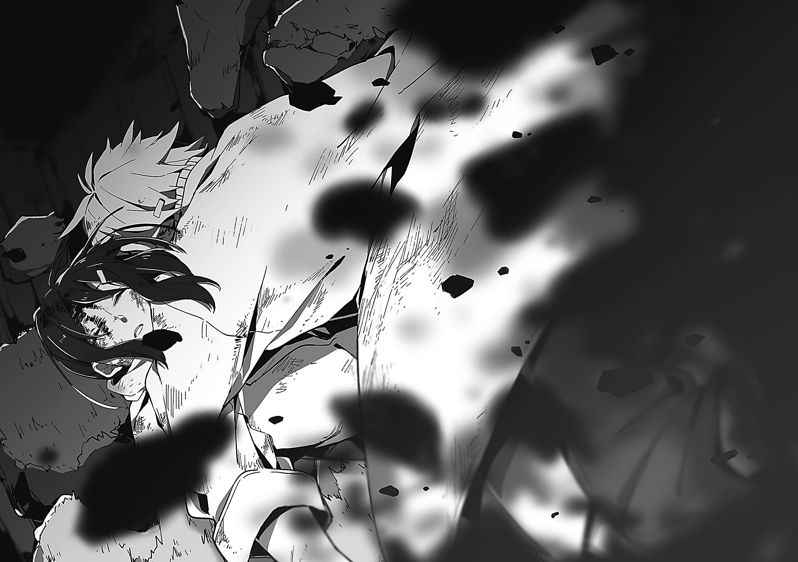
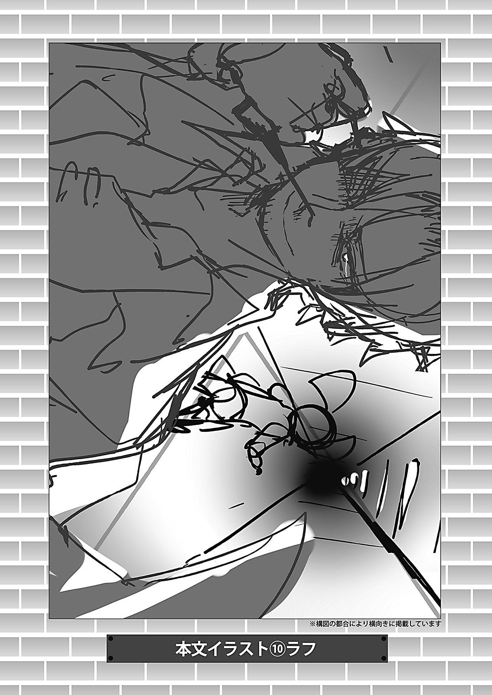

<h1>カゲロウデイズⅤ　-the deceiving-</h1>
<h3>じん（自然の敵Ｐ）</h3>

## 目次

- [夜咄ディセイブ０](#夜咄ディセイブ０)
- [或る日の屋上にて](#或る日の屋上にて)
- [夜咄ディセイブ１](#夜咄ディセイブ１)
- [夜咄ディセイブ２](#夜咄ディセイブ２)
- [夜咄ディセイブ３](#夜咄ディセイブ３)
- [夜咄ディセイブ４](#夜咄ディセイブ４)
- [或る日の路上にて](#或る日の路上にて)
- [夜咄ディセイブ５](#夜咄ディセイブ５)
- [今日という日の路上にて](#今日という日の路上にて)
- [目から鱗の落ちる話](#目から鱗の落ちる話)

## 夜咄ディセイブ０

「……いやいや、ホントだって。こんな<ruby>噓<rt>うそ</rt></ruby>ついたってしょうがないじゃん」

 

　僕がそう言うと、少女は<ruby>訝<rt>いぶか</rt></ruby>しげな表情を浮かべた。

　大方、僕のことを疑っているんだろう。

 

　……疑うのは、<ruby>賢<rt>かしこ</rt></ruby>い行為だ。

　特に僕のような、人の目を<ruby>欺<rt>あざむ</rt></ruby>くのが得意な人間に対して、実に<ruby>賢<rt>けん</rt>明<rt>めい</rt></ruby>な行為だと言える。

 

「信じてもらえないかぁ……僕はただ、君を元の<ruby>身体<rt>からだ</rt></ruby>まで案内してあげたいってだけなんだけど」

　僕の言葉に、少女は<ruby>頑<rt>がん</rt></ruby>として首を縦に振らない。

　まぁ、そうだろう。

　こんな<ruby>胡<rt>う</rt>散<rt>さん</rt>臭<rt>くさ</rt></ruby>い言い方をしているのだから、当然だ。

 

　もちろん、こんな<ruby>喋<rt>しやべ</rt></ruby>り方にだって理由はある。

　僕だって別に、嫌って欲しい訳じゃない。

　ただ「自分ですら信用出来ない自分」を、常に誰かに疑って欲しいのだ。

 

　僕は自分が<ruby>解<rt>わか</rt></ruby>らない。

　何が好きで、何が嫌いで、何がしたくて、何故ここにいるのか。

　僕の本当の中身がどんな奴なのか、さっぱり解らないままでいる。

　だから、そんな奴の言うことを信用なんてして欲しくないのだ。

　疑って、否定して、何なら壊してもらってもいい。

　そうしてそこから顔を出した『本当の僕』を、僕は、改めて確認したいのだ。

 

　……とはいえ、これも『噓』なのかもしれない。

　噓に噓を重ねすぎたせいで、すっかり本音が見えなくなってしまっているから、困ったものだ。

 

　しかし、この子は実にいい子だ。

　人を疑う、まっすぐな強い『我』を持っている。<ruby>羨<rt>うらや</rt></ruby>ましいくらいだ。

 

「……じゃあさ、こうしようよ。君をそこまで連れて行く間、僕が<ruby>飽<rt>あ</rt></ruby>きさせないような話をしてあげるからさ。飽きたらどこかへ行ってくれて構わない」

 

　少女はまだ、<ruby>疑<rt>ぎ</rt>心<rt>しん</rt></ruby>に満ちた顔をしている。

　そうだ、それでいい。

 

「あぁ、変な話じゃないよ？　ちょっとした<ruby>身<rt>み</rt></ruby>の<ruby>上<rt>うえ</rt></ruby>話さ。大した話じゃないけど、<ruby>暇<rt>ひま</rt></ruby>はさせないようにするからさ」

 

 

「……ネタ話って<ruby>体<rt>てい</rt></ruby>で、一つどうかな？」

## 或る日の屋上にて

「でね。<ruby>遙<rt>はるか</rt></ruby>ってば、それ全部食べちゃったの。お医者さんに止められてるのにだよ!?　『<ruby>美<rt>お</rt>味<rt>い</rt></ruby>しいから大丈夫～』とか言ってさぁ」

　グダグダと息巻いていた<ruby>貴<rt>たか</rt>音<rt>ね</rt></ruby>さんは、そう言うと<ruby>嘆<rt>たん</rt>息<rt>そく</rt></ruby>を<ruby>漏<rt>も</rt></ruby>らした。

 

　そよぐ風が心地いい、午後の屋上。

　敷き詰められたコンクリートブロックは、うらうらと降り注ぐ春陽にじんわりと暖められていた。

　そこに腰を落とし、貴音さんの話を聞き始めてから、もう十分は<ruby>経<rt>た</rt></ruby>ったかというところだ。

 

「あはは。いっつも大変そうですねぇ。貴音さん」

　そんな<ruby>差<rt>さ</rt></ruby>し<ruby>障<rt>さわ</rt></ruby>りのない返しをすると、貴音さんは「あ～、話してたらまた腹立って来た」と言って、<ruby>眉<rt>み</rt>間<rt>けん</rt></ruby>にしわを寄せた。

　貴音さんはこの高校の二年生であり、養護学級に所属する女子生徒だ。

　好きな食べ物はブリ大根で、嫌いな食べ物はトマト。

　特技はゲームで、趣味もゲームなら日課もゲームの、典型的なゲーマーである。

　兄弟はおらず、両親は海外で仕事をしているらしい。なので祖母と二人暮らしなのだそうだ。

　そんな数ある貴音さんの特徴の中でも、一番の特徴は「いつもイライラしていること」である。

　今だって、ちょっと<ruby>愚<rt>ぐ</rt>痴<rt>ち</rt></ruby>を<ruby>零<rt>こぼ</rt></ruby>しただけだというのに<ruby>随<rt>ずい</rt>分<rt>ぶん</rt></ruby>と<ruby>苛<rt>いら</rt>立<rt>だ</rt></ruby>っているようだ。

　正直、機嫌を悪くするくらいなら、わざわざ腹の立つ話などしなければいいのではないかと思う。

　しかし、そういう訳にもいかないのが「<ruby>乙<rt>おと</rt>女<rt>め</rt>心<rt>ごころ</rt></ruby>」というやつなのだろう。

　何を隠そう、貴音さんは同級生の「遙」という男子生徒が好きなのである。

　いや、本人がそう公言している訳ではないのだが、ことあるごとに「遙がさ～」と<ruby>愚<rt>ぐ</rt>痴<rt>ち</rt></ruby>を<ruby>零<rt>こぼ</rt></ruby>されている身として、それくらいは<ruby>察<rt>さつ</rt></ruby>して<ruby>然<rt>しか</rt></ruby>るべきだろう。

 

　そんなところから、貴音さんの愚痴は愛情表現だと理解して聞く必要があった。

　変に「<ruby>酷<rt>ひど</rt></ruby>い奴ですね～」などと言って、貴音さんの<ruby>逆<rt>げき</rt>鱗<rt>りん</rt></ruby>に触れると面倒なことになってしまう。

 

　そう、面倒ごとは出来る限り<ruby>避<rt>さ</rt></ruby>けて、差し障りのない生活をしなくてはいけない。

　これが、この学校で過ごす上で、一番気をつけなくてはいけないことなのだ。

 

 

「にしてもあいつら、遅すぎじゃない？　ったく、昼ご飯買ってくるのにどんだけ時間かかってんだか」

「う～ん、<ruby>購<rt>こう</rt>買<rt>ばい</rt></ruby>が<ruby>混<rt>こ</rt></ruby>んでて……とかじゃないですか？」

　そう言うと、貴音さんは「ど～だかね～」と言って鼻を鳴らした。つくづく<ruby>捻<rt>ひね</rt></ruby>くれた、意地の悪い人だ。

　まぁ、自分もそう人のことは言えないのだが。

　屋上階と階下へ続く階段とを<ruby>仕<rt>し</rt>切<rt>き</rt></ruby>る、鉄製のドアを眺めていた貴音さんは、ふとなにか思い出したように、おもむろに口を開いた。

 

「……そだ。今あいつらもいないし、ちょっと聞きたいんだけど」

「はい、なんですか？」

「いや、ん～。いきなり変な質問かも知んないんだけどさ……」

　貴音さんは目を泳がしながら、含んだ言い方でそう言った。

　一体なんだろう。また愚痴でも始まるのだろうか。

 

「……アヤノちゃん、好きな人とか……いるの？」

 

　意外な質問に少々驚いた。

　てっきり貴音さんはそういうことに<ruby>頓<rt>とん</rt>着<rt>ちやく</rt></ruby>の無いタイプだと思っていたのだが……。

「す、好きな人ですか。いきなりですね」

「え!?　あ、そう!?　いや、言いたくなかったら全然いいんだけどさ！　あははは！」

　貴音さんは声を裏返らせ、<ruby>慌<rt>あわ</rt></ruby>てふためきながらにそう言った。

　何をそんなに慌てることがあるというのだろうか。<ruby>馬<rt>ば</rt>鹿<rt>か</rt>馬<rt>ば</rt>鹿<rt>か</rt></ruby>しい。

「いやいや、別にいいですよ。私……好きな人とか、いないですから」

　そう言うと、バタバタと取り乱していた貴音さんはピタッと動きを止め、目を丸くした。

「な、なんですか？　私、なにか変なこと言いました？」

「い、いや、別に……」

　貴音さんは、そう言うと「あはは……」とお茶を<ruby>濁<rt>にご</rt></ruby>した。その様子を見れば、どういう返答をして欲しかったのか、容易に想像がつく。

　大方、あいつの事が好きだと、言って欲しかったのだろう。

 

　……そう考えると、気分が重くなった。

　出来ることなら、そそくさと帰宅してしまいたい程だ。もちろん、そういう訳にもいかないのだが。

「それにしても、本当に遅いですねぇ。早く戻ってくるといいんですけど……」

　なんとか話題を変えようと、そんな事を言ってみる。

　すると、貴音さんも「ホント、何やってるんだろうね！　超お<ruby>腹<rt>なか</rt>空<rt>す</rt></ruby>いたよ～！」と言って、乗って来てくれた。

　……もう数分もすれば、あいつらはここに昼食を持って現れるのだろう。

　そうなれば、また色々と気を遣わなくてはいけない。本当に、<ruby>厄<rt>やつ</rt>介<rt>かい</rt></ruby>な事だ。

　特にあいつの顔など、正直あまり見たくなかった。

　初めて会った時から、どうにもあいつはいけ好かないのだ。

 

　途端、ガチャッとドアノブを捻る音が聞こえた。

「や～！　遅れてホントごめん！　お腹空いたでしょ～」

「しゃあねっすよ。めちゃくちゃ混んでたし」

　ドアが開き、二人分の声が飛び込んで来た。

　思ったより早かったが、まぁいい。今日も引き続き、違和感なく、差し障りなく、やり過ごすとしよう。

 

　小さく息を吸って僕は笑顔でこう言った。

 

「お帰り、シンタロー」

## 夜咄ディセイブ１

「……やっぱ、結構痛いかも」

 

　ズキンと走った痛みに、僕は思わず顔をしかめた。

　痛みの発信源である<ruby>右<rt>みぎ</rt>頰<rt>ほお</rt></ruby>に手をやると、<ruby>火<rt>ほ</rt>照<rt>て</rt></ruby>るような熱さが、冷えた指先から頭の<ruby>中<rt>ちゆう</rt>枢<rt>すう</rt></ruby>へと伝わっていく。

　殴られたのは確か、11時頃だったはずだ。

　あれからもう数時間も<ruby>経<rt>た</rt></ruby>つというのに<ruby>依<rt>い</rt>然<rt>ぜん</rt></ruby>として痛みに<ruby>収<rt>おさ</rt></ruby>まる気配はなく、それどころか右頰はますます熱を<ruby>宿<rt>やど</rt></ruby>し、<ruby>腫<rt>は</rt></ruby>れぼったくなっているようだった。

 

「ほんっと、めんどくさいなぁ」

　確か冷凍庫の中に、母さんの買ったケーキについてきた、保冷剤があったはずだ。

　あれを<ruby>宛<rt>あ</rt></ruby>てがえば、腫れも多少はマシになるだろうか。

　<ruby>痣<rt>あざ</rt></ruby>が残ってしまうと、色々とやっかいなことになる。

　以前、近所のおばさん連中に「どうして<ruby>怪<rt>け</rt>我<rt>が</rt></ruby>してるの？」だの「誰にやられたの？」だのと散々問いつめられた時は、本当に最悪だった。

　あの時のように、また変な連中が家に押し掛けて来たりしては、<ruby>堪<rt>たま</rt></ruby>ったものじゃない。

　<ruby>全<rt>まつた</rt></ruby>く、放っておけばいいものを、なんだって連中は人の事情に首を突っ込みたがるのだろうか。

　大体こんな怪我、僕に取ってみれば大した問題じゃない。

　そう、痛みなんてものは、<ruby>気<rt>き</rt>苦<rt>ぐ</rt>労<rt>ろう</rt></ruby>に比べればどうってことのないものなのだ。

 

　<ruby>淀<rt>よど</rt></ruby>んだ気分を変えるべく「ふぅ」と小さくため息をつき、座っていたベンチにどっかりと背中を預ける。

　日中の<ruby>茹<rt>ゆ</rt></ruby>だるような熱さも<ruby>和<rt>やわ</rt></ruby>らぎ、午後の公園はいつの間にか<ruby>閑<rt>かん</rt>散<rt>さん</rt></ruby>とし始めていた。

　頭上に広がる青空には日の暮れる気配こそないものの、太陽は薄雲に<ruby>翳<rt>かげ</rt></ruby>り、<ruby>先<rt>せん</rt>刻<rt>こく</rt></ruby>に比べ<ruby>幾<rt>いく</rt>分<rt>ぶん</rt></ruby>か落ち着きをみせている。

　小一時間ばかし前まで<ruby>滑<rt>すべ</rt></ruby>り台を<ruby>牛<rt>ぎゆう</rt>耳<rt>じ</rt></ruby>り、砂場をかき回してた子供達の群れはどこへやら。

　今となっては、狂ったように<ruby>逆<rt>さか</rt>上<rt>あ</rt></ruby>がりを練習している女の子一人を残して、<ruby>一<rt>いち</rt>様<rt>よう</rt></ruby>にその姿を<ruby>晦<rt>くら</rt></ruby>ましてしまった。

 

　それもそのはず。

　ちら、と目をやると、園内に設置された太陽電池式時計の針は午後五時を指し終え、それに合わせるように流れ終わったサイレンの残響も、ちょうど鳴り<ruby>止<rt>や</rt></ruby>んだところだった。

　大方、いなくなった子供達は、どこの誰が決めたとも知れないこの「決まり事」を守ったのだろう。

　決まり事を破る子供に、大人は酷く<ruby>敏<rt>びん</rt>感<rt>かん</rt></ruby>だ。その点を考えれば、お手て<ruby>繫<rt>つな</rt></ruby>いで帰った彼らの判断は実に賢明だと言える。

　そもそも僕らが生きているこの世界は、大人たちの作った「決まり事」と言う名の土壌の上に成り立っているのだ。

　進んで<ruby>叛<rt>はん</rt>旗<rt>き</rt></ruby>を<ruby>翻<rt>ひるがえ</rt></ruby>すなど、自殺行為も<ruby>甚<rt>はなは</rt></ruby>だしい。

　生きる<ruby>術<rt>すべ</rt></ruby>を知らぬ子供の僕らが、大人に歯向かい泣きじゃくったところで、世界はこれっぽっちも変わらない。

　当然、今の世界を<ruby>享<rt>きよう</rt>受<rt>じゆ</rt></ruby>し、<ruby>漠<rt>ばく</rt>然<rt>ぜん</rt></ruby>とした思考でもって本日を<ruby>揺蕩<rt>たゆた</rt></ruby>う僕の生活に、何かが変わる気配なんてものは<ruby>微<rt>み</rt>塵<rt>じん</rt></ruby>も見当たらなかった。

 

　……いや、そうでもないか。

　そうだ、昨日左頰に焼き付いていた痛みが、今日右頰に移ったのだった。

　こんな<ruby>些<rt>さ</rt>細<rt>さい</rt></ruby>ことでも「変化」と呼べばそうなのかもしれない。もっとも、くだらないことに変わりはないが。

　我ながら、自分は<ruby>偏<rt>へん</rt>屈<rt>くつ</rt></ruby>なやつだと思う。何を悟ったつもりでいるのかとも思う。

　しかし、友人もおらず、家で一人、俗っぽいメディアに触れることの多い身の上だ。

　同世代の子供達の、一歩先を行くような知識を持ち合わせてしまったところで、別段異常もないだろう。

 

　なんにせよ、今日も僕は、多くの子供達と<ruby>違<rt>たが</rt></ruby>わぬ<ruby>未<rt>み</rt>熟<rt>じゆく</rt></ruby>な思想の<ruby>下<rt>もと</rt></ruby>、母さんとの「決まり事」を守り続けていた。

　こうして公園で他の子供達に<ruby>紛<rt>まぎ</rt></ruby>れ、日がな一日を過ごすのも、そんな決まり事の一つなのだ。

　朝、仕事から帰ってきた母さんに風呂を<ruby>沸<rt>わ</rt></ruby>かし、食事を作ったのち、いつものように公園に出かける。

　そこから、夕方母さんが仕事に出かけるまでの時間を公園で過ごし、頼まれた買い物があれば遂行し、家に帰り、部屋の掃除をして眠りにつく。

　こんないくつかの決まり事を守ることが、僕の役目であり、全てだった。

　こうして考えてみれば<ruby>至<rt>し</rt>極<rt>ごく</rt></ruby>簡単なことばかりなのだが、どうも僕は<ruby>要<rt>よう</rt>領<rt>りよう</rt></ruby>が悪いらしく、いつも母さんを怒らせてしまう。

　昨日はトイレットペーパーを買い忘れたせいで怒らせてしまったし、今日は今日でカップを割ってしまい、これまた酷く怒らせてしまった。

　怒った母さんはいつも決まって僕を殴りつけるが、殴る母さんの手は、きっと僕と同じくらいに痛むんだろう。

　殴ったあと、謝りながらに涙を流す母さんの顔が、僕は何より苦手だった。

　だが、上手くやろうと考えるほどに、毎日何かが空回ってしまう。

　どうにかして母さんを喜ばせようとしても、何故だかいつも正反対の結果になってしまうから、不思議だ。

　そういえば以前、居間にあるテレビのリモコンが壊れた時、母さんは酷く<ruby>憤<rt>ふん</rt>慨<rt>がい</rt></ruby>し「不良品が」と言ってそのリモコンをゴミ箱に投げ込んでいた。

　決められたことを守れず、役に立つことができないものが「不良品」なのだと、僕はその時初めて学んだ。

　そう考えると、あの「不良品」と「僕」とは、<ruby>随<rt>ずい</rt>分<rt>ぶん</rt></ruby>似たもののように思える。

　ただでさえ仕事で疲れている母さんを毎日のように怒らせ、悲しませることしか出来ない僕は、さもすればあの「不良品」と何ら変わらないのではないか。

　だとするならば、何故母さんは、僕を捨てないのだろう。

　あの「不良品」の時と同じ様に、不出来な僕を捨てて新しいものに換えることだって出来るのではないか。

 

　わからない。

 

　どうして僕は毎日、母さんを悲しませることしか出来ないんだろう。

　母さんを悲しませることしか出来ないのに、何故「僕」は生まれてきたんだろう。

　そもそも、母さんは何のために僕なんかを……

　そんなことを考えていると、不意に胸の奥がキュッと締めつけられるように痛んだ。

　もう痛みでは流れなくなった涙が、頼んでもいないというのに、<ruby>瞼<rt>まぶた</rt></ruby>の奥の方からジワジワと込み上げてくる。

　マズい。泣いてはダメだ。別のことを考えないと。

　こんなところを人に見られては、また何か言われるかもしれない。

　以前の様にまた母さんに迷惑をかけ、あまつさえ一緒にいられなくなるなんてことになったら……

　最悪だ。耐えられるはずがない。母さんのいない世界なんて、僕には考えることさえ出来なかった。

 

　あと一時間。

　母さんが目を覚まして仕事に出かけるまでの一時間、この場所で静かにじっとしていよう。

　そのあと割ってしまったカップの代わりを買って、家に戻り、おとなしく過ごすのだ。

　とりあえずこの「決まり事」を守れば、今日はこれ以上母さんを悲しませずに済む。

　そうすれば明日はきっと……

　……きっと、どうなる？

 

　そんな疑問が頭に浮かんだその<ruby>刹<rt>せつ</rt>那<rt>な</rt></ruby>「ぐえっ」と響いた小さな悲鳴に、僕は<ruby>唐<rt>とう</rt>突<rt>とつ</rt></ruby>に我に帰った。

 

　ハッとして目をやると、先ほどまで鉄棒と<ruby>格<rt>かく</rt>闘<rt>とう</rt></ruby>していた例の女の子が、大の字になって地面に横たわっていた。

　驚いて注視するも、彼女は一向に起き上がろうとせず、ただただ両手を広げたまま、<ruby>宙<rt>ちゆう</rt>空<rt>くう</rt></ruby>を仰ぎ続けている。

　一体なにをどうした結果、今彼女はあんな状況になっているのか。

　<ruby>不<rt>ふ</rt>出<rt>で</rt>来<rt>き</rt>極<rt>きわ</rt></ruby>まる<ruby>流石<rt>さすが</rt></ruby>の僕も、それをわざわざ考え込むほどポンコツではなかった。

 

「ちょっ、君！」

　思わず声を張り上げるも返事はなく、短い<ruby>反<rt>はん</rt>響<rt>きよう</rt></ruby>音だけが園内を駆け抜ける。

　続けざまに訪れた不吉な<ruby>静<rt>せい</rt>寂<rt>じやく</rt></ruby>に、えも言われぬ<ruby>悪<rt>お</rt>寒<rt>かん</rt></ruby>が<ruby>奔<rt>はし</rt></ruby>った。

「や、やっば……！」

　僕は堪らず立ち上がり、出来る限りの力で地面を蹴った。

　あまりにいきなりの「緊急事態」を前に、今ひとつ信頼の置けぬ僕の頭は、<ruby>案<rt>あん</rt></ruby>の<ruby>定<rt>じよう</rt></ruby>、ものの見事にテンパり始めた。

　今までにテレビやラジオで見聞きした「最悪の事態」が、<ruby>怒<rt>ど</rt>濤<rt>とう</rt></ruby>の勢いで頭を埋め尽くしていく。

　あの時、ブラウン管の向こう側で、ブルーシートに囲まれていた悲惨な出来事が、もし今目の前で起きている「これ」なのだとしたら。

　この一瞬一秒に、一体どれほどの重みがあるというのだろうか。

　少女の挑んでいた鉄棒は別段背が高いものではなかったが、問題は落ち方だ。

　世の中には、<ruby>椅<rt>い</rt>子<rt>す</rt></ruby>から落ちただけで、大きな<ruby>怪<rt>け</rt>我<rt>が</rt></ruby>を負った人もいると言う。

　それが<ruby>遊<rt>ゆう</rt>具<rt>ぐ</rt></ruby>だろうと、打ち所が悪かったとしたら、なにがあったって不思議なことなどないのだ。

「にしたって、なんで僕なのさ……」

　辺りを見回すも、目の届く範囲に大人の姿は見当たらない。

　突然に手渡されたあまりに重大な役目に、心臓が破裂してしまいそうだった。

　しかし、迷っている時間もなければ、<ruby>怯<rt>おび</rt></ruby>えている余裕もない。

　続けざまに地面を蹴り、<ruby>悪<rt>あく</rt>童<rt>どう</rt></ruby>達によって<ruby>無<rt>む</rt>惨<rt>ざん</rt></ruby>に荒らされた砂場を飛び越えると、<ruby>依<rt>い</rt>然<rt>ぜん</rt></ruby>として倒れたままの少女の姿は、もう目と鼻の先だった。

　せめて、大したことのない怪我であってくれ。

　そんな願いを込め、再び<ruby>渾<rt>こん</rt>身<rt>しん</rt></ruby>の一歩を繰り出そうとした瞬間……

　それまでピクリとも動かなかった少女が、突如勢いよく起き上がった。

　セミロングの黒髪に、色合わせをしたかの様な<ruby>漆<rt>しつ</rt>黒<rt>こく</rt></ruby>の瞳を<ruby>潤<rt>うる</rt></ruby>ませて、少女はポカンとした表情でこちらを見つめている。

 

　あぁ、よかった。どうやら<ruby>致<rt>ち</rt>命<rt>めい</rt>傷<rt>しよう</rt></ruby>ではなかったらしい。血も出ていないようだし、顔色もよさそうだ。

　見たところ<ruby>随<rt>ずい</rt>分<rt>ぶん</rt></ruby>と整った顔立ちをしている。きっと将来はいい男に<ruby>見<rt>み</rt>初<rt>そ</rt></ruby>められ、幸せな家庭を築くのだろう。

　いやぁ、ホント、後に残るような怪我がなくてよかっ……

 

　ゴギッ！　という異音と共に、右の足首へ電流が走った。

　<ruby>無<rt>む</rt>論<rt>ろん</rt></ruby>、この両手で数えられる程度の吹けば飛ぶような数年の人生の中で、電流をお<ruby>見<rt>み</rt>舞<rt>ま</rt></ruby>いされた経験などあるはずもないのだが、そう形容して差し支えないであろう痛みが、一気に頭の<ruby>頂<rt>ちよう</rt>点<rt>てん</rt></ruby>まで突き抜ける。

 

　あぁ、そうだった。

　たしか、ほんのコンマ数秒前、渾身の力で足を踏み込んだのだった。

　少女の<ruby>容<rt>よう</rt>態<rt>だい</rt></ruby>と行く末を案じるあまり、どうやらとんでもない角度で足を踏み込んでしまったらしい。

　高速移動していた上体が、突っ張った足を基点として、もの<ruby>凄<rt>すご</rt></ruby>い勢いで地面へと突っ込んでいく。

　そんなところから、次の瞬間に起きるであろう出来事は、想像するに<ruby>難<rt>かた</rt></ruby>くなかった。

　あぁ、少女よ、せめてあまり見ないでくれ。

「どわぎゃああああぁっ！」

　選び抜いたのかと言わんばかりの情けない悲鳴を上げながら、これまた練習でもしたかのように<ruby>珍<rt>ちん</rt>妙<rt>みよう</rt></ruby>なポーズで、僕は公園の地面に突っ込んだ。

　これが<ruby>所謂<rt>いわゆる</rt></ruby>バラエティ番組のコーナー企画であったなら、お茶の間は大爆笑を禁じ得ないだろう。

　いや、むしろ笑ってくれた方がどれだけありがたいことか。

　笑いどころか音一つない静寂の公園のど真ん中で、僕は<ruby>踞<rt>うずくま</rt></ruby>ったまま完全に起き上がるタイミングを逃してしまった。

　足も身体も相当に痛むのだが、言わずもがな、そんなものはどうってことはない。

　問題は、それをはね<ruby>除<rt>の</rt></ruby>けるほどの苦痛を伴う「<ruby>羞<rt>しゆう</rt>恥<rt>ち</rt>心<rt>しん</rt></ruby>」という名の俗っぽい感情だ。

　考えてもみろ。<ruby>突<rt>とつ</rt>如<rt>じよ</rt></ruby>として突っ込んできた人間が、目の前で奇妙な叫び声を上げながら<ruby>華<rt>か</rt>麗<rt>れい</rt></ruby>なスライディングを決めたとしたら、どう思うか。

　……いや、アウトだ。恐ろしいわ。

　あぁ、あらぬ<ruby>早<rt>そう</rt>計<rt>けい</rt></ruby>で<ruby>余<rt>よ</rt>計<rt>けい</rt></ruby>なことなどしなければよかった。

　どうする。ここはさっさと顔を上げ、<ruby>一<rt>いち</rt>目<rt>もく</rt>散<rt>さん</rt></ruby>に走り去るべきか。

　いや、ダメだ。さっきゴキッとやった足では、いい具合の高速移動など出来るはずがない。

　ズルズルと不気味にのたうつような走り方になること<ruby>請<rt>う</rt></ruby>け<ruby>合<rt>あ</rt></ruby>いだろう。これ以上少女の純粋な記憶に、<ruby>要<rt>い</rt></ruby>らぬ<ruby>闇<rt>やみ</rt></ruby>を増やしてどうする。

　やはりここは、このまま時が過ぎ去るのを待つ、か。

　弁解もせず、少女の記憶の中で永遠に「<ruby>謎<rt>なぞ</rt></ruby>の不気味なスライディング野郎」として存在し続けるのは正直しんどいが、この際だ、<ruby>諦<rt>あきら</rt></ruby>めよう。

　あぁ、もうそれでいいからさっさと時間よ過ぎ去ってくれ。

 

「ねぇ、大丈夫？」

 

　大丈夫な訳あるか。

　身体中痛いわ、恥ずかしいわで、こちとら……

「えっ!?」

　顔を上げると、目の前には、先ほどの少女がハンカチを差し出す姿があった。

　両の大きな瞳には先ほど<ruby>溜<rt>た</rt></ruby>めていた涙はなく、表情を見るに、僕をどこぞへ通報しようという訳でもないようだった。

「い、いやいや！　全然大丈夫！　ちょっとつまずいて転んだだけだし……あ、あっはは……」

　慌てて上体を起こし、急ごしらえの笑顔を作る。

　<ruby>嫌<rt>けん</rt>厭<rt>えん</rt></ruby>されなかったのはありがたいが、かといってこの少女の前で見事にずっこけた事実に変わりはない。

　手を差し伸べられたからといって、ホイホイと<ruby>施<rt>ほどこ</rt></ruby>しを受け取れるほど、僕の羞恥心は軟派なものではなかった。

　慌てて取り<ruby>繕<rt>つくろ</rt></ruby>った僕の様子をみて、少女は<ruby>露<rt>ろ</rt>骨<rt>こつ</rt></ruby>な<ruby>疑<rt>ぎ</rt>問<rt>もん</rt>符<rt>ふ</rt></ruby>を浮かべた。

「でもでも、ちょっとつまずいたって感じじゃなかったよ？　すっごく痛そうだったし」

　少女の<ruby>無<rt>む</rt>垢<rt>く</rt></ruby>な問いかけが、<ruby>可<rt>か</rt>燃<rt>ねん</rt>性<rt>せい</rt>油<rt>ゆ</rt></ruby>の様に羞恥の炎を燃え<ruby>滾<rt>たぎ</rt></ruby>らせていく。

　あぁ、そうだ。<ruby>仰<rt>おつしや</rt></ruby>る通り、先ほどのやつは間違いなく、人生でベスト三に入るくらいの大転倒だ。

「ほ、ホント大丈夫だってば！　僕毎日こんな感じで転ぶし、慣れっこなんだよね、実は」

　いや、そんなやつがいてたまるか。三日で死ぬわ。

　気遣いと大噓がへたくそに入り交じった僕の返答に、少女は疑心の表情を強くした。

「普段から？　ん～、なんか隠してるような……」

　少女はじっとりとした訝しげな表情でもって、マジマジと僕の顔を見下ろす。

「あ、あはは……」

　まずい、これ以上続けても、<ruby>墓<rt>ぼ</rt>穴<rt>けつ</rt></ruby>を掘るだけだ。

　というか、随分とガツガツ来るな、この子は。

　先ほどまで地面に寝っ転んでいたのはなんだったんだ。ピンピンしているじゃないか。

　こうも元気よくされては「君を助けようと思って、転んじゃってさ」などとは口が裂けても言える訳がない。

 

　いやな予感がする。

　<ruby>既<rt>すで</rt></ruby>にろくなことにはなっていないが、これ以上余計に関わりあうと、<ruby>更<rt>さら</rt></ruby>に面倒なことになりかねない。

「不気味なスライディングを決めて怪我をした子がいる」などと<ruby>吹<rt>ふい</rt>聴<rt>ちよう</rt></ruby>して回られては、それこそ一大事だ。

　時間も時間。ここは、多少気色の悪い奴に思われてでも、早々にお引き取り願おう。

　多少僕のメンタルにダメージは残るかもしれないが、スッパリと引いてもらう為だ、仕方がない。

「……ふぅ。わかった、本当のことを話すよ」

　ため息まじりに僕がそう言うと、少女はキョトンとした表情を浮かべた。

「ほ、本当のこと？」

「そう。実はね……」

　いささかのこっ恥ずかしさにくじけそうになるも、僕はそれを表には出すまいと浮かべた<ruby>不<rt>ふ</rt>敵<rt>てき</rt></ruby>な笑みでもって、次のセリフをひねり出した。

「さっきのはね、必殺技の練習をしてたんだよ。一撃でこう……ヤバい奴らを倒すやつをね」

 

　沈黙。

　それはもうどギツイ沈黙だった。

　園内からはまるで時間が止まったかのように音が消え去り、<ruby>稀<rt>き</rt>代<rt>だい</rt></ruby>のヤバい奴へと<ruby>成<rt>な</rt></ruby>り<ruby>下<rt>さ</rt></ruby>がった僕のライフゲージをみるみる削っていった。

　さぁ、引け。僕の顔面が焼け野原になる前にドン引くのだ。

　そして今日のことはさっさと忘れ、帰って夕食を食べ、眠り、恋をし、幸せな人生を送ってくれ。

　しかし、早々に<ruby>立<rt>た</rt></ruby>ち<ruby>退<rt>の</rt></ruby>くであろうとしていた僕の予想に反し、少女は予想外の反応をみせた。

「や、やっぱりそうだったの!?」

　その言葉と共に、少女の表情からは<ruby>眩<rt>まぶ</rt></ruby>しい程の<ruby>好<rt>こう</rt>奇<rt>き</rt>心<rt>しん</rt></ruby>がキラキラと音をたてて<ruby>溢<rt>あふ</rt></ruby>れだす。

「……え？」

「そ、そそそ、そうじゃないかって思ってたんだ！　す、すごい！　なるほど、そうだよね……！　必殺技の練習だったらあんまり人には言えないもんね!?」

　先ほどに比べ、五倍増しでは足りぬほどの食いつきを見せる少女に、<ruby>堪<rt>たま</rt></ruby>らず僕は「う、うん!?　そうね!?」と<ruby>肯<rt>こう</rt>定<rt>てい</rt></ruby>なのか<ruby>否<rt>ひ</rt>定<rt>てい</rt></ruby>なのか<ruby>明<rt>めい</rt>瞭<rt>りよう</rt></ruby>でない返事をした。

　どんなところにツボを隠し持っているのだ、この子は。

　空振り三振で引っ込もうとしたつもりが、これじゃあ場外ホームランじゃないか。

　たじろぐ僕にも<ruby>御<rt>お</rt>構<rt>かま</rt></ruby>い無しの様子で、少女はずいと身を乗り出し、チラチラと辺りを見回したかと思うと、また妙なことを言い始めた。

「じ、実は内緒なんだけど、私も……なんだよね」

「いや、ごめん、何の話？」

　僕がずいと来た分の距離を取りながらそう<ruby>訊<rt>たず</rt></ruby>ねると、少女は再度辺りを見回し、更に声を落として続ける。

「必殺技だよっ、必殺技の練習」

　少女の表情は、真剣そのものだった。

　しかし、その表情<ruby>虚<rt>むな</rt></ruby>しく、発言の内容はお<ruby>世<rt>せ</rt>辞<rt>じ</rt></ruby>にも<ruby>真<rt>しん</rt>剣<rt>けん</rt></ruby>とは思えぬものだった。

「ヘ？　練習？　……それ、もしかしてさっきの逆上がりのこと？」

　思い当たる節はそれしかなかった。

　しかし、どうやらまたも僕はクリーンヒットを飛ばしたらしく、少女は「はぁっ！」と衝撃的な表情を受かべ「や、やっぱり知ってるものなんだ！」と鼻息を荒くした。

　知ってるも何も、逆上がりを知らない人間の方が珍しいだろう。

　というか、それと「必殺技」に何の関係があるというのだ。

　いや、まて。まさかこの子……

「も、もしかして君、逆上がりが何かの必殺技だと思ってる……？」

「うん、お父さんが言ってた。『逆上がりが決まれば、<ruby>大<rt>たい</rt>抵<rt>てい</rt></ruby>の敵は燃えて死ぬ』って」

　とんでもないことを口走りながらも、依然として少女の目に疑いの色はなかった。

「さっきもあとちょっとのところで失敗しちゃったんだけど『いめーじとれーにんぐ』もしたから次は大丈夫」

「そっかぁ……」

　あぁ、なるほど、そういうことか。

　あの怪我人の真似事は少女なりのイメージトレーニングだったのか。そうかそうか。

「……僕、もう帰っていいかな」

　恐らく僕の表情からは既に笑顔のえの字すら消え去り、<ruby>蒼<rt>そう</rt>白<rt>はく</rt></ruby>の色がべったりと張り付いていたことだろう。

　いや、無理もない。

　少女に相対してからのこの数分間で、一体どれほどのエネルギーを消費したことか。

　おおよそ数ヶ月分の活動エネルギーを消費した気さえする。

「え!?　もう帰っちゃうの!?　せっかくいろいろな相談が出来ると思ったのに……」

　<ruby>勘<rt>かん</rt>弁<rt>べん</rt></ruby>してくれ。

　少女にはあいにくだが、僕の肉体にもはや必殺技<ruby>談<rt>だん</rt>義<rt>ぎ</rt></ruby>に花を咲かせる体力は残っていない。

　全身の痛みと<ruby>倦<rt>けん</rt>怠<rt>たい</rt>感<rt>かん</rt></ruby>、そして何より底なしの<ruby>虚<rt>きよ</rt>無<rt>む</rt>感<rt>かん</rt></ruby>が今にも僕の背後より<ruby>具<rt>ぐ</rt>象<rt>しよう</rt>化<rt>か</rt></ruby>し、巨大なモンスターとなって適当な街くらい破壊してしまいそうだった。

「う、うん。時間も時間だし」

　差し支えないニュアンスを選び、僕は笑顔でそう返した。

　少女は「う～」と物言いたげな<ruby>呻<rt>うめ</rt></ruby>きを<ruby>漏<rt>も</rt></ruby>らしたが、さすがにこれ以上引き止めようとはしてこないだろう。

　時計を見ると、時刻は五時三十分を回ったところだった。

　家に帰るには少々早い時間だが、今日の僕にはカップを買って帰るという使命もある。

　そこら辺にかかる時間を考慮すると、このくらいにここを出ておいた方が、具合がいいだろう。

　捻っていない方の足で立ち上がり、恐る恐るもう片方の足に体重を乗せる。

　案の定痛みはあったが、どうやら歩けぬという程ではないようだった。

　これでもし、力も入らなければ立つことも出来ないなんてことになっていたら、少女に何を言われたことか、想像するのも<ruby>憚<rt>はばか</rt></ruby>られる。

 

「じゃ、じゃあ、僕帰るね」

　そう言ってそそくさと退散しようとすると、少女は先ほど同様「うぅ～！」と、不満を<ruby>露<rt>あらわ</rt></ruby>に<ruby>粘<rt>ねん</rt>着<rt>ちやく</rt>質<rt>しつ</rt></ruby>な呻きを上げる。

　よくよく見ると僕を捕らえている両の瞳には、先ほどにはなかった潤みが現れ始めていた。

　まずい、これ以上面倒なことになる前に、ここを去らねば。

　<ruby>仄<rt>ほの</rt></ruby>かな<ruby>罪<rt>ざい</rt>悪<rt>あく</rt>感<rt>かん</rt></ruby>を断ち切りながらに「はは……」と<ruby>愛<rt>あい</rt>想<rt>そ</rt>笑<rt>わら</rt></ruby>いを返し、僕は公園の出口に向け足を引きずり始めた。

 

「ねぇ！」

 

　数歩進んだところで、背後から少女の声が響いた。

　なんだ、まだ何かあるというのか。

 

　振り返ると少女は、つい先ほどの苦々しい表情とは打って変わって、柔らかな笑みを浮かべていた。

「また明日、お話ししない？」

 

　少女のその表情に、その言葉に、僕は思わず<ruby>惚<rt>ほう</rt></ruby>けてしまった。

　そういえば、僕は生まれてこの方「明日の約束」なんてことをしたことがあっただろうか。

　少なからず思い出せる限りの記憶の中に、そんな思い出は無い。

 

　いやいや、何が「思い出せる限り」だ。僕は子供なんだ。

　記憶が<ruby>埋<rt>まい</rt>没<rt>ぼつ</rt></ruby>する程の時間を、生きちゃいない。

 

「うん、また明日、ここで」

　そう言って僕は再び向き直り、公園を後にした。

　わざわざそっけなく返したのは、<ruby>何<rt>な</rt>故<rt>ぜ</rt></ruby>だろう。自分でもよく解らなかった。

　コンクリートの歩道を一歩進むごとに捻った足首は痛んだが、<ruby>雄<rt>ゆう</rt>弁<rt>べん</rt></ruby>に今日の出来事を語るその痛みが、今は何故だか<ruby>愛<rt>いと</rt></ruby>おしく思える。

　明日はどこも痛めたくないな、と、本音を<ruby>偏<rt>へん</rt>屈<rt>くつ</rt></ruby>で<ruby>覆<rt>おお</rt></ruby>い<ruby>隠<rt>かく</rt></ruby>しながら、僕はのんびりと歩みを進めた。

 

　　　　＊

 

　いつの間にやら、辺りは夕映えの色に染め上げられていた。

　手が痺れぬよう交互に買い物袋を持ち替えながら、片足を<ruby>庇<rt>かば</rt></ruby>うように歩き続ける僕は、なかなかにテクニシャンではなかろうか。

 

「ほんと、よさそうなのがあってよかったぁ」

　<ruby>最<rt>も</rt>寄<rt>よ</rt></ruby>り駅近くのアーケードで適当なカップを<ruby>見<rt>み</rt>繕<rt>つくろ</rt></ruby>った僕は、未だ痛む足を引きずりながらに帰路を進んでいた。

　足の痛みも歩く最中こそ少々<ruby>厄<rt>やつ</rt>介<rt>かい</rt></ruby>ではあるものの、家に帰って座ってしまえば、どうってことはないだろう。

　それよりも問題は、足の痛みのせいで右頰のことをすっかり忘れてしまっていたことだ。

　おかげでカップを選ぶ最中店員に「顔、どうしたの？」と訊ねられた際「僕、そんなに<ruby>不<rt>ぶ</rt>細<rt>さい</rt>工<rt>く</rt></ruby>ですか」と<ruby>非<rt>あら</rt></ruby>ぬ言葉を返してしまった。

 

　全く、あの少女め。

　明日会った時には何か仕返しをしてやらないと。

 

　そんな意地の悪いことを考えながら、黙々と歩を進める。

　通い慣れた道に入り、曲がり慣れた交差点を曲がり、待たされ慣れた踏切を抜けると、もう僕の住むアパートは目の前だった。

　いつものように正門を抜け、鉄製の階段をのぼり、二階一番奥の扉を目指す。

　あまり<ruby>奇<rt>き</rt>麗<rt>れい</rt></ruby>なアパートでないせいか、先々月に隣人が引っ越して以来、二階はほぼ空き部屋になっていた。

　母さんは「気を遣わなくていいから楽」と言っていたが、真夜中に一人でいることの多い僕は、正直少しだけ心細かった。

　何を隠そう、僕は<ruby>幽<rt>ゆう</rt>霊<rt>れい</rt></ruby>とか<ruby>祟<rt>たた</rt></ruby>りとかそういう<ruby>類<rt>たぐ</rt></ruby>いのものが、大の苦手なのだ。

　母さんはそう言うのが大好物らしく、よく「夏の心霊特番」なんていう名前からして鳥肌の立つような番組を<ruby>観<rt>み</rt></ruby>ているが、あればかりは本当にやめて欲しい。

　特にこの前の廃病院に潜入するやつなんて……あぁ、思い出すのやめよう。楽しいこと考えよう、楽しいこと……。

「……楽しいことないなぁ。あんまり」

 

　空き部屋の玄関扉を三つ<ruby>素<rt>す</rt>通<rt>どお</rt></ruby>りすると、いよいよ自室の玄関が見えてきた。

　正確な時刻は定かではないが、陽の高さを見るに、おおよそいつもと変わらぬ時間に帰宅出来たようだ。

 

　……ただ、いつもと変わらなかったのは、本当にそれだけだった。

 

「あれ、ドア開いてる」

　近づいた自室玄関のドアは、不用心に半開きになっていた。

　<ruby>余<rt>あま</rt></ruby>り<ruby>建<rt>た</rt></ruby>て<ruby>付<rt>つ</rt></ruby>けが良くないのか、元々しっかり閉めてやらないと閉まらないのだが、そんなことは当然母さんも知っているはずだ。

「急いでたのかな」

　僕は特に気にすることもなく、ドアノブに手をかける。

　ドアを開け、顔を上げるまで「明日、家を出る時は気をつけなくちゃ」などと<ruby>至<rt>し</rt>極<rt>ごく</rt></ruby>くだらないことを考えていた僕は、どこまでも救い様のない、大馬鹿野郎だった。

 

　顔を上げると、濃い<ruby>橙<rt>だいだい</rt></ruby>に照らされた部屋の中に、二人の大人がいた。

　一人はよく知る、奇麗な仕事着に身を包んだ、僕の母さん。

　もう一人は見たこともない、薄汚れた格好にマスクをつけた、<ruby>大<rt>おお</rt>柄<rt>がら</rt></ruby>な男だった。

 

「え……」

　何故母さんは仕事に出かけていないのだろうか。

　極端に家に人をいれたがらない母さんが、こんな男を招いたというのだろうか。

　だとするならば、何故母さんは汚いタオルで<ruby>猿<rt>さる</rt></ruby>ぐつわをされ、手を<ruby>縛<rt>しば</rt></ruby>られて、涙目で横たわっているのだ。

　何故この男は、母さんが大事にしていたアクセサリーを、<ruby>小<rt>こ</rt>汚<rt>ぎたな</rt></ruby>い手に握りしめているのだ。

　その答えは容易に想像がついた。

 

　だが、そんなことに気付くには、もう何もかもがどうしようもないくらいに、遅すぎた。

　音もなく近づいた男の右手が、僕の胸ぐらを捕らえ、もの凄い力で部屋の中へと放り投げる。

「がっ！」

　受け身もとれず、思い切り背中から床に<ruby>叩<rt>たた</rt></ruby>き付けられ、口から勢いよく空気の固まりが飛び出した。

　瞬間目の前がチカチカと、まるで何台ものカメラにフラッシュをたかれたかのように、<ruby>瞬<rt>またた</rt></ruby>く。

　息が吸えない。

　こんなに苦しい思いをしたのは、生まれて初めてだった。

　頭がパニックになり、起き上がろうと<ruby>踏<rt>ふ</rt></ruby>ん<ruby>張<rt>ば</rt></ruby>る右手も、ガクガクとしてまるで役に立たない。

　横たわった母さんが、叫ぶようなうめき声を上げていた。

　なんだ？　母さんは一体、何に対して叫んでいる？

　一体何に……

 

　<ruby>朦<rt>もう</rt>朧<rt>ろう</rt></ruby>とする頭が全力で両の瞳を動かし、部屋を出ようとする男の左手、握られたアクセサリーに<ruby>焦<rt>しよう</rt>点<rt>てん</rt></ruby>を合わせた。

　そうだ、あれに違いない。

　あのアクセサリーは母さんが毎日<ruby>辛<rt>つら</rt></ruby>い思いをして、やっと手に入れたものだ。

　それをこの男は、どこかへ持っていこうとしている。

　そうだよね、母さん。そんなことされちゃ、叫ばずにはいられない。

　ほんの一瞬、震えていた右手に確かに力が伝わった。

　右手は勢い良く床を押し、僕の身体を跳ね上げる。

　立ち上がった僕は、その勢いのまま男の背中へと飛びついた。

「か、返せよ……それ……お前のじゃないだろ……」

　しかし、肝心なところで、僕は<ruby>呆<rt>あき</rt></ruby>れる程に無力だった。

　男はチッと舌打ちをしたかと思うと、先ほどふるった腕力でもって僕の片手を振りほどき、再び僕を部屋の奥へと蹴り飛ばす。

「うぐっ……！」

　ぐらりと体勢を崩した僕は、<ruby>俯<rt>うつぶ</rt></ruby>せに床に倒れ込んだ。

　<ruby>上<rt>う</rt>手<rt>ま</rt></ruby>く息を吸うことも出来ず、両目は<ruby>霞<rt>かす</rt></ruby>み、<ruby>最<rt>も</rt>早<rt>はや</rt></ruby>立ち上がることも出来ない。

 

　ブルブルと震えていると、少々の間の後、台所の方からカシャカシャと金属がこすれる物音が聞こえた。

　見ることは<ruby>叶<rt>かな</rt></ruby>わなかったが、それが何を現しているのか、響く母さんの叫び声によっておおよその見当がついた。

　<ruby>滅<rt>めつ</rt>多<rt>た</rt></ruby>に料理をしない母さんが、ある時随分と立派なナイフセットを買ってきたことを思い出す。

　案の定それは使われることなく、台所に大事にしまわれていたのだが、<ruby>大<rt>おお</rt>方<rt>かた</rt></ruby>アレの中のどれかだろう。

　ようは、僕が再び飛びかかる前に、そいつで<ruby>串<rt>くし</rt>刺<rt>ざ</rt></ruby>しにするつもりなのだ。

　一突きしてしまえば僕は永久に黙り込むのだから、いちいち振りほどく手間もかからない。お手軽なものだ。

　床に頰をべったりとつけて横たわっていた僕には、男の足音がみるみる近づいて来ていることが手に取るように理解できた。

　多分、この後数分も経たぬうちに、僕は死ぬんだろう。そこに<ruby>別<rt>べつ</rt>段<rt>だん</rt></ruby>感動も<ruby>感<rt>かん</rt>傷<rt>しよう</rt></ruby>もなかった。

　かと言って、このまま寝ている訳には、いかない。

　持てる力の全てを込め、息も絶え絶えではあったが、僕はなんとか立ち上がった。

　今日一日これだけ痛い思いをしたというのに、既に身体のどこからも、痛みの信号は無かった。

 

　正面に<ruby>屹<rt>きつ</rt>立<rt>りつ</rt></ruby>する男の右手には、案の定<ruby>真<rt>ま</rt>新<rt>あたら</rt></ruby>しいナイフが握られている。

　例えば今、僕が両の手を振り回したところで、この男を<ruby>撃<rt>げき</rt>退<rt>たい</rt></ruby>することは不可能だろう。

　それどころか、考えうる限りの何をやったところで、かすり傷一つ付けられるのかも解らない。

　しかし、そんなことはしなくても良い。少しの間、こいつの動きを止めるだけで良いのだ。

　倒れた母さんの方に目をやると、母さんは涙を流し、僕に向かって何か叫んでいた。

　ごめん、母さん。多分あのアクセサリーは取り戻せないと思う。

　不出来で、馬鹿で、本当にごめん。

　でも、母さんだけでも逃げられるように、なんとかこいつを止めるから。

　せめて、せめて最後に一度だけで良いから「この子を生んでよかった」って、思って<ruby>貰<rt>もら</rt></ruby>いたいんだ。

 

　僕は男に向き直り、両足に込めた力を一気に<ruby>解<rt>と</rt></ruby>き<ruby>放<rt>はな</rt></ruby>ち、<ruby>相<rt>そう</rt>対<rt>たい</rt></ruby>する男の<ruby>巨<rt>きよ</rt>軀<rt>く</rt></ruby>へと身体ごと突っ込んだ……

　……つもりだった。

 

　一歩を踏み込んだ瞬間、男の身体は既に、壁に叩き付けられていた。

　勢いよく男に体当たりをした母さんの胸には、既に真新しいものでなくなったナイフが、深々と突き刺さっている。

　その意味が、僕にはよく解らなかった。

　苦痛に顔を<ruby>歪<rt>ゆが</rt></ruby>ませた母さんの何かを訴えかけるような目を、ただただ<ruby>呆<rt>ぼう</rt>然<rt>ぜん</rt></ruby>と見つめることしか出来ない。

　男が母さんからナイフを引き抜いた瞬間、上がった鮮血と共に、僕の頭で何かが<ruby>弾<rt>はじ</rt></ruby>けた。

 

　既に音も聞こえなかったが、僕は何かを叫んでいたように思う。

　ただ、僕が飛び込んでから、男に腹を一突きにされ、踏みつけられるまでの時間は、そう長いものではなかったはずだ。

 

　倒れた母さんの横に、並ぶように横たわった僕は、冷たい水の中に沈んでいくような、不思議な感覚に襲われていた。

　猿ぐつわをされたままの母さんは涙を流し、最後に何か伝えようとしているようだったが、それの<ruby>真<rt>しん</rt>意<rt>い</rt></ruby>を知ることは、<ruby>終<rt>つい</rt></ruby>ぞ<ruby>叶<rt>かな</rt></ruby>わなかった。

 

 

 

 

 

　そこは知らない街だった。

 

　知っているものなど、見渡す限りに何一つとして見当たらない。

 

　見上げる空にも見慣れた色はなく、どこまでも広がる漆黒の中、巨大な<ruby>衛<rt>えい</rt>星<rt>せい</rt></ruby>だけが<ruby>不<rt>ぶ</rt>気<rt>き</rt>味<rt>み</rt></ruby>に浮かんでいる。

 

　そう「夜」だ。

 

　僕は……いや、僕らのような「子供」は「夜」を知らない。

 

　光<ruby>溢<rt>あふ</rt></ruby>れる日中とは<ruby>隔<rt>かく</rt>絶<rt>ぜつ</rt></ruby>された、大人達の世界。

 

　踏み込んではいけない、大人達だけの世界。

 

　いつも母さんを飲み込み、連れ去ってしまう、暗黒の世界。

 

　……僕は「夜」が大嫌いだった。

 

　一歩足を進めると、コンクリートを踏みならす僕の靴音は、暗色のビル壁に<ruby>谺<rt>こだま</rt></ruby>し、<ruby>厭<rt>いや</rt></ruby>らしく響き渡る。

 

　吹き抜ける夜風は<ruby>爽<rt>さわ</rt></ruby>やかなものではなく、何かを<ruby>囁<rt>ささや</rt></ruby>くような、気色悪さを<ruby>孕<rt>はら</rt></ruby>んでいた。

 

　<ruby>毒<rt>どく</rt>気<rt>け</rt></ruby>を帯びたネオンが視界の隅にちらつく<ruby>度<rt>たび</rt></ruby>、まるでそれが見てはいけないようなものに思えて、<ruby>堪<rt>たま</rt></ruby>らず目を<ruby>背<rt>そむ</rt></ruby>けてしまう。

 

　気持ちが悪い、吐き気が込み上げてくる。

 

　くらくらと<ruby>目<rt>め</rt>眩<rt>まい</rt></ruby>に似た感覚に襲われながらも、どこへ続くとも知れない道を、僕はひたすらに進んだ。

 

「ダメだよ君、こんなところへ来ちゃ」

 

　<ruby>唐<rt>とう</rt>突<rt>とつ</rt></ruby>に耳元で、そんな言葉を囁かれたような気がした。

 

「君は子供だろう？　『夜』のことをまるで知らない。さぁ、早く帰りなさい」

 

「……偉そうに。あんたに何が解るんだ」

 

「何でも解るさ。大人だからね」

 

　ネットリと耳にまとわりつく様なその声に、僕は<ruby>徐<rt>じよ</rt>々<rt>じよ</rt></ruby>に怒りを覚え始めた。

 

「子供扱いするなよ」

 

　僕がそう言うと、囁く声はシュルシュルと奇妙な音を立てた。

 

　それは笑っている様にも、<ruby>蛇<rt>へび</rt></ruby>が舌なめずりしているようにも聞こえた。

 

「君はまるでなっていない。迷い込んだのが、見え見えだ。いいかい？　要するに、君は一番重要なことが解っていないんだよ」

 

　声はさっきにも増してシュルシュルと、くっついているのではないかと思う程の耳元で囁き続ける。

 

「重要なこと？」

 

　僕がそう問いかけた途端、歩みを止めた訳でもないのに、コツコツと響いていた靴音が途端に<ruby>止<rt>や</rt></ruby>んだ。

 

　驚いて見回すと、てらてらと揺れていたネオンも、ビル壁も、浮かんでいた月すら、その姿を<ruby>晦<rt>くら</rt></ruby>ましていた。

 

　なんだよこれ、と僕は叫んだが、もはや自分の声すら聞こえない。

 

　どこまでも深い闇。<ruby>一<rt>いつ</rt>遍<rt>ぺん</rt></ruby>の光も<ruby>射<rt>さ</rt></ruby>さない暗黒。<ruby>怖<rt>お</rt></ruby>じ<ruby>気<rt>け</rt></ruby>づく僕の姿すら、闇に<ruby>融<rt>と</rt></ruby>けてしまったようだった。

 

「君には見えないだろう？　ここに融け込んだ『噓』が」

 

　囁く声は、僕の内側から聞こえているような気がした。

 

「大人達は、闇に『噓』を<ruby>紛<rt>まぎ</rt></ruby>れ込ませる。そうやって自分の心を守るのさ」

 

　言葉の意味が理解出来ない。苦しい、苦痛だ。出してくれ。

 

「解るか、少年。これが『夜』だ。君たちの知らない、大人の世界だ」

 

　……大人ってなんなんだ。

　なんだって母さんはこんな世界を……

 

「知りたいか。知りたいというなら、その<ruby>澄<rt>す</rt></ruby>んだ心を、忘れるといい」

 

　心を忘れる？

 

「そうだ。どこまでも孤独で、どこまでも暗い『夜』の世界に、心なんてものは必要ない。必要なのは、『噓』だけだ」

 

　保っていた意識が、いよいよ<ruby>朦<rt>もう</rt>朧<rt>ろう</rt></ruby>として来た。

　僕の持つ何もかもが、闇に溶け込んでいくような感覚。

　<ruby>途<rt>と</rt>切<rt>ぎ</rt></ruby>れそうになる意識の中で、最後に聴いたその言葉だけが、消え入る心に<ruby>染<rt>し</rt></ruby>み付いた。

 

「<ruby>全<rt>すべ</rt></ruby>てを<ruby>欺<rt>あざむ</rt></ruby>け、少年」

## 夜咄ディセイブ２

　夏が終わった。

　むせ返るような暑さも、<ruby>蟬<rt>せみ</rt></ruby>の鳴き声も、僕一人を残してどこかへと姿を消してしまった。

　半分物置のようになっている部屋に寝そべり、今日も僕は何をするでもなしに、ただただ生きている。

　母さんがいなくなってから、たらい回しにされた僕が行き着いたのが、この部屋だ。

　僕を引き取ったここの<ruby>家<rt>や</rt>主<rt>ぬし</rt></ruby>夫婦は母さんの遠縁の人らしかったが、僕とは血の<ruby>繫<rt>つな</rt></ruby>がりもないようで、関係は<ruby>軽<rt>けい</rt>薄<rt>はく</rt></ruby>そのものだった。

 

　あれから二ヶ月。

　ただ一人取り残された僕は、死のうとすら思わなかった。

　生きる理由も、死ぬ理由も、僕の全てが母さんあってこそのものだったのだと、改めて思い知らされた。

　たとえここで死んだとして、それが何になる。

　何をしたところで、もう二度と母さんには会えないのだから、そんなことは無意味だ。

　しかし、僕が母さんの息子であることに、<ruby>依<rt>い</rt>然<rt>ぜん</rt></ruby>として変わりはない。

　残された僕が誰かに迷惑をかけるような……それこそ、勝手に死んで面倒を起こすようなことをしては、母さんに申し訳が立たない。

　そんなことは、とても耐えられなかった。

　意味のない日々を、ただ<ruby>平<rt>へい</rt>凡<rt>ぼん</rt></ruby>に生き続ける。

　今はそれが、なにより<ruby>賢<rt>けん</rt>明<rt>めい</rt></ruby>なことのように思えた。

 

　<ruby>仰<rt>あお</rt>向<rt>む</rt></ruby>けに<ruby>寝<rt>ね</rt>転<rt>ころ</rt></ruby>り<ruby>無<rt>む</rt>心<rt>しん</rt></ruby>で天井を見つめていると、開け放した窓からの風が、冷えた空気を部屋へと押し込んだ。

　少なくとも、いつまでもこうしたままではいられないだろう。

　強くならなくてはいけないし、働かなくてはいけないし、食べていかなくてはいけない。

　なにより早く、大人にならなくては……

「大人」という言葉が頭をよぎった瞬間、心臓の奥の方で、何かが<ruby>蠢<rt>うごめ</rt></ruby>いたような気がした。

　ゾッとして起き上がるも、息苦しくもなければ胸も痛くはない。

「なんだろ……」

　下手に窓なんて開けるべきでなかっただろうか。

　これが<ruby>風<rt>か</rt>邪<rt>ぜ</rt></ruby>とか病気の<ruby>類<rt>たぐ</rt></ruby>いだったとしたら、とても<ruby>厄<rt>やつ</rt>介<rt>かい</rt></ruby>だ。

　ここの家主夫婦は正直あまり僕のことをよく思ってはいないように思える。

　あまつさえ熱なんて出してしまったら、苦い顔をされるのがオチだ。

　万が一に備えれば、風邪薬の一つでも飲んでおくべきだろうが、どうしたものか。

　そういえば、以前申し訳程度に家を案内された際、風邪薬の場所を聞いたような覚えがある。

　場所は<ruby>定<rt>さだ</rt></ruby>かではないが、わざわざ教えてくれたということは、使ってもいいということなのだろう。

「ん～……聞いてみようかな」

　確認を取るついでに場所も聞けば、<ruby>一<rt>いつ</rt>石<rt>せき</rt>二<rt>に</rt>鳥<rt>ちよう</rt></ruby>だ。<ruby>酷<rt>ひど</rt></ruby>くなる前に、やっつけてしまおう。

　立ち上がり、部屋を出る。

　たかが廊下ですらも<ruby>端<rt>たん</rt>正<rt>せい</rt></ruby>な<ruby>造<rt>つく</rt></ruby>りでもって<ruby>威<rt>い</rt>厳<rt>げん</rt></ruby>を<ruby>放<rt>はな</rt></ruby>つこの家は、かつてのアパートとは比べるまでもない程に、<ruby>豪<rt>ごう</rt>勢<rt>せい</rt></ruby>である。

　いや、そうは言っても、この家ですら一般家庭の域は出ていないのだろう。

「豪勢」という感想も、僕の育ちから来る<ruby>偏<rt>へん</rt>見<rt>けん</rt></ruby>もなのかもしれない。「これが普通だよ」と言われれば、言い返す何ものもない。

　だが、それにしてもだ。

　口に出したこともなければ今後出すつもりもないが、<ruby>随<rt>ずい</rt>所<rt>しよ</rt></ruby>に<ruby>施<rt>ほどこ</rt></ruby>された<ruby>装<rt>そう</rt>飾<rt>しよく</rt></ruby>や玄関ホールにかけられた絵画等、とてもじゃないが趣味のいいものとは思えなかった。

　廊下を歩くと、何の生き物を<ruby>象<rt>かたど</rt></ruby>ったのかもわからぬような、<ruby>不<rt>ぶ</rt>気<rt>き</rt>味<rt>み</rt></ruby>な<ruby>彫<rt>ちよう</rt>像<rt>ぞう</rt></ruby>に対面する。

　恐らく、海の向こうのどこからかの、<ruby>土産<rt>みやげ</rt></ruby>か何かの類いなのだろう。

　作り手には何の罪もないのはわかっているが、毎日これを掃除する身としては「もうちょっとシンプルに出来なかったんですか」と<ruby>愚<rt>ぐ</rt>痴<rt>ち</rt></ruby>の一つも<ruby>零<rt>こぼ</rt></ruby>したくなる。

 

　彫像を通り過ぎ、キッチンへと通じるドアを開け、中に入る。

　時間としては夕食も近いし、おばさんがいてくれれば話は早かったのだが、どうやら読みは外れたようだ。

　キッチンにおばさんの姿はなく、食器洗い機から取り出された食器の山を見るに、夕食の準備もまだのようだった。

「いない……か。う～ん、どうしよ」

　<ruby>流石<rt>さすが</rt></ruby>におばさんの部屋にまで乗り込み薬の<ruby>在処<rt>ありか</rt></ruby>を聞ける程、僕の神経も<ruby>図<rt>ず</rt>太<rt>ぶと</rt></ruby>くなかった。

　かと言ってここでおばさんを待つというのも、いささか気持ちが悪い。

　しかし幸運なことに、キッチンを訪れたことによって、薬の在処を聞いた時の記憶がなんとなく<ruby>鮮<rt>せん</rt>明<rt>めい</rt></ruby>になって来た。

　たしか、<ruby>茶<rt>ちや</rt>簞<rt>だん</rt>笥<rt>す</rt></ruby>の引き出しの中だったはずだ。

　あまり気を使いすぎるのも気色が悪いし、開けてみて当りだったら一つ貰って、さっさと部屋に戻ろう。

　僕はキッチンの奥に<ruby>聳<rt>そび</rt></ruby>える、これまた豪勢な茶簞笥の方へと、足を踏み出した。

　しかし、黙って進めばよかったものの、僕は何故だか積み上げられた食器の山にふと目をやってしまった。

　積み上げられた食器をなんとなしに眺めると、<ruby>絢<rt>けん</rt>爛<rt>らん</rt></ruby>な食器群の横に敷かれたタオルの上に、一本のナイフが置いてあった。

　それは、あの日男が母さんを刺したナイフと、同じタイプのものだった。

 

　背筋にゾッと嫌な感覚が走り、心臓が小さく飛び跳ねた。

　<ruby>無<rt>む</rt>論<rt>ろん</rt></ruby>、これは実際に母さんの命を奪ったナイフではない。その証拠に、こちらのナイフは<ruby>随<rt>ずい</rt>分<rt>ぶん</rt></ruby>と使い古されている様だった。

 

　おもむろに、ナイフに手を伸ばす。

　柄を握り持ち上げてみると、ナイフはかなりの重さがあった。

　この家に<ruby>溢<rt>あふ</rt></ruby>れる他の<ruby>調<rt>ちよう</rt>度<rt>ど</rt>品<rt>ひん</rt></ruby>と比べても、まったく<ruby>遜<rt>そん</rt>色<rt>しよく</rt></ruby>ない。きっと高価なものなのだろう。

「……ダメだよ母さん。こんないいもの買ったのに、使わないで死んじゃうなんて」

　ナイフセットを買って来た日、母さんは珍しく<ruby>饒<rt>じよう</rt>舌<rt>ぜつ</rt></ruby>だった。

　次の日には忘れてしまっていたようだったが「これで美味しいものが作れるから」と、目を輝かせていたのを覚えている。

　そんなことを思い出していると、<ruby>途<rt>と</rt>端<rt>たん</rt></ruby>に<ruby>淋<rt>さび</rt></ruby>しい気持ちに襲われた。

　母さんの顔が、声が、<ruby>匂<rt>にお</rt></ruby>いが、頭の中に鮮明に浮かぶ。

 

　母さん……

 

「キャアアアアアアア!!」

　突如響いた叫び声に、僕は<ruby>面<rt>めん</rt>食<rt>く</rt></ruby>らった。

　<ruby>慌<rt>あわ</rt></ruby>ててドアの方を見ると、そこには夕食の準備をしに来たのであろう、おばさんの姿があった。

　その表情は、まるで<ruby>化<rt>ば</rt></ruby>け<ruby>物<rt>もの</rt></ruby>にでも行き<ruby>逢<rt>あ</rt></ruby>ったのかと言わんばかりに<ruby>強<rt>こわ</rt>張<rt>ば</rt></ruby>り、恐怖の色で一色となっている。

　しまった。

　ナイフを持って立っていたことで、驚かせてしまったのか。

「あ、すみません！　ちょっと見ていただけなんです！」

　僕は急いでナイフをタオルの上に戻し、両の手の平をヒラヒラとおばさんに見せつけた。

　もちろん襲おうなんて気はこれっぽっちもないのだから、こうするのが一番だ。

　こうしておけば、少なくとも多少は安心してくれるだろう。下手に刺激して、どこぞに通報されでもしたら大変だ。

 

　が、しかし。

　おばさんは胸を<ruby>撫<rt>な</rt></ruby>で下ろすどころか、みるみる顔を<ruby>蒼<rt>そう</rt>白<rt>はく</rt></ruby>させ、ガタガタと<ruby>震<rt>ふる</rt></ruby>えだした。

　どう見ても、<ruby>尋<rt>じん</rt>常<rt>じよう</rt></ruby>ではない。何をそんなに<ruby>怯<rt>おび</rt></ruby>えているのだろうか。

　僕が出来るだけ柔らかに<ruby>訊<rt>たず</rt></ruby>ねようと口を開いた瞬間、おばさんは悲鳴にも似た声色で、早口に<ruby>喋<rt>しやべ</rt></ruby>りだした。

「な、なんであんたが……う、<ruby>恨<rt>うら</rt></ruby>みでもあったっていうの!?」

　恨み……と言われても、そんなものは<ruby>当<rt>とう</rt>然<rt>ぜん</rt></ruby>持ち合わせてはいない。

　むしろ住まわせてもらっていることに、感謝をしているくらいだ。

「いや、あの、とりあえず落ち着いて……」

　おばさんの言葉は理解出来なかったが、ひとまず誤解を解くべく、僕はおばさんに数歩近づいた。

　両手の平は変わらずヒラヒラとさせているし、どう考えても<ruby>敵<rt>てき</rt>意<rt>い</rt></ruby>があるようには見えないはずなのだが……

「ひいいぃ！　こ、来ないでぇ！」

　<ruby>健<rt>けん</rt>闘<rt>とう</rt>虚<rt>むな</rt></ruby>しく、おばさんはそう叫んだと思うと、廊下の方へと飛び出していった。

「あぁ！　ちょ、待ってくださいって！」

　僕が静止の声を上げるとほぼ同時に、おばさんは玄関のドアを開け、<ruby>何<rt>ど</rt>処<rt>こ</rt></ruby>かへと走り去ってしまった。

　バタン！　と勢いよくしまったドアの音だけが、<ruby>豪<rt>ごう</rt>奢<rt>しや</rt></ruby>な<ruby>邸<rt>てい</rt>内<rt>ない</rt></ruby>に<ruby>虚<rt>むな</rt></ruby>しく響く。

 

　マズい。マズいマズいマズい。

　とんでもないことになってしまった。

　<ruby>毛<rt>もう</rt>頭<rt>とう</rt></ruby>そんなつもりはないというのに、あらぬ誤解をされてしまったに違いない。

「ど、どうしよう！　あああ……」

　頭を抱えてオロオロとしてみるも、残念ながら時間が逆行するようなことはなかった。

　あぁ、僕はまた、なんて<ruby>余<rt>よ</rt>計<rt>けい</rt></ruby>なことをしてしまったのだろう。

　部屋で大人しくしていればよかったのだ。

　風邪の予防だなんて<ruby>馬<rt>ば</rt>鹿<rt>か</rt></ruby>なことを考えなければ、こんなことにはならなかったというのに……

　キッと、逆上気味にナイフを<ruby>睨<rt>にら</rt></ruby>みつける。

　こいつのせいもあるではないか。

　一体こいつは、何度僕に<ruby>酷<rt>ひど</rt></ruby>い思いをさせれば気が済むのだろう。

　<ruby>気<rt>き</rt>品<rt>ひん</rt>溢<rt>あふ</rt></ruby>れる刃の、まるで<ruby>挑<rt>ちよう</rt>発<rt>はつ</rt></ruby>するかの様な<ruby>瞬<rt>またた</rt></ruby>きをみていると、なんだか<ruby>無<rt>む</rt>性<rt>しよう</rt></ruby>に腹が立ってきた。

　どうしようという訳でもなかったが、<ruby>堪<rt>たま</rt></ruby>らずに<ruby>柄<rt>え</rt></ruby>を<ruby>摑<rt>つか</rt></ruby>む。

　このまま何処かへ放り投げてしまおうか。いや、売っぱらってしまった方が都合がいい。

　などと<ruby>下<rt>げ</rt>世<rt>せ</rt>話<rt>わ</rt></ruby>な<ruby>妄<rt>もう</rt>想<rt>そう</rt></ruby>に<ruby>耽<rt>ふけ</rt></ruby>ったのもつかの間、鏡面のような刃に映った自身の顔に、僕は<ruby>度<rt>ど</rt>肝<rt>ぎも</rt></ruby>を抜かれた。

 

「……は!?」

　あまりにあり得ない光景に、僕は堪らずナイフを手放し、そのままガシャンと床に落とした。

　ぺたぺたと自分の顔を触ってみるが、感触に違和感はない。やはり、もう一度見てみない事には確認のしようもなかった。

　慌ててキッチンを飛び出し、悪趣味な彫像を横切り、洗面所へと飛び込む。

　瞬間、洗面台に備え付けられた鏡面に映り込んだ自身の姿に、僕は改めて<ruby>驚<rt>きよう</rt>愕<rt>がく</rt></ruby>した。

 

「な、なんで？」

　映り込んだその姿は、見慣れた自分の姿ではなく、他でもない母さんの姿だった。

　これがもし、本物の母さんとの再会だったとするならば、一も二もなく抱きついていただろう。

　が、そんなことは起こるはずがない。母さんは死んだのだ

　目前の<ruby>摩<rt>ま</rt>訶<rt>か</rt>不<rt>ふ</rt>思<rt>し</rt>議<rt>ぎ</rt></ruby>な現象を前に、僕の脳みそは意外と冷静に働いた。

　鏡面に近づき、<ruby>頰<rt>ほお</rt></ruby>をつまんでみる。

　映る顔自体は<ruby>紛<rt>まぎ</rt></ruby>れもない母さんのものだったが、指先に伝わる感覚はどうもそういう訳ではないようだった。

　引き続きマジマジと鏡面を見つめる。

　口をぱくぱくと開閉させると、その動きに合わせて鏡面の母さんの口も同じ動きをした。

　間違いない、これは僕だ。

　何がどうしてこうなったのか、原因は<ruby>全<rt>まつた</rt></ruby>くもって想像つかないが、何故だか僕は母さんの姿になってしまっているのだ。

　そう理解した途端、頭の隅でカチンと歯車のかみ合う音がした。

　先ほど奇声を上げて飛び出していったおばさんは、この姿を見たのか。

　そうだったとするならば、あの様子にも<ruby>俄<rt>が</rt>然<rt>ぜん</rt>納<rt>なつ</rt>得<rt>とく</rt></ruby>がいく。

　夕飯を作ろうとキッチンに入ったところに、死んだはずの<ruby>親<rt>しん</rt>戚<rt>せき</rt></ruby>がナイフを持って立ち尽くしていたのだ。

　驚いて飛び出すのもしょうがないだろう。まぁ、僕だったら抱きついているが。

 

　ともかく、これからどうしたものか。

　このまま鏡面に向かって「会いたかった」などと語りかけたところで、<ruby>不<rt>ふ</rt>毛<rt>もう</rt>極<rt>きわ</rt></ruby>まりなければ<ruby>気<rt>き</rt>色<rt>しよく</rt></ruby>悪いったらない。

　そんなことをするよりも、まずは<ruby>一<rt>いつ</rt>刻<rt>こく</rt></ruby>も早く元の姿に戻らねば。

　おばさんのあの様子だと、恐らく警察あたりに飛び込んだことだろうから、いつまでもこの姿のままでボーッとしているわけにもいかない。

　だが「死んだ親戚がキッチンに立っていたんです」と大騒ぎしたところで、すぐさま警察がここへやってくるだろうか。

　いや、それはない。適当にあしらわれるのが<ruby>関<rt>せき</rt></ruby>の<ruby>山<rt>やま</rt></ruby>だ。

　まだ<ruby>若<rt>じやつ</rt>干<rt>かん</rt></ruby>の時間はあるということか。

　改めて鏡面に映る母さんの顔をマジマジと<ruby>眺<rt>なが</rt></ruby>めてみるも、当然元に戻るボタンがついている訳でもなく、<ruby>打<rt>だ</rt>開<rt>かい</rt>案<rt>あん</rt></ruby>に<ruby>繫<rt>つな</rt></ruby>がるなにかを見いだすことは出来なかった。

　というか、そもそも僕はいつからこの姿になっていたのだろうか。

　最初にナイフを手に取った時、刃に一瞬映った自分の顔は、紛れもない僕自身のものだった。

　その直後におばさんがキッチンに入って来て悲鳴をあげたのだから、僕はそのわずか一瞬でこの姿に<ruby>変<rt>へん</rt>貌<rt>ぼう</rt></ruby>してしまったということだろう。

　あの一瞬で僕がこの姿に変貌した理由……

　そう考えると、思い当たる<ruby>節<rt>ふし</rt></ruby>がない訳でもなかった。

「ま、まさかね……」

　両目を閉じ、とりあえずその思い当たる節を試してみることとする。

　あの時あの一瞬で僕がやっていたこと。

　それは母さんの姿を、声を、匂いを『思い浮かべる』ということだ。

　ならばもう一度『対象』を『思い浮かべる』ことで、元に戻れるのではないか。

　が。

　そんなアホでも思いつくようなやり方で、ホイホイ姿形を変えることが出来るような世の中ならば、そこらかしこではもう少し大混乱が起きているだろう。

　よってこの案に、僕はあまり期待をしていなかった。

　何はともあれ、集中しよう。

　姿を声を匂いを思い浮かべる……

 

　……三十秒ほど経っただろうか。

　頃合いなんてわかるはずもないが、取りあえず目を開けてみる。

「よし。……ってえぇ!?　マジで!?」

　先ほどまで鏡の向こうに立っていた母さんの姿は<ruby>奇<rt>き</rt>麗<rt>れい</rt></ruby>さっぱり消失していた。

　母さんに変わって現れたのは、二ヶ月程前に公園で出くわした少女その人である。

　<ruby>背<rt>せ</rt>格<rt>かつ</rt>好<rt>こう</rt></ruby>も肌の色も印象的な瞳も、何もかもが思い浮かべていた少女のそれと、寸分<ruby>違<rt>たが</rt></ruby>わぬものだった。

「な、なにこれ、すごい……！」

　生まれて以来、何かに対してこんなにも「面白い」と感じたことがあっただろうか。

　いや、なかったと<ruby>断<rt>だん</rt>言<rt>げん</rt></ruby>出来る。

　それほどまでに目の前で巻き起こっているこの現象は、<ruby>奇<rt>き</rt>怪<rt>かい</rt></ruby>で、<ruby>珍<rt>ちん</rt>妙<rt>みよう</rt></ruby>で、実に<ruby>好<rt>こう</rt>奇<rt>き</rt>心<rt>しん</rt></ruby>を<ruby>煽<rt>あお</rt></ruby>るものだった。

　<ruby>不<rt>ふ</rt>毛<rt>もう</rt></ruby>なことだと理解していても「次はどんなものに変身してやろう」という気持ちを、<ruby>抑<rt>おさ</rt></ruby>えることが出来ない。

　まるでこの短い人生の中で<ruby>溜<rt>た</rt></ruby>まっていた「<ruby>悪戯<rt>いたずら</rt>心<rt>ごころ</rt></ruby>」が<ruby>一<rt>いつ</rt>斉<rt>せい</rt></ruby>に吹き出したかのようだった。

　鏡面に映る少女は、<ruby>丁<rt>ちよう</rt>度<rt>ど</rt></ruby>「<ruby>必<rt>ひつ</rt>殺<rt>さつ</rt>技<rt>わざ</rt></ruby>」の話をしていた時のように、目をキラキラと輝かせていた。

　そうか、あの時君はこういう気持ちだったのか。

　だとするなら、あれほどまでにガツガツと食いつきたくなるのも、<ruby>頷<rt>うなず</rt></ruby>ける。

 

　そうだ、思えばあの日約束をしたっきり、結局少女に会うことは出来なかった。

　<ruby>何<rt>ど</rt>処<rt>こ</rt></ruby>かでまた会えたのならば、この力でビックリさせてやろう。

　僕が少女の姿のまま洗面台の前でぴょんぴょんと飛び<ruby>跳<rt>は</rt></ruby>ねていると、邸内にガチャッという<ruby>小<rt>こ</rt>気<rt>ぎ</rt>味<rt>み</rt></ruby>の良い音が響いた。

　<ruby>途<rt>と</rt>端<rt>たん</rt></ruby>身体はギクッと<ruby>硬<rt>こう</rt>直<rt>ちよく</rt></ruby>し、いやな汗が<ruby>溢<rt>あふ</rt></ruby>れ出す。

 

　耳を澄ますと「この中です！　<ruby>不<rt>ふ</rt>審<rt>しん</rt></ruby>な人が……」と、おばさんの声が聞こえた。

　なるほど、<ruby>上<rt>う</rt>手<rt>ま</rt></ruby>くやったものだ。

「幽霊が出た」ではなく「不審者が出た」と言っておいて、取りあえず呼び込んでしまえということか。

　なんにせよ、遊んでいる場合ではない。

　いや、最初から遊んでいる場合ではなかったのだが、<ruby>一<rt>いつ</rt>層<rt>そう</rt></ruby>にそんな場合ではなくなってしまった。

　<ruby>幸<rt>さいわ</rt></ruby>い<ruby>警<rt>けい</rt>戒<rt>かい</rt></ruby>しているのか、ドカドカと踏み込んで来ようと言う訳でもなさそうだ。

　この<ruby>隙<rt>すき</rt></ruby>にとっとと元の姿に戻るとしよう。誰もいないとなったらおばさんは<ruby>顰<rt>ひん</rt>蹙<rt>しゆく</rt></ruby>をかうかもしれないが、この際それも<ruby>止<rt>や</rt></ruby>む<ruby>無<rt>な</rt></ruby>しだ。

　後で何かの形で<ruby>贖<rt>しよく</rt>罪<rt>ざい</rt></ruby>すればいい。

　目を<ruby>瞑<rt>つむ</rt></ruby>り、目前を暗闇で満たす。

　出来る限りに集中し、自分の本来の姿を、匂いを、声を『思い浮かべる』……

　思い浮かべる……！

「……ぜんっぜんダメだ」

　全身から汗が噴き出した。

　マズい。肝心の「自分自身」が全く持って思い浮かばない。

　今までの人生、僕はどれだけ自分に興味がなかったというのだ。

　考えてみれば写真を撮るなんてこともなかったし、鏡を見る習慣もなかった。

　更に言えば自分の声などわざわざ気にもしなかったし、匂いともなれば<ruby>尚<rt>なお</rt>更<rt>さら</rt></ruby>だ。

　<ruby>僅<rt>わず</rt></ruby>かな期待を込め両目を開けるも願い<ruby>虚<rt>むな</rt></ruby>しく、鏡には顔面蒼白の少女の姿が映し出されていた。

　ギシギシと廊下を近づく複数の<ruby>気<rt>け</rt>配<rt>はい</rt></ruby>に気づき、少女の表情は更に凍り付く。

　こんな姿で警察に捕らえられてみろ。

　少女にとってみればこの上ない<ruby>大<rt>だい</rt>迷<rt>めい</rt>惑<rt>わく</rt></ruby>だ。

　せめて別の誰かにとも思ったが、今にもショートしそうな頭では、集中なんて出来るはずもなかった。

 

「と、とにかく隠れなくちゃ……！」

　洗面所の奥には、浴室がある。

　一時しのぎも<ruby>甚<rt>はなは</rt></ruby>だしいが、このまま取っ捕まるよりも、<ruby>幾<rt>いく</rt>分<rt>ぶん</rt></ruby>かマシだろう。

　そうと決めたら、とりあえずは実行だ。

　僕は浴室に向け勢いよく足を踏み込んだ。

　そしてその一歩目で、マットの端を踏みつけ、思い切りすっころんだ。

「いでっ!!」

　腰のところに、激しい痛みが走る。

　僕の声に反応したのか、すぐ近くまで迫っていた複数の気配が、勢いよく洗面所に飛び込んで来た。

　予想通り、飛び込んで来たのは複数の警官だった。少女の姿のままであろう僕をジロジロと<ruby>見<rt>み</rt>下<rt>お</rt></ruby>ろすその姿に、僕の心は凍り付いた。

　僕は少女になんと言って<ruby>詫<rt>わ</rt></ruby>びればいいのだろう。

　それだけならまだしも、こんな力があると知られたら、僕は間違いなく今回の騒動の犯人に認定されてしまう。

　そうなれば、想像もできぬ程の面倒が巻き起こるに違いない。

　後悔してもしきれなかった。なんて<ruby>軽<rt>けい</rt>率<rt>そつ</rt></ruby>だったのだろうか。

　僕が自身の<ruby>愚<rt>おろ</rt></ruby>かさに絶望していると、残りの警官が<ruby>辺<rt>あた</rt></ruby>りをキョロキョロと警戒する中、一人が手を差し伸べてきた。

「君、大丈夫かい？　ここで一体何があったの」

「あ、いえ、なにもないです。ちょっと転んじゃって……」

　僕は<ruby>端<rt>たん</rt>的<rt>てき</rt></ruby>に、直近に起きた事実のみを伝えた。

「そうか。ええと……君以外に人は？」

　ギクッとして身体を<ruby>震<rt>ふる</rt></ruby>わせてしまったが、僕はありのまま「いませんけど……」と答えた。

　そうしていると、警官の背後から恐る恐るといった様子のおばさんが顔を<ruby>覗<rt>のぞ</rt></ruby>かせた。

　終わった。もうダメだ。

　おばさんはこの直後、見知らぬ少女の姿に驚くだろう。

　そうなれば、後はトントン<ruby>拍<rt>びよう</rt>子<rt>し</rt></ruby>だ。

　<ruby>何<rt>ど</rt>処<rt>こ</rt></ruby>かへ連れて行かれ、<ruby>尋<rt>じん</rt>問<rt>もん</rt></ruby>され……その先は、想像するのも<ruby>憚<rt>はばか</rt></ruby>られる。

　しかし、僕の予想とは<ruby>裏<rt>うら</rt>腹<rt>はら</rt></ruby>に、おばさんは思いもよらない言葉を口にした。

「なにしてるの？　<ruby>修<rt>しゆう</rt>哉<rt>や</rt></ruby>君」

「え？」

　名前を呼ばれるなんてことは、<ruby>別<rt>べつ</rt>段<rt>だん</rt></ruby>不思議も何もないことなのだが、この状況でのその言葉は、実に大きな意味を持っていた。

　慌てて起き上がり、洗面台の鏡を覗き込むと、そこには元の姿に戻った僕が、<ruby>涙<rt>なみだ</rt>目<rt>め</rt></ruby>で立っていた。

「しゅ、修哉君？　一体なにしてるの？」

　おばさんの言葉に返事もせず、僕は何故元の姿に戻ることが出来たのかを考えていた。

 

「……痛みだ」

 

　浮かんだ結論は、実に<ruby>皮<rt>ひ</rt>肉<rt>にく</rt></ruby>なものだった。

　転んだときに腰に走った激しい痛み。

 

　それに感じたのは、<ruby>紛<rt>まぎ</rt></ruby>れもなく「<ruby>懐<rt>なつ</rt></ruby>かしさ」だった。

 

　痛みには<ruby>慣<rt>な</rt></ruby>れっこになっていると思っていたが、それは大きな間違いだった。

「痛み」こそが、僕が「僕」であると実感するために必要な、<ruby>唯<rt>ゆい</rt>一<rt>いつ</rt></ruby>の「アイデンティティ」だったのだ。

　痛みでしか自分を実感出来ないだなんて、どれほど僕の頭は自分に興味がないのだろう。

　その場の人間が心配そうにこちらをみつめる中、あまりの<ruby>下<rt>くだ</rt></ruby>らなさに、僕は<ruby>堪<rt>たま</rt></ruby>らず吹き出してしまった。

 

　……自らを<ruby>偽<rt>いつわ</rt></ruby>り、他人を<ruby>欺<rt>あざむ</rt></ruby>く能力。

　そんな不気味な能力との出会いを、その時の僕は<ruby>呆<rt>あき</rt></ruby>れる程に<ruby>歓<rt>かん</rt>迎<rt>げい</rt></ruby>していた。

## 夜咄ディセイブ３

　<ruby>重<rt>おも</rt>苦<rt>くる</rt></ruby>しい雰囲気が、車内に<ruby>充<rt>み</rt></ruby>ち<ruby>満<rt>み</rt></ruby>ちていた。

　暖房のおかげで快適な温度にこそ<ruby>保<rt>たも</rt></ruby>たれてはいるものの、気の<ruby>利<rt>き</rt></ruby>いた会話がある<ruby>訳<rt>わけ</rt></ruby>でもなく、<ruby>凄<rt>すさ</rt></ruby>まじく<ruby>居<rt>い</rt>心地<rt>ごこち</rt></ruby>が悪い。

　<ruby>路<rt>ろ</rt>傍<rt>ぼう</rt></ruby>に並んだ電信柱の影が生むリズミカルな明暗だけが、車内における<ruby>唯<rt>ゆい</rt>一<rt>いつ</rt></ruby>の<ruby>活<rt>かつ</rt>気<rt>き</rt></ruby>となるほどだった。

 

　ハンドルを握るおばさんに<ruby>気<rt>き</rt>付<rt>づ</rt></ruby>かれぬようにしながら、僕は小さくため息をついた。

　そもそも、僕はあまり乗り物が得意ではない。いや、苦手、超苦手だ。

　それこそシーソーみたいなものならどうということはないが、車、電車あたりになるとてんでダメだった。

　それらに乗るという経験自体が少ないせいもあるとは思うが、もともと<ruby>三<rt>さん</rt>半<rt>はん</rt>規<rt>き</rt>管<rt>かん</rt></ruby>というやつが<ruby>貧<rt>ひん</rt>弱<rt>じやく</rt></ruby>なのだろう。

　そういえばかつて、母さんの気まぐれでジェットコースターとかいう訳の<ruby>解<rt>わか</rt></ruby>らない乗り物に乗ったことがあるが、あれは本当に最悪だった。

　速いわ、揺れるわ、回るわ、結局乗る意味もないわでとにかくすごかった。

　最中よろしくないものが込み上げて来た時には「恥を<ruby>晒<rt>さら</rt></ruby>すくらいなら」と<ruby>自<rt>じ</rt>決<rt>けつ</rt></ruby>すら覚悟したものだ。

　幸い最悪の事態にこそならずに済んだものの、とてもじゃないがあれにもう一度乗ろうなんて気は起きなかった。

 

　そんなこんなで、家を出てから早四十分。

　車は<ruby>一<rt>いち</rt>路<rt>ろ</rt></ruby>、僕の新しい家となるという特別養護施設を目指していた。

　どうしてこうなったのかといえば、理由は<ruby>諸<rt>しよ</rt>処<rt>しよ</rt></ruby>考えられるが、やはり一番の原因となったのは先日の一件だろう。

 

　僕が初めて力を使ったあの日以降、おばさんは僕をあからさまに避けるようになっていった。

　もちろん僕が<ruby>奇<rt>き</rt>怪<rt>かい</rt></ruby>な力を持っているだなんてことは、話してもいなければバレてもいない。

　はずなのだが、どうにもおばさんはややこしい方に<ruby>勘<rt>かん</rt>違<rt>ちが</rt></ruby>いをしてしまったらしく、翌日からあの<ruby>豪<rt>ごう</rt>勢<rt>せい</rt></ruby>な家には、<ruby>自<rt>じ</rt>称<rt>しよう</rt>付<rt>つ</rt></ruby>きの<ruby>霊<rt>れい</rt>媒<rt>ばい</rt>師<rt>し</rt></ruby>やらエクソシストやらが入り<ruby>浸<rt>びた</rt></ruby>るようになってしまった。

　あの連中の<ruby>胡<rt>う</rt>散<rt>さん</rt>臭<rt>くさ</rt></ruby>さと言ったらなかったが、おばさんは<ruby>随<rt>ずい</rt>分<rt>ぶん</rt></ruby>お気に<ruby>召<rt>め</rt></ruby>したらしく、連中の<ruby>霊<rt>れい</rt>験<rt>げん</rt></ruby>あらたかなお言葉を<ruby>妄<rt>もう</rt>信<rt>しん</rt></ruby>し始めたのが運の尽き。

　<ruby>案<rt>あん</rt></ruby>の<ruby>定<rt>じよう</rt></ruby>、<ruby>諸<rt>しよ</rt>悪<rt>あく</rt></ruby>の<ruby>根<rt>こん</rt>源<rt>げん</rt></ruby>は僕とされたようで、そこからはまぁ、お<ruby>察<rt>さつ</rt></ruby>しだ。

　元より迷惑と言われれば去るつもりもあったし、<ruby>別<rt>べつ</rt>段<rt>だん</rt></ruby>あの家に<ruby>未<rt>み</rt>練<rt>れん</rt></ruby>がある訳でもない。

　あるとするならば、むしろ<ruby>自<rt>じ</rt>責<rt>せき</rt></ruby>の<ruby>念<rt>ねん</rt></ruby>だ。

　あの一件でかけてしまった迷惑は、とても今の僕に<ruby>償<rt>つぐな</rt></ruby>いきれるものじゃない。

　いつかなにかの形で返したいとは思うのだが、その方法すら、今の僕には思いつくことが出来なかった。

 

　僕が再びため息をついた<ruby>丁<rt>ちよう</rt>度<rt>ど</rt></ruby>その時、ガタゴトと走っていた車が停まった。

　僕がキョロキョロとしていると「着いたよ。さぁ、降りて」と言って、おばさんは車外に出て行ってしまった。

　フロントガラスの向こうに聳えている薄茶色の<ruby>外<rt>がい</rt>装<rt>そう</rt></ruby>をした<ruby>邸<rt>てい</rt>宅<rt>たく</rt></ruby>が、おばさんの言っていた「施設」というやつだろうか。

　おばさんが言うには、僕のように<ruby>身<rt>み</rt>寄<rt>よ</rt></ruby>りのない子供達が暮らす施設であるらしい。

　説明の際、おばさんは気まずそうな笑顔を浮かべながら「年の近い子が一緒の方が、楽しいだろうから」とセールスポイントを<ruby>挙<rt>あ</rt></ruby>げた。

　が、年の近い子供程、面倒くさい生き物はいない。

　生まれてこの<ruby>方<rt>かた</rt></ruby>友達の一人も出来たことのない僕に取って、目の前の邸宅は動物園となんら変わりないようにすら思えた。

 

　僕が車から降りると、おばさんは車にガチャリと<ruby>鍵<rt>かぎ</rt></ruby>をかけ、時計を見た。

「奥で職員の人とちょっと話をしてくるから、ここで待っていてね」

「え？　あ、はい」

　そのままおばさんは正門から敷地内へと姿を消し、僕は一人取り残されてしまった。

　車内ですっかり温められた身体に、北風が<ruby>浸<rt>し</rt></ruby>みる。

　そんな気分ではないというのに、いささかセンチメンタルになってしまいそうだった。

　などと、ふわっとした気持ちでいたのもつかの間、ビュービューと吹きつける風が、もの<ruby>凄<rt>すご</rt></ruby>い勢いで身体を冷やし始めた。

「さ、さむっ！　っていうかこれ、どれくらい待たされるんだろ……」

　あまり<ruby>体<rt>たい</rt>軀<rt>く</rt></ruby>のいい方でない僕は、吹きすさぶ風を前にブルブルと身体を震わせた。

　数分で帰って来てくれるのならまだありがたいが、これが十分二十分かかるというのなら、話は別だ。

　というか、おばさん。なんで一人で行くのなら僕を車から出したのだ。絶対に考え無しだろう、これ。

　車内に戻ろうにも、おばさんが親切<ruby>丁<rt>てい</rt>寧<rt>ねい</rt></ruby>に鍵をかけていったので、それも<ruby>叶<rt>かな</rt></ruby>わない。

　かと言って正門の前に<ruby>呆<rt>ぼう</rt>然<rt>ぜん</rt></ruby>と立ち尽くしていては、<ruby>凍<rt>こご</rt></ruby>え死んでしまいそうだ。

　僕は<ruby>暫<rt>しばら</rt></ruby>くその場で足踏みをしていたが、身体に熱が宿る様子もなく、時間だけが過ぎていった。

 

「……無理無理無理、寒すぎだって！　これじゃ死んじゃうよ！」

　弱気な<ruby>独<rt>ひと</rt></ruby>り<ruby>言<rt>ごと</rt></ruby>を<ruby>繰<rt>く</rt></ruby>り<ruby>出<rt>だ</rt></ruby>しつつ、辺りをぐるっと見回してみるも、もちろん気の<ruby>利<rt>き</rt></ruby>いた暖房設備などある訳もない。

　こんなことなら<ruby>横<rt>おう</rt>着<rt>ちやく</rt></ruby>をしないで、もう少し厚着をしてくればよかった。

　コートなんて<ruby>贅<rt>ぜい</rt>沢<rt>たく</rt></ruby>は言わないが、せめて手袋ぐらい……

 

　などと考えていると、いつの間にやら目の前にマフラーが差し出されていた。

　あぁ、この際だ。マフラーだろうと別にいい。

　はぁ……と<ruby>至<rt>し</rt>福<rt>ふく</rt></ruby>の表情を浮かべてそれを受け取ろうとしたあたりで、僕はようやくことの異常さに気が付いた。

　ほんの一瞬……それこそ<ruby>瞬<rt>まばた</rt></ruby>きをする直前までいなかった人間が、当然のように目の前に立っていたのだ。

「うわわぁあっ！」と<ruby>不<rt>ぶ</rt>細<rt>さい</rt>工<rt>く</rt></ruby>な悲鳴をあげ、僕は<ruby>堪<rt>たま</rt></ruby>らず<ruby>飛<rt>と</rt></ruby>び<ruby>退<rt>の</rt></ruby>いた。

　大きく身体を<ruby>退<rt>ひ</rt></ruby>かせると、マフラーを差し出していたのが年の頃も近そうな少女であることに気が付いた。

 

　紫色をした大きな耳当てをつけ、暖かそうなコートに身を包んだ少女は、身につけているものこそ<ruby>立<rt>りつ</rt>派<rt>ぱ</rt></ruby>なように思えたが、短い髪の毛だけがボサボサと所々でハネている。

　一瞬少年と<ruby>見<rt>み</rt>紛<rt>まが</rt></ruby>えたが、スカートを<ruby>履<rt>は</rt></ruby>いているところから、少女と見て間違いないだろう。

　短髪の少女は僕が飛び退くとビクッと身体を揺らし、直後<ruby>恨<rt>うら</rt></ruby>めしそうにこちらを<ruby>睨<rt>にら</rt></ruby>みつけた。

 

「人がせっかく親切にしてあげたのに」

「へ……」

　僕がわたわたとしていると、短髪の少女は<ruby>大<rt>たい</rt>層<rt>そう</rt></ruby>気にくわない様子で「隣で死なれちゃ気分悪いから、貸してあげようと思ったの！」と声を荒らげた。

「わっ！　あ、そ、それはどうも。はは、じゃあ借りようかな……」

　僕がそう言ってマフラーに手を伸ばすと、短髪の少女は「最初からそうすればよかったんだ」と言わんばかりに、鼻を鳴らした。

　今さっきこの子が何もないところからいきなり現れたように思えたのは、気のせいだったのだろうか。

　それだけが少々気がかりだったが、こういう場合は、何も言わずに受け取っておいた方が身のためだろう。

　受け取ったマフラーは短髪の少女が身に<ruby>纏<rt>まと</rt></ruby>っているもの同様、子供用にしてはいささか立派すぎるものに思えた。

　よくよく見てみると、マフラーには案の定、有名なブランドのロゴがあしらえてある。

　丁度母さんもこのブランドの時計を持っていた。

　それはべらぼうに高価なものだったらしく、母さんもそれを滅多に着けようとはせず、戸棚の奥にしまい込まれていたことを思い出す。

「え～と、これはちょっと借りられないかな」

　僕が苦笑いでそう言うと、短髪の少女は<ruby>露<rt>ろ</rt>骨<rt>こつ</rt></ruby>に不満げな表情を浮かべた。

「人がせっかく……」

「いや、もちろんありがたいんだけどね!?　これすっごく高価なものでしょ。ダメだよ、ほいほい人に貸しちゃあ」

　僕がそう言うと、短髪の少女はキョトンとした表情を浮かべた。

「これ……高いの？」

「え、知らなかったの!?　う～ん……と、とにかく！　僕は大丈夫だから！」

　マフラーをずいっと押し返すと、少女は<ruby>苦<rt>にが</rt>虫<rt>むし</rt></ruby>をかみつぶしたような顔をして、渋々それを受け取った。

　そして、<ruby>暫<rt>しば</rt></ruby>しマフラーを見つめ考え込んだかと思うと、今度は直接僕の首にそれを巻き付けた。

「なんでっ!?」

「やっぱ貸す。ずっと見てたけど、やっぱり寒そうだし」

　意外と<ruby>強<rt>ごう</rt>情<rt>じよう</rt></ruby>な子だ。

　あまり気は進まないが、こうやって巻かれてしまったらもうどうしようもない。

　僕の身体は首元からぬくぬくと温まり始め、これを外して再び押し返すことなど出来なくなってしまった。

「あ～、うん、ありがと……しっかしこれ、いいねぇ」

　さすがはブランド品。恐ろしいぬくさだ。

　物の価値など大してわからないが、これなら大金を出してでも買う価値があると思う。

　しかし至福に<ruby>浸<rt>ひた</rt></ruby>ったのもつかの間、短髪の少女の「ずっと見てた」という言葉にハッとなり、僕は細めていた目を見開いた。

 

「そういえば君、ずっと見てたって言ってたけど、どこで？」

「は？　どこでって、だから横で……」

　短髪の少女はそこまで言って何かに気づき、苦い顔をしたかと思うと「うぅ……」と<ruby>呻<rt>うめ</rt></ruby>きを漏らした。

「あ、な、なんかマズいこと聞いちゃった？」

　何か良くない<ruby>琴<rt>きん</rt>線<rt>せん</rt></ruby>に触れたのではと僕が恐る恐る<ruby>訊<rt>たず</rt></ruby>ねると、短髪の少女は「別にマズくはない」とぶっきらぼうに返した。

「最近よく言われる。『お前、いつからそこにいたんだ』って」

　短髪の少女はそう言って、<ruby>険<rt>けわ</rt></ruby>しい表情を浮かべた。

　なるほど。見た限り口数もあまり多くない様だし、目立ちにくい子なのだろう。

「いや、さっきもいきなり現れたように見えたから、ビックリしたよ。一瞬<ruby>幽<rt>ゆう</rt>霊<rt>れい</rt></ruby>かと思っちゃった」

　何の<ruby>気<rt>き</rt>無<rt>な</rt></ruby>しにそんな冗談を言った僕は「あはは」と笑って見せた。

　が、対照的に短髪の少女の顔はみるみる赤くなり「うぐ……」と小さく呻いたかと思うと、ポロポロと涙を<ruby>零<rt>こぼ</rt></ruby>し始めた。

　もちろん、女の子を泣かせたのは初めてである。

「ああああああ!!　ごめん！　噓！　噓だからね!?　<ruby>全<rt>ぜん</rt></ruby>っ<ruby>然<rt>ぜん</rt></ruby>そんなこと思ってないからね!!」

　<ruby>大<rt>おお</rt>慌<rt>あわ</rt></ruby>てで<ruby>取<rt>と</rt></ruby>り<ruby>繕<rt>つくろ</rt></ruby>おうとするも、<ruby>時<rt>とき</rt>既<rt>すで</rt></ruby>に遅し。

　短髪の少女はグスグスとベソをかきながらも、<ruby>合<rt>あい</rt>間<rt>ま</rt>合<rt>あい</rt>間<rt>ま</rt></ruby>に<ruby>微<rt>かす</rt></ruby>かに「噓じゃない」「許さない」「絶対に」と攻撃的な<ruby>愚<rt>ぐ</rt>痴<rt>ち</rt></ruby>を零した。

　しまった。また<ruby>馬<rt>ば</rt>鹿<rt>か</rt></ruby>なことをやらかした。

　かつて母さんが「女の子はデリケートなんだ」と言っていたのを思い出す。

　なんてことだ、これがデリケートというやつか。

「ええと、ええと……」

　よりにもよって今日から『家』になる場所の前で、一体僕は何をやっているのだろうか。

　こんなところ誰かに見られては、入る前から<ruby>問<rt>もん</rt>題<rt>だい</rt>児<rt>じ</rt></ruby>扱いされかねない。

　誰か居やしないだろうなと、僕は勢いよく辺りを見回す。

　右を、左を、そしてもう一度右を見ようと振り向いた瞬間、驚くべきことが起きた。

 

　先ほどまで目の前で泣きじゃくっていた短髪の少女がこつ然と姿を消したのだ。

 

「え!?　いつの間に……!?」

　それは先ほど、少女が突如として現れた時以上の衝撃だった。

　僕に<ruby>愛<rt>あい</rt>想<rt>そ</rt></ruby>を<ruby>尽<rt>つ</rt></ruby>かしてどこかに走り去ったとしたならば、まだその後ろ姿は手の届くところにあっておかしくないだろう。

　それに、スポンジ製の靴でも<ruby>履<rt>は</rt></ruby>いていない限り、それなりの靴音だって聞こえるはずだ。

　しかしどこをどう見回してみても、そのどちらも確認することが出来なかった。

　異常だ。どう考えても「消えた」としか形容しようがないほどの速度で、短髪の少女はその姿を<ruby>晦<rt>くら</rt></ruby>ましてしまった。

「う、うそでしょ……？」

　目の前の現象を信じることが出来ず、僕は手の<ruby>甲<rt>こう</rt></ruby>で目をゴシゴシとこする。

 

「……噓つきはどっちさ」

　その声に、僕は再び<ruby>度<rt>ど</rt>肝<rt>ぎも</rt></ruby>を抜かれた。

　僕が目をこすったその<ruby>刹<rt>せつ</rt>那<rt>な</rt></ruby>、今度は先ほどまで立っていた場所に、再び短髪の少女が現れたのだ。

　普通なら僕は叫び声を上げていただろう。そうしなかったのはあまりの急展開に頭がついていかなかったからだ。

　しかし、ここで叫び声をあげなかったのは、実に<ruby>好<rt>こう</rt>都<rt>つ</rt>合<rt>ごう</rt></ruby>なことだった。

　変わらず泣き続けている短髪の少女を前に、もう一度大声なんて上げた日には、恐らく僕は思い切り<ruby>頰<rt>ほお</rt></ruby>をぶたれて<ruby>悶<rt>もん</rt>絶<rt>ぜつ</rt></ruby>していたことだろう。

　と、そんなことを考えていた矢先、僕はさらにとんでもないものを目にしてしまい、堪らず歯を食いしばった。

　短髪の少女の足の部分が、丁度スカートから<ruby>覗<rt>のぞ</rt></ruby>く<ruby>膝<rt>ひざ</rt></ruby>の下辺りから、ゆらゆらと<ruby>透<rt>す</rt></ruby>けてなくなっていたのだ。

　流石に「ひっ……」と声が<ruby>漏<rt>も</rt></ruby>れた。

　冗談で言ったつもりの「幽霊」という言葉が、<ruby>図<rt>はか</rt></ruby>らずも頭の中に浮かぶ。

 

　……ちょっと待て。

　もしかしてこの少女は、本当にそっちの<ruby>類<rt>たぐ</rt></ruby>いの存在なのではないか。

　たまたま僕がちょっと前に死にかけていたものだから、仲間かなにかだと勘違いをして、声をかけて来たのではないか。

　それだと言うのに僕が「幽霊かと思った」などと軽口をたたいてしまったから、怒っているのでは……

「私のこと、幽霊だって思ってるんでしょ」

　短髪の少女の言葉に、今度は僕の方が泣き出してしまいそうになった。

　背筋はガチガチに凍り付いていたが、なんとか<ruby>気<rt>き</rt>丈<rt>じよう</rt></ruby>を<ruby>振<rt>ふ</rt></ruby>る<ruby>舞<rt>ま</rt></ruby>う。

「あ、あは、あははは！　い、いやだなぁ！　ほ、ほ、ホント、そんなこと思ってないって！　僕ら友達じゃない、ね!?」

　案の定、どうしようもない程に口が回らなかった。

　足がガタガタと震える。もはや怯えていることにも気付かれているかもしれない。

「友達……？」

　短髪の少女は、<ruby>依<rt>い</rt>然<rt>ぜん</rt></ruby>グスグスと鼻をすすりながら、僕にそう問いかけた。

「そ、そう！　なんていうか……僕ら似た者同士じゃない？　え、え～っと……その……」

　立派な足を二本も生やして、何が似た者同士なものか。向こうは<ruby>浮<rt>ふ</rt>遊<rt>ゆう</rt></ruby>しているんだぞ。馬鹿か僕は。

　案の定、短髪の少女は胡散臭くてしょうがないといったような目で、こちらをじっとりと<ruby>睨<rt>にら</rt></ruby>みつけていた。

　ダメだ、殺される。<ruby>祟<rt>たた</rt></ruby>りとかなんかそういう感じのやつで殺される。

　ああ、こんなことになるのなら、あの胡散臭い自称霊媒師に、お<ruby>札<rt>ふだ</rt></ruby>の一枚や二枚<ruby>貰<rt>もら</rt></ruby>っておけばよかった。

　正直死ぬことよりも、何をされるかわからないということが、何より恐ろしい。

　あまりの恐怖にいよいよ泣き出してしまいそうになった時、僕はふと<ruby>妙<rt>みよう</rt>案<rt>あん</rt></ruby>を思いついた。

 

「そ、そうだ！　僕のとっておきも見せてあげるよ！　そしたら、ね！　友達ってことでいいよね！　ね！」

　僕が涙目になりながら、<ruby>無<rt>ぶ</rt>様<rt>ざま</rt></ruby>に<ruby>懇<rt>こん</rt>願<rt>がん</rt></ruby>すると、短髪の少女は「え、いや、何言ってんの」と引き気味に<ruby>容<rt>よう</rt>赦<rt>しや</rt></ruby>のない言葉を言い<ruby>放<rt>はな</rt></ruby>った。

　ここで引いては負けだと言わんばかりに、僕は「とりあえず見てみよう!?　ね!?　<ruby>後<rt>こう</rt>悔<rt>かい</rt></ruby>はさせないから！」と訳のわからないことを口走った。

　短髪の少女の表情からは、もう既に<ruby>不<rt>ふ</rt>信<rt>しん</rt>感<rt>かん</rt></ruby>しか見てとれなかったが、僕は構わず「例の能力」に頼ろうと、目を<ruby>瞑<rt>つむ</rt></ruby>り集中を<ruby>試<rt>こころ</rt></ruby>みた。

 

　あの日、初めてこの能力に気付いてからというもの、僕はおばさん達にバレないようにではあるが、何度かこの能力を使っていた。

　なりたい姿を、匂いを、声を『思い浮かべる』ことで、僕はその姿へと<ruby>変<rt>へん</rt>貌<rt>ぼう</rt></ruby>する。

　好奇心から色々な姿に<ruby>変<rt>へん</rt>貌<rt>ぼう</rt></ruby>しようと試みた結果、解ったことがいくつかあった。まず、<ruby>無<rt>む</rt>機<rt>き</rt>物<rt>ぶつ</rt></ruby>には変身出来ない。

　一度「飛行機に変身して空を飛ぼう」と考えたのだが、その時鏡に映し出されたのは、口を<ruby>尖<rt>とが</rt></ruby>らせて両手を広げる薄気味の悪い僕の姿だった。

　そもそも飛行機なんて、乗ったこともなければ<ruby>直<rt>じか</rt></ruby>に見たこともない。変身出来た方が驚きだ。

　仮に変身出来たとして、家の中で飛行機になろうだなんて、僕は一体何を考えていたのだろうか。

　家をぶち壊しでもしたら、どうやって償うというのだ。我ながら<ruby>呆<rt>あき</rt></ruby>れ返る。

　そこから<ruby>更<rt>さら</rt></ruby>に実験を重ね続けた結果僕は「実際に対面したことがあり、<ruby>尚<rt>なお</rt></ruby>かつ<ruby>鮮<rt>せん</rt>明<rt>めい</rt></ruby>にイメージ出来る<ruby>有<rt>ゆう</rt>機<rt>き</rt>物<rt>ぶつ</rt></ruby>」にしか変身出来ないということに気が付いた。

　更に、変身と言っても、例えば<ruby>体<rt>たい</rt>骨<rt>こつ</rt>格<rt>かく</rt></ruby>を大きく変化させたりなんてことは出来ない。

　自分の目を含む「人の目」に映る自分の姿を「イメージした姿」に変えるのが、おおよその僕の能力らしかった。

　とは言っても正直一人で実験するのにも限界があり、未だに解っていないことも多々あるのだが、状況が状況だ。今はこの能力に頼るしかない。

　この子に気に入って貰えそうな姿を『思い浮かべる』……

 

　……何度もごめん。公園の少女。

　目を開くと、短髪の少女は口をポカンと開け、こちらを呆然とみつめていた。

　これは、果たして<ruby>上<rt>う</rt>手<rt>ま</rt></ruby>くいったのだろうか。

「ど、どう？　結構面白くない？」

　僕が<ruby>冷<rt>ひ</rt></ruby>や<ruby>汗<rt>あせ</rt></ruby>まじりにそう訊ねると、短髪の少女はプルプルと震えだした。

　あぁ、ダメだったか。もうどうしようもない。祟られる……

　僕が、恐怖のあまり頭の中で「<ruby>南<rt>な</rt>無<rt>む</rt>阿<rt>あ</rt>弥<rt>み</rt>陀<rt>だ</rt>仏<rt>ぶつ</rt></ruby>南無阿弥陀仏」と<ruby>念<rt>ねん</rt>仏<rt>ぶつ</rt></ruby>を<ruby>唱<rt>とな</rt></ruby>えだした辺りで、少女はようやっと口を開いた。

「結構面白い……！」

　短髪の少女の目はキラキラと、僕が初めてこの能力を使った時のように光り輝いていた。

「ほ、ホント!?　よかったぁ……」

　<ruby>安<rt>あん</rt>堵<rt>ど</rt></ruby>した僕は早々に念仏の再生を止め、大きく息を吐き出す。

　この様子だと、確実に気に入って貰えたはずだ。もう祟り殺される心配もないだろう。

「ど、どうなってるの、これ……！」

「えっと、なんていうんだろ。好きな姿に変身出来るって感じ……かな？」

　僕がそう言うと、短髪の少女は「おぉ……！」と小さく<ruby>感<rt>かん</rt>嘆<rt>たん</rt></ruby>の声を上げた。

　よし、イケる。この子意外とちょろいぞ。このまま上手いことやれば、見逃してもらえるはずだ。

「じゃあ他のも見せて」

「……え？」

　短髪の少女はよっぽどこの能力が気に入ったのか、<ruby>瞬<rt>またた</rt></ruby>き一つせず僕の変身を待っていた。

「あ、あぁ、うん！　じゃあ次の姿！　えぇっと、そうだな……」

　とは言っても即座に変身出来るようなレパートリーは、残すところ母さんの姿しかなかった。

　あぁ、僕の交友関係の<ruby>無<rt>む</rt>惨<rt>ざん</rt></ruby>なことよ。もう少し公園の子供達とふれあっておけばよかった。

　母さんの姿になるのは正直気が進まない……が、ダメだ。

　ごめん母さん、どうしても祟り殺されるのは怖い。もう一度だけだから……！

「じゃ、じゃあいくね」

「う、うん」

　目を閉じて、母さんの姿を、匂いを、声を『思い浮かべる』……

　公園の少女に比べて、母さんの姿は簡単に思い出すことが出来る。思い出すほどに、辛い気持ちにはなってしまうのだが。

「……どう？」

　目を開けると、短髪の少女は「おぉ～！」と、今までにないはっきりとした声で歓声を上げた。

　感動の余りなのかパチ、パチとゆっくりな拍手を、僕へと送っている。

「あはは、いや、ど～もど～も……」

　少々照れくさくなった僕は、小さく<ruby>会<rt>え</rt>釈<rt>しやく</rt></ruby>をした。

　なんだ、こうして見ると元気ないい子じゃないか。

　少なくとも、短髪の少女の表情に、会った当初の<ruby>険<rt>けわ</rt></ruby>しさはなくなっていた。

　幽霊にも、色々なタイプの人がいるのか。

　こんな感じの幽霊だったら、言葉だけじゃなく、本当に友達になれるかもしれない。

 

「あれ？」

　ふと目をやった短髪の少女の膝下には、いつの間にか足が生えていた。

「え、なに？　足がどうかした？」

　短髪の少女は、不思議そうに首を<ruby>傾<rt>かし</rt></ruby>げる。

「ええと……いや、なんでもない」

「ふ～ん、へんなの」

　少女はそう言うと「まぁいいか」と言った具合の表情で、引き下がった。

「変なのはお互い様なのでは？」と<ruby>問<rt>と</rt></ruby>い<ruby>質<rt>ただ</rt></ruby>したいところではあるが、また余計なことを言って「デリケートな女の子の心」に踏み込んでしまっては、堪らない。

「じゃあ、はい」

　そういうと短髪の少女は片手を前に出した。

「はい？」

「『はい？』じゃなくて……友達！　友達なんだから<ruby>握<rt>あく</rt>手<rt>しゆ</rt></ruby>」

　そう言って短髪の少女は、前に出した手を更にずいと突き出す。

　そうか、必死のあまり忘れていたが、僕はそんなことを言ったんだった。

「あ、うん、そうだね。ええと……」

　ぱっとその手を<ruby>摑<rt>つか</rt></ruby>めば良いものを僕がまごまごとしていると、短髪の少女は僕の右手をぐいと摑み、無理矢理に握手をした。

「はい、友達」

　そう言って短髪の少女はニッと笑う。

　僕は顔から火が出るのではないかと思う程に、恥ずかしい気持ちになった。

　そうだ。友達なんて、生まれて初めてじゃないか。

　僕にも友達が出来たのだ。いつもいつも公園で<ruby>憧<rt>あこが</rt></ruby>れていた、一緒に遊べる友達が。

「う、うん！」

　僕も、その手を少し握り返し、思い切り笑った。短髪の「幽霊」少女が、僕の「友達第一号」になった記念すべき瞬間だった。

 

「ところで名前、なんていうの？」

　短髪の少女に訊ねられ、僕は「あっ」と声を出した。

　お互い名前も知らないんじゃ、いくら友達と<ruby>豪<rt>ごう</rt>語<rt>ご</rt></ruby>したところで格好がつかない。

「それと、いつまで握手してるの」

　続けて短髪の少女は気だるそうにそう言った。

　余りの恥ずかしさに僕は勢いよく手を引っ込め「あ、あはは、名前ね！　名前～」とごまかした。

 

「ぼ、僕は<ruby>修<rt>しゆう</rt>哉<rt>や</rt></ruby>。<ruby>鹿<rt>か</rt>野<rt>の</rt></ruby>修哉」

　僕の名前を聞き、短髪の少女は「ふんふん……」と小さく頷いた。

「き、君の名前は？」

　僕の問いかけに、今度は短髪の少女が答える。

 

「私はキド……」

 

「キャアアアアアアアア!!!」

　短髪の少女が自己紹介をしようとしたその瞬間、正門の方から、つい最近にも聞いたようないやな悲鳴が上がった。

　慌てて振り向くと、案の定そこには今にも泡を吹き出しそうなおばさんが立っていた。

　……あ、元に戻るの忘れてた。

「な、なんでこんな所にまで!?　お、追いかけて来たのね!?　そうなのね!?　あああ……」

　おばさんはマシンガンの<ruby>如<rt>ごと</rt></ruby>くそう叫ぶと、<ruby>途<rt>と</rt>端<rt>たん</rt></ruby>にフラッと地面に倒れ込んでしまった。

　続けて正門奥の建物の中から「なんだ!?」「悲鳴だ！」と声が上がる。

　最悪だ。非常に最悪だ。

「ねぇ、この人誰？」

　短髪の少女の問いかけに応えることもせず、冷や汗をダラダラとかきながら、僕は必死に<ruby>打<rt>だ</rt>開<rt>かい</rt>策<rt>さく</rt></ruby>を考えていた。

　そして<ruby>即<rt>そく</rt>座<rt>ざ</rt></ruby>に、一番画期的で一番<ruby>酷<rt>ひど</rt></ruby>いやつを思いついた。これしかない。もうこれしかないのだ。

「ちょ、ちょっと思いっきり殴ってくれない!?」

　短髪の少女の肩を摑み、僕は半笑いで<ruby>懇<rt>こん</rt>願<rt>がん</rt></ruby>した。

「……は？」

　短髪の少女は、その表情を出会った当初の険しさにまで巻き戻し、冷たい視線を僕に投げつけた。

　が、そんなこと、この際どうだっていい。今すぐ元の姿に戻らなくては……。

　敷地内からは「誰か倒れているぞ！」という声と共に、もの凄い勢いで足音が近づいていた。

「ね!?　ね!?　<ruby>手<rt>て</rt>加<rt>か</rt>減<rt>げん</rt></ruby>とかしなくていいから、ね!?　早く殴って！　ねぇ!!」

　短髪の少女の表情は、もう完全に引きつっていた。そこに先ほどの笑顔の面影は、既に一切残っていない。

　それでも<ruby>構<rt>かま</rt></ruby>わず肩をガタガタと揺すると、カチンと音が聞こえそうな程に少女の表情は一変。

　次の瞬間、少女は殺意を持った<ruby>眼<rt>まな</rt>差<rt>ざ</rt></ruby>しでこちらを<ruby>睨<rt>にら</rt></ruby>みつけた。

 

　あぁ、さよなら僕の友達第一号。短い間だったけど、とても素敵な思い出だった。

 

　バヂン！　という<ruby>快<rt>かい</rt>音<rt>おん</rt></ruby>が施設内に響いた。

 

　それが「キド」と名乗った少女に殴られ続けた僕の、記念すべきでもない一発目になったのだった。

## 夜咄ディセイブ４

　<ruby>薄<rt>うす</rt>橙<rt>だいだい</rt></ruby>のルームライトの光が、<ruby>小<rt>こ</rt>綺<rt>ぎ</rt>麗<rt>れい</rt></ruby>に<ruby>整<rt>せい</rt>頓<rt>とん</rt></ruby>された部屋を<ruby>淡<rt>あわ</rt></ruby>く照らしていた。

　整頓されているといえば聞こえはいいが、それ以前に、この部屋には物が<ruby>極<rt>きよく</rt>端<rt>たん</rt></ruby>に少ない。

　小型の<ruby>液<rt>えき</rt>晶<rt>しよう</rt></ruby>テレビと、チェックの柄の大きなちゃぶ台。ちゃぶ台を囲むように<ruby>座<rt>ざ</rt>布<rt>ぶ</rt>団<rt>とん</rt></ruby>が少々と、本棚には児童書が数冊。

　それ以外には<ruby>各<rt>おの</rt>々<rt>おの</rt></ruby>の服をしまい込むカラーボックスが数個、といった具合の、<ruby>簡<rt>かん</rt>素<rt>そ</rt></ruby>で<ruby>無<rt>む</rt>機<rt>き</rt>質<rt>しつ</rt></ruby>な部屋だった。

 

　個室棟一階の最端「１０７号室」。

　そこに備え付けられている二台の二段ベッドのうち、<ruby>薄<rt>うす</rt>汚<rt>よご</rt></ruby>れた方の一段目……つまりは僕のベッドの上で、僕らは今日もモゾモゾと反省会を<ruby>執<rt>と</rt></ruby>り行っていた。

　今日の反省会のテーマは『現在この養護施設内において「<ruby>化<rt>ば</rt></ruby>け<ruby>物<rt>もの</rt></ruby>」とされている僕たちは、どうしたらそれを<ruby>払<rt>ふつ</rt>拭<rt>しよく</rt></ruby>出来るか』だ。

　まぁ「今日のテーマ」とは言ったが、昨日もこれだったし、なんなら一昨日もこれだった。

　今日も今日とて、僕以外の二人から特に意見が上がる訳でもなく「二人はどう思う？」という僕の問いかけもにも返答はなく、<ruby>薄<rt>うす</rt>闇<rt>やみ</rt></ruby>の中、<ruby>既<rt>すで</rt></ruby>に二分程沈黙が続いていた。

 

「いや～、はは。どうしようね～……ホント」

　<ruby>流石<rt>さすが</rt></ruby>に<ruby>堪<rt>たま</rt></ruby>らず「正直もうお手上げです」という意味をたっぷりに込めて僕がそう<ruby>零<rt>こぼ</rt></ruby>すと、セトは抱えていた<ruby>枕<rt>まくら</rt></ruby>をギュッとやり、今にも泣き出しそうな顔をした。

「僕のせいですよね、やっぱり。ごめんなさい……」

「いや、セトだけのせいじゃないでしょ。そういうの禁止。あと、敬語禁止」

　弱気なセトの言葉を、キドがピシャッとぶった切った。

　セトはビクッと肩を揺らしたかと思うと、消え入りそうな声で「ごめんなさ……ごめん」と言って、枕に顔を<ruby>埋<rt>うず</rt></ruby>めた。

 

　セトはすぐに泣く、小動物と赤ん坊を足したような少年だ。

　転べば泣くし、腹が減れば泣く。夜がくれば泣くし、特に何がなくてもとりあえず泣く。

　それがここで出会った、僕の「友達第二号」である<ruby>瀬<rt>せ</rt>戸<rt>と</rt>幸<rt>こう</rt>助<rt>すけ</rt></ruby>の主立った<ruby>特<rt>とく</rt>徴<rt>ちよう</rt></ruby>だった。

　そんなセトにものを言うのだったら、少々言い方に気を<ruby>遣<rt>つか</rt></ruby>ってもいいのではないかと思うのだが、当のキドはどこ吹く風。

「ん」とぶっきらぼうな返事をしたかと思えば、手元でコチョコチョとやっていたあやとりで、東京タワーを<ruby>建<rt>けん</rt>造<rt>ぞう</rt></ruby>し始めた。

　このまま放っておいてもややこしいことになりそうなので、<ruby>慌<rt>あわ</rt></ruby>てて僕が<ruby>仲<rt>ちゆう</rt>介<rt>かい</rt></ruby>に入る。

「ま、まぁまぁ、いいじゃない。セトもセトなりに色々考えてくれてるんだし……」

「……あの、ごめんなさい、僕そんなに色々考えてないです」

　枕に顔を埋めたままセトはボソッとそう<ruby>呟<rt>つぶや</rt></ruby>き、僕のフォローを<ruby>台<rt>だい</rt>無<rt>な</rt></ruby>しにした。

　それにイラッとした様子のキドが「だから敬語」と<ruby>威<rt>い</rt>圧<rt>あつ</rt></ruby>を放ち、セトはまたビクッとして黙り込む。あっという間に振り出しに戻ってしまった。

　僕は「はぁ」とため息をつき、よけてあった掛け布団の<ruby>束<rt>たば</rt></ruby>にバフッと<ruby>凭<rt>もた</rt></ruby>れる。

　今日も恐らくダメだろう。このまま気付けば全員<ruby>就<rt>しゆう</rt>寝<rt>しん</rt></ruby>という、いつもの流れになるのが目に見えていた。

 

　ここに来てから、早いもので数ヶ月。

　ここでの数ヶ月は、おばさんの家で過ごした二ヶ月間よりも、<ruby>遙<rt>はる</rt></ruby>かに密度の濃いものだった。

　あの日、<ruby>初<rt>しよ</rt></ruby>っぱなからほっぺたに赤々とした<ruby>紅葉<rt>もみじ</rt></ruby>マークが出来た時は、どうなることかと思ったが、幸い僕は、今日もなんとかここで暮らすことが出来ている。

 

　紅葉マークといえば、それを付けた<ruby>張<rt>ちよう</rt>本<rt>ほん</rt>人<rt>にん</rt></ruby>である少女「キド」が、僕と同じような理由でここに来た孤児だと知った時は驚いた。

　それだけならまだしも、住む部屋まで同じになったのだから、更に驚きだ。

　普通は男女で部屋を分けるのが決まりらしいのだが、既に他の部屋が<ruby>全<rt>すべ</rt></ruby>て埋まっており、<ruby>尚<rt>なお</rt></ruby>かつ低年齢だから、とのことだった。

　<ruby>噂<rt>うわさ</rt></ruby>には聞いていたが、世の中には「<ruby>縁<rt>えん</rt></ruby>」というものがホントにあるんだなぁと、そのときの僕は実感したものだ。

 

　ちなみに「キド」という呼び方は、結局あの時<ruby>名<rt>みよう</rt>字<rt>じ</rt></ruby>しか聞くことが出来ぬまま<ruby>変<rt>へん</rt>態<rt>たい</rt></ruby>扱いされ、一時的に口すら聞いてもらえなくなったことに<ruby>起<rt>き</rt>因<rt>いん</rt></ruby>する。

　<ruby>折<rt>せつ</rt>角<rt>かく</rt></ruby>の友達第一号を逃すまいと、必死に「キドさんキドさん」と<ruby>喚<rt>わめ</rt></ruby>いていた僕に「さんはやめろ」とキドが口を開いてくれた時は、涙が出るかと思った。しかし名前は、その後も一ヶ月ほど教えてもらえなかったため、結局呼び名はキドとなった。

　そんなキドと僕を、この部屋でちんまりと待ち<ruby>構<rt>かま</rt></ruby>えていたのが、元からのここの住人であるセトだ。

　セトはキドのぶっきらぼうさとは別の意味で口数が少ないのだが、当初キドに無視をされ続けていた僕を元気づけようとしてか、ある時から色々と話をしてくれるようになった。

 

　自分が、生まれてすぐの頃からこの養護施設にいるということ。

　友達が一人もおらず、むしろ他の部屋の住人からいじめられているということ。

　昨年唯一の友人であった、犬のハナコが死んでしまったこと……など、涙ながらに語られるそれは、お<ruby>世<rt>せ</rt>辞<rt>じ</rt></ruby>にも「元気の出る話」と言えるものではなかった。

　しかし、それを「大丈夫大丈夫」となだめているうちに、僕とセトの間には<ruby>所謂<rt>いわゆる</rt></ruby>「<ruby>絆<rt>きずな</rt></ruby>」のようなものが出来上がっていた。

　なんならその時口を聞いてくれなかった「友達第一号」のキドよりも、よっぽど友達らしかったのではなかろうか。

 

　そんなところから、セトは僕の友達第二号となった。

　別にそれは、ある時「僕たち、友達ってことで良いんですよね？」と<ruby>訊<rt>たず</rt></ruby>ねてきたセトの目に「そうじゃないのなら死ぬ」と書いてあったからでは、断じてない。

　僕は<ruby>純<rt>じゆん</rt>粋<rt>すい</rt></ruby>に、このセトという少年と過ごす時間が楽しかったのだ。

　そうして日が<ruby>経<rt>た</rt></ruby>つに連れて、キドも<ruby>徐<rt>じよ</rt>々<rt>じよ</rt></ruby>に僕らと話をしてくれるようになり、未だ多少のギクシャクはあるものの、僕ら三人は<ruby>順<rt>じゆん</rt>風<rt>ぷう</rt>満<rt>まん</rt>帆<rt>ぱん</rt></ruby>に……。

 

　……過ごしてなどいなかった。

　いや、それはもう順風満帆とは<ruby>真<rt>ま</rt>反<rt>はん</rt>対<rt>たい</rt></ruby>の状況である。

　僕ら三人の乗り込んだこのベッドが<ruby>帆<rt>はん</rt>船<rt>せん</rt></ruby>だとすれば、<ruby>既<rt>すで</rt></ruby>に<ruby>帆<rt>ほ</rt></ruby>なんてものはズタズタに引き裂かれ、嵐の<ruby>太<rt>たい</rt>平<rt>へい</rt>洋<rt>よう</rt></ruby>を<ruby>孤<rt>こ</rt>独<rt>どく</rt></ruby>に<ruby>遭<rt>そう</rt>難<rt>なん</rt></ruby>している<ruby>真<rt>ま</rt></ruby>っ<ruby>最<rt>さい</rt>中<rt>ちゆう</rt></ruby>であった。

　そう、だからこその反省会なのだ。

　僕らだって、職員の方々や別室に暮らす他の入居者にやれ「化け物」だ「クリーチャー」だなどと呼ばれるのは、正直しんどいのだ。

「化け物部屋」と書かれた紙を１０７号室のプレートの上に<ruby>貼<rt>はり</rt>付<rt>つ</rt></ruby>けられるのは、もう嫌なのだ。だからこそ、一刻も早くこのイメージを<ruby>払<rt>ふつ</rt>拭<rt>しよく</rt></ruby>せねば……。

 

「ば、化け物……クリーチャー……」

「ね。ホントやめて欲しいよ……って、え？」

　僕は今「化け物」や「クリーチャー」なんて単語を、口に出してなどいない。少し頭に思い浮かべていただけだ。

　それなのに<ruby>何<rt>な</rt>故<rt>ぜ</rt></ruby>、それに反応出来るというのか。

　ハッとして上体を起こし、セトの方を見ると、セトは枕に埋めていた顔を上げ、<ruby>潤<rt>うる</rt></ruby>む<ruby>瞳<rt>ひとみ</rt></ruby>でこちらを見ていた。

　その両目は、<ruby>見<rt>み</rt>惚<rt>と</rt></ruby>れてしまうほど<ruby>鮮<rt>あざ</rt></ruby>やかな<ruby>深<rt>しん</rt>紅<rt>く</rt></ruby>に染まっている。

　僕は一瞬ポカンとなり「あ」と口に出したあと、少々考えて目を<ruby>瞑<rt>つむ</rt></ruby>った。

 

（……また僕の考えてること、聞こえちゃってる？）

　僕は頭の中で、そう唱えた。

「す、すみません、聞こえちゃってます」

　セトは申し訳なさそうにそう言うと、目だけをひょっこり出すように枕を口元に押し当てた。

　やはりそうだったか。

　僕は続けて頭の中で（最近それ、減ってたんだけどなぁ。それにしても、セトのそれはいっつもいきなりだね）と<ruby>唱<rt>とな</rt></ruby>える。

　するとセトは枕で口を隠しながら、恥ずかしそうに「ちょっとしたら<ruby>収<rt>おさ</rt></ruby>まると思うので」と言った。

 

　それを聞いて僕が<ruby>苦<rt>にが</rt>笑<rt>わら</rt></ruby>いをしていると、今度はキドの方から、不吉な空気が流れ出した。

　恐る恐るキドの方を見ると、キドはイラついてしょうがないと言わんばかりにセトを<ruby>睨<rt>にら</rt></ruby>みつけている。

　続いて睨まれているセトの方をみると、蛇に出くわした子ネズミの様になっていた。

　セトはバタバタと手を振り回しながら「あ、あ、敬語！　ごめんなさい、ごめんなさい！　え……？　ち、違います！　わざととかじゃなくって！」と、キドの心の声に必死の敬語で<ruby>弁<rt>べん</rt>明<rt>めい</rt></ruby>をしていた。呆れてしまう程に、セトの敬語症は根が深いのである。

　キドは、<ruby>可<rt>か</rt>愛<rt>わい</rt></ruby>がっていたあやとりの<ruby>紐<rt>ひも</rt></ruby>をぽいと放り投げ「敬語やめてって、何回言わせるの……」と言いながら<ruby>膝<rt>ひざ</rt></ruby>立ちになり、右の<ruby>拳<rt>こぶし</rt></ruby>を握りしめながら、セトに近づき始めた。

　<ruby>途<rt>と</rt>端<rt>たん</rt></ruby>、セトは恐怖のあまりか、ボロボロと泣き始め「ひいい！　ひいいい！」と情けない悲鳴を上げる。

　流石にこれはマズい。

　セトとキドの間に割って入り、僕はキドに向かって両手を広げた。

「ちょ、ストップ、ストーップ！　キド、ちょっと怒り過ぎだって。ね？」

　多少引きつってはいると思うが<ruby>精<rt>せい</rt>一<rt>いつ</rt>杯<rt>ぱい</rt></ruby>の笑顔でキドにそう言うと、キドは「どけ、お前も殺すぞ」と言わんばかりの目で僕を睨んだ。

　この子は、本当に目つきが悪い。<ruby>戦<rt>せん</rt>隊<rt>たい</rt>物<rt>もの</rt></ruby>とかだったら、確実に<ruby>敵<rt>てき</rt>役<rt>やく</rt></ruby>だと思う。

 

　そんなことを考えていると、背後のセトから「ふふっ、敵役」と笑い声が漏れた。

（ちょっと何笑ってるの！　僕、今セトの為に<ruby>身体<rt>からだ</rt>張<rt>は</rt></ruby>ってるんだけど!?）

　僕がそう頭の中で唱えると、後ろの方から「ご、ごめんなさい！」とセトの声が上がった。

　が、この状況でその<ruby>謝<rt>しや</rt>罪<rt>ざい</rt></ruby>の<ruby>仕<rt>し</rt>方<rt>かた</rt></ruby>は非常にナンセンスだ。なんだって君はそう<ruby>不<rt>ぶ</rt>用<rt>よう</rt>心<rt>じん</rt></ruby>なんだ、セトよ。

　案の定、<ruby>眼<rt>がん</rt>前<rt>ぜん</rt></ruby>のキドは先ほどにも増して、怒りのオーラを強くした。

「また敬語……それにカノ。今セトになんか言ったでしょ」

　キドは静かに、ただし言葉の裏に鋭い殺意を忍ばせて、そう言った。

「い!?　い、いやだな、なにも言ってないよ！　ねぇ、セト！」

「う、うんうん！　敵役とか全然言ってないです！」

　次の瞬間、キドの<ruby>鋭<rt>するど</rt></ruby>いボディブローが、僕のみぞおちを<ruby>的<rt>てき</rt>確<rt>かく</rt></ruby>に<ruby>射<rt>い</rt>抜<rt>ぬ</rt></ruby>いた。

「ごほぉっ！」

　<ruby>堪<rt>たま</rt></ruby>らず純白のベッドシーツへとダウンする僕。

　それはもう、遠くからゴングの音が聞こえてきそうな程に、<ruby>奇<rt>き</rt>麗<rt>れい</rt></ruby>なノックダウンだった。

　途端、セトが「ひゃああ！」とこれまた情けない声を上げる。

　襲いかかる腹部への<ruby>激<rt>げき</rt>痛<rt>つう</rt></ruby>の中、なんとか顔を上げてキドの顔を見ると、怒りが一周したのか、キドはメソメソと泣き始めていた。

　それに同調するように、<ruby>当<rt>とう</rt>然<rt>ぜん</rt></ruby>のようにセトも泣き始める。

　気付けば真っ白に燃え尽きそうな僕を残して、二人は<ruby>合<rt>がつ</rt>唱<rt>しよう</rt></ruby>するように、わんわんと泣き出した。

　……え、なんだこれ。

　この状況だったら普通僕じゃない？　泣くの。

　そんな僕のやりきれない気持ちをよそに、二人の<ruby>号<rt>ごう</rt>泣<rt>きゆう</rt></ruby>はいよいよヒートアップし始めた。

「あ、やば、このままじゃ……」

　ふと気付いて再びキドの方見ると、<ruby>案<rt>あん</rt></ruby>の<ruby>定<rt>じよう</rt></ruby>キドの目はぼんやりと赤くなり、姿がみるみるうちに薄くなっていく。

 

　そう、何故だかキドは、<ruby>不<rt>ふ</rt>機<rt>き</rt>嫌<rt>げん</rt></ruby>になったり、泣いたり、<ruby>寂<rt>さみ</rt></ruby>しがったりすると、薄く……正確には『他人に<ruby>認<rt>にん</rt>識<rt>しき</rt></ruby>されなく』なってしまうのだ。

　もっとも、それには「触れていれば認識出来る」というこれまたよく<ruby>解<rt>わか</rt></ruby>らない条件がある。

　よって、手を握っていたり、消えた空間をブンブンやったりしていれば大丈夫なのだが、<ruby>厄<rt>やつ</rt>介<rt>かい</rt></ruby>なのは、キドが姿を消したまま外に出てしまうことだ。

　不機嫌が理由で薄くなった時、キドはそのままどこかへ行こうとすることがある。

　以前、そんな調子でキドが姿を消し、そのあと<ruby>全<rt>まつた</rt></ruby>く戻って来なかった時は、セトと僕とで何時間も<ruby>捜<rt>そう</rt>索<rt>さく</rt></ruby>したものだ。

　恥ずかしいことだが、その時ばかりはセトを泣き虫と呼べないくらいに僕もベソをかいていた。

　結局、朝まで捜索してもみつからず、とりあえずで一度部屋に戻って来たら当の本人はベッドでスヤスヤ寝ていたなんてオチだったのだが、またあんなことになっては堪ったものじゃない。

　ここはなんとかして、二人の号泣を止めておいたほうが、<ruby>後<rt>あと</rt>々<rt>あと</rt>面<rt>めん</rt>倒<rt>どう</rt></ruby>もないだろう。

 

　そうして僕は一つの姿を想像した。

　まだ二人にも見せていない、最近増えたレパートリーの一つである「それ」の姿を、<ruby>匂<rt>にお</rt></ruby>いを、声を『思い浮かべる』……

　僕が目を開けた瞬間、二人の口から、<ruby>揃<rt>そろ</rt></ruby>えたように「うわぁっ！」と声が上がった。期待通りのリアクションに、気分がよくなる。

　僕は勢いよく床へと飛び出し、二人に向かって手を振ってみせた。

　二人は最初<ruby>愕<rt>がく</rt>然<rt>ぜん</rt></ruby>とした表情を浮かべていたが、僕が手を振ると先ほどまでの泣き顔から<ruby>一<rt>いつ</rt>転<rt>てん</rt></ruby>、<ruby>溢<rt>あふ</rt></ruby>れんばかりの笑顔になった。

 

『<ruby>猫<rt>ねこ</rt></ruby>だっ！』

 

　その通り。こんな時の為に、僕は<ruby>暇<rt>ひま</rt></ruby>があれば<ruby>野<rt>の</rt>良<rt>ら</rt></ruby>猫を観察し、猫の姿を覚えておいたのだ。

　この数ヶ月の付き合いで、キドは<ruby>可<rt>か</rt>愛<rt>わい</rt></ruby>いものが、セトは動物が好きだということが解っていた。

　だとするならば、この「黒猫」の姿は二人に取って、とても愛おしいものであるはずなのだ。

　予想通り、二人は見るも<ruby>無<rt>む</rt>惨<rt>ざん</rt></ruby>に<ruby>興<rt>きよう</rt>味<rt>み</rt></ruby>を示し始めた。

　キドがベッドから身を乗り出し、鼻息を荒くしながら「こ、こっち！　猫ちゃんこっちおいでっ」と手をパンパンやりだすと、セトも一緒になって手をチョイチョイやり始めた。

　気付けば二人の瞳からは赤色が<ruby>奇<rt>き</rt>麗<rt>れい</rt></ruby>になくなり、キドの姿はくっきりとしていた。

　ふふふ。まったく可愛いものだ。

　飛びついてやったら喜ぶだろうが、ここはもう少し<ruby>弄<rt>もてあそ</rt></ruby>んでやろう。

　先ほどの<ruby>恨<rt>うら</rt></ruby>みと言わんばかりに、僕はちょっと近づいては遠ざかり、ちょっと近づいては遠ざかりを繰り返した。

　その度に二人は<ruby>一<rt>いつ</rt>喜<rt>き</rt>一<rt>いち</rt>憂<rt>ゆう</rt></ruby>し、もっと僕の興味を引こうと、<ruby>更<rt>さら</rt></ruby>に<ruby>珍<rt>ちん</rt>妙<rt>みよう</rt></ruby>なことをやり始める。

　実に、実に<ruby>痛<rt>つう</rt>快<rt>かい</rt></ruby>だった。正直笑い転げてしまいそうな程に、僕は<ruby>愉<rt>ゆ</rt>快<rt>かい</rt></ruby>な気分になっていた。

　そうなってくると、もうこっちも止まらないというものだ。

　さて、どうする、<ruby>小<rt>こ</rt>躍<rt>おど</rt></ruby>りでもしようか。うん、それがいい。

　テンションの上がって来た僕が、ちゃぶ台に上がりって小躍りを始めると、二人は腹を抱えてゲラゲラと笑い出した。

　あぁ、楽しい。なんと楽しい夜だろう。

　ここしばらくの間で、こんなに楽しい気持ちになったのは久しぶりだ。

　これは猫、いいぞ。<ruby>癖<rt>くせ</rt></ruby>になるかもしれない。

 

　僕が調子に乗って激しく踊っていると、不意にドサッという音がドアの方から聞こえた。

　楽しくなっていたので余り気にならなかったのだが、ドアの方を見る二人の顔がみるみる青ざめていくのを見て、いよいよ僕も振り向いた。

　二人の笑い声のせいで気付かなかったが、いつの間にやら部屋のドアが開け放たれていた。

　部屋と廊下の<ruby>境<rt>さかい</rt></ruby>のところでは、夜間の見回りだろうか、職員が見事にぶっ倒れている。

 

　何故こんなところでいきなり倒れたのだろうか、と一瞬訳が解らなかったが、考えてみれば単純なことだった。

　小躍りをやめると、全身から一気に血の気が引いていくのを感じた。

 

「ど、どうするの、猫ちゃん」

　キドが恐る恐る僕に訊ねた。

　どうするもこうするも、むしろこっちが聞きたいくらいだ。

　何一つ浮かばなかった僕は、とりあえず「にゃん」とだけ言っておいた。

 

　……後日、その職員は「深夜に大声で騒いでる子供達を注意しようとドアを開けたら、黒猫が踊り狂っていたんです」と周りに話して回った後、ノイローゼになったらしく、別の施設へと移っていった。

　もちろん、この事件が僕たち三人の悪評を更に<ruby>跳<rt>は</rt></ruby>ね上げ「化け物部屋」と呼ばれるこの１０７号室の<ruby>悪<rt>あく</rt>名<rt>みよう</rt></ruby>を<ruby>不<rt>ふ</rt>動<rt>どう</rt></ruby>のものとしたということは、言うまでもない。

 

　　　　＊

 

　個室棟一階の最端「１０７号室」。

　そこに備え付けられている二台の二段ベッドのうち、薄汚れた方の一段目……つまりは僕のベッドの上で、僕らは今日もわちゃわちゃと反省会を執り行っていた。

　今日の反省会のテーマは『現在この養護施設内において「化け物」とされている僕たちは……このままじゃマズい』だ。そういう感じだ。

　しかしまぁ、状況は驚くほどに好転しなかった。

　それどころか日に日に僕らの評判は下がり、あちらこちらで僕らにまつわるさまざまな噂が飛び交っているようだった。

 

　例えばその一つ。

「一階共同女子トイレの一番奥の個室から、<ruby>夜<rt>よ</rt></ruby>な<ruby>夜<rt>よ</rt></ruby>な<ruby>幽<rt>ゆう</rt>霊<rt>れい</rt></ruby>のすすり泣く声が聞こえる。調べてみてもそこには誰もいない」というのがある。

　聞けば「その幽霊は僕らの部屋に出入りしている」というのが<ruby>通<rt>つう</rt>説<rt>せつ</rt></ruby>らしいのだが、やれやれ、誰がそんなことを言い始めたのか。

　出入りどころか住んでるわ、ちくしょうめ。

　キドに聞いてみたところ、思い当たる<ruby>節<rt>ふし</rt></ruby>があるようで「言い始めたやつなぐってやる……」と鼻息を荒げていたので、止めておいた。

 

　例えばもう一つ。

「廊下で１０７号室の子供に何か<ruby>囁<rt>ささや</rt></ruby>かれた職員が、翌日から姿を消した。あれは悪魔の子なのではないか」というのがある。

　噂を聞いた時にはさっぱりだったのだが、後日、セトが「そういえば、前に女の人の下着を付けてる男の職員さんがいて『間違ってますよ』って教えたらいなくなってしまって……」と話していたため、これもまぁ僕らのせいなのだろう。

　何故そんなことをしていたのか、何故いなくなったのか、子供の僕らにはちょっとよく解らないのだが。

 

　最後にもう一つ。

「個室棟の裏でひたすらに野良猫の匂いを<ruby>嗅<rt>か</rt></ruby>いでいるやつがいた」というのがあるのだが、これはまぁ、僕だ。死ぬ程恥ずかしい。

 

　そんな感じで日々、黒い噂が次から次へとアップデートされていくものだから、僕らはもうてんてこ舞いだった。

　いや、僕らって訳でもなかった。僕以外の二人はてんてこを舞ってはいない。僕の独り舞台だ。

　今日も今日とて、そんな噂を数例を<ruby>挙<rt>あ</rt></ruby>げつつ、いつものように「二人はどう思う？」と投げかけている真っ最中だった。

 

「カノがキモいと思う」

　キドが<ruby>迷<rt>まよ</rt></ruby>いのない眼でピシャッとそう返した。

「え？　あ～……え？」

　<ruby>余<rt>あま</rt></ruby>りに<ruby>慈<rt>じ</rt>悲<rt>ひ</rt></ruby>のないストレートな返答に、僕は一瞬「なにかの<ruby>暗<rt>あん</rt>喩<rt>ゆ</rt></ruby>かな？」と考えてしまった。

「キモいと思う」

　いや違う、どう考えてもこれはそのままの意味だ。

「……いや、野良猫の匂い嗅いでた僕のキモさについてじゃなくてさ。この先どうしようかって言う……」

　キドの<ruby>鋭<rt>えい</rt>利<rt>り</rt></ruby>な言葉をなんとか<ruby>耐<rt>た</rt></ruby>えきり、この反省会の<ruby>趣<rt>しゆ</rt>旨<rt>し</rt></ruby>を改めて説明しようと試みるも、キドはもう眠たいのかお構い無しの様子で「ふわ」と<ruby>欠伸<rt>あくび</rt></ruby>をした。

　たまらず涙がジワジワと込み上げてくる。

　なんだって僕がキモいなどと言われなくちゃいけないのか。こんなに頑張っているというのに。

　それを<ruby>察<rt>さつ</rt></ruby>したのか、セトが「キモくないですよ。僕もよくやるので」と小さく耳打ちをしてきた。

　……ごめん、セト。やっぱり<ruby>素<rt>す</rt></ruby>であれをやるのはちょっとキモいかもしれない。

「ところでこれ、いつまでやるの。っていうかやる意味あるの」

　キドは眼をゴシゴシと<ruby>擦<rt>こす</rt></ruby>りながら、<ruby>酷<rt>ひど</rt></ruby>く眠そうにそう言った。

「う。……いや、まぁ、そうなんだよねぇ」

　そう<ruby>訊<rt>たず</rt></ruby>ねられると返す言葉もない。

　毎晩のように「反省会」と<ruby>銘<rt>めい</rt>打<rt>う</rt></ruby>って二人を招集してはみるものの、現状をガラッと<ruby>塗<rt>ぬ</rt></ruby>り<ruby>替<rt>か</rt></ruby>えるような<ruby>妙<rt>みよう</rt>案<rt>あん</rt></ruby>は、今日までのところ出てくる気配すらなかった。

「でもさぁ、このままこんな生活してたら僕ら、ホント追い出されちゃうかもよ？」

「や、やっぱり追い出されちゃいます!?」

　僕の言葉に、セトが身体を大きくビクつかせた。

　<ruby>間<rt>かん</rt>髪<rt>ぱつ</rt>入<rt>い</rt></ruby>れずにポロポロと大量の涙を量産するセトの<ruby>涙<rt>るい</rt>腺<rt>せん</rt></ruby>は、一体どういう仕組みになっているのだろうか。

「あぁ、もう。泣かない泣かない」

　僕が背中をさすると、セトとは小さく<ruby>頷<rt>うなず</rt></ruby>いて涙を<ruby>拭<rt>ぬぐ</rt></ruby>った。

　涙に尾を引かないところが、セトのいいところでもある。にしたって泣き過ぎなのだが。

「まぁ、<ruby>流石<rt>さすが</rt></ruby>に『今すぐ出てけ～』って事にはならないと思うけどさ。職員の人たちも僕らのこと怖がってるみたいだし、やっぱここら辺で<ruby>好<rt>こう</rt>感<rt>かん</rt>度<rt>ど</rt></ruby>上げとかないと……」

「こ、好感度ですか……」

　とは言っても、もちろん僕に何らかの策がある訳ではない。

　そもそも、こんな<ruby>底<rt>てい</rt>辺<rt>へん</rt></ruby>から好感度を上げるなんてことは、本当に可能なのだろうか。

　さすがに評判は「化け物」より下には下がらないとは思うが、ここまで下がってしまった評判をどう「人間」にまで上げろというのだ。

 

「……って寝てるし」

　僕がうんうん<ruby>唸<rt>うな</rt></ruby>っていると、いつの間にやらキドは座ったままスヤスヤと寝息を立てていた。

　そうか、先ほどからセトが敬語を使っているにもかかわらず、キドが<ruby>摑<rt>つか</rt></ruby>み<ruby>掛<rt>か</rt></ruby>からなかったのはこのせいか。

　しかし、わざわざ起こして怒りを買う必要もないだろう。

　僕はキドの背中に手を<ruby>宛<rt>あ</rt></ruby>てがい、<ruby>慎<rt>しん</rt>重<rt>ちよう</rt></ruby>にベッドに横たわらせた。

　起きている<ruby>間<rt>あいだ</rt></ruby>は<ruby>無<rt>ぶ</rt>愛<rt>あい</rt>想<rt>そう</rt></ruby>なキドだったが、<ruby>黙<rt>だま</rt></ruby>って寝ていれば<ruby>可<rt>か</rt>憐<rt>れん</rt></ruby>なものだ。

「ホント、皆が騒ぐほどおっかない子じゃないんだけどねぇ」

　僕がキドのほっぺたを軽く突きながら、そう言って笑うと、セトも「怒らなければ」と言ってクスクス笑った。

　<ruby>途<rt>と</rt>端<rt>たん</rt></ruby>、キドが「ん」と<ruby>寝<rt>ね</rt>言<rt>ごと</rt></ruby>を<ruby>呟<rt>つぶや</rt></ruby>いたかと思うと、セトは「ひいいい！」と言ってひっくり返った。

　こんな二人の姿を見せてやれば、噂していた連中も「こんなショボそうなのに怯えていたなんて！」と驚くことだろう。

　しかし、<ruby>周<rt>まわ</rt></ruby>りの人間に、そんなことを強くは言えなかった。

　思い返してみれば僕だって、当初はキドを「幽霊」と<ruby>勘<rt>かん</rt>違<rt>ちが</rt></ruby>いして<ruby>怯<rt>おび</rt></ruby>えていたのだから。

　人間、交流してみないと……話してみないと、本当のところなんて解らない。

　だとするならば、本当のところを解ってもらえばいいのだろうが、それがなかなか難しい。

　本当のところが解ってもらえれば、こうやって仲良く過ごすことだって出来るのだ。

　だがしかし問題は……。

 

「やっぱりこの『目』……ですよね。僕らの問題って」

　そう言って、ひっくり返っていたセトがヒョコッと起き上がった。

「ごめんなさい、ちょっとまた聞こえちゃって……」

　申し訳なさそうにそう言ったセトの両目は、いつの間にか赤くなっていた。

　僕がふふ、と笑い、心の中で（キドも寝ちゃったしこっちの方が言いかもね）と唱えるとセトは<ruby>嬉<rt>うれ</rt></ruby>しそうに笑い、小声で「お言葉に甘えて」と返した。

（ホンットこの力、なんなんだろうね。テレビとかで言う<ruby>超<rt>ちよう</rt>能<rt>のう</rt>力<rt>りよく</rt></ruby>って奴なのかな、やっぱり）

「うっ。あれですか……やっぱり誰かに聞いた方が……」

　そう言ってセトはうるうると目に涙を<ruby>溜<rt>た</rt></ruby>める。

（あはは、ごめんごめん。いや～、ペラペラ話せないでしょ、これは。ねぇ？）

「で、ですね……恐ろしくて」

　そう、過去の反省会でも「おおよそこの能力のせいで、僕らは『化け物』と呼ばれているのではないか」という話になったことがある。

　正直僕らはこの能力に関して、自分たちで<ruby>体<rt>たい</rt>感<rt>かん</rt></ruby>したことしか解っておらず、僕はさておき、セトとキドは<ruby>未<rt>いま</rt></ruby>だに使いこなせてすらいなかった。

　使いこなせていれば、僕らの悪い噂も半分くらいで<ruby>留<rt>とど</rt></ruby>まっていただろう。

　そんなところから「大人の誰かに聞いてみよう」なんて意見も、もちろん出て来た訳だ。

　だが、<ruby>丁<rt>ちよう</rt>度<rt>ど</rt></ruby>そんな時に観ていたテレビドラマが、そんな考えをものの見事に<ruby>打<rt>う</rt></ruby>ち<ruby>砕<rt>くだ</rt></ruby>いた。

　何の<ruby>因<rt>いん</rt>果<rt>が</rt></ruby>か、その日放送していたドラマの中に「サイコメトラー」と呼ばれる人の心を読み取る超能力者が登場し「セトみたいじゃん！」などと笑い転げていたのもつかの間、謎の組織に捕まったサイコメトラーは<ruby>凄<rt>せい</rt>惨<rt>さん</rt></ruby>な実験を受け、死んでしまったのである。

　その時の僕らの……特にセトの表情ときたら「冷凍庫に<ruby>暫<rt>しばら</rt></ruby>く入れてそのままにしておきました」と言わんばかりのものだった。

　僕らが「超能力者は実験されて死ぬ」と共通認識した瞬間である。

　ちなみに数分後、セトはようやっとガタガタと<ruby>震<rt>ふる</rt></ruby>えだしたかと思ったら、今度は無言でベッドに入り、そのまま丸一日出て来なかった。

　よって「サイコメトラー」という言葉はセトに対して<ruby>禁<rt>きん</rt>句<rt>く</rt></ruby>であり、最近ではたまにキドがぼそっと呟き、セトの反応を楽しむ為に使う魔法の言葉となっていた。

　そういう訳で、僕ら三人のこの能力は、未だこの部屋だけの秘密となっているのだ。

 

（とは言ったもののこの力、正体も原因も不明だし、ちょっと怖いよねぇ）

「確かにそうですよね。僕とキドのなんて勝手に出て来ちゃうし……」

　セトはため息をついた。

　セトの「人の考えていることを読み取る」能力は時と場合によって力の強さが変わるらしく、強く<ruby>発<rt>はつ</rt>動<rt>どう</rt></ruby>していると「その人の気持ち」から「過去の記憶」まで感じとってしまうとのことだった。

　逆に今のように、ポッと発動した時は「対象が意識的に頭に思い浮かべた言葉」を拾ってしまう程度の能力になるらしい。

　かつて、セトは<ruby>拙<rt>つたな</rt></ruby>い言葉で親切<ruby>丁<rt>てい</rt>寧<rt>ねい</rt></ruby>に説明してくれたのだが、<ruby>体<rt>たい</rt>感<rt>かん</rt></ruby>している本人以外だと、あまりピンと来ない部分も多いのだった。

（二人のそれ、ホント困っちゃうよね。特にキドなんて見た目でバレちゃうから大変だし）

　一時期に比べれば安定してはいるものの、キドも「<ruby>透<rt>す</rt></ruby>ける能力」をコントロール出来ていない様だった。

　本人に<ruby>曰<rt>いわ</rt></ruby>く「ムシャクシャしてたらなる」とのことらしいが、その<ruby>実<rt>じつ</rt></ruby>はどうなのだろう。

　幸い大事件にはなって……いないと信じたいが、なんにせよこれ以上悪い状況になってしまう前に、使い方くらいは覚えるべきだろう。

　本当に、何か方法はないものだろうか。

「せめて<ruby>我<rt>が</rt>慢<rt>まん</rt></ruby>とか出来ればいいんですけどね……」

（我慢ねぇ。ま、セトはまず泣き虫を我慢するところからじゃない？）

　僕がそう言ってニヤッとすると、セトは顔を赤くして「ほんとですね」とはにかんだ。

（でも、冗談抜きで関係してるのかもよ。キドもセトも、泣かなかったらそんなに能力出て来ないじゃん）

「で、でも僕そういうのてんでダメで……変わろうと思っても、なかなか変われないっていうか……」

　セトはそう言ってしょんぼりとした。

（そういえば、敬語も全然抜けないもんねぇ）

「うぅっ……はい。すみません」

　一層しょんぼりとするセトを見れば、わざとそうしている訳ではないことは<ruby>一<rt>いち</rt>目<rt>もく</rt>瞭<rt>りよう</rt>然<rt>ぜん</rt></ruby>だ。

　恐らくキドもそんなことは解っているのだと思うが、セトの敬語に関しては、未だに<ruby>厳<rt>きび</rt></ruby>しい態度を崩そうとはしなかった。

　正直、こういう二人の<ruby>不<rt>ぶ</rt>器<rt>き</rt>用<rt>よう</rt></ruby>なところを見ていると、自分がやけに器用に思えて、なんというか不気味だった。

　いや、周りの子供を見ていても、<ruby>大<rt>おお</rt>方<rt>かた</rt></ruby>、<ruby>皆<rt>みな</rt></ruby>不器用に出来ている。これは昔からだが、そういう他人の「人らしい」部分をやけに<ruby>俯<rt>ふ</rt>瞰<rt>かん</rt></ruby>して見てしまう自分が、僕はどうにも嫌いだった。

「けど、やっぱりカノはすごいです。能力もちゃんと使えるし、いっつも僕らのこと助けてくれるし」

　セトは笑ってそう言ったが、何故だかその言葉は、あまり喜べなかった。

（えぇ？　そんなことないない！　僕だって二人と一緒だよ。解んないことだらけだし、怖いものだらけさ）

「……え？」

　僕が頭に浮かべた言葉を読み取ったのであろうセトが、<ruby>唐<rt>とう</rt>突<rt>とつ</rt></ruby>に首を<ruby>傾<rt>かし</rt></ruby>げた。

　慌ててセトの顔を見ると、その瞬間、瞳からはふっと赤色が消え<ruby>失<rt>う</rt></ruby>せ、元の色へと戻っていった。

「あ、あれ。収まったみたいです！　ふぅ……すみません、いつもいつも」

　そう言ってセトはペコペコと頭を下げた。

「ん、あぁ、いやいや！　そんな気にすることないって」

　僕はそう言って笑顔を作る。

「でも、最後一瞬カノの考えてることが……そのなんて言うか、よく解らなくなっちゃって……」

「……なぁんだ、そんなこと。あれだよ、能力消えかかってたからさ。ちょっと混乱しちゃっただけじゃない？」

「で、ですね。はぁ……、勝手に出てきて勝手に消えちゃうなんて、ほんと<ruby>意<rt>い</rt>地<rt>じ</rt>悪<rt>わる</rt></ruby>な力です」

　セトはそう言って肩を落とした。

「まぁまぁ、いいじゃない。能力に振り回されてるセトも、見てて楽しいよ？」

　僕が意地悪くそう言うと、セトは「あんまりからかわないで下さい」と<ruby>頰<rt>ほお</rt></ruby>を<ruby>膨<rt>ふく</rt></ruby>らませた。

「でもホント、変わらなくっちゃですよね！　このまんま皆に迷惑かけ続けるの、やっぱり辛いですから」

　セトは鼻息荒くそう言った。先ほどの弱気とは打って変わって、また<ruby>随<rt>ずい</rt>分<rt>ぶん</rt></ruby>と頼りがいのあることだ。

「ふふっ。まぁまぁ、のんびりでいいじゃん。今すぐ無理して変わらなくったって……」

 

「……よくない」

　僕の言葉に割って入ったのは、キドだった。

　寝ている間の可愛さはどこへやら、いつものトゲトゲとした表情のキドの顔が、セトをじっとりと睨みつけている。

「敬語。いつまで直らないの」

　キドがボソッとそう言うと、セトは小さく「ひっ」と<ruby>漏<rt>も</rt></ruby>らした。

　そのやり取りは見慣れたものだっだはずなのだが、何故だか僕は<ruby>酷<rt>ひど</rt></ruby>く気に<ruby>喰<rt>く</rt></ruby>わなくなり、堪らず口を出してしまう。

「……ちょっとそれはないんじゃない？」

　僕がそう言うと、キドは仰向けに寝転んだまま、視線をセトから僕へと移した。

「なにが」

　キドはそう言いながらムクッと起き上がり、僕の方を睨みつける。

　こういう時、いつもの僕だったらヘラヘラとやり過ごすのだが、どういう訳かどうにも腹の虫が治まらない。

「っていうかセトの話ちゃんと聞いてた？　セト、変わろうとしてるじゃん」

「でも、全然変わらないでしょ？　何回も言ってるのに」

　キドは一歩も引かない様子で、吐き捨てるようにそう言った。

　僕とキドのやり取りに、セトが「あ、あの……」と声を漏らす。

　だが、もう僕らは止まらなかった。

 

「……ムッカつくなぁ」

　黙っていれば良いものを、僕は正直な感情を口に出した。続けざまに僕の口からは、思いの<ruby>丈<rt>たけ</rt></ruby>が<ruby>溢<rt>あふ</rt></ruby>れ出す。

「人の気持ちも考えないで、毎日毎日わがままばっか。<ruby>何<rt>なに</rt>様<rt>さま</rt></ruby>なの？　正直そういうの、もうついていけないんだけど。だいたいキドは……」

　そこまで言ったところで右顔面に激しい<ruby>衝<rt>しよう</rt>撃<rt>げき</rt></ruby>が走り、視界がガクンとブレた。

　あまりに突然のことに、一瞬思考が停止したが、セトの声にならない悲鳴を聞いて、僕はようやくキドの<ruby>平<rt>ひら</rt>手<rt>て</rt>打<rt>う</rt></ruby>ちを喰らったのだと気が付いた。

「……いったいな」

　僕はそう言ってキドを睨みつけた。

　今まで感じたこともなかったドス黒い感情が、心の中を満たしていく。

　それはキドも同じのようで、その表情には明確な敵意が浮かんでいた。

 

「人の気持ち考えてないのはどっちさ。カノだって、私のことなんにも解ってないくせに」

　そう言い<ruby>放<rt>はな</rt></ruby>ったキドの両目が、みるみる赤く染まっていく。

　合わせるように、僕を殴った<ruby>忌<rt>いま</rt>々<rt>いま</rt></ruby>しいキドの右手も、徐々に薄くなり始めた。

　そんなキドの様子を見ても、僕はいつものように<ruby>慰<rt>なぐさ</rt></ruby>めることをせず、反対に「はっ」と鼻を鳴らした。

「殴られてばっかだもん、そんなの解る訳ないでしょ？　僕セトじゃないしさぁ。っていうか何、また消える訳？　いやぁ、<ruby>気<rt>き</rt>楽<rt>らく</rt></ruby>でいいねぇ」

　もっと良い言い方もあったのだろうが、僕は馬鹿にする意味を<ruby>多<rt>た</rt>分<rt>ぶん</rt></ruby>に込めて、感情任せにそう吐き捨てた。

　キドは一瞬何を言われたのか理解出来ていないようだったが、直後顔を激しく紅潮させたかと思うと、勢いよく僕に摑み掛かってきた。

「このぉッ！」

　全体重で押し倒された僕は、なす<ruby>術<rt>すべ</rt>無<rt>な</rt></ruby>く倒れ込む。

　それを押し返そうともがくも、<ruby>形<rt>けい</rt>勢<rt>せい</rt></ruby>がひっくり返ることはなかった。情けないことだが、こと筋力に関して、僕はキドに<ruby>全<rt>まつた</rt></ruby>く<ruby>敵<rt>かな</rt></ruby>わないのだった。

　そのまま僕にのしかかったキドは、またしても思い切り僕の頰をひっぱたく。

　バチンと響いた音に、セトが「ひぃっ」と力なく声を上げた。

「……いって！　……んだよ、またそうやって……」

「うるさいッ！　<ruby>喋<rt>しやべ</rt></ruby>るなッ！」

　僕が口を開くと、キドは僕の口を両手で押さえつけた。

　言葉を発することが出来なくなった僕は、<ruby>不<rt>ぶ</rt>格<rt>かつ</rt>好<rt>こう</rt></ruby>に足をばたつかせ、うめき声を上げる。

　キドの瞳から溢れた涙が、何も言えぬ僕の頰にポタポタと<ruby>零<rt>こぼ</rt></ruby>れ落ちた。

「……カノなんて……嫌いだッ！」

　<ruby>途<rt>と</rt>端<rt>たん</rt>発<rt>はつ</rt></ruby>せられたキドのその言葉に、心臓が激しく痛み、ばたつかせていた足にすら力が入らなくなった。

　殴られた時の<ruby>火<rt>ほ</rt>照<rt>て</rt></ruby>るような痛みとは違う、無理矢理氷を飲み込まされたかのような、冷たい痛み。

　キドの言葉によって生まれたその痛みは、言葉の意味を理解すればする程、ジワジワと心臓を締めつけた。

　あまりの恐怖に、慌ててキドの両手をはね<ruby>除<rt>の</rt></ruby>けると、キドはその両手で自分の顔を<ruby>覆<rt>おお</rt></ruby>い、小さく<ruby>嗚<rt>お</rt>咽<rt>えつ</rt></ruby>を零した。

 

　<ruby>咽<rt>むせ</rt></ruby>び泣くキドを前に、僕は言葉の一つも思い浮かばなかった。

　なにを言ったらいいのだろう。嫌いと言われた僕は、キドに何と言えば……。

「……そりゃどうも」

　脳みそが必死に答えを探す中、<ruby>突<rt>とつ</rt>如<rt>じよ</rt></ruby>、僕の口は思いもよらぬことを口走った。

　自らの口から飛び出した言葉に、僕は激しく<ruby>困<rt>こん</rt>惑<rt>わく</rt></ruby>した。こんなことを言うつもりなんてなかったのに、何故こんな言葉が出て来てしまったのだろうか。

　僕の言葉に<ruby>愕<rt>がく</rt>然<rt>ぜん</rt></ruby>とした表情を浮かべたキドを見て、僕は自分が取り返しのつかないことをしてしまったのだと察した。

　正直、いつもの様に殴って欲しかった。

　それで気が済むのなら、嫌わないでもらえるのなら、こんな僕なんて傷だらけにしてもらって構わないとさえ思った。

　しかし、キドが再び僕を殴りつけることはなく、右手で涙を<ruby>拭<rt>ぬぐ</rt></ruby>ったかと思うと何も言わずに僕の上から降り、ベッドを離れていった。

「ちょ、ちょっと待ってキド！　ごめ……」

「……もういい。喋りかけないで」

　ベッドから乗り出した僕の言葉に振り向くこともせず、キドは冷たくそう返した。

　その<ruby>冷<rt>れい</rt>徹<rt>てつ</rt></ruby>な<ruby>振<rt>ふ</rt></ruby>る<ruby>舞<rt>ま</rt></ruby>いに僕が<ruby>面<rt>めん</rt>食<rt>く</rt></ruby>らっていると、続いてセトがベッドから身を乗り出し「ぼ、僕が悪いんです！」と叫んだ。

　そして使ってしまった敬語に気が付いたのか、すぐさま口を押えた。

　あまりの不用心さに、流石の僕もセトが<ruby>恨<rt>うら</rt></ruby>めしく思えた。

　しかしセトのそんな言葉にも、キドはいつものような<ruby>叱<rt>しつ</rt>責<rt>せき</rt></ruby>を返すことはなく「セトも、もういいから」と静かな言葉を返した。

「あと私、もうここ出てく」

　続けざまキドが放ったその言葉に、僕とセトは凍り付いた。

「な、何言って……」

「この前職員の人から相談されたの。私を引き取りたいって人がいるんだって。……断ろうと思ってたけど、やっぱり出て行くことにする」

　あまりに唐突な話に、目の前がくらくらとした。冗談にしては、筋が通り過ぎているし、そもそもキドは冗談を言わない。

「う、<ruby>噓<rt>うそ</rt></ruby>ですよね!?　そんなの……」

　堪らずセトが<ruby>訊<rt>たず</rt></ruby>ねると、キドはようやっと振り向いた。

「噓じゃない。それと敬……なんでもない」

　キドは「しまった」という様な表情を浮かべると、<ruby>踵<rt>きびす</rt></ruby>を返し、モゾモゾと自身のベッドへと<ruby>潜<rt>もぐ</rt></ruby>り込んだ。

　そうして最後に「次に喋りかけたら、本気で殴る」と一言残し、そのまま何も言わなくなってしまった。

　先ほどまでのアレは本気ではなかったのか。

 

　……そこからしばらく沈黙が続いた。

　僕とセトは互いに顔を見合わせることもせず、ただただキドのベッドを眺めていた。

　セトも非常に珍しいことだが、泣いていなかった。

　ただ、我慢しているという感じではない。大方、ショックで思考回路が働いていないだけだろう。

　とはいえ、セトのことなど言えないくらいに、僕の頭も<ruby>朦<rt>もう</rt>朧<rt>ろう</rt></ruby>としていた。

　嫌いと言われ、喋りかけるなと言われてしまっては、僕に残された手段など何もない。

　それを知っていて、キドはあんな態度を取ったのだろう。言葉通り「嫌いなやつを」相手取るなら、<ruby>賢<rt>けん</rt>明<rt>めい</rt></ruby>なやり方だ。

 

「どうなっちゃうんですかね、僕たち……」

「……さぁね」

 

　不意に口を開いたセトの問いかけに、僕は短くそう返して、ゴロンと横になり、目を瞑った。

　そうでもしないと、セトにまで当たり散らしてしまいそうだったからだ。

 

　セトはしばらく「あの……」だの「ええと……」だのと言っていたが、僕の様子を見て<ruby>諦<rt>あきら</rt></ruby>めたのか「本当にごめんなさい」という言葉を最後に、二段ベッドの上へと上がっていった。

　そこからまた暫くすると、上の方からスンスンとセトの咽び泣く音が聞こえて来たが、少々もすると収まり、部屋には静寂が訪れた。

　静寂の中、僕は頭に色々な思いを巡らしたが、昨日までの楽しかった時間を取り戻す術など簡単に思いつくはずもなく、いつの間にか眠りに落ちてしまった。

 

　キドが<ruby>里<rt>さと</rt>親<rt>おや</rt></ruby>に引き取られたのは、丁度そこから一週間後のことだ。その日までの一週間、ついに僕たちが口を聞くことはなかった。

 

　　　　＊

 

「や、ホントいい天気だねぇ！　なんかピクニックとか行きたくなっちゃうなぁ～」

 

　車内の重苦しい雰囲気を打ち破ろうとしてか、運転席から<ruby>快<rt>かい</rt>活<rt>かつ</rt></ruby>な声が上がった。

　運転席側の後部座席に腰掛けた僕は、その声に返事もせず、小さく<ruby>溜<rt>ため</rt>息<rt>いき</rt></ruby>を<ruby>漏<rt>も</rt></ruby>らした。

 

　別に<ruby>無<rt>ぶ</rt>愛<rt>あい</rt>想<rt>そう</rt></ruby>を決め込もうとした訳ではなかった。

　窓の外、街の歩道を行き<ruby>交<rt>か</rt></ruby>う人々は、コートの<ruby>類<rt>たぐ</rt></ruby>いを身に<ruby>纏<rt>まと</rt></ruby>い、随分と寒そうにしている。

　だというのに「お弁当を持ってピクニックに行きましょう」なんてことになってしまっては、寒がりな僕は凍え死んでしまうだろう。

　かと言って、何か反論をして「空気の読めないやつめ」などと言われてしまっては、<ruby>至<rt>し</rt>極<rt>ごく</rt></ruby>面倒だ。

　そんなところから、僕は色々な<ruby>思<rt>おも</rt>惑<rt>わく</rt></ruby>を押し<ruby>止<rt>とど</rt></ruby>め、ただただ溜息をついたのだった。

「で、でもピクニックにはまだ寒すぎるんじゃ……」

　沈黙に堪え兼ねてか、助手席のセトが苦笑いでそう言った。

　一瞬心を読まれたのかとハッとするも、どうやらそういう訳でもなさそうだ。その証拠に、瞳が赤くなっている様子もない。

「な～に言ってるの！　子供なんだからこれくらいの寒さ何ともないって～。ね？　家に帰ったら準備していこうよ～」

　運転席からお構い無しの能天気な声が上がる。

　セトは面喰ったのか、「あはは……」と言葉に困っているようだった。

 

　<ruby>元<rt>がん</rt>来<rt>らい</rt></ruby>セトは、性格に似合わぬアウトドア<ruby>気質<rt>かたぎ</rt></ruby>だ。

　よく一人で外に飛び出しては、どこぞで動物とでも<ruby>戯<rt>たわむ</rt></ruby>れて来たのか、薄汚れて帰ってくる。

　つい一ヶ月程前のある日も、僕が部屋で凍えていたと言うのに、丸一日外で駆け回っていたらしかった。

　よって、この流れはおかしい。

　セトが「寒いから外に出るのはやめましょう」なんてことを言うのは、どう考えても不自然なのだ。

　しかしセトがそんな「ちょっとした噓」をついてしまうのも、頷ける。

　なにせ、<ruby>面子<rt>めんつ</rt></ruby>と状況が最悪なのだ。

　ちら、と左側を見ると、助手席側に腰掛けていたキドと目が合った。

　キドは<ruby>直<rt>す</rt></ruby>ぐさま不機嫌な顔を浮かべ、僕とは逆側の窓の方へと視線を移す。

　目が合ったことに一瞬期待してしまった僕は、その態度を見てガックリと肩を落とし、同時に少々腹が立ってきたので、再び窓の方を向いた。

　一週間前の「反省会」で<ruby>喧<rt>けん</rt>嘩<rt>か</rt></ruby>して以来、僕とキドはずっとこんな調子なのだ。

　同じ部屋に住んでいる<ruby>手<rt>て</rt>前<rt>まえ</rt></ruby>、顔を合わさないなんてことは当然不可能なのだが、そんな非常に喧嘩のしにくい環境にも関わらず、僕らは<ruby>頑<rt>がん</rt></ruby>として口をきかなかった。

　セトはその間ずっとオロオロとしていたのだが、ことを更にややこしいことにしてしまう自覚でもあったのか、特に口を出すこともしなかった。

　いや、僕だって別にキドと口をききたくない訳でもない。

　むしろすぐにでも仲直りしようと、僕は何となく歩み寄ったりもしたのだ。

　しかし、キドは僕がちょっとでも近づくと睨みをきかせ、僕との仲直りを<ruby>拒<rt>こば</rt></ruby>み続けた。

　喋りかけるなとも言われていたし、それ以上僕はどうすることも出来ず、今日まで<ruby>悶<rt>もん</rt>々<rt>もん</rt></ruby>とした日々を過ごしていたのだが……

 

「それにしても、いきなりでごめんね～。っていうかやっぱ<ruby>施<rt>し</rt>設<rt>せつ</rt>長<rt>ちよう</rt></ruby>さん、ちゃんと伝えてなかったのかな？　三人一緒に引き取るって話」

　そう、いきなりにして、まさかの展開だった。

　キドの引き取り先である「<ruby>楯<rt>たて</rt>山<rt>やま</rt></ruby>」という家は、当初からキドだけではなく、僕ら三人を引き取ると言ってくれていたのだ。

　もちろん僕とセトは、そんな話聞いてすらいなかったのだが、二日前、施設長に呼び出された際ようやっと知るに至った。

　これから家族になるという人と一度の面会もなく、<ruby>尚<rt>なお</rt></ruby>かつ話もされていないというのに「二日後、君たちの新しい家族になる人が迎えにくるから」なんて、普通はあり得ないことだろう。子供扱いにしても、化け物扱いにしても、どっちにしたって酷すぎる話だ。

　<ruby>上<rt>う</rt>手<rt>ま</rt></ruby>く言えば僕らを<ruby>厄<rt>やつ</rt>介<rt>かい</rt>払<rt>ばら</rt></ruby>い出来ると考えたのだろうが、<ruby>余<rt>あま</rt></ruby>りにも<ruby>雑<rt>ざつ</rt></ruby>なやり方に、僕は少々腹が立った。

　しかし、もちろん断るという選択肢もあったのだが、僕とセトは一も二もなくその話に飛びついた。

　そもそもあそこには、<ruby>遺<rt>い</rt>恨<rt>こん</rt></ruby>はあれどなんの<ruby>未<rt>み</rt>練<rt>れん</rt></ruby>もない。

　そしてなにより、このままキドと口もきかずに離ればなれになってしまうのだと落ち込んでいた僕らにとって、この話は願ってもないことだったのだ。

 

「い、いやいや！　こうやって一緒にお世話になれるなんて、僕らにしてみたら嬉しい限りです！　ね、ねぇ、皆」

　セトはそう言うと、後部座席を振り返った。

「なんでわざわざこっちに振るんだバカ」と僕は心の中で<ruby>念<rt>ねん</rt></ruby>じたが、あいにくセトの目は赤くなっておらず、その表情には「頼むから『うん』って言って」と書いてあったので、僕は仕方なく「とっても嬉しいです」と答える。

　それに引き換え、キドはブスッとした顔のまま「はぁ」とだらし無い返事をした。

　ぎこちない笑顔のままプルプルと震えるセトの表情には「もうちょっといい言い方してよ……」と書いてあるように思えた。

　ちなみにセトの能力が使えるようになった訳ではない。

　セトの表情が解りやすすぎるのだ。

　しかし、キドはムスッとした表情こそしてはいるものの、僕らが着いてくると知っても特に騒ぎ立てることをしなかった。

　正直「お前らが着いてくるなら私は行かない」なんてことを言い出すんじゃないかとヒヤヒヤしていたのだが、<ruby>杞<rt>き</rt>憂<rt>ゆう</rt></ruby>だったようだ。

　だが、先ほどの態度を見るに、別に僕らを許したという訳でもないのだろう。それを考えると、気が<ruby>滅<rt>め</rt>入<rt>い</rt></ruby>った。

　これから先の生活の中で、僕らはもう一度仲良くなれるのだろうか。

 

「よ～し、着いたよ～！　さ、降りた降りた！」

　駐車場に乗り付けられた車が止まり、ゾロゾロと降りた僕らの目の前にあったのは、赤いレンガ造りの小さな家だった。

　あまり<ruby>見<rt>み</rt>慣<rt>な</rt></ruby>れないタイプの家を前に、僕とセトは周りをキョロキョロと見回した。

　恐らくセトも「ここら辺はこういう家が<ruby>主<rt>しゆ</rt>流<rt>りゆう</rt></ruby>の地域なんだろうか」と思っていたのだろう。それくらいに、住宅街の中にあるには浮いた<ruby>造<rt>つく</rt></ruby>りの家だった。

「……かわいい」

　キドがぼそっと言った。

　僕が振り向くと、それに気付いたのかキドは顔を赤らめ「なに見てんだゴミが」と言わんばかりの睨みで返した。

　<ruby>弁<rt>べん</rt>解<rt>かい</rt></ruby>の為に何か言おうかとも考えたが「次に喋りかけたら本気でぶん殴る」というあの夜のキドの言葉もあって、僕は<ruby>無<rt>む</rt>言<rt>ごん</rt></ruby>を<ruby>貫<rt>つらぬ</rt></ruby>くことにした。

　そうだった。キドは可愛いものが好きなのだった。

　恐らくこういう家は、女の子からしてみると「かわいい」ものなのだろう。

　それを思い出した僕の頭に、一つの案が浮かんだ。

　もう一度猫の姿になれば、キドは喜んでくれるのではないか。

　前に猫の姿になった時、キドは正体が僕であることも忘れたかのように、猫姿に夢中になっていた。

　何故気付かなかったのだろう。そうだ、簡単なことじゃないか。もう一度あの姿になれば……。

「さぁさ！　入っちゃって入っちゃって～！」

　開けられた玄関ドアから家に入ると、異様な<ruby>外<rt>がい</rt>装<rt>そう</rt></ruby>とは打って変わって、中身はテレビで見るような一般家庭の様相となんら変わらないものだった。

　自分の住む部屋とは違う初めての匂いが、ここでの生活が始まるのだと、僕に改めて実感をさせた。

「ふふ、新しい家はどう？　好きに使ってくれていいからね。……あ、そうそう、自己紹介ちゃんとしてなかったや。私は楯山アヤカ。お母さんって思ってくれても、思ってくれなくてもいいから、家族とだけ思って<ruby>貰<rt>もら</rt></ruby>いたいな」

　そう言って笑うアヤカさんのその表情は、不安を残していた僕の心を、奇麗に洗ってくれる様だった。

「よ、よろしくお願いします」

　僕がそういうと、「うん！　よろしくね！」と言って、アヤカさんは僕の頭を<ruby>撫<rt>な</rt></ruby>でた。

　少々恥ずかしくなってセトとキドの方を見ると、二人は僕を<ruby>羨<rt>うらや</rt></ruby>ましそうに見つめている。

　アヤカさんもそれに気付いたのか「二人もよろしく～！」と言って、セトとキドの頭を撫でた。

　この人の手のひらには、人を安心させる力でもあるのだろうか。

　黙って頭を撫でられている二人の表情は、随分と幸せそうだった。

「じゃあ～、とりあえずお姉ちゃんが帰ってくるまで、お部屋で遊んでてもらおうかな～」

　その言葉に、二人はビクッとして固まった。合わせるように僕も<ruby>硬<rt>こう</rt>直<rt>ちよく</rt></ruby>した。

「お、お姉ちゃんというのは……」

　セトが恐る恐る訊ねると、アヤカさんは「ん？　皆より一個上のお姉ちゃんがいるんだけど……ってあれ、施設長さんに聞いてない？」と言ってキョトンとした。

　堪らず「すみません、その施設長さんとかいう奴は<ruby>大<rt>だい</rt>体<rt>たい</rt></ruby>のことを言っていません」と零しそうになったが、セトの「あ、あぁ！　そうだったかもしれません！」という言葉に、僕は黙って頷くこととした。

　<ruby>折<rt>せつ</rt>角<rt>かく</rt></ruby>いい雰囲気で迎え入れてもらえたのだ。そこに石を投げる必要も、<ruby>根<rt>ね</rt>掘<rt>ほ</rt></ruby>り<ruby>葉<rt>は</rt>掘<rt>ほ</rt></ruby>り聞く必要もない。

　きっとそのお姉さんという人も、この人の娘なのだったら、優しく、素敵な人なのだろう。

　僕とセトは一瞬でアイコンタクトを交わし「うん」と頷くことで、互いの意見が同じであるということを共有した。

　こういうところに、この数ヶ月間キドの機嫌を気にし続けた僕らの<ruby>絆<rt>きずな</rt></ruby>のようなものを感じる。まぁ、切ない話だが。

　しかし当のキドはというと、僕らの考えなどわかるはずもなく、<ruby>顔<rt>がん</rt>面<rt>めん</rt>蒼<rt>そう</rt>白<rt>はく</rt></ruby>でプルプルと震えていた。

「ありゃ。どうしたの？　大丈夫？」

「い、いや、なんでも……」

　キドはアヤカさんの言葉に、力なくそう返した。

　その到底なんでもないようには見えぬ様子に気付いたのか、アヤカさんは「お姉ちゃん、心配？」と言ってキドの頭を撫でた。

　そうすると驚くことに、キドの表情はポワっと<ruby>弛<rt>ゆる</rt></ruby>み、口からは「いえ……」と柔かな言葉が漏れた。

　やはり、あの手の平には何か<ruby>特<rt>とく</rt>殊<rt>しゆ</rt></ruby>な能力があるのではないだろうか。

　ここまで玄関先でまごまごとやっていた僕らであったが、とりあえず家の中へと入ることにした。

　廊下を進むと二階へと上がる階段の手前に「子供部屋」と書かれたプレートのかけられたドアがあった。

「とりあえずになっちゃうんだけど、今日からここを、君たちのお部屋にしてもらおうと思って」

　アヤカさんがそう言ってドアを開けると、そこは僕らのいた<ruby>忌<rt>いま</rt>々<rt>いま</rt></ruby>しき「１０７号室」よりも<ruby>遙<rt>はる</rt></ruby>かに大きい、日当りのいい部屋であった。

「わぁ……」とセトから<ruby>感<rt>かん</rt>嘆<rt>たん</rt></ruby>が漏れる。

　見るとセトは目をキラキラと輝かせ、ここでの未来を<ruby>妄<rt>もう</rt>想<rt>そう</rt></ruby>しているようだった。

　僕らはバタバタと部屋に入り込むと、<ruby>各<rt>おの</rt>々<rt>おの</rt></ruby>興味があるものを見回した。

　色々な<ruby>玩具<rt>おもちや</rt></ruby>が詰め込まれたクローゼット、やけに特撮ヒーローものの本が多い本棚……僕らは、それら一つ一つに胸を<ruby>躍<rt>おど</rt></ruby>らせた。

「いや～なんか気に入って<ruby>貰<rt>もら</rt></ruby>えたみたいでよかった！　じゃあ、お姉ちゃんが帰ってくるまで、皆で仲良くしててね？」

　アヤカさんはそう言ってニコッと笑うと、ドアを閉めた。

　子供部屋には僕ら三人だけになった。

 

　そうすると襲って来たのは「お姉ちゃん」に対する不安感だった。

　アヤカさんがいた時はそうでもなかったはずなのに、いざ、このあと対面するとなると、やはり不安だ。

　ふと二人の方を見ると、案の定僕と同じだった様で、それぞれ座り込み、床を眺めてプルプルとしている。

　かと言って三人でひそひそと「どうしようね～」などと話すことを出来ない現状である。

　喋りかけると殴り掛かってくるキドがいるのだ。そんな危険を犯すことは出来ないない。

　気まずい沈黙が流れる。僕らは、本当にこのままこの家でやって行けるのだろうか。

　セトが、チラチラと僕の方を見てくる。僕になんとかしろというのか。くそう。

「……ちょっとトイレ行ってくるね」

　不安と沈黙でそわそわとしてしまった僕は、そう言って部屋を出ることにした。

　ドアを閉める際、セトが「一人にしないで！」と僕に熱い視線を送っていたが、<ruby>断<rt>だん</rt>腸<rt>ちよう</rt></ruby>の思いでドアを閉めた。

　心の中で適当に「セトがんばれ！」と唱えた後、何か言われてもあれなので僕は一応トイレを目指すことにした。

 

　少し廊下を進むと「Ｗ／Ｃ」と書かれたドアを見つけた。英語の意味は解らなかったが、あれがトイレだと言うことは僕にも解る。

　僕はトイレに入り「ふぅ」と溜息をついた。トイレというのは、何故こんなにも落ち着くのだろうか。

　一人部屋ではなかったということもあって、僕の一人で落ち着ける場所がトイレだけだったからかも知れない。

　そう考えると途端に切ない気持ちに<ruby>駆<rt>か</rt></ruby>られたが、僕は深く考えることをやめた。

 

　しかし、これからどうしたものか。

　戻ったところで、今のあの部屋の居心地の悪さったらない。

　かと言って、いつまでもトイレに<ruby>籠<rt>こも</rt></ruby>っていては、家の人に<ruby>要<rt>い</rt></ruby>らぬ心配をかけてしまうだろう。

　一体どうしたらいいものか。

 

「ただいまー！」

 

　突如、ドア越しでも<ruby>容<rt>よう</rt>易<rt>い</rt></ruby>に聞き取れる程の大声が響いた。

　僕の心臓は、それを聞いてドクンと<ruby>跳<rt>は</rt></ruby>ね上がる。

　直後ドタドタと勢いのいい足音が響き、ガチャンとドアを開ける音が鳴ったかと思うと途端に収まった。

 

　ドアを開けて見ずとも「お姉ちゃん」が帰宅したのだと容易に想像ができた。

　声の感じからすると、相当元気な人らしい。<ruby>陰<rt>いん</rt>湿<rt>しつ</rt></ruby>な意地悪をするタイプではなさそうだ。

　待て、もしかすると実は意地悪な人かも……。

　……いや、何を考えてるんだ僕は。

　今まで僕らはそうやって、接してもいないのに「悪」と判断されて、嫌われて来たんじゃないか。

　それだというのに、声だけでその人に対する<ruby>憶<rt>おく</rt>測<rt>そく</rt></ruby>を<ruby>巡<rt>めぐ</rt></ruby>らせるなんて、最低だ。

　会ってみないと解らない。人間はそれに<ruby>尽<rt>つ</rt></ruby>きるのだ。

　僕は「よし」と決意を固め、トイレを後にした。

 

　あの音の感じだと「お姉ちゃん」は帰宅して<ruby>早<rt>そう</rt>々<rt>そう</rt></ruby>、子供部屋へと飛び込んだようだった。

　ということは、恐らくセトとキドは既に「お姉ちゃん」との対面を済ませていることだろう。

　少々不安もあるが、あの二人のことだ。

　緊張してまともに喋れないなんてことがあったとしても、いきなり<ruby>暴<rt>ぼう</rt>言<rt>げん</rt></ruby>を<ruby>吐<rt>は</rt></ruby>いたり突っぱねたりすることはないだろう。

　もしかすると、意外にも<ruby>意<rt>い</rt>気<rt>き</rt>投<rt>とう</rt>合<rt>ごう</rt></ruby>して盛り上がっているかもしれない。

　そんな思いを巡らせながら、僕は子供部屋の前にたどり着いた。

　小さく深呼吸し、ドアノブに手をかける。

　そして僕がドアを開けようとしたその瞬間、部屋の中から「ぐえっ！」という、<ruby>間<rt>ま</rt></ruby>の<ruby>抜<rt>ぬ</rt></ruby>けた悲鳴が聞こえた。

 

　……ちょっと待て。

　この声、どこかで聞いたことがあるぞ。

 

　たしか……結構前に公園で……

 

　そこまで考えたところで、僕はとんでもないことに気が付き、勢いよくドアを開けた。

　案の定、飛び込んで来たのは床に<ruby>踞<rt>うずくま</rt></ruby>る女の子の姿だった。

　女の子は「ぐうぅ……」と呻き声を上げ、苦しそうにもがいている。

　その横に立つキドは、倒れた少女と僕の顔を交互に見返し「な、なんで殴ったのに戻らないの……なんでカノが二人いるの……」と<ruby>囈<rt>うわ</rt>言<rt>ごと</rt></ruby>のように<ruby>呟<rt>つぶや</rt></ruby>いている。

　そこまで状況を見たところで、僕は勢いよくドアを閉めた。

　そしてそのまま全力の駆け足でトイレまで戻り、鍵を閉め、トイレの床に膝をついた。

 

「そりゃないよ神様ぁ……」

　最悪である。

　いるのかも解らぬ神様に<ruby>愚<rt>ぐ</rt>痴<rt>ち</rt></ruby>ったところでしょうのないことだが、堪らず呻く。

　誰がこんなことを予想しただろうか。

「お姉ちゃん」とは公園で出会ったあの少女だったのだ。

　もの<ruby>凄<rt>すご</rt></ruby>い偶然である。こんなことが世に起きるのか。いや、むしろ誰が起こしたんだ出てこい。絶対に許さない。

　いや。それだけならまだ「いや、偶然ってすごいですねぇ」で済んだ話だったかもしれない。

　しかし、少女のあの様子は、完全にキドのボディブローを<ruby>喰<rt>く</rt></ruby>らった時のそれだ。僕が言うのだから間違いない。

　思うに、あの少女は部屋に飛び込んだ直後「お姉ちゃんだよ～！」などと言って自己紹介したのだろう。

　これから<ruby>姉<rt>きよう</rt>弟<rt>だい</rt></ruby>、もしくは<ruby>姉<rt>し</rt>妹<rt>まい</rt></ruby>になる僕らを前に、その行動は全くもっておかしいことでもないし、むしろ僕らにとってみれば幸せなことだ。

　だが、そんな愛らしい振る舞いも、キドの視点で考えてみると<ruby>醜<rt>しゆう</rt>悪<rt>あく</rt></ruby>に<ruby>一<rt>いつ</rt>転<rt>てん</rt></ruby>する。

　不安な思いで「お姉ちゃん」を待っているというのに、現在進行形の喧嘩相手である僕がいつも変身している女の子の姿で「お姉ちゃんだよ～！」などと訳の解らないことを口にしながら部屋に飛び込んで来たのだ。

 

　まぁ……。

「……そりゃ殴るわ」

 

　僕の呟きを消し去るように、ドンドンドン！　と激しいノックの音が鳴った。

　続けざまにガチャガチャと、ドアノブを乱暴に<ruby>弄<rt>いじ</rt></ruby>くる音が響く。

 

「ぎゃあああ！」

　僕は堪らず悲鳴を上げた。

「いるんでしょ。出てこい。早く」

　<ruby>淡<rt>たん</rt>々<rt>たん</rt></ruby>としたキドの言葉が、僕にはもう「殺す」にしか聞こえなかった。

　一週間待ち望んでいたキドの言葉に、こんな形で出会うことになろうとは、本当に世の中というのは最悪だ。

「ちょ、ちょっとお<ruby>腹<rt>なか</rt></ruby>痛くって……」

「解った。今すぐ楽にしてあげるから出てきなって」

「ひいぃ！　か、勘弁してよもおぉ……！　こんなことになるなんて思ってなかったんだってぇ……」

　僕は恐らく、今までの人生の中で一番情けない<ruby>声<rt>こわ</rt>色<rt>いろ</rt></ruby>でそう言った。

　直後、ダン！　と一発、ドアを壊さんばかりのノックの音が<ruby>轟<rt>とどろ</rt></ruby>く。

「あ、もう逃げられない。これを喰らったら死ぬんだろうなぁ」と悟った僕は、<ruby>諦<rt>あきら</rt></ruby>めてドアを開けた。

　キドの<ruby>形<rt>ぎよう</rt>相<rt>そう</rt></ruby>は、もう語る必要もない程に、<ruby>憤<rt>ふん</rt>怒<rt>ぬ</rt>一<rt>いつ</rt>色<rt>しよく</rt></ruby>であった。

 

「何か言い残すことは」

「……じゃあ最後にこれだけ言ってぐはぁっ！」

　語り途中だというのに、キドの<ruby>強<rt>きよう</rt>烈<rt>れつ</rt></ruby>な一撃がみぞおちにめり込んだ。堪らず僕はトイレの床にべちゃっとダウンする。

　……じゃあ何故言い残すことなど聞いたのか。

 

　あぁ、ドンドン意識が遠のいていく。

　セトよ、僕がいなくなっても、キドに負けたりせず、強く生きるんだぞ。

 

「……あれ、君……」

　遠くから、誰かの喋り声が聞こえる。一体誰だろう。

「やっぱり！　前に公園であった子だ！　うわ～、すっごい偶然！」

　消えかけていた意識が、女の子の声によって<ruby>現<rt>げん</rt>世<rt>せ</rt></ruby>へと呼び返された。

　痛みに耐えて慌てて起き上がると、先ほど踞っていた女の子は笑顔で僕を見下ろしている。

　黒いセミロングの髪に<ruby>漆<rt>しつ</rt>黒<rt>こく</rt></ruby>の瞳。

　あの日と変わらぬ女の子の姿が、そこにはあった。

「久しぶりだねぇ。私のこと、覚えてる？」

　その姿、その声、その匂いを、僕は一日たりとも忘れたことはなかった。

「また明日遊ぼうね」と言ったっきり、もう二度と会うことは出来ないと思っていたのに、まさかこんな形で再会出来るなんて……

　……まぁ場所がトイレっていうのがあれなのだが。

「あ、お、お腹は……」

　殴ったことを気にしてか、キドが心配そうに女の子のお腹を<ruby>擦<rt>さす</rt></ruby>る。

「ん？　へーきだよ！　へーき！　<ruby>鍛<rt>きた</rt></ruby>えてるから！」

　女の子はそう言うと「えっへん」という調子で胸を反らし「大抵のことじゃ死なないよ、私！」と付け加えた。

「でもびっくりしたぁ！　いきなりパンチされるんだもん！　いや～、すごい必殺技持ってるねぇ」

　そう言うと女の子はニッと笑い、キドの頭を撫でた。

　キドは恥ずかしそうにしながら「ごめんなさい……でも全部カノのせい」とさりげなく僕に罪の全てを受け渡した。

「あ、さっきも言ってたよねぇ、それ。どういうことなの？」

　女の子はそう言って首を傾げる。

「い、いや！　違うんだって！　これには深い訳が……」

　<ruby>罪<rt>ざい</rt>悪<rt>あく</rt>感<rt>かん</rt></ruby>を覚えていた僕は、堪らず、適当なことを言ってしまった。

「深い訳？　ほほう、それは興味深いねぇ……」

　しかも下手に「深い訳が」などと言ってしまったせいで、女の子の<ruby>関<rt>かん</rt>心<rt>しん</rt></ruby>を買ってしまった。

　<ruby>興<rt>きよう</rt>味<rt>み</rt>津<rt>しん</rt>々<rt>しん</rt></ruby>の様子で、女の子は僕の顔を<ruby>覗<rt>のぞ</rt></ruby>き込む。

 

　その姿が、声が、匂いが、改めて頭の中にいた少女と、目の前の女の子が同一人物であるのだと、僕に思い知らせた。

　そういえば、この子の姿は何故、たった一瞬で頭に残ったのだろうか。

　猫の姿を覚えるのなんて、とんでもなく時間がかかったというのに。

　僕が「えっと」だの「いや～」だのと煮え切らない態度をとっていると、女の子は待ちくたびれたのか「ん～、まぁいいか」と言って、へラッと笑った。

 

「そんなことよりも自己紹介しよ！　自己紹介！　ね？」

　女の子はそう言って<ruby>踵<rt>きびす</rt></ruby>を返すと、ドタドタと部屋に戻っていった。

　それを見たキドは、僕の顔を<ruby>一<rt>いち</rt>瞥<rt>べつ</rt></ruby>したかと思うと「ちなみに許してないから。後でちゃんと説明してもらう」と厳しい言葉を吐き捨て、女の子の後を追った。

　相変わらず、キドは僕のことを<ruby>敵<rt>てき</rt>視<rt>し</rt></ruby>している様だ。

　僕は二人が部屋に入ったのを<ruby>見<rt>み</rt>計<rt>はか</rt></ruby>らい、一度大きくため息をついて、部屋へと戻った。

 

　　　　＊

 

　部屋に着いた僕は、適当にセトをなだめた。

　セトは「ホントに殺されちゃうんじゃないかと思いました」と言って涙ぐんだが、恐らく運がよかっただけだろう。

　当たりどころが悪ければ死んでいた。

 

　女の子の指示の<ruby>下<rt>もと</rt></ruby>、僕ら三人は並んで座らされ、正面に座る女の子と向かい合う形になった。

 

「じゃあ、自己紹介ね」

　女の子は「この時を待っていた」と言わんばかりに鼻息を荒らげる。

「私はアヤノ。楯山アヤノ！　<ruby>是<rt>ぜ</rt>非<rt>ひ</rt></ruby>、お姉ちゃんって呼んでね！」

　先ほどアヤカさんが「お母さんと呼ばなくても～」と言っていたのとは対照的に、アヤノと名乗った女の子はそう言って思い切り胸を張った。

「わ、私は<ruby>木<rt>き</rt>戸<rt>ど</rt></ruby>つぼみ。よろしくお願いします」

　続けざまにキドはそう言うと、小さく笑った。

　その横では、それを見たセトが鳩が豆鉄砲を喰らったような表情を浮かべている。

　キドが僕らにはとても見せない様な<ruby>人<rt>ひと</rt>懐<rt>なつ</rt></ruby>っこい表情で、<ruby>尚<rt>なお</rt></ruby>かつ僕にはなかなか教えてくれなかった名前を簡単に明かしたのだ。驚くのも無理はない。

　僕は「キドのくせに<ruby>随<rt>ずい</rt>分<rt>ぶん</rt></ruby>素直だねぇ」と<ruby>零<rt>こぼ</rt></ruby>しそうになるのを抑え、少々面白くない気分でそれを見ていた。

　続けてセトが「<ruby>瀬<rt>せ</rt>戸<rt>と</rt>幸<rt>こう</rt>助<rt>すけ</rt></ruby>です……」と実に短い自己紹介をした。

　とは言ってもちゃんと喋れているし、セトにしては頑張った方だ。

　僕らが初めて出会った時なんて、セトは自己紹介どころかベッドから降りて来るのにも数時間かかったのだ。

　それから考えると随分成長したなぁと関心する。

　そして最後に僕が「<ruby>鹿<rt>か</rt>野<rt>の</rt>修<rt>しゆう</rt>哉<rt>や</rt></ruby>です。よろしくね」と自己紹介をした。

　すると、今まで二人の紹介を「うんうん」と聞いていた女の子は「やっと名前聞けた」と言って笑った。

　僕は顔が赤くなりそうだったので、「まぁ、はい」と言って<ruby>俯<rt>うつむ</rt></ruby>いた。

 

「さぁ～てと。じゃあ皆の名前も教えて<ruby>貰<rt>もら</rt></ruby>ったし、そろそろ～……」

　自己紹介が終わった途端、女の子はそう言ってソワソワし始めた。

　その様子に、僕ら三人は揃って首を傾げる。そろそろ？　そろそろとはなんだ。

　口ぶりから<ruby>察<rt>さつ</rt></ruby>するに、当初から予定していた何かなのだろうが、その様子からだけでは<ruby>真<rt>しん</rt>意<rt>い</rt></ruby>を<ruby>汲<rt>く</rt></ruby>み<ruby>取<rt>と</rt></ruby>ることは出来なかった。

　僕らが黙って次の言葉を待っていると、まごついていた女の子は<ruby>拍<rt>ひよう</rt>子<rt>し</rt>抜<rt>ぬ</rt></ruby>けする様なことを言い出した。

 

「そろそろ、お、お姉ちゃんって呼んでもらおうかな？」

　そう言って女の子は僕らの方をちらっと見る。

「ぎゃ、逆に、お姉さんでもいいよ？」

　そう言って女の子はチラチラと<ruby>目<rt>め</rt>配<rt>くば</rt></ruby>せを続ける。何が逆なのだろうか。

 

　なんだ。そう言うことか。

　要は新しく出来た兄弟である僕らに「姉」として呼んでもらいたいのであろう。

　見ると、セトはポカんとしていたが、キドは何かを考えているのか、色々と<ruby>考<rt>こう</rt>量<rt>りよう</rt></ruby>を<ruby>巡<rt>めぐ</rt></ruby>らせているようだった。

　しかしちょっとすると「うん」と一言零し、女の子のことを「お姉ちゃん」と呼んだ。

　お姉ちゃんと呼ばれた女の子は<ruby>大<rt>たい</rt>層<rt>そう</rt></ruby>嬉しかった様で「つぼみ～！　かわいいかわいい！」と言って<ruby>一<rt>ひと</rt>頻<rt>しき</rt></ruby>りキドを撫でたあと、勢いよく僕とセトの方を振り向いた。

　その<ruby>爛<rt>らん</rt>々<rt>らん</rt></ruby>とした目には「次は君達がお姉ちゃんっていう番だね」と書いてあり、僕とセトはその<ruby>威<rt>い</rt>圧<rt>あつ</rt>感<rt>かん</rt></ruby>にたじろいだ。

「ど、どうしたの？　お姉ちゃんだよ？　ほら……」

　そう言ってにじり寄る女の子の顔は、ちょっと危ないくらいに本気だった。

　セトが堪らず「お、お姉ちゃん！」と叫ぶ。

　あからさまに「早めに終わらせておこう」という感じが出ていたが、女の子はそんなもの気にしないという様子で「よろしくね～！　幸助～！」と言ってセトの頭を撫でた。

　セトは<ruby>案<rt>あん</rt>外<rt>がい</rt></ruby>幸せそうだった。

 

　残されたのは僕だけとなった。

　女の子の目が僕を捕らえ、再びじわりじわりとにじり寄ってくる。

　まぁ、そんなもの言ってしまえば楽なのだが、正直、僕はこの子のことを「同じ年」か「一個下」くらいに思っていたので、<ruby>相<rt>そう</rt>当<rt>とう</rt></ruby>な<ruby>違<rt>い</rt>和<rt>わ</rt>感<rt>かん</rt></ruby>があった。

　しかし、女の子はそんな僕の思惑など察する訳もなく、「ほ～ら、お姉ちゃんだよ～」と言って目前までにじり寄ってきた。

　止めだ。<ruby>観<rt>かん</rt>念<rt>ねん</rt></ruby>して、僕もそう呼ぶこととしよう。違和感とは言ったものの、口に出してしまえば大したことなんてないだろう。

「ね、姉ちゃん」

　そう女の子のことを呼んだ瞬間、何か心の中にあった何かが、スッとその<ruby>鳴<rt>なり</rt></ruby>を<ruby>潜<rt>ひそ</rt></ruby>めたような気がした。

　少なくともそう呼んでみたことで、僕の脳みそは目の前の女の子を「姉」として意識し始めたようだった。

　女の子は僕の言葉に驚いたように目をパチクリとさせ「姉ちゃん。そっちがあったか」と訳の解らないことを言う。

　一体なんの話だろうかと僕が<ruby>呆<rt>ほう</rt></ruby>けていると、女の子は「うん。まぁよし！　よろしくね、修哉」と言って僕の頭を撫でた。

　僕の中で目の前の女の子が「姉ちゃん」になった瞬間であった。

　姉ちゃんに撫でられるのは、アヤカさんに撫でられるのとは違う、<ruby>歯<rt>は</rt>痒<rt>がゆ</rt></ruby>さのようなものがあった。

　僕が恥ずかしさの余りさりげなく逃げ出すと、姉ちゃんは頰を<ruby>膨<rt>ふく</rt></ruby>らまし「今逃げたでしょ～」と言った。

　そりゃ、皆の前で撫でられたら恥ずかしいだろう。逃げたくもなる。

 

「もう一回」

　そう言って手を伸ばし、顔をしかめる姉ちゃんには、何故だか逆らえなかった。

　姉ちゃんが「女の子」の時だったとするならば、のらりくらりと<ruby>躱<rt>かわ</rt></ruby>せたはずなのだが、どうも姉ちゃんだと思ってしまうと、それが<ruby>上<rt>う</rt>手<rt>ま</rt></ruby>くいかない。

　観念して近づくと、姉ちゃんは「よ～しよし」と言って僕の頭を撫で<ruby>繰<rt>く</rt></ruby>り回した。

　あまりの恥ずかしさに身体を<ruby>硬<rt>こう</rt>直<rt>ちよく</rt></ruby>させていると、それを見ていたキドがにやりとしたのが見えた。

 

　……これはいつまで続くのだろうか。

　その時の僕は早く終わって欲しいとも感じたし、いつまでも続いて欲しいとも感じていた。

 

　今思うと、僕は<ruby>在<rt>あ</rt></ruby>りし日の母さんへの感情を、姉ちゃんに感じていたのかもしれない。

 

　なにせ僕は、この日、この時から「最後の最後」まで、姉ちゃんに逆らうことなど、ただの一度も出来なかったのだから。

## 或る日の路上にて

　薄暗い夜道を、家へ向け、<ruby>黙<rt>もく</rt>々<rt>もく</rt></ruby>と進んでいた。

　暑さも、寒さも感じない。

　まるで<ruby>全<rt>すべ</rt></ruby>ての感覚が、<ruby>狂<rt>くる</rt></ruby>ってしまったかのようだった。

 

　<ruby>最<rt>さい</rt>期<rt>ご</rt></ruby>に見た姉ちゃんの姿が、濃い<ruby>橙<rt>だいだい</rt>色<rt>いろ</rt></ruby>と共に目に焼き付いている。

　これからどこに向かえばいいのか、何をすればいいのか、僕にはもう、よく<ruby>解<rt>わか</rt></ruby>らなかった。

 

　少なくとも、あの蛇の言う通りにしなくてはいけない。

　僕がそうしなければ、残された二人が<ruby>酷<rt>ひど</rt></ruby>い目に<ruby>遭<rt>あ</rt></ruby>わされてしまう。

　あの蛇が「殺す」と言ったんだ。僕が言うことを守らなければ、きっとどこまでも<ruby>冷<rt>れい</rt>酷<rt>こく</rt></ruby>で、<ruby>残<rt>ざん</rt>忍<rt>にん</rt></ruby>なやり方で、それを現実にするのだろう。

　僕はもう、勝手に死ぬ事も許されないのだ。

　かと言って皆に話すことも出来ない。

　頭に残ったあの蛇の言葉だけが、ふらつく僕の足を進める、<ruby>原<rt>げん</rt>動<rt>どう</rt>力<rt>りよく</rt></ruby>となっていた。

 

「はぁ……はぁ……うわっ！」

　<ruby>朦<rt>もう</rt>朧<rt>ろう</rt></ruby>とする頭でフラフラと歩いていると、足がもつれ、僕は地面に倒れ込んでしまった。

　コンクリートの路面に思い切り<ruby>膝<rt>ひざ</rt></ruby>を<ruby>擦<rt>こす</rt></ruby>りつけてしまい、<ruby>途<rt>と</rt>端<rt>たん</rt></ruby>に激しい痛みが走る。

「っつ……！」

　近くにあった電柱に手をつき、立ち上がる。

　そう言えば、家に戻る前に、元の姿に戻っておかないといけないのだった。ちょうどよかったかもしれない。

　いつまでも姉ちゃんの姿のままでいては、あの蛇にまた……

 

　……何をやっているんだ。僕は。

　何故、大好きな姉ちゃんが死んでしまったというのに、姉ちゃんの死体の<ruby>真<rt>ま</rt>似<rt>ね</rt>事<rt>ごと</rt></ruby>をして、<ruby>適<rt>てき</rt>当<rt>とう</rt></ruby>な写真をバシャバシャと撮られなくちゃいけないんだ。あまりに、あまりに<ruby>酷<rt>ひど</rt></ruby>すぎる。

　いっそ<ruby>一<rt>ひと</rt>思<rt>おも</rt></ruby>いに殺してくれればいいものを、<ruby>何<rt>な</rt>故<rt>ぜ</rt></ruby>、そうしてくれないのだ。

 

「ちくしょう……ちくしょう……！」

 

　<ruby>悔<rt>くや</rt></ruby>しくて、情けなくて、どうしようもなかった。

　僕はどうしたらいい。誰か助けてくれ、誰か……。

 

「アヤノ……？　やっぱり。アヤノじゃねぇか」

　声のする方を向くと、街灯の<ruby>薄<rt>うす</rt>明<rt>あか</rt></ruby>かりの下に、<ruby>如月<rt>きさらぎ</rt></ruby>シンタローの姿があった。

「どうしたんだよお前、そんなところで」

　おかしい。何故、痛みを受けたのに、僕は元の姿に戻っていないんだ。

　……マズい。最悪だ。よりにもよって、こいつに出会うだなんて……。

 

「なんだ？　具合でも悪いのか？　……あ、お前あれだろ。<ruby>補<rt>ほ</rt>習<rt>しゆう</rt></ruby>で先生になんか言われたんじゃねえのか？　まったく、<ruby>普<rt>ふ</rt>段<rt>だん</rt></ruby>から勉強してねぇからそういうことになるんだよ、お前は。この間もせっかく勉強教えってやったのに……」

「……<ruby>黙<rt>だま</rt></ruby>れ」

「な、なんだよ……。そんな<ruby>睨<rt>にら</rt></ruby>むことねぇだろ……？」

 

　僕は如月シンタローを押し<ruby>退<rt>の</rt></ruby>け、歩き出した。

「おいっ！　お前どうしたんだよ！　なんか変だぞ!?」

　如月シンタローの言葉に、最期、振り返った僕は、こう言い<ruby>放<rt>はな</rt></ruby>った。

 

「全部お前のせいだ。何も気付かなかった、お前の」

## 夜咄ディセイブ５

　夜が、すぐそこにまで近づいていた。

　窓の外、長方形のビルに少しずつ飲み込まれていた太陽は、僕が<ruby>瞬<rt>またた</rt></ruby>きをしたその<ruby>一<rt>いつ</rt>瞬<rt>しゆん</rt></ruby>の間に、<ruby>仄<rt>ほの</rt></ruby>かな残光を残して消えてしまった。

　<ruby>橙<rt>だいだい</rt></ruby>色の逆光を浴びる家々が、いよいよ<ruby>漆<rt>しつ</rt>黒<rt>こく</rt></ruby>の衣を<ruby>纏<rt>まと</rt></ruby>い始める。こうなってしまうと、もう誰にも夜を止める事など出来ないのだった。

 

　そうだ。この世界の決まりごとに、初めから<ruby>情<rt>じよう</rt></ruby>なんてものはない。

　当然巻き戻る事もなければ、早回しになる事もない。誰が死のうと生きようと、変わらぬスピードで<ruby>廻<rt>まわ</rt></ruby>り続けるのが、この世界なのだ。

 

　<ruby>呆<rt>ぼう</rt>然<rt>ぜん</rt></ruby>と窓の外を<ruby>眺<rt>なが</rt></ruby>めていた僕は、そんな<ruby>至<rt>し</rt>極<rt>ごく</rt>当<rt>とう</rt>然<rt>ぜん</rt></ruby>の事を、<ruby>今<rt>いま</rt>更<rt>さら</rt></ruby>ながらに実感していた。

　<ruby>仰<rt>あお</rt>向<rt>む</rt></ruby>けに寝転んだまま、眺めていた窓から目を離し、ゴロンと横を向く。

　目に入った本棚には、もうしばらく手に取っていないヒーローものの本が、<ruby>奇<rt>き</rt>麗<rt>れい</rt></ruby>に<ruby>陳<rt>ちん</rt>列<rt>れつ</rt></ruby>されてあった。

　あの本の中で活躍するヒーローに思いを<ruby>馳<rt>は</rt></ruby>せ、ヒーローごっこに<ruby>興<rt>きよう</rt></ruby>じたのはいつの事だっただろうか。

　<ruby>秘<rt>ひ</rt>密<rt>みつ</rt>組<rt>そ</rt>織<rt>しき</rt></ruby>の<ruby>真<rt>ま</rt>似<rt>ね</rt>事<rt>ごと</rt></ruby>をして、近所を<ruby>駆<rt>か</rt></ruby>け回っていたのはいつの頃だっただろうか。

 

　思い出せば思い出す程に、この数年間は本当に色々な事があったように思う。

　学校に通おうとしたが<ruby>馴<rt>な</rt>染<rt>じ</rt></ruby>めず、結局全部をダメにしてしまった時なんて、僕ら三人は悔しくて一晩中泣き明かした。

　せっかく父さんと母さんが買ってくれた筆記用具を、教科書を、学生服を、<ruby>全<rt>すべ</rt></ruby>て<ruby>無<rt>む</rt>駄<rt>だ</rt></ruby>にしてしまった事が、本当に申し訳なかった。

「<ruby>頑<rt>がん</rt>張<rt>ば</rt></ruby>っておいで」と言ってくれたのに、それに応えられなかった事が、本当に悔しかった。

 

　セトが自分の能力に<ruby>堪<rt>た</rt></ruby>え<ruby>兼<rt>か</rt></ruby>ねて、街を離れようとしたのも、確かそのあたりだったはずだ。

　飛び出していったかと思ったら、夜になっても帰って来ないものだから、一時はどうなる事かと思った。

　<ruby>当<rt>とう</rt>然<rt>ぜん</rt></ruby>、<ruby>家<rt>か</rt>族<rt>ぞく</rt>総<rt>そう</rt>出<rt>で</rt></ruby>で<ruby>捜<rt>そう</rt>索<rt>さく</rt></ruby>したのだが、正直途中からは大声で泣きじゃくる姉ちゃんをなだめる方が大変だった。

　翌日帰って来たセトが、<ruby>開<rt>かい</rt>口<rt>こう</rt>一<rt>いち</rt>番<rt>ばん</rt></ruby>「<ruby>可<rt>か</rt>愛<rt>わい</rt></ruby>い女の子に会った」なんて言った時は、怒りを通り越して<ruby>呆<rt>あき</rt></ruby>れたものだ。

　<ruby>案<rt>あん</rt></ruby>の<ruby>定<rt>じよう</rt></ruby>キドにボコボコにされていたが、不思議とそれ以来、セトが能力を<ruby>暴<rt>ぼう</rt>発<rt>はつ</rt></ruby>させる事も少なくなった。

　それはどこだかの森で出会ったという「可愛い子」のおかげなのだろうか。

　最近も仲良くしているらしいが、なかなか僕らに紹介してこないあたり、これはひょっとしてひょっとするのかもしれない。

 

　キドも、以前に比べれば<ruby>柔<rt>にゆう</rt>和<rt>わ</rt></ruby>になり、いつの間にやら能力に困ることも少なくなっていた。

「コツ<ruby>摑<rt>つか</rt></ruby>んだ」と<ruby>自<rt>じ</rt>慢<rt>まん</rt></ruby>げに話していたが、キドの思い通りに出たり消えたりされるのも、少々<ruby>厄<rt>やつ</rt>介<rt>かい</rt></ruby>だったりする。

　前にセトと下らない話をしていた際、いきなり横から「それどういう意味」なんて言われた時は、心臓が止まるかと思った。

　そういえば、セトとキドとの間で<ruby>勃<rt>ぼつ</rt>発<rt>ぱつ</rt></ruby>していた「敬語問題」も、セトの努力で最近ようやく終結を迎えたようだ。

　そもそもキドの敬語嫌いは、かつて住んでいた家の人間に敬語で嫌みを言われたことが原因だったらしく「友達には使われたくない」と言うのが、キドの言い分だった。

　キドにその話を聞いてからというもの、セトはいよいよ敬語グセを直そうとやっきになり、結局なんだか変な<ruby>喋<rt>しやべ</rt></ruby>り方になってしまった。

　最近こそ、その変な喋り方にも<ruby>慣<rt>な</rt></ruby>れては来たが、実は少々<ruby>淋<rt>さみ</rt></ruby>しい気もしている。

　しかし、セトとキドも以前に増して仲が良くなったし、これでいいのだろう。

 

　二人は変わろうとして、変わったのだ。

　変わる事もせず、変わろうともしていないのは、部屋の真ん中でこうやっている僕だけなのかもしれない。

 

　前にもこうやって、丸一日何もせず、部屋の中で色々な事を考えていた時があった。

　母さんが……いや「僕を生んでくれた母さん」が、死んだときだ。

　あの時は、このままぬるま湯の中を<ruby>揺蕩<rt>たゆた</rt></ruby>うような人生が続くのだと、本気で思っていた。

「幸せ」なんてものを、望むことさえしなかった。

　しかし、実際はどうだ。

　僕は新しい両親に恵まれ、姉弟に恵まれ、それからの毎日を笑って過ごすことが出来たのだ。

　実に<ruby>突<rt>とつ</rt>飛<rt>ぴ</rt></ruby>な事だと思った。世界が今まで頑張った僕らに「幸せになれ」と言ってくれているのだと思った。

 

　一ヶ月前。

「僕をここまで育ててくれた母さん」である、アヤカさんが死ぬその時まで、僕は本当にそんな馬鹿げたことを、本気で思っていたのだ。

 

「……なんでこんなことになるんだよ」

　<ruby>堪<rt>たま</rt></ruby>らず、僕は<ruby>愚<rt>ぐ</rt>痴<rt>ち</rt></ruby>を<ruby>零<rt>こぼ</rt></ruby>した。

　世界に耳があったとするなら、こんな文句でも言えたのだろうか。

　いや、それはない。仮にそんなものがあったなら、僕は文句も言わず、その耳を引き<ruby>千<rt>ち</rt>切<rt>ぎ</rt></ruby>っていることだろう。

　世界に「考え」があったなら、その脳みそを引きずり出して地面に叩き付け、踏みつぶしている事だろう。

　考えれば考えるほどにはらわたが煮え立ち、口から飛び出してしまいそうだった。

　一体僕らが何をしたっていうんだ。

「世界の<ruby>全<rt>すべ</rt></ruby>て」を受け入れ、「<ruby>不<rt>ふ</rt>条<rt>じよう</rt>理<rt>り</rt></ruby>」に涙を<ruby>堪<rt>こら</rt></ruby>え、「<ruby>理<rt>り</rt>不<rt>ふ</rt>尽<rt>じん</rt></ruby>」に歯を食いしばって、やっと「幸せ」を手に入れたかと思えば、これだ。

　何故、こうも簡単に簡単に奪われてしまうのか。

　世界というやつは、僕らが小さな幸せを手に入れる事すら、気に<ruby>喰<rt>く</rt></ruby>わないというのか。

　一体<ruby>何<rt>ど</rt>処<rt>こ</rt></ruby>のどいつだ。こんなクソみたいな世界を創ったやつは……。

 

「なにへこんでんの」

　<ruby>不<rt>ふ</rt>意<rt>い</rt></ruby>に聞こえたその声に、僕は驚いて起き上がった。

　見ると、ジャージにスウェット姿のキドが、僕のことを<ruby>見<rt>み</rt>下<rt>お</rt></ruby>ろしている。

　かつてはボサボサと短かった髪も肩まで伸び、すっかり女の子らしくなったとはいえ、キドの表情は相も変わらずニヒルなものだった。

「い、いたの？」

　いつからこうやって見下ろされていたのだろうか。キドの能力を前にしては、<ruby>見<rt>けん</rt>当<rt>とう</rt></ruby>もつかない。

「なに、元気ないの」

　キドは相変わらずの無表情だったが、どうやら僕を心配してくれているらしい。

　それに気付いた僕は、慌てて顔に「笑顔」を<ruby>貼<rt>はり</rt>付<rt>つ</rt></ruby>けた。

「いやいや！　別にへこんでないよ？　むしろ超元気なくらいさ。あ、もしかして一人で寝てたもんだから心配しちゃった？　キドったらかぁ～わいいね～……いでっ！」

　僕がへらへらとそう言うと、<ruby>唐<rt>とう</rt>突<rt>とつ</rt></ruby>にキドが<ruby>拳<rt>げん</rt>骨<rt>こつ</rt></ruby>を繰り出して来た。

「な、何するのさいきなり！」

　痛む頭を<ruby>抑<rt>おさ</rt></ruby>えながらに訴えると、キドはおもむろに口を開いた。

「……やっぱ泣いてんじゃん。うそつき」

　キドにそう言われ、僕はハッとした。

　貼付けた「笑顔」が外れている。痛みによって<ruby>欺<rt>あざむ</rt></ruby>く能力が<ruby>解<rt>と</rt></ruby>けてしまっていたのだ。

「う……」

　外れた笑顔の下に隠していた素の表情は、どんな風に見えているのだろう。

　予想外に泣きっ面を<ruby>晒<rt>さら</rt></ruby>してしまった僕は、堪らず顔を伏せた。

 

「ち、違う違う！　泣いてないってば！　嫌だな、もう……」

　こんなちんけな痛みで解けてしまうなんて、本当に使えない能力だ。

　<ruby>慌<rt>あわ</rt></ruby>てて涙を<ruby>拭<rt>ぬぐ</rt></ruby>って取り<ruby>繕<rt>つくろ</rt></ruby>うも、泣き顔を見られてしまった事実が変わることなどなく、本当に無意味なことでしかなかった。

　キドは大きな溜息をついたかと思うと、しゃがみ込んで「<ruby>馬<rt>ば</rt>鹿<rt>か</rt></ruby>」と<ruby>呟<rt>つぶや</rt></ruby>いた。

「ば、馬鹿って……」

　二の句をつぐことさえできない僕とは対照的に、キドはきっぱりした口調で喋り出す。

「別に無理しなくてもいいじゃん。そういうことしたらダメだよ」

　キドの言うことは、もっともだった。これでは「心配してください」と言ってしまっているようなものだ。

「……ごめん。僕が悪かったよ」

　言い<ruby>逃<rt>のが</rt></ruby>れる<ruby>術<rt>すべ</rt></ruby>も思いつかず、僕は素直に謝った。

　この一ヶ月、キドだって<ruby>遣<rt>や</rt></ruby>り切れない気持ちで過ごしていたはずだ。事実、何度も泣いている姿を見た。

　本当は僕を<ruby>気<rt>き</rt>遣<rt>づか</rt></ruby>う余裕なんてないはずなのに、無理にそんなことをさせてしまうだなんて、僕は大馬鹿者だ。

「カノは馬鹿だからしょうがない。許してあげる」

　口を<ruby>尖<rt>とが</rt></ruby>らせながらにそう言ったキドの言葉に、僕は少し安心した。

「今後も殴り続けてあげる」

　そして一気に不安になった。長生き出来ないだろうな、僕は。

「あはは……って、そういえば何しに来たの？　なんか用事？」

「あ、そうだった。お姉ちゃんがご飯出来たって。お父さんとセト、もう待ってるよ」

　そういってキドはドアの方を指差した。

「え、皆帰って来てたの!?　うわわ、ごめんごめん、すぐ行く！」

　僕がそう言って起き上がると、キドは「手間のかかるやつめ」と言って鼻を鳴らし、立ち上がった。

　それには同意だ。自分でもそう思う。しかし、言葉はぶっきらぼうだが、キドはいつも本当のところで優しいのだった。

 

　あぁ、僕はまたなんて勘違いをしていたんだろう。まだこんなに幸せじゃないか。

　一人になってしまったあの頃とは違うのだ。こうやって、殴ってくれる優しい人がいるじゃないか。

　生きなくてはいけない。幸せにならなくてはいけない。

　僕が不幸になると、家族の皆まで一緒に不幸になってしまう。

　……そうだ。こんな世界の好きになんて、させて堪るものか。生き抜いて、生き抜いて、絶対に幸せになってやるんだ。

 

「今日のご飯なんだろね～。またとんでもないのが出て来ないとよいんだけど」

「多分大丈夫。ちょっと変な匂いしたけど」

「ま、マジで……。いや、僕料理作れないし文句も言えないけどさぁ。キド料理得意なんだから、たまにはキドに作って欲しいな～なんて……」

「それは別に良いけど、お姉ちゃんが自分がやるって聞かないんだからしょうがないじゃん」

 

 

 

 

 

 

 

 

 

 

　そんな会話をしながら、僕とキドは家族の待つ食卓を目指した。

　案の定夕食は<ruby>微<rt>び</rt>妙<rt>みよう</rt></ruby>な味だったが、その日僕は久しぶりに家族と笑い話をした。

 

　　　　＊

 

　春のある日。

　僕は家の近くにある小さな公園に来ていた。

　<ruby>今<rt>け</rt>朝<rt>さ</rt>方<rt>がた</rt></ruby>「相談したい事があるから公園にいて」なんて事を、姉ちゃんに言われたからだ。

　まばらな<ruby>遊<rt>ゆう</rt>具<rt>ぐ</rt></ruby>の中からブランコを選んで<ruby>腰<rt>こし</rt>掛<rt>か</rt></ruby>けた僕は、特に何をする訳でもなく、ただただあっけらかんとした空を見上げていた。

　まぁ、姉ちゃんがいきなり変な事を言い出すのには<ruby>慣<rt>な</rt></ruby>れていた。いや、むしろこうやって内容がハッキリしているだけ、ありがたいくらいだ。

　なにせ、前に姉ちゃんが「なんか面白い事しにいこう」なんて言い出した時は、夜中まで虫取りに付き合わされたのである。

　それに比べれば「公園でお話」なんて、<ruby>随<rt>ずい</rt>分<rt>ぶん</rt></ruby>と楽なものだ。もちろん、話だけで<ruby>済<rt>す</rt></ruby>めば、の話だが。

　しかし、わざわざ公園なんかに呼び出してまで一体なんの話をしようというのだろう。そう<ruby>軽<rt>かる</rt>々<rt>がる</rt></ruby>しく出来るような話ではない、ということなのか。

 

　そういえば姉ちゃんは最近、なんだか落ち込んでいるようだった。

　<ruby>元<rt>がん</rt>来<rt>らい</rt></ruby>、姉ちゃんは「超」がつく程に<ruby>能<rt>のう</rt>天<rt>てん</rt>気<rt>き</rt></ruby>な人だ。そんな姉ちゃんが落ち込んでいるのだから、今日の相談事の内容はそれに<ruby>起<rt>き</rt>因<rt>いん</rt></ruby>する話とみて、間違いないだろう。

　そうだ、高校に入学してから勉強も難しくなったらしいし、もしかしてそういう話なのでは……。

　いや、だったとしたら、わざわざ僕なんかに相談しようとは思わないはずだ。そんなもの、父さんに相談すればいいのだから。

　となると、勉強以外の高校の悩みだろうか。そう、例えば……

 

「……<ruby>恋<rt>れん</rt>愛<rt>あい</rt></ruby>、とか」

　自分で言っておいて、僕は途端にどぎまぎし始めた。

　いや、姉ちゃんに限ってそれはないだろう。<ruby>特<rt>とく</rt>撮<rt>さつ</rt></ruby>ヒーローものと少年<ruby>漫<rt>まん</rt>画<rt>が</rt></ruby>の知識で構成されているような人だ。

　そんな少女漫画チックな頭を持っているはずがない。いや、あり<ruby>得<rt>え</rt></ruby>ないだろう。うん、ありえない、ありえない……。

「え？　ありえないよね!?」

　僕は堪らずブランコから立ち上がった。座板を<ruby>吊<rt>つ</rt></ruby>るした<ruby>鎖<rt>くさり</rt></ruby>がチャリンチャリンと<ruby>派<rt>は</rt>手<rt>で</rt></ruby>な音を立てる。

　いや、別にそういうのは姉ちゃんの勝手であるから、僕がどうのこうのと言うところでないのは、もちろん解っている。

　だが、実際に姉ちゃんが、誰かに恋でもしていたとしたら、どうする。

　その相手が、どこぞの馬の骨のなり<ruby>損<rt>そこ</rt></ruby>ないみたいな奴だったとしたら、どうする。

　……<ruby>血<rt>ち</rt>祭<rt>まつ</rt></ruby>りだ。

　家族総出で<ruby>完<rt>かん</rt>膚<rt>ぷ</rt></ruby>なきまでに叩きのめすに違いない。

　特に父さんになんて知れた日には、それこそ<ruby>地<rt>じ</rt>獄<rt>ごく</rt>絵<rt>え</rt>図<rt>ず</rt></ruby>だ。

　恐らくその男は、最初からこの世に存在していなかった事になるだろう。もちろん僕も<ruby>加<rt>か</rt>勢<rt>せい</rt></ruby>する。

　しかし、しかしだ。

　万が一にも姉ちゃんがそんな事になっていたとして、尚かつ誰かに相談したがっているのだとしたら。

　セトは恥ずかしがって役に立たないだろうし、キドなんてもっと役に立たないだろう。

　父さんは<ruby>論<rt>ろん</rt>外<rt>がい</rt></ruby>だとして、残る家族はただ一人。

「……僕ってこと？　ぐえぇ……きっつ……」

　<ruby>適<rt>てき</rt>当<rt>とう</rt></ruby>な<ruby>憶<rt>おく</rt>測<rt>そく</rt></ruby>だが、妙にリアリティがあった。

　高校生ともなれば、普通は彼氏の一人や二人は作ると聞く。いや、なにが一人や二人だふざけるな。絶対に許さないぞ。

　ともあれ否定出来る何ものもない。

「恋しちゃってて～」なんて言葉が姉ちゃんから飛び出したとしても、なんらおかしな事もない。

　そういえば、姉ちゃんは前に「いい友人が出来た」と言っていた。

　確かそいつと去年、あの「変な<ruby>射<rt>しや</rt>的<rt>てき</rt></ruby>」の<ruby>催<rt>もよ</rt></ruby>しがあった<ruby>学<rt>がく</rt>祭<rt>さい</rt></ruby>にも行っていたはずだ。

　<ruby>尚<rt>なお</rt></ruby>かつ、入学した高校のクラスも一緒になったらしい。

　ということは、だ。

「……そいつか」

　たかが憶測の<ruby>仮<rt>か</rt>想<rt>そう</rt>敵<rt>てき</rt></ruby>に対して、僕は完全に「<ruby>狩人<rt>かりうど</rt></ruby>の目」になっていた。

　万が一にも姉ちゃんに手なんて出してみろ。そんなことをした日には……

 

「ごめ～ん、遅くなっちゃった～」

　<ruby>威<rt>い</rt>勢<rt>せい</rt></ruby>のいい声と共に、姉ちゃんがパタパタと現れた。冬<ruby>仕<rt>し</rt>様<rt>よう</rt></ruby>の学生服に身を包み、いつものようにマフラーを巻いたその姿は、いつの間にやらすっかり高校生だ。

　僕は<ruby>件<rt>くだん</rt></ruby>の憶測をひとまず頭の奥にしまい込み、姉ちゃんに応える。

「どうしたの、姉ちゃん。別にそんな急がなくてもよかったのに」

「いやいや～、待たせちゃうのも<ruby>可<rt>か</rt>哀<rt>わい</rt>想<rt>そう</rt></ruby>だと思って」

　そう言うと姉ちゃんは「えへへ」とはにかんだ。

　こういう昔からの<ruby>無<rt>む</rt>邪<rt>じや</rt>気<rt>き</rt></ruby>なところは変わらないが、高校生になった姉ちゃんは<ruby>随<rt>ずい</rt>分<rt>ぶん</rt></ruby>と大人びたようだった。

　<ruby>身<rt>み</rt>内<rt>うち</rt></ruby>びいきもあるかもしれないが、こんないい子はなかなかいないのではないかと思う。

「いきなりごめんね～。呼び出しちゃって」

「別にいいよ。いきなりなんていつものことじゃん。で、話って何？」

「あ、うん。えっと……」

　僕が<ruby>訊<rt>たず</rt></ruby>ねると、姉ちゃんは少々言い<ruby>倦<rt>あぐ</rt></ruby>ねているようだった。

　黙って待っていたが、姉ちゃんはなかなか口を開かず、しまいにはシュンとしてしまった。

「ど、どうしたの？」

「いや、ちょっと言いにくいことでさ。何から話そうかな～って」

　姉ちゃんはそう言って取り<ruby>繕<rt>つくろ</rt></ruby>ったが、やはり、あまり浮かない様子だった。

　先ほどまで脳内で展開していた憶測が、ジワリとかま首をもたげる。

「な、なに、そんなにマジな話なの……？」

　まさか、本当に男の話なのではないかと僕がそわそわとしだすと、姉ちゃんは決心がついたのか、ゆっくりと口を開いた。

 

「……いや、ね。お母さんのね……死んじゃった理由、なんだけどさ」

 

「はえ？」

　<ruby>身<rt>み</rt>構<rt>がま</rt></ruby>えていた方とは全く別方向からの話題に、僕は変な声で<ruby>応<rt>こた</rt></ruby>えてしまった。

「お母さんさ、<ruby>土<rt>ど</rt>砂<rt>しや</rt>崩<rt>くず</rt></ruby>れに巻き込まれたって話だったじゃない？」

　姉ちゃんは目を<ruby>伏<rt>ふ</rt></ruby>せがちにそう続けた。

 

　僕の新しい母さん……アヤカさんは<ruby>民<rt>みん</rt>俗<rt>ぞく</rt>学<rt>がく</rt></ruby>や<ruby>考<rt>こう</rt>古<rt>こ</rt>学<rt>がく</rt></ruby>などを研究する「考古学者」という仕事をしていた。

　そんな<ruby>珍<rt>めずら</rt></ruby>しい仕事<ruby>柄<rt>がら</rt></ruby>、あまり家にいることも多くなく、色々なところを飛び回っているようだった。

　その日も、何かの調査をしていたのか、父さんと共にどこぞへ<ruby>出<rt>で</rt>向<rt>む</rt></ruby>いていたという話だったはずなのだが……。

 

「その日もなんかの調査してたってことでしょ？　それは僕も聞いたけど……」

「うん、それは間違いじゃないんだけどさ……あ、どっか座らない？　この靴、まだ慣れなくって」

　そう言うと、姉ちゃんはローファーのつま先をトントンと鳴らした。

　僕らはとりあえず近くのベンチに座ることとし、話を続けた。

「これなんだけど……」

　姉ちゃんはそう言って、<ruby>鞄<rt>かばん</rt></ruby>の中から一冊のノートを取り出した。

　古いという訳ではないが、随分書き込まれているのか、ノートは端の方がよれよれになっていた。

　表紙には<ruby>丁<rt>てい</rt>寧<rt>ねい</rt></ruby>な手書き文字で「『<ruby>化<rt>ば</rt></ruby>け<ruby>物<rt>もの</rt></ruby>』についての調査記録」と書かれてあった。

「なにこの『化け物』って……。っていうかこれ、母さんのやつ？　なんでまたこんなもの……」

　僕が受け取ろうと手を伸ばすと、姉ちゃんは差し出していたノートをバッと引っ込めた。

「わっ。な、なにさ。読んだらダメってこと？」

「ちょ、ちょっと待って！　ごめん……」

　そう言うと姉ちゃんは、ノートをお腹に抱え込んだ。

　見ると、身体はブルブルと<ruby>震<rt>ふる</rt></ruby>え、<ruby>目<rt>め</rt>尻<rt>じり</rt></ruby>には<ruby>微<rt>かす</rt></ruby>かに涙が浮かんでいる。どう見ても<ruby>尋<rt>じん</rt>常<rt>じよう</rt></ruby>じゃない様子だった。

「どうしたの!?　どっか具合悪いの……？」

　僕が背中を<ruby>擦<rt>さす</rt></ruby>ると、姉ちゃんは弱々しく「うぅ、ごめんね」と<ruby>漏<rt>も</rt></ruby>らした。

「具合とかじゃないの。ただ、ちょっと怖くって……」

　先ほどからの焦らすような物言いに、僕の頭は混乱し始めた。このノートに何か恐ろしいことでも書いてあるというのだろうか。

「『化け物』について」なんて<ruby>物<rt>もの</rt>々<rt>もの</rt></ruby>しいタイトルだ。その可能性は十分にあり得る。

　姉ちゃんは自らを落ち着けるように二、三度大きく深呼吸し、<ruby>仕<rt>し</rt>切<rt>き</rt></ruby>り直すように喋り始めた。

「ごめんね、なんか<ruby>焦<rt>じ</rt></ruby>らすみたいになっちゃって。このノート、<ruby>修<rt>しゆう</rt>哉<rt>や</rt></ruby>にも読んでもらおうと思ったんだけどさ。……見る前に、ちょっとお話ししてもいい？」

　姉ちゃんは、僕の<ruby>瞳<rt>ひとみ</rt></ruby>を<ruby>覗<rt>のぞ</rt></ruby>き込みながらそう言った。その目には覚悟を決めたような、強い意志のようなものが感じられた。

「そりゃあ、もちろん。なんだって聞くよ」

　僕がそう言うと、姉ちゃんは少し悲しそうな顔をして「ありがと」と返し、本題に入った。

「修哉は覚えてる？　ちっちゃい頃皆で「<ruby>秘<rt>ひ</rt>密<rt>みつ</rt>組<rt>そ</rt>織<rt>しき</rt></ruby>ごっこ」して遊んだこと」

「うん、覚えてるよ。皆でパーカー着て遊んだっけ。確か名前は……」

「……『メカクシ団』」

　僕が思い出そうとしていると、姉ちゃんの口から<ruby>懐<rt>なつ</rt></ruby>かしい言葉が飛び出した。

　そうだ。幼少の頃の遊びは決まって「秘密組織・メカクシ団ごっこ」だった。

「皆の『目の力』私たち四人だけの秘密だったよね。自分たちの目を隠す……メカクシ団。今思うとちょっと恥ずかしい名前かも」

　そう言って姉ちゃんは照れくさそうにした。

　確かにそうかも知れない。お<ruby>世<rt>せ</rt>辞<rt>じ</rt></ruby>にもカッコいい名前とは言えないだろう。

　しかし、僕はその名前が好きだった。

　今でこそ思えることだが、人に恐れられ、<ruby>忌<rt>い</rt></ruby>み<ruby>嫌<rt>きら</rt></ruby>われた僕たちの「目」を、姉ちゃんが遊びに仕立てて隠そうとてくれたのが、あの団なのだ。

　自ら団長を名乗り、僕らが「目」を隠しやすいようにパーカーを<ruby>拵<rt>こしら</rt></ruby>え、僕たちを笑顔にしてくれたのは、他でもない姉ちゃんだった。

 

　しかし、<ruby>何<rt>な</rt>故<rt>ぜ</rt></ruby>今、その話をするのだろうか。僕は<ruby>未<rt>いま</rt></ruby>だに、この話題の行く<ruby>末<rt>すえ</rt></ruby>が見えていなかった。

「なんでまた、そんな話するのさ。姉ちゃんの相談事となんか関係あるの？」

「……うん」

　姉ちゃんはそう言って、もう一度大きく深呼吸をし、再びゆっくりと語りだした。

「お母さんね。皆の『目の力』、最初っから全部知ってたんだって。皆がそれのせいで苦しんでるのも、<ruby>解<rt>わか</rt></ruby>ってた」

「え!?　う、<ruby>噓<rt>うそ</rt></ruby>だよ!!　僕ら<ruby>必<rt>ひつ</rt>死<rt>し</rt></ruby>で隠したんだ！　この家からだけは、絶対に追い出されないようにって……！」

「解ってる、解ってるよ。でもお母さん、その『蛇の力』から皆のこと助けようとしてたの……私……そんなの全然知らなくって……」

　姉ちゃんは、そう言うと涙を<ruby>零<rt>こぼ</rt></ruby>した。<ruby>渇<rt>かわ</rt></ruby>いた地面に点々と小さなシミが出来ていく。

　姉ちゃんは零した涙を拭うこともせず、ノートを強く抱き抱え、<ruby>嗚<rt>お</rt>咽<rt>えつ</rt></ruby>を零した。

「大変なことになっちゃった……どうしよ……皆死んじゃうかもしれない……！」

 

　僕は、無力だった。

　<ruby>咽<rt>むせ</rt></ruby>び泣く姉ちゃんを前に、何を言うことも出来ない。

　<ruby>突<rt>とつ</rt>如<rt>じよ</rt></ruby>突きつけられた現実を、理解することすら出来ない。

 

　そう、僕は何一つ知らなかったのだ。

『化け物』と呼ばれた悲しい存在のことも、僕たちに<ruby>宿<rt>やど</rt></ruby>った「呪い」のことも、父さんのことも……。

 

　もうその時、僕らに残されたほんの少しの「幸せ」は、救いようのない程に<ruby>腐<rt>くさ</rt></ruby>りきってしまっていたのだった。

 

 

 

 

 

 

 

 

 

 

　　　　＊

 

「……やっぱりお父さんに取り<ruby>憑<rt>つ</rt></ruby>いた『<ruby>冴<rt>さ</rt></ruby>える蛇』、お父さんの願い事を<ruby>叶<rt>かな</rt></ruby>えようとしてるみたい」

「願い事……」

「そう。『お母さんにもう一度会いたい』って、お願い事」

「そ、そんなことが出来るの？」

「『こっちの世界』に化け物を作れば出来るんだって。そしたら『向こうの世界』に飲み込まれた人に会えるって……」

「そ、それ最高じゃない！　僕たちも手伝おうよ、それ……」

「ダメッ!!」

「え……？」

「……化け物を作るのには、命の代わりになっている蛇を集めなくちゃいけないって。集めた蛇を、一つにしなくちゃいけないって……だから……」

「それって僕らの……？」

「私だって、お母さんに会いたいよ……でも、その代わりに皆が死んじゃうなんて、絶対ダメ……！」

「姉ちゃん……」

「……お母さん、最後まで皆のこと心配してたもん。それなのにそんなの絶対ダメだよ……！」

 

 

 

 

 

 

 

 

 

 

　　　　＊

 

「姉ちゃんの先輩達って……あの人達？」

「そう、修哉も学校で会ったでしょ？　<ruby>貴<rt>たか</rt>音<rt>ね</rt></ruby>さんと<ruby>遙<rt>はるか</rt></ruby>さん。……あの蛇、貴音さん達に、向こうにいる残りの蛇を取り憑かせようとしてる。多分、あの世界に飲み込ませるんだと思う」

「それって人を殺すってこと!?　……い、いくらなんでもそんなことしたら警察とか黙ってないって！」

「修哉が学校行ってくれてる間、ずっと調べてたの。あの蛇、お父さんの<ruby>身体<rt>からだ</rt></ruby>で、もう<ruby>沢<rt>たく</rt>山<rt>さん</rt></ruby>悪いことしてるみたい。……すごい額のお金も持ってるの。病院も、学校も、警察も……もっともっと大きいところの悪い人たちも、きっとあの蛇に協力してる……」

「そ、そんな……」

「ねぇ、修哉。私、あの蛇と話してみようと思うんだ。もう、それしかないと思って……」

「は!?　そんな、話なんて出来っこないって！　簡単に人を殺そうとするようなやつなんだよ!?　まともに会話すらしてくれるか……！」

「そうかなぁ？　でもほら、私馬鹿だから、逆に拍子抜けしておしゃべりしてくれるかもよ？」

「ふざけないでよッ！　姉ちゃんまでいなくなったら、僕らは……」

「何言ってるの。もちろん、私も皆とず～っと皆と一緒にいるつもりだよ？　だから泣かないで？」

「嫌だ……そんなの嫌だよ……姉ちゃんの居ない世界なんてそんなの……！」

「大丈夫だって。修哉、忘れたの？　お姉ちゃん『メカクシ団』団長なんだよ？　あんなやつの一匹や二匹へっちゃらだもん！　だからね、修哉……」

「世界を嫌いにならないで？　きっと、皆で幸せになれるから」

 

 

 

 

 

 

 

 

 

 

　　　　＊

 

「姉ちゃん!!　だめだ！」

 

　僕は<ruby>堪<rt>たま</rt></ruby>らずドアを開け放ち、飛び出した。

　吹きすさぶ夕風が、屋上の端に立つ姉ちゃん黒髪を、バサバサと<ruby>棚<rt>たな</rt>引<rt>び</rt></ruby>かせている。

　辺り一面の<ruby>橙<rt>だいだい</rt></ruby>に包まれた姉ちゃんの姿は<ruby>儚<rt>はかな</rt></ruby>く、今にも空の中に吸い込まれてしまいそうに思えた。

 

「修哉……！」

　姉ちゃんは、<ruby>怯<rt>おび</rt></ruby>えた表情のまま僕の名前を呼んだ。

「へ、変なこと言わないでよ……ずっと一緒だって……ずっと一緒にいてくれるって言ったじゃないか！」

 

　姉ちゃんは、僕の言葉に<ruby>酷<rt>ひど</rt></ruby>く申し訳のなさそうな顔を浮かべたものの、<ruby>頷<rt>うなず</rt></ruby>いてくれる事はなかった。

「……もう成功しないって解った計画なら、続ける意味はない……先輩達も、家族も、殺す意味なんてなくなるでしょ？」

　姉ちゃんはそう言って、広がる夕空の方を向いた。

　あと少し姉ちゃんが足を踏み出せば、その身体は地面へと<ruby>無<rt>む</rt>抵<rt>てい</rt>抗<rt>こう</rt></ruby>に落ちていくだろう。

 

「やめろ！　姉ちゃん!!」

 

　僕は力の限りに叫んだ。しかし、姉ちゃんは身を引く事もしなければ、振り返る事もしない。

「死んだ人を引き込むんだよね。これ」

 

　そう言った姉ちゃんの目の向く先に、一瞬、何か黒いもやのようなものが<ruby>揺<rt>ゆ</rt></ruby>らめいた。

　僕は、かつてそれを見た事がある。この世で一番「悲しい」存在だ。

 

　気が狂いそうだった。

　次の瞬間が<ruby>永<rt>えい</rt>久<rt>きゆう</rt></ruby>に<ruby>訪<rt>おとず</rt></ruby>れなければいいと、心の底から祈った。大嫌いなこの世界に「もう止めてくれ」と、僕は必死に<ruby>嘆<rt>たん</rt>願<rt>がん</rt></ruby>した。

 

　誰でも良い、助けてくれ。姉ちゃんを、僕らを、助けてくれ。

 

「ごめん、修哉。やっぱりお姉ちゃん、かっこわるいね。ちょっとだけ……<ruby>怖<rt>こわ</rt></ruby>いや」

 

　<ruby>最<rt>さい</rt>期<rt>ご</rt></ruby>、姉ちゃんはそう言って、涙を零した。

　駆け出すも、もう間に合わない。

　力なく、空中に身を<ruby>委<rt>ゆだ</rt></ruby>ねた姉ちゃんの身体が、僕の視界から姿を消すと同時に、頭の中の何かが「ブチン」と音を立てて、引き<ruby>千<rt>ち</rt>切<rt>ぎ</rt></ruby>れた。

 

「……はぁ、まさかこんなことになるとはなぁ。つくづく、こいつらには<ruby>呆<rt>あき</rt></ruby>れてものも言えん」

 

「……殺してやる」

 

「おいおい、お前も解ってるんだろう？　お前の父親を生かしてやってるのも、俺なんだっての。だったら殺すもなにもないじゃあないか。……とはいえ、あいつのおかげで計画は失敗だなぁ。こっちに全ての蛇を集められなくなった以上、こいつの嫁を連れ戻すことは出来ん、一体どうしたものか……」

 

「だったらもう何もするなよ。父さんだけでも……返してくれよ……！」

 

「アホか。失敗したならやり直せばいいんだよ。最初から。……そうだ。お前、あいつの『死体のフリ』でもしてろ。そういうの得意だろ？　そんで適当にみつけられりゃあ、俺の息のかかったやつらが自殺ってことにするからよ。やれ<ruby>失<rt>しつ</rt>踪<rt>そう</rt></ruby>だってなると何かと面倒くせえからなぁ」

 

「……なに言ってんだお前……！」

 

「<ruby>勘<rt>かん</rt>違<rt>ちが</rt></ruby>いするなよ？　お前も、お前の家族も、生かしてやってんのはこの俺だ。自分の家族がむごたらしく殺される<ruby>様<rt>さま</rt></ruby>が見てぇか？　見たくないよなぁ」

 

「う……あ……」

 

 

「お前の力はそこそこ使えるからよ。言う通りにしてりゃあ悪いようにはしねぇさ。……いいか？　お前が何をしようと、運命は変わらねぇ。家族そろって早死にしたくなけりゃ、気をつけるこったな」

 

 

「クソ……クソぉ……！」

 

 

「てめぇらは俺の手の平の上で生きてんだ。忘れんなよ？　<ruby>糞<rt>くそ</rt></ruby>ガキ」

## 今日という日の路上にて

　あの子は、自分の身体に戻れただろうか。

　戻ったところで、もう意味なんてないと思うが、それでも<ruby>最<rt>さい</rt>期<rt>ご</rt></ruby>に<ruby>愚<rt>ぐ</rt>痴<rt>ち</rt></ruby>が<ruby>零<rt>こぼ</rt></ruby>せてよかった。

 

　なにせ、あの頃の屋上ではこっちが散々聞かされていたのだ。最期くらい、僕の愚痴を聞いてもらったって良いだろう。

　そういえば、自分の話を人にしたのなんて、いつ以来だったろう。

　これももしかすると、初めてのことだったのかもしれない。

 

　きっと、こうも自分の身の上をペラペラ話すことが出来たのは、相手があの性格のひん曲がった子だったからだろう。

　何故だか、僕とあの子は、変なところですごく似ているような気がする。まあ今となっては、そんなこともどうだっていいことなのだが。

 

 

　歩く夜道を、点々と設置された街灯が照らしている。そのぼんやりとした<ruby>煌<rt>きら</rt></ruby>めきには、妙な安心感があった。

　一歩足を進める<ruby>度<rt>たび</rt></ruby>に、響く靴音が、耳に心地いい。いつの間にやら僕は、こんな夜が好きになっていた。

 

　<ruby>崩<rt>くず</rt></ruby>れそうになる僕の顔色を、<ruby>漆<rt>しつ</rt>黒<rt>こく</rt></ruby>の色が塗り<ruby>潰<rt>つぶ</rt></ruby>してくれる。

　言わなくてもいいような汚い言葉を、夜風が<ruby>誤<rt>ご</rt>摩<rt>ま</rt>化<rt>か</rt></ruby>してくれる。

 

　<ruby>醜<rt>みにく</rt></ruby>く<ruby>歪<rt>ゆが</rt></ruby>んだこんな心を、闇が許してくれる。

 

　……僕は、いつの間にか変わってしまったのだろうか。

　そんなことすらも解らない自分に、つくづく<ruby>呆<rt>あき</rt></ruby>れてしまう。

　痛みにすら自分を見いだせなくなってしまった僕は、<ruby>最<rt>も</rt>早<rt>はや</rt></ruby>「自分」を確かめることなど、出来なくなっていたのだ。

 

　だが、こんなことを考える必要も、もうなくなるんだろう。

 

　あともう少しで、<ruby>全<rt>すべ</rt></ruby>てが終わる。

　無力な僕らは、こんな暗闇なんて比べ物にならない程の暗黒に、<ruby>圧<rt>お</rt></ruby>し<ruby>潰<rt>つぶ</rt></ruby>されるのだろうから。

 

　……それでも、昨日の少年達には、悪いことをした。

　せめてあの子達だけでも逃がしてあげたかったが、どうすることもできなかった。

「女王」の元に集まるのが「蛇」の本能だとあいつは言っていたが、少年も例に<ruby>違<rt>たが</rt></ruby>わなかったようだ。

 

　本当に、何も変えられなかった。

　何かを変えようともがいたところで、全てが面白いように、あいつの言った通りになってしまう。

　この世界が<ruby>創<rt>つく</rt></ruby>られた理由すら、本当にあいつの言った通りだというのなら、僕らになす<ruby>術<rt>すべ</rt></ruby>なんて、あるはずもない。

 

　結局、幸せとはなんだったのだろうか。

　今となってはそんなもの、初めからなかったようにすら思える。

　そう、あの家で過ごした日々すらも、今となっては<ruby>虚<rt>きよ</rt>構<rt>こう</rt></ruby>の<ruby>産<rt>さん</rt>物<rt>ぶつ</rt></ruby>のように思えてしまうのだ。

 

　<ruby>不<rt>ふ</rt>意<rt>い</rt></ruby>に、自分以外の足音が響き、僕は足を止めた。

　その方向を見ると、そこには<ruby>見<rt>み</rt>慣<rt>な</rt></ruby>れたセトの姿があった。

「あ～！　やっと見つけた！」

　そう言うとセトは、大きく手を振りながら、駆け足で近づいて来た。

「もう～、バイト終わってからずっと探してたんすよ？　どっか行くなら一声かけてくれればいいのに、<ruby>酷<rt>ひど</rt></ruby>いっす！」

「な、なんでそんなことしてんのさ。いいじゃん、ちょっと出かけるくらい」

　僕がそう言うとセトはムッとした。

「なっ！　昨日の夜だって皆心配してたんすよ!?　帰って来れないなら、連絡くらいするべきっす」

　セトの、そのクドクドとした言い回しに、僕は腹が立ち始めた。

　何も知らないくせに、何だってそう偉そうなことが言えるのか。

「解ったよ、ぎゃあぎゃあうるさいな」

　僕が<ruby>吐<rt>は</rt></ruby>き捨てるようにそう言うと、セトは「なんすかその言い方～！　俺だって心配してたんすよ？」と<ruby>能<rt>のう</rt>天<rt>てん</rt>気<rt>き</rt></ruby>にぶぅ<ruby>垂<rt>た</rt></ruby>れた。

 

　……その言葉の意味くらい、僕にだって解っていた。

　心配してくれているということにも、もちろん気付いている。

　ただ、本当に不本意に、自分でも解らなくなってしまった『自分』の心が、激しい痛みと共に<ruby>破<rt>は</rt>裂<rt>れつ</rt></ruby>してしまった。そこから溢れ出すドス黒い感情を、もう僕にはどうすることもできなかった。

 

「うるっさいなぁ!!　黙ってろよ！　お前！」

　僕の叫び声が、夜の路上に響き渡った。

「何も解ってないくせに勝手なこと言うなよ!!　能天気にヘラヘラしてさぁ！　僕のことだって<ruby>上<rt>うわ</rt></ruby>っ<ruby>面<rt>つら</rt></ruby>だけ心配して……」

　感情が、次から次に口から<ruby>溢<rt>あふ</rt></ruby>れ出る。もう僕自身も、何を言っているか解らなかった。

「ど、どうしたんすかいきなり……」

「その……その<ruby>喋<rt>しやべ</rt></ruby>り方やめろよ!!　なんだよ……なんで……」

　僕は地面に<ruby>膝<rt>ひざ</rt></ruby>をついた。両目から、ボロボロと涙が零れ落ちる。

「なんで変わっちゃったんだよ……セトも、キドも……。なんで皆僕のこと気付いてくれないんだよ……！　姉ちゃんだって一人で死んじゃうし……あんまりだよ……」

　自分の全てが、ぐしゃぐしゃに崩れていくようだった。

「もう嫌だ……こんな世界、もう……」

「カノ……」

　しゃがみ込んだセトが、僕の肩を抱き寄せた。

「大丈夫、大丈夫だから……」

「何が……何が大丈夫なんだよ、クソぉ……」

　大丈夫なことなんて何もない。

　いっそのこと、こんな酷い世界、終わってしまえばいい。そうすれば……。

 

「気付いてあげられなくて、ごめん。こんなに近くに<ruby>居<rt>い</rt></ruby>たのに……」

　セトの言葉に、僕はもう、頼ることしか出来なかった。

「……ダメなんだ。怖くて、皆に話せなかったんだ……だから……」

　崩れそうな僕の背を、セトがポンポンと叩いた。

「解ってる。一人で背負わせちゃってごめん。……ここからは一緒に背負おう」

 

「……兄弟なんだから」

 

　<ruby>懐<rt>なつ</rt></ruby>かしい感覚だった。

　養護施設の頃の『１０７号室』で、二人で秘密の話をした夜のことを思い出す。

 

 

　ずっと昔の小さな僕が「よかったじゃん」と言って、笑っているような気がした。

 

 

 

 

 

　　　　＊

 

　アジトへの帰り道を、僕とセトは歩いていた。

　皆は、どうしているだろう。

　こんな話を今の今までしなかった僕は、皆に嫌われてしまうだろうか。

 

「そんなことないっすよ。大丈夫」

　セトの言葉に、僕はギクッとした。

「ま、まだ能力使ってたの……？　なんか久々だし照れくさいんだけど、読まれるの」

「えぇっ!?　さっき聞いて欲しいって言ってたじゃないっすか！」

「だあぁ！　さっきの話はもういいから！　……っていうかその話、マジで皆の前でしないでよね」

「はっはっは！　しないっすよ！　男同士の秘密ってやつで！」

　そう言ってセトはニッと笑った。

　しかし、僕はうなだれる。<ruby>随<rt>ずい</rt>分<rt>ぶん</rt></ruby>とまたこっ恥ずかしいことをしてしまったものだ。

「あ～、キャラじゃないことしちゃった。あ～……」

「たまには良いじゃないっすか！　たまには！」

 

　<ruby>快<rt>かい</rt>活<rt>かつ</rt></ruby>なセトの様子は、いつもとさして変わらなかった。ホントに事の重大さを理解しているのだろうか。

　しかし、理解していたとしても、セトはこうなのだろう。

　あんなにメソメソと情けない奴だったのに、すっかり頼れる男になったものだ。

 

　そんなやり取りをしながら帰り道を進んでいると、自動販売機の前に人影をみつけた。

「うっ……また<ruby>面<rt>めん</rt>倒<rt>どう</rt></ruby>な人が……」

　人影はこっちに気付いたのか、トコトコと近づいてきた。

　どこからかっぱらって来たのか入院服のようなものに身を包み、長い黒髪をツインテールに結んでいる。

「……え？　だれっすかあの人」

「……エネちゃん」

　僕の言葉に、セトはしばらく<ruby>思<rt>し</rt>考<rt>こう</rt>停<rt>てい</rt>止<rt>し</rt></ruby>していた。

　無理もない。なにせ二次元と三次元の差だ。そうホイホイ飲み込める奴など、なかなか居ないだろう。

「ええぇ!?　エネちゃんってもっとこう……ちんまりとしてたような……」

「誰がちんまりとしてるって？　誰が」

　近づいた目つきの悪い少女が、そう言ってセトのことを<ruby>睨<rt>にら</rt></ruby>みつけた。

　<ruby>堪<rt>たま</rt></ruby>らずセトは「いぃっ!?　あ、いや～……」と言って目を泳がせた。

「……<ruby>貴<rt>たか</rt>音<rt>ね</rt></ruby>さんって呼んだ方が言いわけ？」

　僕が<ruby>訊<rt>たず</rt></ruby>ねると、貴音さんは<ruby>苦<rt>にが</rt>虫<rt>むし</rt></ruby>をかみつぶしたような表情をした。

「ぐ……面倒だしどうでもいいよ」

「ん～……貴音さんだと、姉ちゃんの呼び方だし……。じゃあ、僕らしく貴音ちゃんで」

　そう言うと、貴音ちゃんは「私年上なのに……」と<ruby>不<rt>ふ</rt>満<rt>まん</rt></ruby>げな声を<ruby>漏<rt>も</rt></ruby>らしたが、<ruby>了<rt>りよう</rt>承<rt>しよう</rt></ruby>してくれた。

 

「……っていうか、なに。あんた<ruby>随<rt>ずい</rt>分<rt>ぶん</rt></ruby>元気になってんじゃん。さっきまで死にそうな顔してたのに」

「い、いや～まぁ色々とね。あと、出来るだけさっきの話、皆にしないでもらえると……」

　僕がそこまで言うと、貴音ちゃんはニヤっとした笑みを浮かべた。本当に性格がひね曲がっている。僕にそっくりだ。

「へぇ～、お姉ちゃんに<ruby>変<rt>へん</rt>装<rt>そう</rt></ruby>して学校通ってたこと、そんなに恥ずかしいの。そうかそうか～……」

　貴音ちゃんは意地悪くそう言った。

　ダメだ。やっぱりこいつに話したのは間違いだった。水を得たサカナのようになっている。

「そういう貴音ちゃんも、よく戻ってくる気になったねぇ。あんだけやんちゃに『エネちゃん』やっといて……」

　僕がそう言った瞬間、貴音ちゃんは地面にしゃがみ込み、頭を抱えた。

「死にたい死にたい死にたい死にたい……」

　どうやらクリーンヒットだったようだ。

「あぁ～……マジでどうしよ。ドン引かれる。絶対ドン引かれる……」

　まぁ、無理もないだろう。

　あれだけ目の<ruby>敵<rt>かたき</rt></ruby>にしていた奴を前に「ご主人ご主人」と今日まで大暴れしていたのだから……。

　……そうだ、シンタロー君には僕も、謝らなくてはいけない。

　気が立っていたとはいえ、あまりに<ruby>酷<rt>ひど</rt></ruby>い取り返しのつかないことをしてしまった。

　許してもらえるとは思えないが、せめて、全ての話をありのままに伝えなくては……。

「なに？　あいつのこと気にしてんの？」

　それを<ruby>察<rt>さつ</rt></ruby>したのか、頭を抱えていた貴音ちゃんが、そう言って僕を見上げた。

「……そりゃあ、ね。<ruby>流石<rt>さすが</rt></ruby>に申し訳ないことしちゃったし」

「ん～。あいつ<ruby>馬<rt>ば</rt>鹿<rt>か</rt></ruby>じゃないし、ちゃんと事情話したら、そんなに引きずらないと思うよ。私もなんだかんだあいつに話さなくちゃいけないこと多いしさ。一緒に話そうよ」

「……そうだね。そうするよ」

　シンタロー君のことに関して、貴音ちゃんはよく理解しているようだ。

　流石、長い時間を共にしただけある。

「あ、やっぱだめだ……あいつのこと思い浮かべただけで吐きそう……」

　突如そう言うと、貴音ちゃんは再び頭を抱えた。

「えぇ!?　全然だめじゃん!!　っていうか二年間も何も食べてなかったのに何吐くの!?」

「いや、さっきラーメン食べて来た」

「お金は!?」

「あ～！　うっさいなぁ！　久々に食べたかったんだって!!　二年だよ!?　二年!!　チャーシューメンの一杯も食べたくなるでしょうが!!」

「いや、だからそれのお金は……」

 

　そんな僕らのそんなやり取りを前に、セトが静かに手をあげた。

　そう言えば、セトのことをすっかり置いてけぼりにしてしまっていた。

 

「ちょ、ちょっと話が飲み込めないんすけど……」

　セトは、目をぐるぐると回してそう言った。

　説明しても良いが、このあとアジトでも大説明会になるだろうし、後にしよう。

　しかし、むやみやたらに思考を読み取ろうとしないところが、セトらしい。

 

「……まぁ、どっちにしろこのあと大変なことになるだろうから、説明は皆もまとめてその時ってことにしてさ。とりあえずそろそろ帰らない？」

　僕がそう言うと、貴音ちゃんとセトは合わせたかのように「うっす」と言っいた。

 

「っていうか貴音ちゃん、戻って来たってことは、やる気なんでしょ？」

　僕が<ruby>訊<rt>たず</rt></ruby>ねると、貴音ちゃんはフンと鼻息を荒らげた。

 

「と～ぜんっ！　アヤノちゃんとも約束したしね。っていうか、とりあえずあの<ruby>髭<rt>ひげ</rt>親父<rt>おやじ</rt></ruby>ぶん殴りゃいいんでしょ？　っていうか殴らないと収まんない」

　目をギラつかせる貴音ちゃんは、あまり話を理解していないようだったが、状況が状況だと、頼もしい限りだった。

 

「俺も、ちょっとマリーと話してみるっす。いや～、なかなかしんどそうっすけど、皆でやれば、きっとなんとかなるっすよ！」

　セトもそう言って僕の背中を叩いた。

「いてて……いや～ホント、一人で抱え込んでたのが馬鹿みたいだよ」

　自分で言ってて、なんだか笑えてしまった。

 

　世界の<ruby>最<rt>さい</rt>期<rt>ご</rt></ruby>を目の前にしても、皆はなにも変わらない。

「皆が変わってしまって<ruby>淋<rt>さみ</rt></ruby>しい」なんて、お<ruby>門<rt>かど</rt>違<rt>ちが</rt></ruby>いも良いところだった。

 

「へぇ～、あんた、そうやって笑うんだ」

　貴音ちゃんが、キョトンとした顔でそう言った。

「え？」

「そうなんすよ～！　カノは恥ずかしがりなんで<ruby>滅<rt>めつ</rt>多<rt>た</rt></ruby>に笑わないんす！」

 

　そう言われた僕の顔は、みるみる熱くなっていった。

「お～？　なに、また隠す訳？」

　すかさず、貴音ちゃんが、ニヤニヤとしながら僕をちゃかす。

「う、うるさいなぁっ！　ほら、早く戻ろ！」

「うっす！　いや～、しっかしお腹空いたっすねぇ。飯にしましょ！　飯に！」

「いや、だから私ラーメン食べたって……」

 

　……姉ちゃん。

　見えてるかい、姉ちゃん。

 

　昔に比べて<ruby>大<rt>だい</rt>分<rt>ぶ</rt>賑<rt>にぎ</rt></ruby>やかになったけど、僕ら、大して変わらないみたい。

　今日もこのあと、<ruby>秘<rt>ひ</rt>密<rt>みつ</rt>組<rt>そ</rt>織<rt>しき</rt></ruby>ごっこになりそうなんだ。笑っちゃうよね。

 

　……ねぇ、姉ちゃん。

　姉ちゃんが大好きだった「あいつ」に、これから全部話してくるよ。

　なんだかへたれた奴だと思うし、正直僕はあんまりいけ<ruby>好<rt>す</rt></ruby>かないけど、なんだかあいつ、面白いんだ。

 

　あいつだったら、父さんから、世界から、姉ちゃんを<ruby>奪<rt>うば</rt></ruby>い取っちゃいそうな気がする。ホント変な話だけどね。

 

　あぁ、そうだ。姉ちゃんの番号……No.０はずっと空けてあるからさ。

　帰って来たら、また皆で一緒に、馬鹿みたいに遊ぼうよ。

 

　だからさ、もう少しだけ……

 

　……もう少しだけ待っててね、姉ちゃん。

## 目から鱗の落ちる話

　じんです。カゲロウデイズⅤ-the deceiving-お楽しみいただけたでしょうか？

　今巻の主人公は「カノ」という青年でした。

　これまで主人公だったキャラ達に比べてちょっと<ruby>捻<rt>ひね</rt></ruby>くれたとこも多く、書くのもなかなかに大変でしたが、その分とても<ruby>愛<rt>いと</rt></ruby>おしいキャラとなりました。今後シンタロー達とも、本当の意味で仲良しになってもらいたいものです。

　しかし、カノというキャラは随分と多くの方に<ruby>好<rt>す</rt></ruby>いてもらっているようで、本当にありがたいです。

　前巻のあとがきでも書いたんですが、僕のいとこの子もカノが好きらしいのです。

　<ruby>所謂<rt>いわゆる</rt></ruby>「モテる」というやつですよね。いやいや、<ruby>羨<rt>うらや</rt></ruby>ましい限り。

　なので今巻はそんなカノ好きの皆さんの為に、カノにゲロの一発や二発<ruby>吐<rt>は</rt></ruby>いてもらおうかと思ったんですが、構成上の問題で無しになりました。まったく運のいいやつですね。

　ちなみに僕の母はシンタローが好きらしいです。実にどうでもいいですね。

 

　そうそう、今巻のサブタイトルなんですが「-the deceiving-」になるまでにかなりの<ruby>紆<rt>う</rt>余<rt>よ</rt>曲<rt>きよく</rt>折<rt>せつ</rt></ruby>がありました。

　確か「-the deceiver-」とか「-the night of deceive-」とか、そういうのも一案としてあったような気がします。

　最終的には「<ruby>異<rt>い</rt>能<rt>のう</rt>力<rt>りよく</rt>者<rt>しや</rt></ruby>の僕が女子高生の姉ちゃんに変身して学校に行くことになったんだが」と「-the deceiving-」との<ruby>一<rt>いつ</rt>騎<rt>き</rt>打<rt>う</rt></ruby>ちになったんですが、前者が圧倒的に支持を得なかったので、今のやつになりました。難しいところですね。

 

　そんなこんなで小説もいよいよ五巻。物語も<ruby>徐<rt>じよ</rt>々<rt>じよ</rt></ruby>に終わりへと近づいております。

　それにしても、物語が終わりに近づけば近づく程、やはり<ruby>寂<rt>さみ</rt></ruby>しい気持ちになってくるものですね。

　僕はこのシリーズが初めての小説作品なので、まだ「作品の終わり」というものを経験したことがありません。

　ですが、ストーリー的な終わりはもう決めているので、この小説も長く続く作品にはならないかと思います。

　最後まで全力で執筆いたしますので、もう少々の間ではありますが、キャラ達の成長を見守っていただけると幸せです。

 

　いやいや、本当に<ruby>沢<rt>たく</rt>山<rt>さん</rt></ruby>のご声援を<ruby>頂<rt>いただ</rt></ruby>けているおかげで、今巻もこうして執筆することが出来ました。

　僕はよく執筆中にネットを見たりするんですが（サボり）色んな方がメカクシ団員たちのイラストや小説を書いて下さっているのを見ると、もうホント嬉しくなるんですよ。

　中にはメカクシ団の<ruby>漫<rt>まん</rt>画<rt>が</rt></ruby>とかを描いて下さっている方もいるんですが、これもまたホント面白いんです。

 

　思えば本編には「日常編」というものがないんですよね。団員十人が集まる描写もないですし。

　なので団員達の日常というのをいつか僕も描いてみたいです。そういう機会ないかな～。

 

　とにもかくにも、今巻もそんな方々に負けまいと色々と考えながら執筆させていただきました。

　え？　発刊ペースが以前より遅くなってないかって？　いえいえ、サボっていた訳ではないのです。<ruby>鬼<rt>おに</rt></ruby>のように忙しかったのです。

　小説の執筆と平行しながらライブに出演したり、ゲームの主題歌を制作したり、アニメの脚本を書いたりアニメの主題歌を制作したりと……。

 

　……。

　アニメ化します!!（遅）

　そうです、そうなんです。

　本小説「カゲロウデイズ」に登場するキャラクター達が、新ストーリーで活躍するアニメ「メカクシティアクターズ」が、この度全国で放送されることになりました！（説明的）

　いやいや、本当に嬉しいです。頑張って物を作っていれば夢は<ruby>叶<rt>かな</rt></ruby>うんだなぁと、改めて実感しました。

　これも偏に皆さんの応援のおかげです。いや、本当に。

　次回六巻もそれほど遠くない将来に発表出来るかと思います。<ruby>是<rt>ぜ</rt>非<rt>ひ</rt>是<rt>ぜ</rt>非<rt>ひ</rt></ruby>、今後とも応援していただけると嬉しいです。

　では、また次巻のあとがきで！

 

 

じん（自然の敵Ｐ）

 

---

---

KCG文庫

<strong>
カゲロウデイズⅤ 
-the deceiving- </strong>

じん（自然の敵Ｐ）

2014年3月29日電子版ver.1.0発行

イラスト／しづ

(c)2014 KAGEROU PROJECT/1st PLACE

